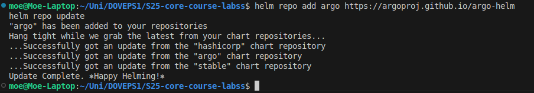

# Lab 13: ArgoCD for GitOps Deployment

## **Overview**

This lab implements ArgoCD to automate Kubernetes deployments using GitOps principles. We install ArgoCD using Helm, configure it to manage our Python app, and set up a multi-environment deployment workflow.

---

## **Task 1: Deploy and Configure ArgoCD**

### **1. Install ArgoCD via Helm**

### **Step 1: Add the ArgoCD Helm repository**

```bash
helm repo add argo https://argoproj.github.io/argo-helm
helm repo update

```



### **Step 2: Install ArgoCD**

```bash
helm install argo argo/argo-cd --namespace argocd --create-namespace

```


### **Step 3: Verify installation**

```bash
kubectl wait --for=condition=ready pod -l app.kubernetes.io/name=argocd-server -n argocd --timeout=90s

```

Output:


---

### **2. Install ArgoCD CLI**

### **Step 1: Install the CLI**

- **For Ubuntu/Debian**

    ```bash
    VERSION=$(curl -L -s https://raw.githubusercontent.com/argoproj/argo-cd/stable/VERSION)
    curl -sSL -o argocd-linux-amd64 https://github.com/argoproj/argo-cd/releases/download/v$VERSION/argocd-linux-amd64
    sudo install -m 555 argocd-linux-amd64 /usr/local/bin/argocd
    rm argocd-linux-amd64
    
    ```

    

### **Step 2: Verify Installation**

```bash
argocd version

```

**Output :**

---


### **3. Access the ArgoCD UI**

### **Step 1: Port-forward ArgoCD server**

```bash
kubectl port-forward svc/argo-argocd-server -n argocd 8080:443 &

```


### **Step 2: Retrieve the Initial Admin Password**

```bash
kubectl -n argocd get secret argocd-initial-admin-secret -o jsonpath="{.data.password}" | base64 --decode

```

Output:


### **Step 3: Log in via CLI**

```bash
argocd login localhost:8080 --insecure
argocd account login

```


---

### **4. Configure Python App Sync**

### **Step 1: Create an ArgoCD directory for manifests**

```bash
mkdir -p k8s/ArgoCD

```


### **Step 2: Define ArgoCD Application Manifest**

Create `k8s/ArgoCD/argocd-python-app.yaml`:

```yaml
apiVersion: argoproj.io/v1alpha1
kind: Application
metadata:
  name: python-app
  namespace: argocd
spec:
  project: default
  source:
    repoURL: https://github.com/MoeJaafar/S25-core-course-labss.git
    targetRevision: lab13
    path: k8s/python-app
    helm:
      valueFiles:
        - values.yaml
  destination:
    server: https://kubernetes.default.svc
    namespace: default
  syncPolicy:
    automated: {}

```


### **Step 3: Apply the Application**

```bash
kubectl apply -f k8s/ArgoCD/argocd-python-app.yaml

```


### **Step 4: Sync Application**

```bash
argocd app sync python-app
argocd app get python-app

```

 Output:


---

## **Task 2: Multi-Environment Deployment & Auto-Sync**

### **1. Set Up Multi-Environment Configurations**

- Modify the Helm chart to support `dev` and `prod`.
- Create `values-dev.yaml` and `values-prod.yaml`.


---

### **2. Create Namespaces for Each Environment**

```bash
kubectl create namespace dev
kubectl create namespace prod

```


---

### **3. Deploy Multi-Environment via ArgoCD**

Create `argocd-python-dev.yaml` for `dev` and `argocd-python-prod.yaml` for `prod`.


Apply the manifest:

```bash
kubectl apply -f k8s/ArgoCD/argocd-python-prod.yaml

```


Sync:

```bash
argocd app sync python-app-prod

```


---

### **4. Enable Auto-Sync**

Modify `values-prod.yaml` and push changes:

```yaml
replicaCount: 5

```


Observe the sync:

```bash
argocd app get python-app-prod

```

 Output:


---

## **Task 3: Self-Healing Testing**

### **Test 1: Manual Override of Replica Count**

Modify manually:

```bash
kubectl patch deployment python-app-prod -n prod --patch '{"spec":{"replicas": 3}}'

```


---

### **Test 2: Delete a Pod (Replica)**

Delete a pod:

```bash
kubectl delete pod -n prod -l app.kubernetes.io/name=python-app

```


Watch Kubernetes recreate it:

```bash
kubectl get pods -n prod -w

```

  Output:


---

## **Bonus Task: Sync Your Bonus App with ArgoCD**

Create `k8s/ArgoCD/argocd-bonus-app.yaml` similar to the above steps.

Deploy it:

```bash
kubectl apply -f k8s/argocd/argocd-node-app.yaml
argocd app sync node-app

```


Check deployment:

```bash
kubectl get pods -n bonus

```


---
