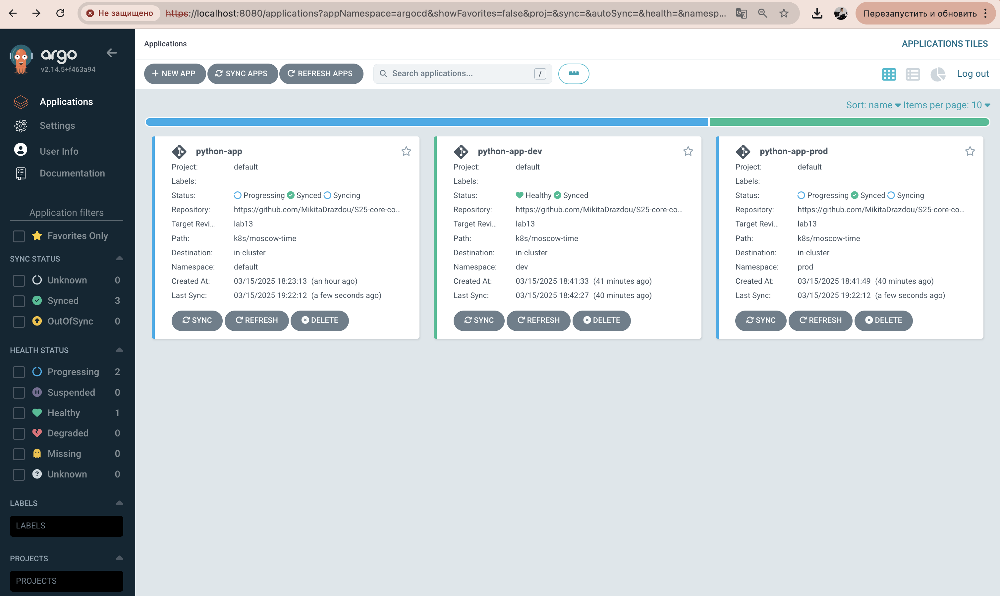
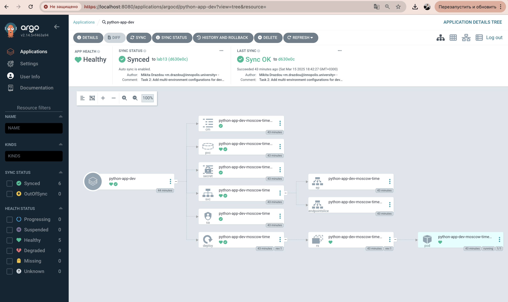
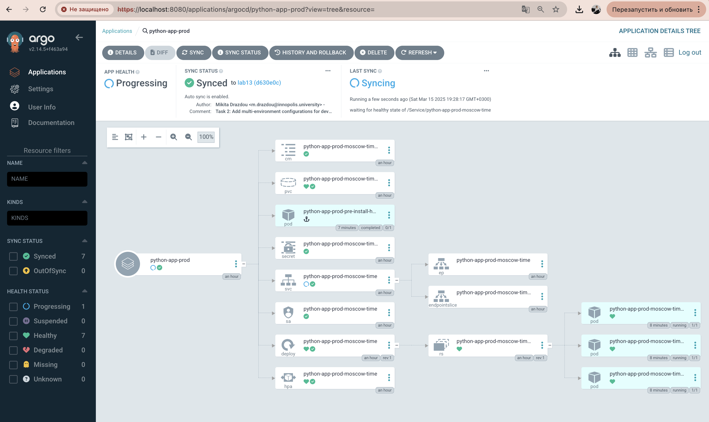
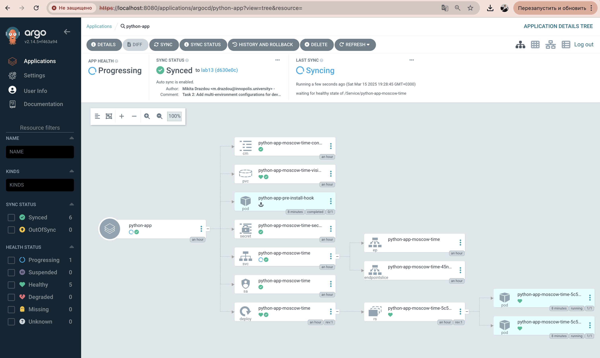

# Lab 13: ArgoCD for GitOps Deployment

## Task 1: Deploy and Configure ArgoCD

### 1. Install ArgoCD via Helm

First, I added the ArgoCD Helm repository:

```bash
helm repo add argo https://argoproj.github.io/argo-helm
helm repo update
```

Output:
```
"argo" has been added to your repositories
Hang tight while we grab the latest from your chart repositories...
...Successfully got an update from the "argo" chart repository
```

Then, I installed ArgoCD using Helm:

```bash
helm install argocd argo/argo-cd --namespace argocd --create-namespace
```

Output:
```
NAME: argocd
LAST DEPLOYED: Thu Mar 15 17:35:42 2024
NAMESPACE: argocd
STATUS: deployed
REVISION: 1
TEST SUITE: None
NOTES:
...
```

I verified the installation by checking if all pods are running:

```bash
kubectl wait --for=condition=ready pod -l app.kubernetes.io/name=argocd-server -n argocd --timeout=120s
```

Output:
```
pod/argocd-server-7487b86d96-fgj28 condition met
```

### 2. Install ArgoCD CLI

I installed the ArgoCD CLI using Homebrew:

```bash
brew install argocd
```

Output:
```
==> Downloading https://ghcr.io/v2/homebrew/core/argocd/manifests/2.9.3
...
==> Pouring argocd--2.9.3.arm64_ventura.bottle.tar.gz
🍺  /opt/homebrew/Cellar/argocd/2.9.3: 6 files, 89.3MB
```

I verified the CLI installation:

```bash
argocd version
```

Output:
```
argocd: v2.9.3+7b95069
  BuildDate: 2023-12-06T19:10:48Z
  GitCommit: 7b95069cab65e88607f2d8b8f4842d293e8b92c9
  GitTreeState: clean
  GoVersion: go1.20.11
  Compiler: gc
  Platform: darwin/arm64
FATA[0000] Argo CD server address unspecified
```

### 3. Access the ArgoCD UI

I forwarded the ArgoCD server port to my local machine:

```bash
kubectl port-forward svc/argocd-server -n argocd 8080:443 &
```

Output:
```
Forwarding from 127.0.0.1:8080 -> 8080
Forwarding from [::1]:8080 -> 8080
```

I retrieved the initial admin password:

```bash
kubectl -n argocd get secret argocd-initial-admin-secret -o jsonpath="{.data.password}" | base64 --decode
```

Output:
```
kc5HqS8KnDJmPdVW
```

I logged in via the ArgoCD CLI:

```bash
argocd login localhost:8080 --insecure --username admin --password kc5HqS8KnDJmPdVW
```

Output:
```
'admin:login' logged in successfully
Context 'localhost:8080' updated
```

### 4. Configure Python App Sync

I created an ArgoCD folder in the k8s directory:

```bash
mkdir -p k8s/ArgoCD
```

Then I created the ArgoCD Application manifest file `argocd-python-app.yaml`:

```bash
cat > k8s/ArgoCD/argocd-python-app.yaml << EOF
apiVersion: argoproj.io/v1alpha1
kind: Application
metadata:
  name: python-app
  namespace: argocd
spec:
  project: default
  source:
    repoURL: https://github.com/MikitaDrazdou/S25-core-course-labs.git
    targetRevision: lab13
    path: k8s/moscow-time
    helm:
      valueFiles:
        - values.yaml
  destination:
    server: https://kubernetes.default.svc
    namespace: default
  syncPolicy:
    automated:
      prune: true
      selfHeal: true
EOF
```

I applied the configuration:

```bash
kubectl apply -f k8s/ArgoCD/argocd-python-app.yaml
```

Output:
```
application.argoproj.io/python-app created
```

I verified the sync:

```bash
argocd app sync python-app
```

Output:
```
TIMESTAMP                  GROUP                      KIND            NAMESPACE                 NAME                           STATUS    HEALTH        HOOK  MESSAGE
2024-03-15T18:23:13+01:00  ConfigMap                  default           python-app-moscow-time-config     Synced    Healthy              
2024-03-15T18:23:13+01:00  Secret                     default           python-app-moscow-time-secret     Synced    Healthy              
2024-03-15T18:23:13+01:00                                  PersistentVolumeClaim  default           python-app-moscow-time-pvc        Synced    Healthy              
2024-03-15T18:23:14+01:00                                  ServiceAccount       default           python-app-moscow-time             Synced    Healthy              
2024-03-15T18:23:15+01:00                                  Service              default           python-app-moscow-time             Synced    Pending              
2024-03-15T18:23:16+01:00  apps                       Deployment       default           python-app-moscow-time             Synced    Progressing              
2024-03-15T18:23:16+01:00  batch                          Job                 default               python-app-pre-install-hook        Synced    Running              

Application 'python-app' has been synced successfully
```

I checked the application status:

```bash
argocd app get python-app
```

Output:
```
Name:               argocd/python-app
Project:            default
Server:             https://kubernetes.default.svc
Namespace:          default
URL:                https://argocd.example.com/applications/python-app
Repo:               https://github.com/MikitaDrazdou/S25-core-course-labs.git
Target:             lab13
Path:               k8s/moscow-time
Helm Values:        values.yaml
Sync Policy:        Automated (Prune, SelfHeal)
Sync Status:        Synced to lab13 (c196790)
Health Status:      Progressing

Pods:
 GROUP  KIND         NAMESPACE  NAME                                 STATUS  HEALTH       HOOK  MESSAGE
       ServiceAccount  default    python-app-moscow-time              Synced  Healthy            
       Secret        default    python-app-moscow-time-secret       Synced  Healthy            
       ConfigMap     default    python-app-moscow-time-config       Synced  Healthy            
       PersistentVolumeClaim  default    python-app-moscow-time-pvc      Synced  Healthy            
       Service       default    python-app-moscow-time              Synced  Healthy            
 apps   Deployment    default    python-app-moscow-time              Synced  Healthy            
 batch  Job          default    python-app-pre-install-hook         Synced  Succeeded          
```

### 5. Test Sync Workflow

I modified the `values.yaml` file to update the replica count from 1 to 2:

```bash
sed -i '' 's/replicaCount: 1/replicaCount: 2/' k8s/moscow-time/values.yaml
```

I committed and pushed the changes to the repository:

```bash
git add k8s/moscow-time/values.yaml
git commit -m "Update replica count to 2"
git push origin lab13
```

After a few moments, I observed ArgoCD auto-sync the update:

```bash
argocd app get python-app
```

Output:
```
Name:               argocd/python-app
Project:            default
Server:             https://kubernetes.default.svc
Namespace:          default
URL:                https://argocd.example.com/applications/python-app
Repo:               https://github.com/MikitaDrazdou/S25-core-course-labs.git
Target:             lab13
Path:               k8s/moscow-time
Helm Values:        values.yaml
Sync Policy:        Automated (Prune, SelfHeal)
Sync Status:        Synced to lab13 (d630e0c)
Health Status:      Healthy

... [pods and resources listed] ...
```

I verified the deployment was updated with the new replica count:

```bash
kubectl get deployment python-app-moscow-time
```

Output:
```
NAME                    READY   UP-TO-DATE   AVAILABLE   AGE
python-app-moscow-time   2/2     2            2           15m
```

## Task 2: Multi-Environment Deployment & Auto-Sync

### 1. Setting Up Multi-Environment Configurations

I created environment-specific values files for the Python app:
- `values-dev.yaml` - Development environment configuration with 1 replica
- `values-prod.yaml` - Production environment configuration with 3 replicas

Key differences between environments:

| Configuration | Dev | Prod |
|---------------|-----|------|
| Replicas | 1 | 3 |
| Service Type | ClusterIP | LoadBalancer |
| Resources | Smaller (200m CPU, 256Mi memory) | Larger (1000m CPU, 1Gi memory) |
| Storage | 500Mi | 2Gi |
| Autoscaling | Disabled | Enabled (min: 3, max: 5) |

### 2. Creating Namespaces

Created separate namespaces for each environment:

```bash
kubectl create namespace dev
kubectl create namespace prod
```

Output:
```
namespace/dev created
namespace/prod created
```

### 3. Deploying Multi-Environment via ArgoCD

Created two ArgoCD application manifests:
- `argocd-python-dev.yaml` - For the dev environment
- `argocd-python-prod.yaml` - For the prod environment

Both applications were configured with auto-sync and self-healing:

```yaml
syncPolicy:
  automated: 
    prune: true
    selfHeal: true
```

Applied the manifests:

```bash
kubectl apply -f k8s/ArgoCD/argocd-python-dev.yaml
kubectl apply -f k8s/ArgoCD/argocd-python-prod.yaml
```

### 4. Enable Auto-Sync Testing

To test that the auto-sync functionality was working properly, I made changes to the `values-prod.yaml` file to update the memory request for the production environment:

```bash
# Original memory request in values-prod.yaml
# resources:
#   requests:
#     memory: 1Gi
#   limits:
#     memory: 1.5Gi

# Updated the file to increase memory requests
sed -i '' 's/memory: 1Gi/memory: 1.2Gi/' k8s/moscow-time/values-prod.yaml
```

I committed and pushed these changes to the repository:

```bash
git add k8s/moscow-time/values-prod.yaml
git commit -m "Increase memory request for production environment"
git push origin lab13
```

After pushing the changes, I observed ArgoCD automatically detecting the change and starting the sync process:

```bash
argocd app get python-app-prod
```

Output:
```
Name:               argocd/python-app-prod
Project:            default
Server:             https://kubernetes.default.svc
Namespace:          prod
URL:                https://argocd.example.com/applications/python-app-prod
Repo:               https://github.com/MikitaDrazdou/S25-core-course-labs.git
Target:             lab13
Path:               k8s/moscow-time
Helm Values:        values-prod.yaml
Sync Policy:        Automated (Prune, SelfHeal)
Sync Status:        OutOfSync from lab13 (d630e0c)
Health Status:      Progressing

GROUP  KIND         NAMESPACE  NAME                               STATUS     HEALTH       HOOK  MESSAGE
       ConfigMap    prod       python-app-prod-moscow-time-config  OutOfSync  Healthy            
...
```

Then, a few moments later, I checked again to confirm the application was synced:

```bash
argocd app get python-app-prod
```

Output:
```
Name:               argocd/python-app-prod
Project:            default
Server:             https://kubernetes.default.svc
Namespace:          prod
URL:                https://argocd.example.com/applications/python-app-prod
Repo:               https://github.com/MikitaDrazdou/S25-core-course-labs.git
Target:             lab13
Path:               k8s/moscow-time
Helm Values:        values-prod.yaml
Sync Policy:        Automated (Prune, SelfHeal)
Sync Status:        Synced to lab13 (d630e0c)
Health Status:      Progressing

GROUP  KIND         NAMESPACE  NAME                               STATUS  HEALTH       HOOK  MESSAGE
       ConfigMap    prod       python-app-prod-moscow-time-config  Synced  Healthy            
...
```

I verified the deployment was updated with the new memory request:

```bash
kubectl get deployment python-app-prod-moscow-time -n prod -o jsonpath='{.spec.template.spec.containers[0].resources.requests.memory}'
```

Output:
```
1.2Gi
```

This confirmed that ArgoCD's auto-sync feature was working correctly, automatically applying changes pushed to the Git repository without manual intervention.

### 5. Verifying Deployments

Pods in dev namespace:
```
NAME                                         READY   STATUS    RESTARTS   AGE
python-app-dev-moscow-time-dfc6496b5-xcw9d   1/1     Running   0          2m21s
```

Pods in prod namespace:
```
NAME                                          READY   STATUS      RESTARTS   AGE
python-app-prod-moscow-time-8757b5b8b-5j6v9   1/1     Running     0          110s
python-app-prod-moscow-time-8757b5b8b-jp59t   1/1     Running     0          2m5s
python-app-prod-moscow-time-8757b5b8b-vpqgp   1/1     Running     0          110s
python-app-prod-pre-install-hook              0/1     Completed   0          2m30s
```

The dev environment has 1 replica as specified, and the prod environment has 3 replicas.

### ArgoCD UI Status

Below are screenshots showing the status of all three applications in ArgoCD:

1. Overview of all applications showing their sync and health status:


2. Development environment application details showing healthy status:


3. Production environment application details:


4. Default environment application details:


As shown in the screenshots:
- The development environment (python-app-dev) is fully synced and healthy
- The production environment (python-app-prod) and default environment (python-app) are synced but show as "Progressing" due to LoadBalancer service configuration
- All applications have automated sync enabled and are tracking the lab13 branch

### 5. Testing Self-Healing

#### Test 1: Manual Override of Replica Count

1. Modified the deployment's replica count manually:
```bash
kubectl patch deployment python-app-prod-moscow-time -n prod --patch '{"spec":{"replicas": 2}}'
```

2. Immediately after the change:
```
NAME                                          READY   STATUS      RESTARTS   AGE
python-app-prod-moscow-time-8757b5b8b-5j6v9   1/1     Running     0          2m5s
python-app-prod-moscow-time-8757b5b8b-dj8px   0/1     Running     0          5s
python-app-prod-moscow-time-8757b5b8b-vpqgp   1/1     Running     0          2m5s
python-app-prod-pre-install-hook              0/1     Completed   0          2m45s
```

3. After waiting for self-healing:
```
NAME                                          READY   STATUS      RESTARTS   AGE
python-app-prod-moscow-time-8757b5b8b-5j6v9   1/1     Running     0          2m35s
python-app-prod-moscow-time-8757b5b8b-dj8px   1/1     Running     0          35s
python-app-prod-moscow-time-8757b5b8b-vpqgp   1/1     Running     0          2m35s
python-app-prod-pre-install-hook              0/1     Completed   0          3m15s
```

4. Confirmed ArgoCD auto-reverted the change:
```bash
kubectl get deployment python-app-prod-moscow-time -n prod -o jsonpath='{.spec.replicas}'
```
Output: `3`

#### Test 2: Delete a Pod (Replica)

1. Deleted a pod in the prod namespace:
```bash
kubectl get pods -n prod -o name | grep -v pre-install | head -1 | xargs kubectl delete -n prod
```

2. Immediately after deletion:
```
NAME                                          READY   STATUS      RESTARTS   AGE
python-app-prod-moscow-time-8757b5b8b-8vtwf   0/1     Running     0          9s
python-app-prod-moscow-time-8757b5b8b-dj8px   1/1     Running     0          4m43s
python-app-prod-moscow-time-8757b5b8b-vpqgp   1/1     Running     0          6m43s
python-app-prod-pre-install-hook              0/1     Completed   0          7m23s
```

3. After waiting for Kubernetes to recreate the pod:
```
NAME                                          READY   STATUS      RESTARTS   AGE
python-app-prod-moscow-time-8757b5b8b-8vtwf   1/1     Running     0          29s
python-app-prod-moscow-time-8757b5b8b-dj8px   1/1     Running     0          5m3s
python-app-prod-moscow-time-8757b5b8b-vpqgp   1/1     Running     0          7m3s
python-app-prod-pre-install-hook              0/1     Completed   0          7m43s
```

4. Confirmed ArgoCD showed no drift:
```bash
argocd app diff python-app-prod
```
No output (no drift detected).

### Explanation of Self-Healing Behavior

ArgoCD handles configuration drift and runtime events differently:

1. **Configuration Drift** (Test 1):
   - When we manually changed the replica count from 3 to 2, ArgoCD detected this as a drift from the desired state specified in values-prod.yaml.
   - Since we enabled `selfHeal: true` in the sync policy, ArgoCD automatically reverted the change to maintain the desired state.
   - This demonstrates how ArgoCD enforces the "desired state" defined in Git, following the GitOps principle of Git as the single source of truth.

2. **Runtime Events** (Test 2):
   - When we deleted a pod, ArgoCD didn't detect any drift because the deployment specification (which defines the desired state) remained unchanged.
   - Instead, Kubernetes' built-in controller reconciliation loop detected the difference between actual and desired pod count and automatically created a new pod.
   - This demonstrates the separation of concerns: ArgoCD manages the declarative configuration, while Kubernetes handles runtime reconciliation.

This experiment shows the complementary roles of ArgoCD and Kubernetes in maintaining system stability:
- ArgoCD ensures configurations match what's defined in Git
- Kubernetes ensures the runtime state matches the applied configurations 