# Lab 13: ArgoCD for GitOps Deployment

## Task 1: Deploy and Configure ArgoCD

### Install ArgoCD via Helm

```bash
helm repo add argo https://argoproj.github.io/argo-helm
helm install argo argo/argo-cd --namespace argocd --create-namespace
```

### Verify installation

```bash
kubectl wait --for=condition=ready pod -l app.kubernetes.io/name=argocd-server -n argocd --timeout=90s
```
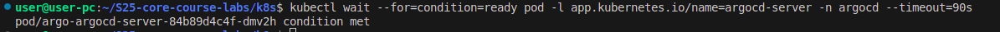

### Install ArgoCD CLI

```bash
curl -sSL -o argocd https://github.com/argoproj/argo-cd/releases/latest/download/argocd-linux-amd64
chmod +x argocd
sudo mv argocd /usr/local/bin/
```

Verify installation:

```bash
argocd version
```
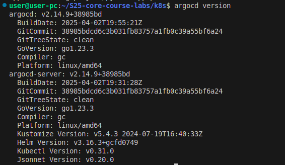
### Access ArgoCD UI

```bash
kubectl port-forward svc/argocd-server -n argocd 8080:443 &
kubectl -n argocd get secret argocd-initial-admin-secret -o jsonpath="{.data.password}" | base64 --decode
argocd login localhost:8080 --insecure
```
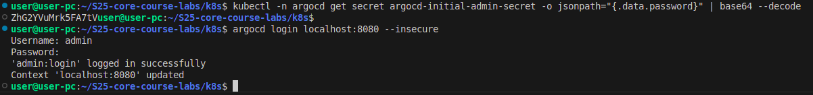
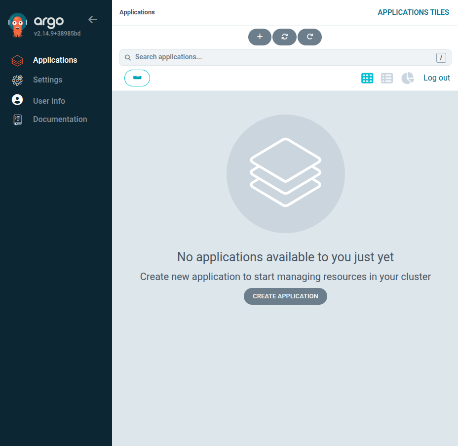

### Configure Python App Sync

Created `argocd-python-app.yaml` with the following content:

```yaml
apiVersion: argoproj.io/v1alpha1
kind: Application
metadata:
  name: python-app
  namespace: argocd
spec:
  project: default
  source:
    repoURL: https://github.com/alimansour0002/S25-core-course-labs.git
    targetRevision: lab13
    path: k8s/web-app
    helm:
      valueFiles:
        - values.yaml
  destination:
    server: https://kubernetes.default.svc
    namespace: default
  syncPolicy:
    automated: {}
```

Applied the configuration:

```bash
kubectl apply -f k8s/argocd/argocd-python-app.yaml
```

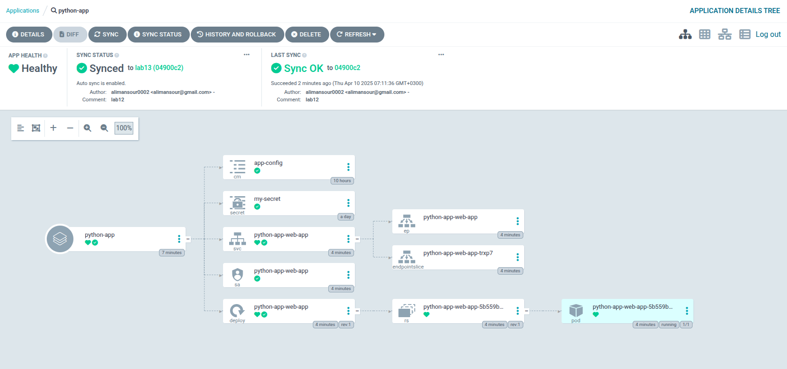
### Test Sync Workflow
I modified `values.yaml` ( Changed `replicaCount` from 1 to 3 ) then pushed the changes with `test argo sync` commit as showed in the screenshot:
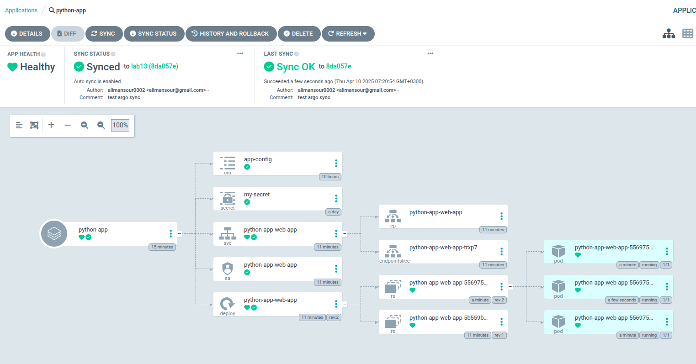

## Task 2: Multi-Environment Deployment & Auto-Sync

### Created Values Files

Created `values-dev.yaml` and `values-prod.yaml` with environment-specific settings.

### Created Namespaces

```bash
kubectl create namespace dev
kubectl create namespace prod
```
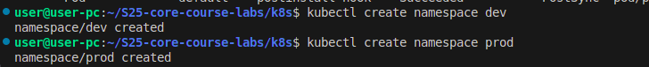
### Created Two ArgoCD Apps

Created `argocd-python-dev.yaml` and `argocd-python-prod.yaml`.

### Tested Auto-Sync
By changing `values-prod.yaml` (`replicaCount` from 3 to 2):
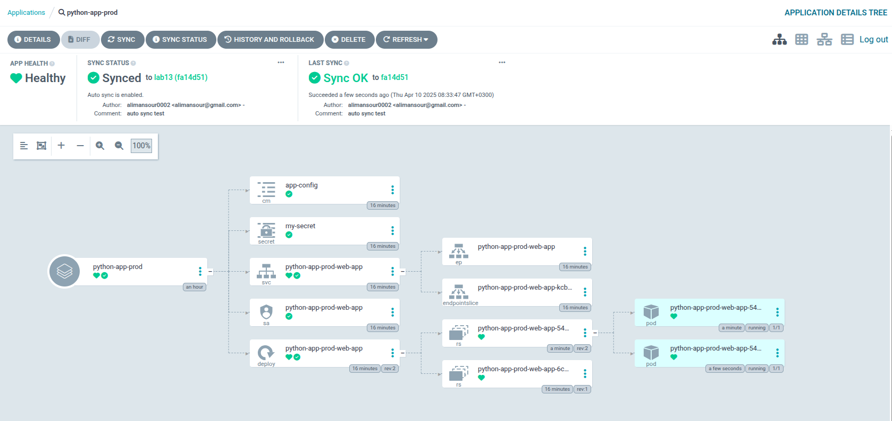
#### 1. Manual Override Test

```bash
kubectl patch deployment python-app-prod -n prod --patch '{"spec":{"replicas": 3}}'
```
ArgoCD triggered that it's out of sync:
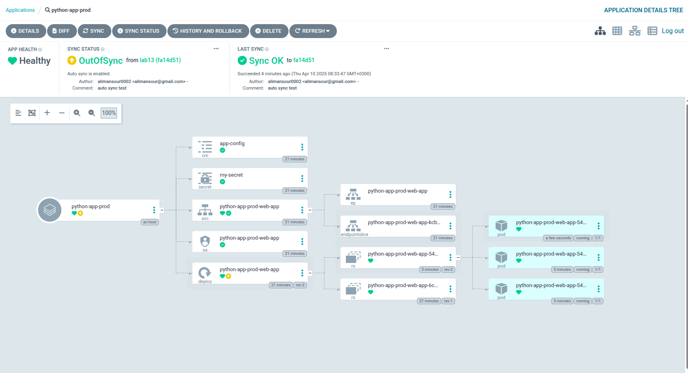
And then auto-reverted the change.
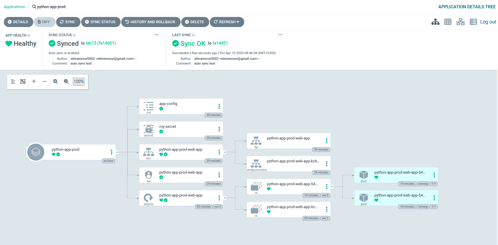


#### 2. Delete a Pod

```bash
kubectl delete pod -n prod -l app.kubernetes.io/name=web-app
```
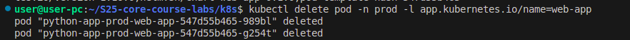
```bash
kubectl get pods -n prod -w
```
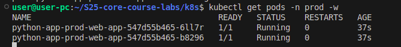
Kubernetes recreated the pod automatically.

ArgoCD shows no drift:

```bash
argocd app diff python-app-prod
```

---

## Explanation

- **Drift**: When config deviates from declared Git state, ArgoCD reverts it (like replica count).
- **Runtime Events**: Pod deletions are part of normal operations, so ArgoCD doesn’t consider them a drift.