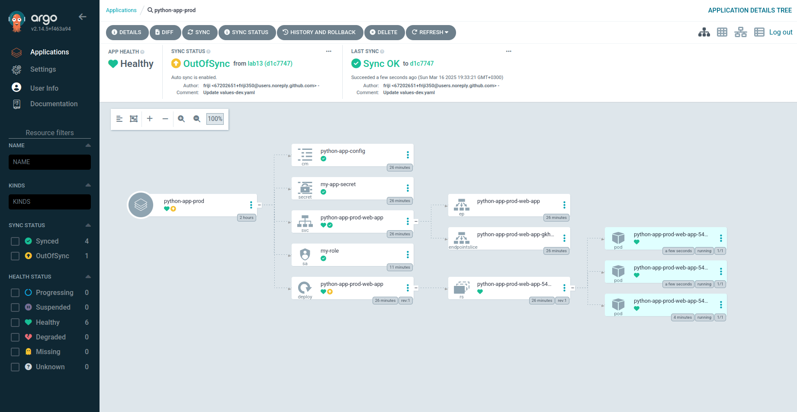
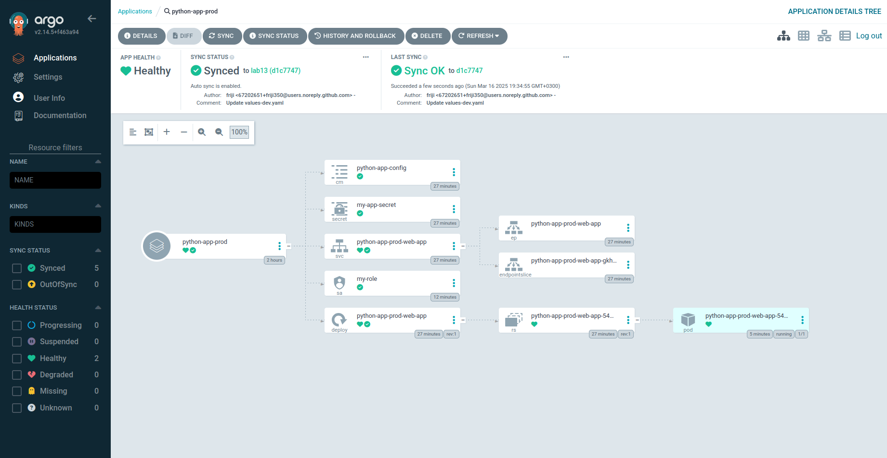

```
a@a-VirtualBox:~/PycharmProjects/S25-core-course-labs/k8s/web-app$ argocd app sync python-app-prod
TIMESTAMP                  GROUP        KIND       NAMESPACE                  NAME       STATUS   HEALTH            HOOK  MESSAGE
2025-03-16T19:40:06+03:00             Secret            prod         my-app-secret       Synced                           
2025-03-16T19:40:06+03:00            Service            prod  python-app-prod-web-app    Synced  Healthy                  
2025-03-16T19:40:06+03:00         ServiceAccount        prod               my-role       Synced                           
2025-03-16T19:40:06+03:00   apps  Deployment            prod  python-app-prod-web-app    Synced  Progressing              
2025-03-16T19:40:06+03:00          ConfigMap            prod     python-app-config       Synced                           
2025-03-16T19:40:07+03:00                Pod        prod            preinstall                                 
2025-03-16T19:40:09+03:00                Pod        prod            preinstall   Running   Synced     PreSync  pod/preinstall created
2025-03-16T19:40:12+03:00   apps  Deployment        prod  python-app-prod-web-app    Synced  Healthy              
2025-03-16T19:40:34+03:00         ServiceAccount        prod               my-role       Synced                        serviceaccount/my-role unchanged
2025-03-16T19:40:34+03:00             Secret            prod         my-app-secret       Synced                        secret/my-app-secret unchanged
2025-03-16T19:40:34+03:00          ConfigMap            prod     python-app-config       Synced                        configmap/python-app-config unchanged
2025-03-16T19:40:34+03:00            Service            prod  python-app-prod-web-app    Synced   Healthy              service/python-app-prod-web-app unchanged
2025-03-16T19:40:34+03:00   apps  Deployment            prod  python-app-prod-web-app    Synced   Healthy              deployment.apps/python-app-prod-web-app unchanged
2025-03-16T19:40:34+03:00                Pod            prod            preinstall     Succeeded   Synced     PreSync  pod/preinstall created
2025-03-16T19:40:34+03:00                Pod        prod           postinstall   Running   Synced    PostSync  pod/postinstall created
2025-03-16T19:40:59+03:00                Pod        prod           postinstall  Succeeded   Synced    PostSync  pod/postinstall created

Name:               argocd/python-app-prod
Project:            default
Server:             https://kubernetes.default.svc
Namespace:          prod
URL:                https://argocd.example.com/applications/python-app-prod
Source:
- Repo:             https://github.com/friji350/S25-core-course-labs.git
  Target:           lab13
  Path:             k8s/web-app
  Helm Values:      values-prod.yaml
SyncWindow:         Sync Allowed
Sync Policy:        Automated
Sync Status:        Synced to lab13 (d1c7747)
Health Status:      Healthy

Operation:          Sync
Sync Revision:      d1c77473db8f899d00d647eba07faa9f158fbd02
Phase:              Succeeded
Start:              2025-03-16 19:40:06 +0300 MSK
Finished:           2025-03-16 19:40:59 +0300 MSK
Duration:           53s
Message:            successfully synced (no more tasks)

GROUP  KIND            NAMESPACE  NAME                     STATUS     HEALTH   HOOK      MESSAGE
       Pod             prod       preinstall               Succeeded           PreSync   pod/preinstall created
       ServiceAccount  prod       my-role                  Synced                        serviceaccount/my-role unchanged
       Secret          prod       my-app-secret            Synced                        secret/my-app-secret unchanged
       ConfigMap       prod       python-app-config        Synced                        configmap/python-app-config unchanged
       Service         prod       python-app-prod-web-app  Synced     Healthy            service/python-app-prod-web-app unchanged
apps   Deployment      prod       python-app-prod-web-app  Synced     Healthy            deployment.apps/python-app-prod-web-app unchanged
       Pod             prod       postinstall              Succeeded           PostSync  pod/postinstall created
```


```
a@a-VirtualBox:~/PycharmProjects/S25-core-course-labs/k8s/web-app$ argocd app diff python-app-prod
a@a-VirtualBox:~/PycharmProjects/S25-core-course-labs/k8s/web-app$ 
```