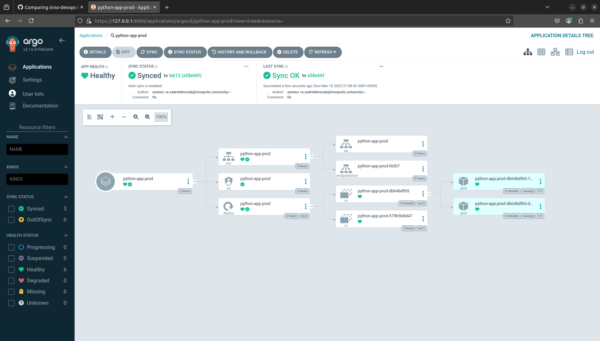
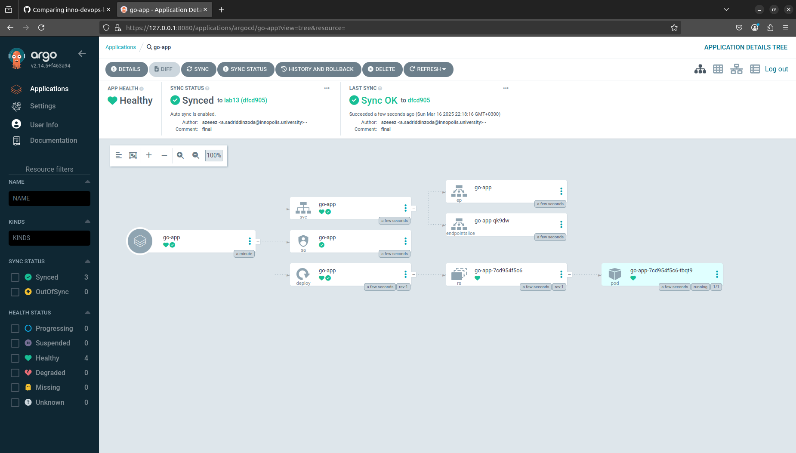

# Lab 13

## Task 1

`argocd app get` before commit:

```bash
Name:               argocd/python-app
Project:            default
Server:             https://kubernetes.default.svc
Namespace:          default
URL:                https://argocd.example.com/applications/python-app
Source:
- Repo:             https://github.com/azzyyzz/S25-core-course-labs.git
  Target:           lab13
  Path:             k8s/python-app
  Helm Values:      values.yaml
SyncWindow:         Sync Allowed
Sync Policy:        Automated
Sync Status:        Synced to lab13 (2b9f4e9)
Health Status:      Healthy

GROUP  KIND            NAMESPACE  NAME              STATUS     HEALTH   HOOK      MESSAGE
       Pod             default    preinstall-hook   Succeeded           PreSync   pod/preinstall-hook created
       ServiceAccount  default    python-app        Synced                        serviceaccount/python-app configured. Warning: resource serviceaccounts/python-app is missing the kubectl.kubernetes.io/last-applied-configuration annotation which is required by  apply.  apply should only be used on resources created declaratively by either  create --save-config or  apply. The missing annotation will be patched automatically.
       Service         default    python-app        Synced     Healthy            service/python-app configured. Warning: resource services/python-app is missing the kubectl.kubernetes.io/last-applied-configuration annotation which is required by  apply.  apply should only be used on resources created declaratively by either  create --save-config or  apply. The missing annotation will be patched automatically.
apps   Deployment      default    python-app        Synced     Healthy            deployment.apps/python-app configured. Warning: resource deployments/python-app is missing the kubectl.kubernetes.io/last-applied-configuration annotation which is required by  apply.  apply should only be used on resources created declaratively by either  create --save-config or  apply. The missing annotation will be patched automatically.
       Pod             default    postinstall-hook  Succeeded           PostSync  pod/postinstall-hook created
```

`argocd app get` after commit:

```bash
Name:               argocd/python-app
Project:            default
Server:             https://kubernetes.default.svc
Namespace:          default
URL:                https://argocd.example.com/applications/python-app
Source:
- Repo:             https://github.com/azzyyzz/S25-core-course-labs.git
  Target:           lab13
  Path:             k8s/python-app
  Helm Values:      values.yaml
SyncWindow:         Sync Allowed
Sync Policy:        Automated
Sync Status:        Synced to lab13 (b4405c1)
Health Status:      Healthy

GROUP  KIND            NAMESPACE  NAME              STATUS     HEALTH   HOOK      MESSAGE
       Pod             default    preinstall-hook   Succeeded           PreSync   pod/preinstall-hook created
       ServiceAccount  default    python-app        Synced                        serviceaccount/python-app unchanged
       Service         default    python-app        Synced     Healthy            service/python-app unchanged
apps   Deployment      default    python-app        Synced     Healthy            deployment.apps/python-app configured
       Pod             default    postinstall-hook  Succeeded           PostSync  pod/postinstall-hook created
```

## Task 2

Getting `dev`:

```bash
azeeez@azeeez:~/Desktop/courses/devops/kdi/S25-core-course-labs/k8s$ argocd app get python-app-dev

Name:               argocd/python-app-dev
Project:            default
Server:             https://kubernetes.default.svc
Namespace:          dev
URL:                https://argocd.example.com/applications/python-app-dev
Source:
- Repo:             https://github.com/azzyyzz/S25-core-course-labs.git
  Target:           lab13
  Path:             k8s/python-app
  Helm Values:      values-dev.yaml
SyncWindow:         Sync Allowed
Sync Policy:        Automated
Sync Status:        Synced to lab13 (fbc66c9)
Health Status:      Progressing

GROUP  KIND            NAMESPACE  NAME             STATUS     HEALTH       HOOK     MESSAGE
       Pod             dev        preinstall-hook  Succeeded               PreSync  pod/preinstall-hook created
       ServiceAccount  dev        python-app-dev   Synced                           serviceaccount/python-app-dev created
       Service         dev        python-app-dev   Synced     Healthy               service/python-app-dev created
apps   Deployment      dev        python-app-dev   Synced     Progressing           deployment.apps/python-app-dev created
```

Getting `prod`:

```bash
azeeez@azeeez:~/Desktop/courses/devops/kdi/S25-core-course-labs/k8s$ argocd app get python-app-prod

Name:               argocd/python-app-prod
Project:            default
Server:             https://kubernetes.default.svc
Namespace:          prod
URL:                https://argocd.example.com/applications/python-app-prod
Source:
- Repo:             https://github.com/azzyyzz/S25-core-course-labs.git
  Target:           lab13
  Path:             k8s/python-app
  Helm Values:      values-prod.yaml
SyncWindow:         Sync Allowed
Sync Policy:        Automated
Sync Status:        Synced to lab13 (141079c)
Health Status:      Progressing

GROUP  KIND            NAMESPACE  NAME             STATUS     HEALTH       HOOK     MESSAGE
       Pod             prod       preinstall-hook  Succeeded               PreSync  pod/preinstall-hook created
       ServiceAccount  prod       python-app-prod  Synced                           serviceaccount/python-app-prod created
       Service         prod       python-app-prod  Synced     Healthy               service/python-app-prod created
apps   Deployment      prod       python-app-prod  Synced     Progressing           deployment.apps/python-app-prod created
```

### After commit

Getting `prod` after changing the number of replicas to **2**:

```bash
azeeez@azeeez:~/Desktop/courses/devops/kdi/S25-core-course-labs/k8s$ argocd app get python-app-prod

Name:               argocd/python-app-prod
Project:            default
Server:             https://kubernetes.default.svc
Namespace:          prod
URL:                https://argocd.example.com/applications/python-app-prod
Source:
- Repo:             https://github.com/azzyyzz/S25-core-course-labs.git
  Target:           lab13
  Path:             k8s/python-app
  Helm Values:      values-prod.yaml
SyncWindow:         Sync Allowed
Sync Policy:        Automated
Sync Status:        Synced to lab13 (a58e66f)
Health Status:      Healthy

GROUP  KIND            NAMESPACE  NAME              STATUS     HEALTH   HOOK      MESSAGE
       Pod             prod       preinstall-hook   Succeeded           PreSync   pod/preinstall-hook unchanged
       ServiceAccount  prod       python-app-prod   Synced                        serviceaccount/python-app-prod unchanged
       Service         prod       python-app-prod   Synced     Healthy            service/python-app-prod unchanged
apps   Deployment      prod       python-app-prod   Synced     Healthy            deployment.apps/python-app-prod configured
       Pod             prod       postinstall-hook  Succeeded           PostSync  pod/postinstall-hook created

```

### Test 1

Changing the number of replicas:

```bash
azeeez@azeeez:~/Desktop/courses/devops/kdi/S25-core-course-labs/k8s$ kubectl patch deployment python-app-prod -n prod --patch '{"spec":{"replicas": 3}}'

deployment.apps/python-app-prod patched
```

Observing:

```bash
azeeez@azeeez:~/Desktop/courses/devops/kdi/S25-core-course-labs/k8s$ argocd app sync python-app-prod

TIMESTAMP                  GROUP        KIND       NAMESPACE                  NAME    STATUS    HEALTH        HOOK  MESSAGE
2025-03-16T21:57:55+03:00            Service            prod       python-app-prod    Synced   Healthy              
2025-03-16T21:57:55+03:00         ServiceAccount        prod       python-app-prod    Synced                        
2025-03-16T21:57:55+03:00   apps  Deployment            prod       python-app-prod  OutOfSync  Healthy              
2025-03-16T21:57:56+03:00                Pod        prod       preinstall-hook                                 
2025-03-16T21:57:58+03:00                Pod        prod       preinstall-hook   Running   Synced     PreSync  pod/preinstall-hook created
2025-03-16T21:58:19+03:00   apps  Deployment        prod       python-app-prod    Synced  Progressing              
2025-03-16T21:58:19+03:00   apps  Deployment        prod       python-app-prod    Synced  Healthy              
2025-03-16T21:58:21+03:00                Pod            prod       preinstall-hook  Succeeded   Synced     PreSync  pod/preinstall-hook created
2025-03-16T21:58:21+03:00         ServiceAccount        prod       python-app-prod    Synced                        serviceaccount/python-app-prod unchanged
2025-03-16T21:58:21+03:00            Service            prod       python-app-prod    Synced   Healthy              service/python-app-prod unchanged
2025-03-16T21:58:21+03:00   apps  Deployment            prod       python-app-prod    Synced   Healthy              deployment.apps/python-app-prod configured
2025-03-16T21:58:21+03:00                Pod        prod      postinstall-hook   Running   Synced    PostSync  pod/postinstall-hook created
2025-03-16T21:58:42+03:00                Pod        prod      postinstall-hook  Succeeded   Synced    PostSync  pod/postinstall-hook created

Name:               argocd/python-app-prod
Project:            default
Server:             https://kubernetes.default.svc
Namespace:          prod
URL:                https://argocd.example.com/applications/python-app-prod
Source:
- Repo:             https://github.com/azzyyzz/S25-core-course-labs.git
  Target:           lab13
  Path:             k8s/python-app
  Helm Values:      values-prod.yaml
SyncWindow:         Sync Allowed
Sync Policy:        Automated
Sync Status:        Synced to lab13 (a58e66f)
Health Status:      Healthy

Operation:          Sync
Sync Revision:      a58e66f528636c1882d8782932574aa8e518b575
Phase:              Succeeded
Start:              2025-03-16 21:57:55 +0300 MSK
Finished:           2025-03-16 21:58:42 +0300 MSK
Duration:           47s
Message:            successfully synced (no more tasks)

GROUP  KIND            NAMESPACE  NAME              STATUS     HEALTH   HOOK      MESSAGE
       Pod             prod       preinstall-hook   Succeeded           PreSync   pod/preinstall-hook created
       ServiceAccount  prod       python-app-prod   Synced                        serviceaccount/python-app-prod unchanged
       Service         prod       python-app-prod   Synced     Healthy            service/python-app-prod unchanged
apps   Deployment      prod       python-app-prod   Synced     Healthy            deployment.apps/python-app-prod configured
       Pod             prod       postinstall-hook  Succeeded           PostSync  pod/postinstall-hook created
```

```bash
azeeez@azeeez:~/Desktop/courses/devops/kdi/S25-core-course-labs/k8s$ argocd app get python-app-prod

Name:               argocd/python-app-prod
Project:            default
Server:             https://kubernetes.default.svc
Namespace:          prod
URL:                https://argocd.example.com/applications/python-app-prod
Source:
- Repo:             https://github.com/azzyyzz/S25-core-course-labs.git
  Target:           lab13
  Path:             k8s/python-app
  Helm Values:      values-prod.yaml
SyncWindow:         Sync Allowed
Sync Policy:        Automated
Sync Status:        Synced to lab13 (a58e66f)
Health Status:      Healthy

GROUP  KIND            NAMESPACE  NAME              STATUS     HEALTH   HOOK      MESSAGE
       Pod             prod       preinstall-hook   Succeeded           PreSync   pod/preinstall-hook created
       ServiceAccount  prod       python-app-prod   Synced                        serviceaccount/python-app-prod unchanged
       Service         prod       python-app-prod   Synced     Healthy            service/python-app-prod unchanged
apps   Deployment      prod       python-app-prod   Synced     Healthy            deployment.apps/python-app-prod configured
       Pod             prod       postinstall-hook  Succeeded           PostSync  pod/postinstall-hook created
```



### Test 2

Getting `pods`:

```bash
azeeez@azeeez:~/Desktop/courses/devops/kdi/S25-core-course-labs/k8s$ kubectl get pods -n prod

NAME                              READY   STATUS    RESTARTS   AGE
python-app-prod-db64bdf65-7h2fn   1/1     Running   0          6m54s
python-app-prod-db64bdf65-d2z8k   1/1     Running   0          6m56s
```

Deleting `prod`:

```bash
azeeez@azeeez:~/Desktop/courses/devops/kdi/S25-core-course-labs/k8s$ kubectl delete pod -n prod -l app.kubernetes.io/name=python-app

pod "python-app-prod-db64bdf65-7h2fn" deleted
pod "python-app-prod-db64bdf65-d2z8k" deleted
```

Checking recreated `pods`:

```bash
azeeez@azeeez:~/Desktop/courses/devops/kdi/S25-core-course-labs/k8s$ kubectl get pods -n prod

NAME                              READY   STATUS    RESTARTS   AGE
python-app-prod-db64bdf65-4m4hm   1/1     Running   0          37s
python-app-prod-db64bdf65-5498w   1/1     Running   0          37s
```

Confirming no drift(no output):

```bash
azeeez@azeeez:~/Desktop/courses/devops/kdi/S25-core-course-labs/k8s$ argocd app diff python-app-prod
```


1. **Configuration Drift**:
   - Argo CD continuously monitors the desired state (declared in Git) and the actual state (in the cluster).
   - If there is a **drift** (e.g., someone manually changes resources in the cluster), Argo CD detects it and can automatically or manually **sync** the cluster state back to match the Git state.

2. **Runtime Events**:
   - Argo CD does not directly manage runtime events (e.g., pod crashes, scaling events) unless they are part of the desired state in Git.
   - Runtime issues are typically handled by Kubernetes controllers (e.g., Deployment controller, HPA).
   - Argo CD focuses on maintaining the desired configuration, not runtime behavior.

## Bonus Task

Running `argocd app get go-app`:

```bash
azeeez@azeeez:~/Desktop/courses/devops/kdi/S25-core-course-labs/k8s$ argocd app get go-app
Name:               argocd/go-app
Project:            default
Server:             https://kubernetes.default.svc
Namespace:          default
URL:                https://argocd.example.com/applications/go-app
Source:
- Repo:             https://github.com/azzyyzz/S25-core-course-labs.git
  Target:           lab13
  Path:             k8s/go-app
  Helm Values:      values.yaml
SyncWindow:         Sync Allowed
Sync Policy:        Automated
Sync Status:        Synced to lab13 (dfcd905)
Health Status:      Healthy

GROUP  KIND            NAMESPACE  NAME              STATUS     HEALTH   HOOK      MESSAGE
       Pod             default    preinstall-hook   Succeeded           PreSync   pod/preinstall-hook created
       ServiceAccount  default    go-app            Synced                        serviceaccount/go-app created
       Service         default    go-app            Synced     Healthy            service/go-app created
apps   Deployment      default    go-app            Synced     Healthy            deployment.apps/go-app created
       Pod             default    postinstall-hook  Succeeded           PostSync  pod/postinstall-hook created
```


