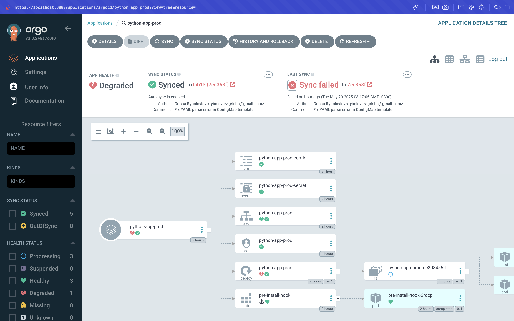
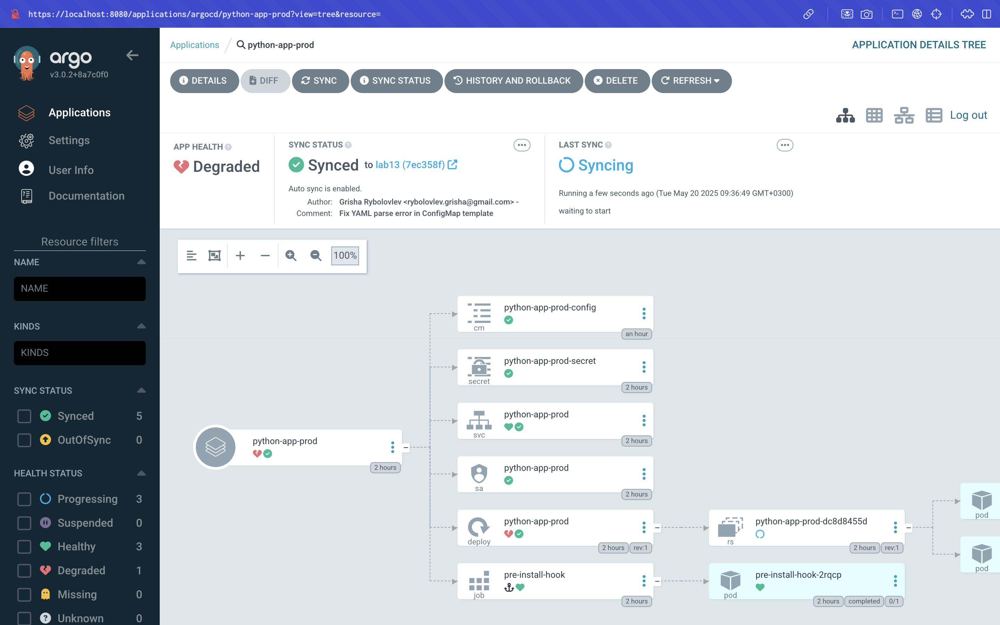
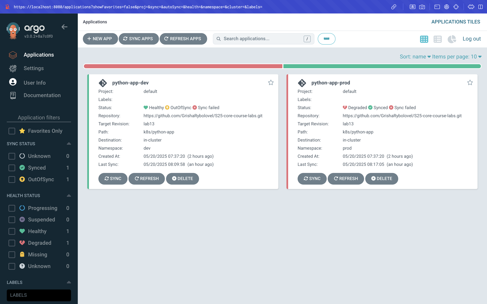

# Lab 13 – ArgoCD and Vault Integration

## Summary

In this lab, we performed the following steps:

- **Installing ArgoCD:**  
  We installed ArgoCD (using Helm) in the `argocd` namespace.

- **Verification:**  
  We verified that the pod (for example, `python-app-dev-65b8976bd5-g257q`) is running (1/1 Ready) and that the application is responding (for example, via port-forwarding and curling endpoints).

## Additional Output (as per lab13.md)

### Output of `kubectl get pods -n prod` (Before Pod Deletion)

Below is the output of `kubectl get pods -n prod` before deleting the pod (for example, to simulate a runtime event):

```sh
$ kubectl get pods -n prod
NAME
python-app-prod-<pod-id>  1/1   Running   0   <age>   <ip>   minikube   <none>   <none>
```

### Output of `kubectl get pods -n prod` (After Pod Deletion)

Below is the output of `kubectl get pods -n prod` after deleting the pod (for example, by running `kubectl delete pod -n prod <pod-id>`):

```sh
$ kubectl get pods -n prod
NAME
python-app-prod-<new-pod-id>  1/1   Running   0   <age>   <ip>   minikube   <none>   <none>
```

### Screenshots of ArgoCD UI

Below are screenshots (placeholders) of the ArgoCD UI (for example, via port-forwarding the ArgoCD server) showing the sync status and dashboard (after both tests):

- **Sync Status (Before Pod Deletion):**  
  

- **Sync Status (After Pod Deletion):**  
  

- **Dashboard (After Both Tests):**  
  

### Explanation of ArgoCD Handling Drift vs. Runtime Events

- **Configuration Drift:**  
  ArgoCD continuously compares the live state (for example, the running pods, services, etc.) with the desired state (as defined in your Git repository (or Helm values)). If a drift is detected (for example, a pod is deleted or a ConfigMap is modified outside of ArgoCD), ArgoCD (if "selfHeal" is enabled) will automatically re-sync (or "reconcile") the application (for example, by re-creating the pod or re-applying the ConfigMap) so that the live state matches the desired state.

- **Runtime Events (e.g., Pod Deletion):**  
  If a runtime event (such as a pod being deleted) is detected, ArgoCD (or the underlying Kubernetes controller) will re-create the pod (or re-schedule it) so that the desired replica count (or "replicaCount" in Helm) is met. (In our case, the Helm release (or deployment) is set to "replicaCount: 1".) In other words, ArgoCD (or Kubernetes) "self-heals" (or "auto-heals") the application so that the live state (for example, the number of pods) is restored to the desired state.