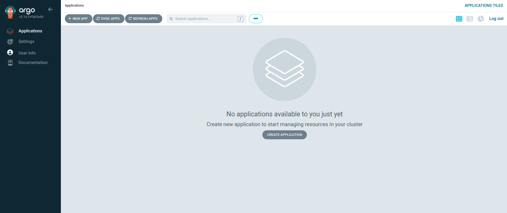
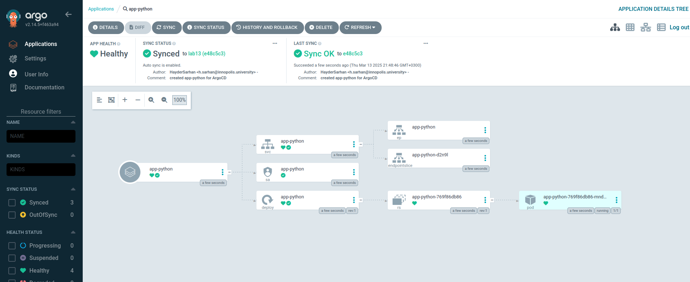
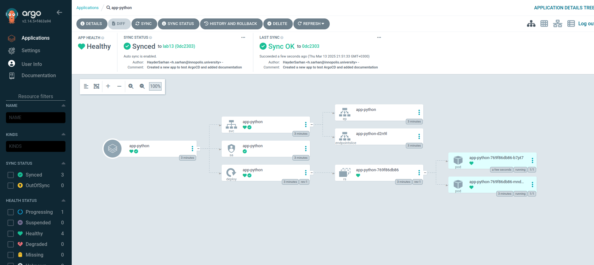
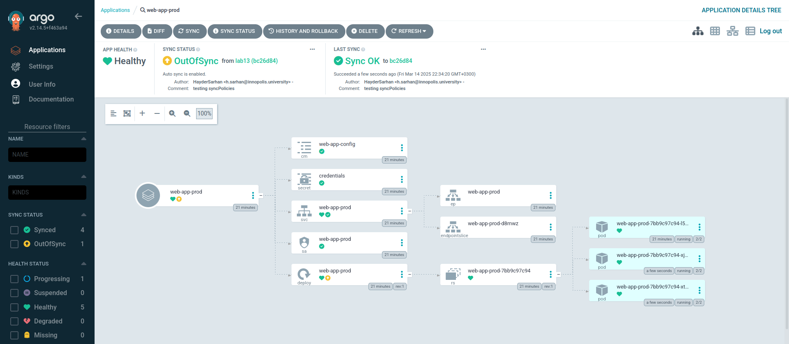
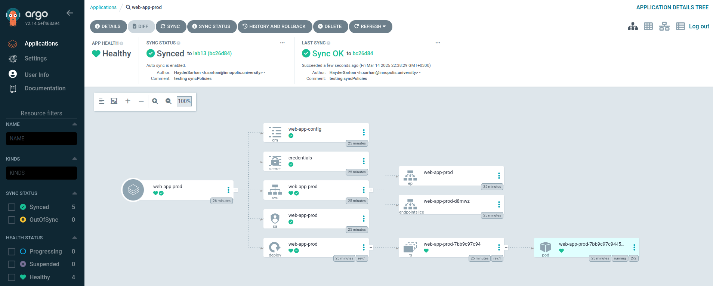
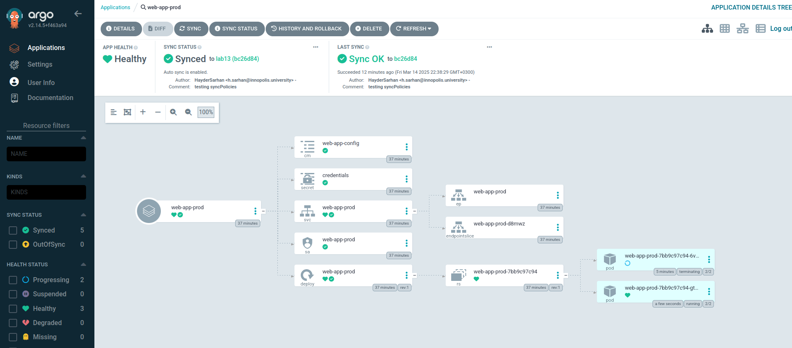
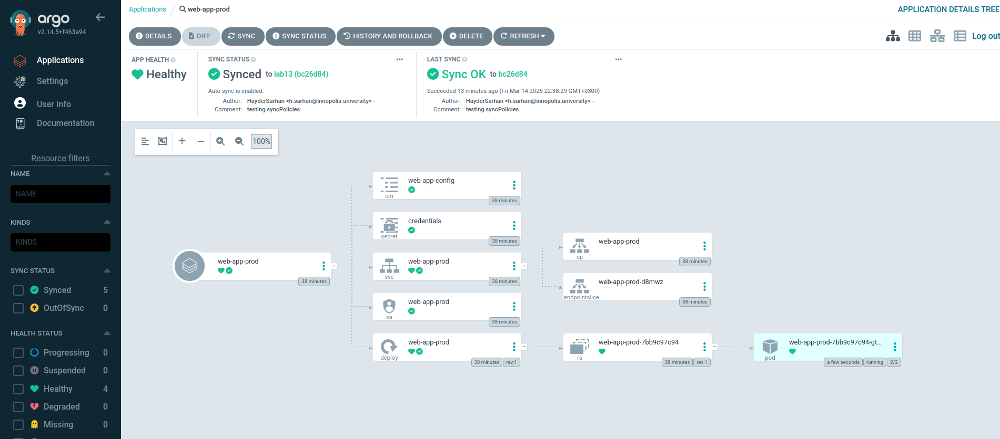

# ArgoCD

## Overview

This document gives an overview over ArgoCD running on app

## Deployment and Configuration

We first have to:

- [Add ArgoCD to Helm](https://argoproj.github.io/argo-helm/) and install it
- [Install ArgoCD CLI](https://argo-cd.readthedocs.io/en/stable/cli_installation/#download-latest-stable-version)

Then we do port-forwarding to get access to the API server\
Resources:

- [Port Forwarding](https://argo-cd.readthedocs.io/en/stable/getting_started/#port-forwarding)
- [Login Using The CLI](https://argo-cd.readthedocs.io/en/stable/getting_started/#4-login-using-the-cli)



To add an app an ArgoCD manifest was created `ArgoCD/argocd-python-app.yaml`



After making changes to our app:



```bash
$ argocd app get web-app
Name:               argocd/web-app
Project:            default
Server:             https://kubernetes.default.svc
Namespace:          default
URL:                https://argocd.example.com/applications/web-app
Source:
- Repo:             https://github.com/HayderSarhan/S25-core-course-labs.git
  Target:           lab13
  Path:             k8s/web-app
  Helm Values:      values.yaml,secrets.yaml
SyncWindow:         Sync Allowed
Sync Policy:        Automated (Prune)
Sync Status:        Synced to lab13 (4c4b9c7)
Health Status:      Healthy

GROUP  KIND            NAMESPACE  NAME              STATUS     HEALTH   HOOK      MESSAGE
       Pod             default    preinstall-hook   Succeeded           PreSync   pod/preinstall-hook created
       ServiceAccount  default    web-app           Synced                        serviceaccount/web-app unchanged
       Secret          default    credentials       Synced                        secret/credentials unchanged
       ConfigMap       default    web-app-config    Synced                        configmap/web-app-config unchanged
       Service         default    web-app           Synced     Healthy            service/web-app unchanged
apps   Deployment      default    web-app           Synced     Healthy            deployment.apps/web-app configured
       Pod             default    postinstall-hook  Succeeded           PostSync  pod/postinstall-hook created
```

## Multi-Environment Deployment

I created two new environments:

- Create 2 new value files for each environment (`web-app/values-dev.yaml` and `web-app/values-prod.yaml`)
- Create 2 new ArgoCD manifests (`ArgoCD/argocd-python-dev.yaml` and `ArgoCD/argocd-python-prod.yaml`)\
The two manifests have [Auto-Sync](https://argo-cd.readthedocs.io/en/stable/user-guide/auto_sync/#automated-sync-policy) enabled just like `argocd-python-app.yaml`.\
I used [Create Namespace](https://argo-cd.readthedocs.io/en/stable/user-guide/sync-options/#create-namespace) to automatically create the namespaces for the environments through the ArgoCD manifests.

## Testing

### Test 1

I patched the deployment so that we get 3 replicas in the production namespace:



After syncing:



We can add `selfHeal: true` to our ArgoCD manifest so that such changes never happen and we keep GitHub as the source of truth

### Test 2

```bash
$ kubectl get pods -n prod
NAME                            READY   STATUS    RESTARTS   AGE
web-app-prod-7bb9c97c94-6vj8w   2/2     Running   0          4m6s
```

After deleting the pod in production, ArgoCD immediately created a new pod:



```bash
$ kubectl get pods -n prod
NAME                            READY   STATUS    RESTARTS   AGE
web-app-prod-7bb9c97c94-gtnzm   2/2     Running   0          68s
```



### Configuration drift vs. Runtime events in ArgoCD

ArgoCD handles configuration drift by continuously comparing the live Kubernetes state with the desired state stored in Git. If manual changes are detected, ArgoCD marks the application as OutOfSync and, if auto-sync is enabled, automatically reverts the changes.

On the other hand, runtime events, such as adjustments made by the Horizontal Pod Autoscaler (HPA) or Kubernetes operators, are not considered drift and do not trigger an OutOfSync status.\
However, during the next sync, ArgoCD may override these runtime changes unless explicitly ignored using ignoreDifferences in the application spec. This ensures that dynamic updates (like autoscaling) can coexist with GitOps workflows without constant resets.
