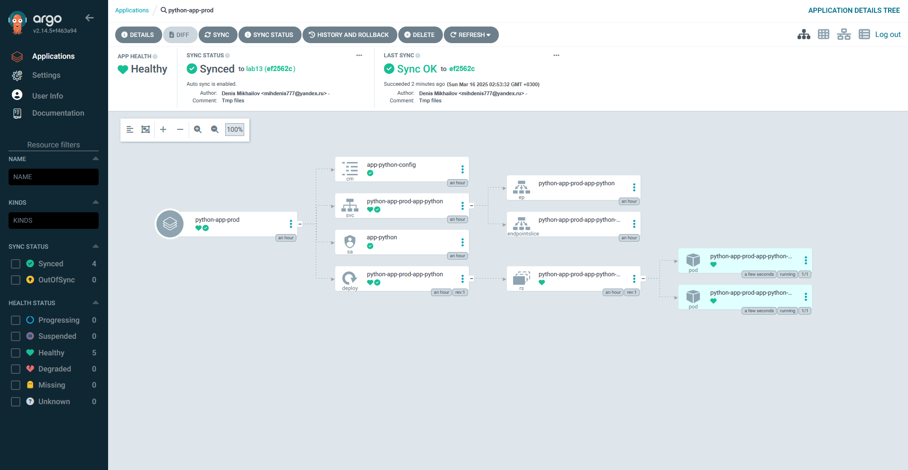

# Lab 13

## Task 1

I decided to delete secrets and hooks from `k8s/app-python/templates/` because they were causing problems with ArgoCD.

### First sync

```bash
$ argocd app sync python-app
TIMESTAMP                  GROUP        KIND       NAMESPACE                  NAME     STATUS   HEALTH        HOOK  MESSAGE
2025-03-16T02:11:33+03:00          ConfigMap         default     app-python-config     Synced
2025-03-16T02:11:33+03:00            Service         default  python-app-app-python    Synced  Healthy
2025-03-16T02:11:33+03:00         ServiceAccount     default          app-python       Synced
2025-03-16T02:11:33+03:00   apps  Deployment         default  python-app-app-python    Synced  Healthy
2025-03-16T02:11:35+03:00          ConfigMap         default     app-python-config     Synced                       configmap/app-python-config unchanged
2025-03-16T02:11:35+03:00            Service         default  python-app-app-python    Synced  Healthy              service/python-app-app-python unchanged
2025-03-16T02:11:35+03:00   apps  Deployment         default  python-app-app-python    Synced  Healthy              deployment.apps/python-app-app-python unchanged
2025-03-16T02:11:35+03:00         ServiceAccount     default          app-python       Synced                       serviceaccount/app-python unchanged

Name:               argocd/python-app
Project:            default
Server:             https://kubernetes.default.svc
Namespace:          default
URL:                https://argocd.example.com/applications/python-app
Source:
- Repo:             https://github.com/mihdenis85/S25-core-course-labs.git
  Target:           lab13
  Path:             k8s/app-python
  Helm Values:      values.yaml
SyncWindow:         Sync Allowed
Sync Policy:        Automated
Sync Status:        Synced to lab13 (4142cf2)
Health Status:      Healthy

Operation:          Sync
Sync Revision:      4142cf2f5027080fefe0c4213f4fe8df86af8832
Phase:              Succeeded
Start:              2025-03-16 02:11:32 +0300 MSK
Finished:           2025-03-16 02:11:35 +0300 MSK
Duration:           3s
Message:            successfully synced (all tasks run)

GROUP  KIND            NAMESPACE  NAME                   STATUS  HEALTH   HOOK  MESSAGE
       ServiceAccount  default    app-python             Synced                 serviceaccount/app-python unchanged
       ConfigMap       default    app-python-config      Synced                 configmap/app-python-config unchanged
       Service         default    python-app-app-python  Synced  Healthy        service/python-app-app-python unchanged
apps   Deployment      default    python-app-app-python  Synced  Healthy        deployment.apps/python-app-app-python unchanged
```

```bash
$ argocd app get python-app
Name:               argocd/python-app
Project:            default
Server:             https://kubernetes.default.svc
Namespace:          default
URL:                https://argocd.example.com/applications/python-app
Source:
- Repo:             https://github.com/mihdenis85/S25-core-course-labs.git
  Target:           lab13
  Path:             k8s/app-python
  Helm Values:      values.yaml
SyncWindow:         Sync Allowed
Sync Policy:        Automated
Sync Status:        Synced to lab13 (4142cf2)
Health Status:      Healthy

GROUP  KIND            NAMESPACE  NAME                   STATUS  HEALTH   HOOK  MESSAGE
       ServiceAccount  default    app-python             Synced                 serviceaccount/app-python unchanged
       ConfigMap       default    app-python-config      Synced                 configmap/app-python-config unchanged
       Service         default    python-app-app-python  Synced  Healthy        service/python-app-app-python unchanged
apps   Deployment      default    python-app-app-python  Synced  Healthy        deployment.apps/python-app-app-python unchanged
```

### After update in Git

Commit hash now is different:

```bash
$ argocd app get python-app
Name:               argocd/python-app
Project:            default
Server:             https://kubernetes.default.svc
Namespace:          default
URL:                https://argocd.example.com/applications/python-app
Source:
- Repo:             https://github.com/mihdenis85/S25-core-course-labs.git
  Target:           lab13
  Path:             k8s/app-python
  Helm Values:      values.yaml
SyncWindow:         Sync Allowed
Sync Policy:        Automated
Sync Status:        Synced to lab13 (dd7cc71)
Health Status:      Healthy

GROUP  KIND            NAMESPACE  NAME                   STATUS  HEALTH   HOOK  MESSAGE
       ServiceAccount  default    app-python             Synced                 serviceaccount/app-python unchanged
       ConfigMap       default    app-python-config      Synced                 configmap/app-python-config unchanged
       Service         default    python-app-app-python  Synced  Healthy        service/python-app-app-python unchanged
apps   Deployment      default    python-app-app-python  Synced  Healthy        deployment.apps/python-app-app-python configured
```

## Task 2

### Dev and Prod

```bash
$ argocd app get python-app-dev
Name:               argocd/python-app-dev
Project:            default
Server:             https://kubernetes.default.svc
Namespace:          default
URL:                https://argocd.example.com/applications/python-app-dev
Source:
- Repo:             https://github.com/mihdenis85/S25-core-course-labs.git
  Target:           lab13
  Path:             k8s/app-python
  Helm Values:      values-dev.yaml
SyncWindow:         Sync Allowed
Sync Policy:        Automated
Sync Status:        OutOfSync from lab13 (0f6218f)
Health Status:      Healthy

CONDITION              MESSAGE                                                                                   LAST TRANSITION
SharedResourceWarning  ConfigMap/app-python-config is part of applications argocd/python-app-dev and python-app  2025-03-16 02:20:22 +0300 MSK
SharedResourceWarning  ServiceAccount/app-python is part of applications argocd/python-app-dev and python-app    2025-03-16 02:20:21 +0300 MSK


GROUP  KIND            NAMESPACE  NAME                       STATUS     HEALTH   HOOK  MESSAGE
       ServiceAccount  default    app-python                 OutOfSync                 serviceaccount/app-python configured
       ConfigMap       default    app-python-config          OutOfSync                 configmap/app-python-config configured
       Service         default    python-app-dev-app-python  Synced     Healthy        service/python-app-dev-app-python created
apps   Deployment      default    python-app-dev-app-python  Synced     Healthy        deployment.apps/python-app-dev-app-python created
```

```bash
$ argocd app get python-app-prod
Name:               argocd/python-app-prod
Project:            default
Server:             https://kubernetes.default.svc
Namespace:          default
URL:                https://argocd.example.com/applications/python-app-prod
Source:
- Repo:             https://github.com/mihdenis85/S25-core-course-labs.git
  Target:           lab13
  Path:             k8s/app-python
  Helm Values:      values-prod.yaml
SyncWindow:         Sync Allowed
Sync Policy:        Automated
Sync Status:        Synced to lab13 (0f6218f)
Health Status:      Healthy

GROUP  KIND            NAMESPACE  NAME                        STATUS  HEALTH   HOOK  MESSAGE
       ServiceAccount  default    app-python                  Synced                 serviceaccount/app-python configured
       ConfigMap       default    app-python-config           Synced                 configmap/app-python-config configured
       Service         default    python-app-prod-app-python  Synced  Healthy        service/python-app-prod-app-python created
apps   Deployment      default    python-app-prod-app-python  Synced  Healthy        deployment.apps/python-app-prod-app-python created
```

### Prod after values-prod.yaml update

```bash
$ argocd app get python-app-prod
Name:               argocd/python-app-prod
Project:            default
Server:             https://kubernetes.default.svc
Namespace:          default
URL:                https://argocd.example.com/applications/python-app-prod
Source:
- Repo:             https://github.com/mihdenis85/S25-core-course-labs.git
  Target:           lab13
  Path:             k8s/app-python
  Helm Values:      values-prod.yaml
SyncWindow:         Sync Allowed
Sync Policy:        Automated
Sync Status:        Synced to lab13 (53782e6)
Health Status:      Healthy

GROUP  KIND            NAMESPACE  NAME                        STATUS  HEALTH   HOOK  MESSAGE
       ServiceAccount  default    app-python                  Synced                 serviceaccount/app-python configured
       ConfigMap       default    app-python-config           Synced                 configmap/app-python-config configured
       Service         default    python-app-prod-app-python  Synced  Healthy        service/python-app-prod-app-python unchanged
apps   Deployment      default    python-app-prod-app-python  Synced  Healthy        deployment.apps/python-app-prod-app-python unchanged
```

### Test 1

```bash
$ kubectl patch deployment python-app-prod-app-python -n prod --patch "{\"spec\":{\"replicas\": 3}}"
deployment.apps/python-app-prod-app-python patched
```

```bash
$ argocd app sync python-app-prod
TIMESTAMP                  GROUP        KIND       NAMESPACE                  NAME          STATUS    HEALTH        HOOK  MESSAGE
2025-03-16T02:41:34+03:00          ConfigMap            prod     app-python-config          Synced
2025-03-16T02:41:34+03:00            Service            prod  python-app-prod-app-python    Synced   Healthy
2025-03-16T02:41:34+03:00         ServiceAccount        prod          app-python            Synced
2025-03-16T02:41:34+03:00   apps  Deployment            prod  python-app-prod-app-python  OutOfSync  Healthy
2025-03-16T02:41:36+03:00          ConfigMap            prod     app-python-config          Synced                        configmap/app-python-config unchanged
2025-03-16T02:41:36+03:00            Service            prod  python-app-prod-app-python    Synced   Healthy              service/python-app-prod-app-python unchanged
2025-03-16T02:41:36+03:00   apps  Deployment            prod  python-app-prod-app-python  OutOfSync  Healthy              deployment.apps/python-app-prod-app-python configured
2025-03-16T02:41:36+03:00         ServiceAccount        prod          app-python            Synced                        serviceaccount/app-python unchanged
2025-03-16T02:41:36+03:00   apps  Deployment        prod  python-app-prod-app-python      Synced  Progressing              deployment.apps/python-app-prod-app-python configured

Name:               argocd/python-app-prod
Project:            default
Server:             https://kubernetes.default.svc
Namespace:          prod
URL:                https://argocd.example.com/applications/python-app-prod
Source:
- Repo:             https://github.com/mihdenis85/S25-core-course-labs.git
  Target:           lab13
  Path:             k8s/app-python
  Helm Values:      values-prod.yaml
SyncWindow:         Sync Allowed
Sync Policy:        Automated
Sync Status:        Synced to lab13 (ef2562c)
Health Status:      Healthy

Operation:          Sync
Sync Revision:      ef2562cc067f0ffd5746771ca99931a76dff3419
Phase:              Succeeded
Start:              2025-03-16 02:41:34 +0300 MSK
Finished:           2025-03-16 02:41:35 +0300 MSK
Duration:           1s
Message:            successfully synced (all tasks run)

GROUP  KIND            NAMESPACE  NAME                        STATUS  HEALTH   HOOK  MESSAGE
       ServiceAccount  prod       app-python                  Synced                 serviceaccount/app-python unchanged
       ConfigMap       prod       app-python-config           Synced                 configmap/app-python-config unchanged
       Service         prod       python-app-prod-app-python  Synced  Healthy        service/python-app-prod-app-python unchanged
apps   Deployment      prod       python-app-prod-app-python  Synced  Healthy        deployment.apps/python-app-prod-app-python configured
```

```bash
$ argocd app get python-app-prod
Name:               argocd/python-app-prod
Project:            default
Server:             https://kubernetes.default.svc
Namespace:          prod
URL:                https://argocd.example.com/applications/python-app-prod
Source:
- Repo:             https://github.com/mihdenis85/S25-core-course-labs.git
  Target:           lab13
  Path:             k8s/app-python
  Helm Values:      values-prod.yaml
SyncWindow:         Sync Allowed
Sync Policy:        Automated
Sync Status:        Synced to lab13 (ef2562c)
Health Status:      Healthy

GROUP  KIND            NAMESPACE  NAME                        STATUS  HEALTH   HOOK  MESSAGE
       ServiceAccount  prod       app-python                  Synced                 serviceaccount/app-python unchanged
       ConfigMap       prod       app-python-config           Synced                 configmap/app-python-config unchanged
       Service         prod       python-app-prod-app-python  Synced  Healthy        service/python-app-prod-app-python unchanged
apps   Deployment      prod       python-app-prod-app-python  Synced  Healthy        deployment.apps/python-app-prod-app-python configured
```


### Test 2

Before changing:

```bash
$ kubectl get pods -n prod
NAME                                          READY   STATUS    RESTARTS   AGE
python-app-prod-app-python-e3pt8q92mx-l7s0r   1/1     Running   0          38m
python-app-prod-app-python-e3pt8q92mx-c0nfw   1/1     Running   0          38m
```

Deleting:

```bash
$ kubectl delete pod -n prod -l app.kubernetes.io/name=app-python
pod "python-app-prod-app-python-e3pt8q92mx-l7s0r" deleted
pod "python-app-prod-app-python-e3pt8q92mx-c0nfw" deleted
```

After changing:

```bash
$ kubectl get pods -n prod
NAME                                          READY   STATUS    RESTARTS   AGE
python-app-prod-app-python-e3pt8q92mx-v5nxr   1/1     Running   0          31s
python-app-prod-app-python-e3pt8q92mx-l7fy2   1/1     Running   0          31s
```

```bash
$ argocd app diff python-app-prod
```




## Explanation of how ArgoCD handles configuration drift vs runtime events

How ArgoCD handles configuration drift: 
1) Occurs when the manifests/specifications in the cluster differ from what is stored in Git
2) ArgoCD automatically corrects these inconsistencies to align with Git
3) Shown in Test 1, where manual changes to the number of replicas were reverted

How ArgoCD handles runtime events:
1) Normal changes made by Kubernetes during operations, such as pod restarts or auto-scaling
2) These events are ignored by ArgoCD
3) Shown in Test 2, where pod deletion led to normal Kubernetes recreation process
