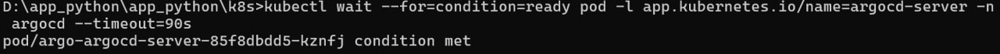
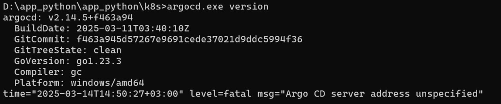
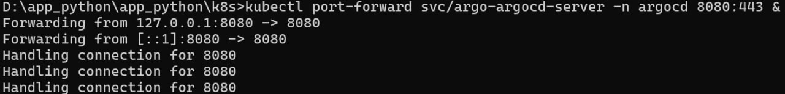
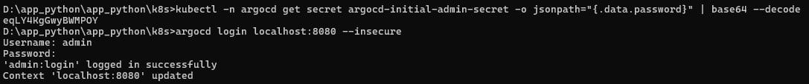
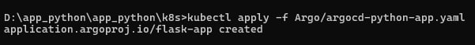
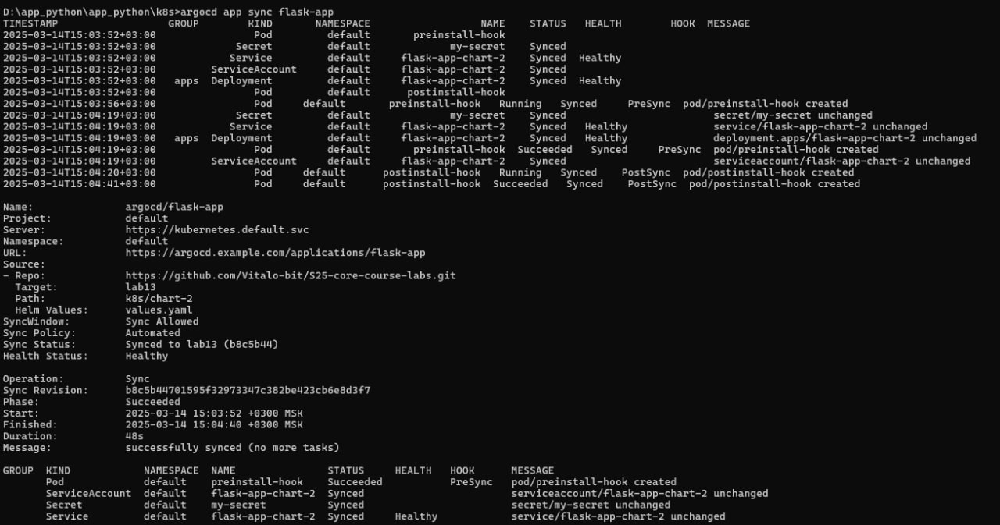
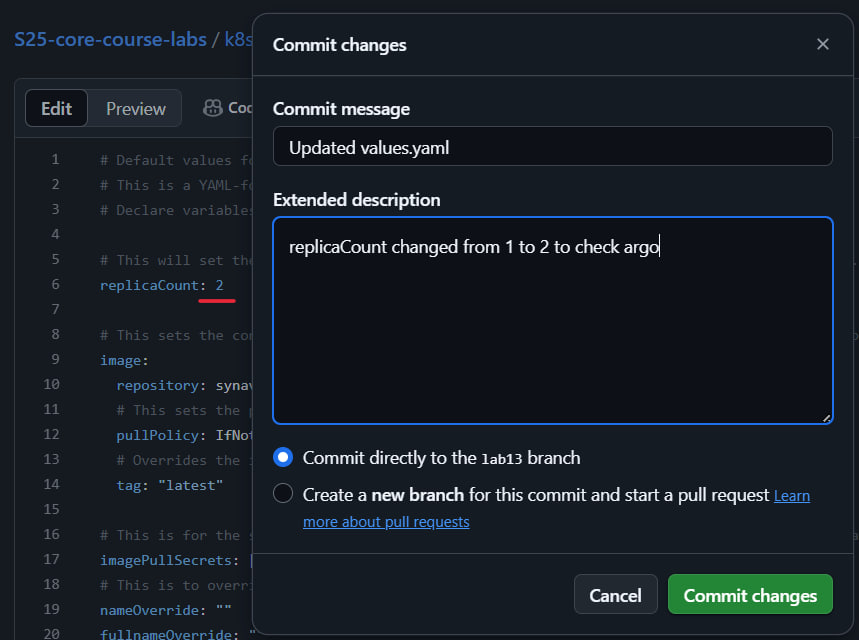
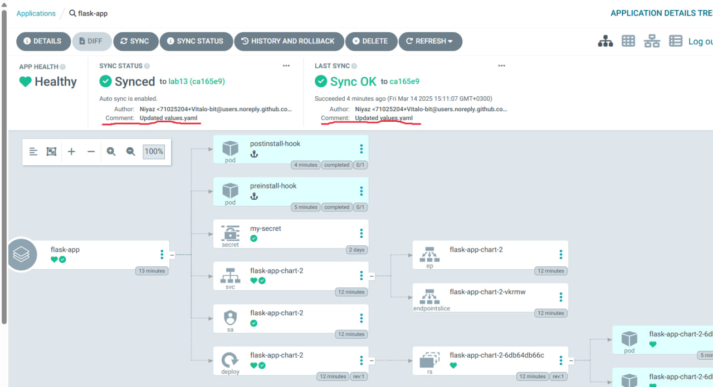

# Lab 13 - ArgoCD

- Let's follow the guide and see what'll we get

## ArgoCD gets downloaded

- Downloading ArgoCD via 

```cmd
helm repo add argo https://argoproj.github.io/argo-helm
```


## Setting timeout

```cmd
kubectl wait --for=condition=ready pod -l app.kubernetes.io/name=argocd-server -n argocd --timeout=90s
```



## ArgoCD checkout 

```cmd
argocd version
```



## Running ArgoCD on localhost

```cmd
k8s>kubectl port-forward svc/argo-argocd-server -n argocd 8080:443 &
```



## ArgoCD logginning

- Let's check the password for loggining

```cmd
kubectl -n argocd get secret argocd-initial-admin-secret -o jsonpath="{.data.password}" | base64 --decode
```

- After that we can login

```cmd
argocd login localhost:8080 --insecure
```



## Creating argo-yaml and applying it

```cmd
kubectl apply -f Argo/argocd-python-app.yaml
```



## Sync!

```cmd
argocd app sync flask-app
```



## Checking if sync is correct

- I'll change values.yaml and check if everything has synced



- Now let's visit localhost where Argo is located and checkout the sync



- Everything is great!