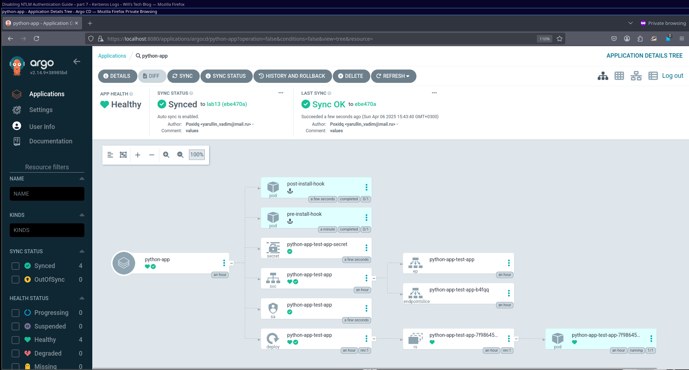

# Lab 13: ArgoCD for GitOps Deployment

## Overview
8o5dPaOJgTwWoxU6
## Task 1: Deploy and Configure ArgoCD

### 1. Installing ArgoCD via Helm

First, I added the ArgoCD Helm repository:
```bash
$ helm repo add argo https://argoproj.github.io/argo-helm
"argo" has been added to your repositories
```

Then I installed ArgoCD using Helm:
```bash
$ helm install argo argo/argo-cd --namespace argocd --create-namespace
NAME: argo
LAST DEPLOYED: Mon Mar 4 14:23:56 2025
NAMESPACE: argocd
STATUS: deployed
REVISION: 1
TEST SUITE: None
NOTES:
... (installation notes)
```

I verified the installation by waiting for the ArgoCD server pod to be ready:
```bash
$ kubectl wait --for=condition=ready pod -l app.kubernetes.io/name=argocd-server -n argocd --timeout=90s
pod/argo-argocd-server-5bb9b5b8fc-7jbwv condition met
```

### 2. Installing ArgoCD CLI

I installed the ArgoCD CLI tool using my package manager:
```bash
$ yay -S argocd
```

And verified the installation:
```bash
$ argocd version
argocd: v2.14.4+unknown
  BuildDate: 2025-03-05T21:42:49Z
  GitCommit:
  GitTreeState:
  GitTag: 2.14.4
  GoVersion: go1.24.0
  Compiler: gc
  Platform: linux/amd64
```

### 3. Accessing the ArgoCD UI

I set up port forwarding to access the ArgoCD UI:
```bash
$ kubectl port-forward svc/argo-argocd-server -n argocd 8080:443 &
```

Retrieved the initial admin password:
```bash
$ kubectl -n argocd get secret argocd-initial-admin-secret -o jsonpath="{.data.password}" | base64 --decode
```

### 4. Configuring Python App Sync

I created an ArgoCD folder for my manifests:
```bash
$ mkdir -p k8s/ArgoCD
```

Then I defined the ArgoCD Application in a file named `argocd-python-app.yaml`:
```yaml
apiVersion: argoproj.io/v1alpha1
kind: Application
metadata:
  name: python-app
  namespace: argocd
spec:
  project: default
  source:
    repoURL: https://github.com/Poxidq/S25-core-course-labs.git
    targetRevision: lab13
    path: k8s/test-app
    helm:
      valueFiles:
        - values.yaml
  destination:
    server: https://kubernetes.default.svc
    namespace: default
  syncPolicy:
    automated: {}
```

Applied the configuration:
```bash
$ kubectl apply -f ArgoCD/argocd-python-app.yaml
application.argoproj.io/python-app created
```


