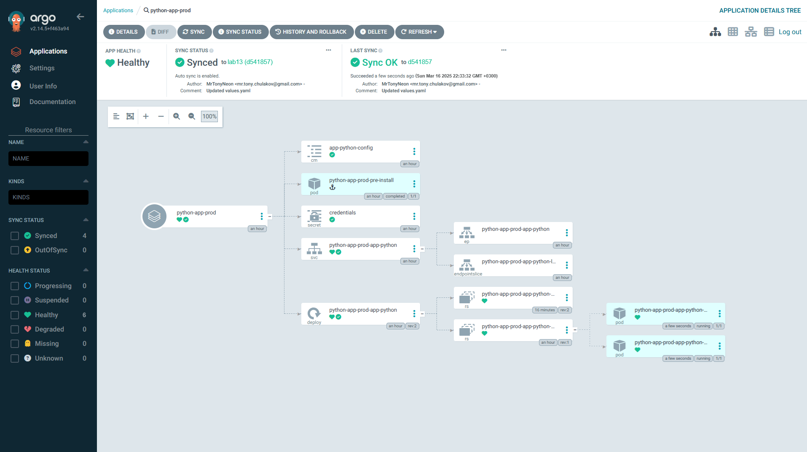

## Test 1

```bash
PS D:\PyCharmProjects\S25-core-course-labs\k8s> kubectl patch deployment python-app-prod-app-python -n prod --patch '{"spec":{"replicas": 3}}'
deployment.apps/python-app-prod-app-python patched
```

```bash
PS D:\PyCharmProjects\S25-core-course-labs\k8s> argocd app sync python-app-prod        
TIMESTAMP                  GROUP        KIND   NAMESPACE                  NAME           STATUS   HEALTH            HOOK  MESSAGE
2025-03-16T21:16:15+03:00             Secret        prod           credentials           Synced
2025-03-16T21:16:15+03:00            Service        prod  python-app-prod-app-python     Synced  Healthy
2025-03-16T21:16:15+03:00   apps  Deployment        prod  python-app-prod-app-python     Synced  Progressing
2025-03-16T21:16:15+03:00          ConfigMap        prod     app-python-config           Synced
2025-03-16T21:16:15+03:00                Pod        prod  python-app-prod-pre-install
2025-03-16T21:16:18+03:00                Pod        prod  python-app-prod-pre-install   Running   Synced     PreSync  pod/python-app-prod-pre-install unchanged
2025-03-16T21:16:20+03:00                Pod        prod  python-app-prod-pre-install  Succeeded   Synced         PreSync  pod/python-app-prod-pre-install unchanged
2025-03-16T21:16:20+03:00             Secret        prod           credentials           Synced                            secret/credentials unchanged
2025-03-16T21:16:20+03:00          ConfigMap        prod     app-python-config           Synced                            configmap/app-python-config unchanged
2025-03-16T21:16:20+03:00            Service        prod  python-app-prod-app-python     Synced   Healthy                  service/python-app-prod-app-python unchanged
2025-03-16T21:16:20+03:00   apps  Deployment        prod  python-app-prod-app-python     Synced   Progressing              deployment.apps/python-app-prod-app-python unchanged

Name:               argocd/python-app-prod
Project:            default
Server:             https://kubernetes.default.svc
Namespace:          prod
URL:                https://argocd.example.com/applications/python-app-prod
Source:
- Repo:             https://github.com/MrTonyNeon/S25-core-course-labs.git
  Target:           lab13
  Path:             k8s/app-python
  Helm Values:      values-prod.yaml
SyncWindow:         Sync Allowed
Sync Policy:        Automated
Sync Status:        Synced to lab13 (d541857)
Health Status:      Healthy

Operation:          Sync
Sync Revision:      d541857e90fbea30ef86b419bf8b12bf00343a6a
Phase:              Succeeded
Start:              2025-03-16 21:16:16 +0300 MSK
Finished:           2025-03-16 21:24:56 +0300 MSK
Duration:           1s
Message:            successfully synced (all tasks run)

GROUP  KIND        NAMESPACE  NAME                         STATUS     HEALTH    HOOK     MESSAGE
       Pod         prod       python-app-prod-pre-install  Succeeded            PreSync  pod/python-app-prod-pre-install unchanged
       Secret      prod       credentials                  Synced                        secret/credentials unchanged
       ConfigMap   prod       app-python-config            Synced                        configmap/app-python-config unchanged
       Service     prod       python-app-prod-app-python   Synced     Healthy            service/python-app-prod-app-python unchanged
apps   Deployment  prod       python-app-prod-app-python   Synced     Healthy            deployment.apps/python-app-prod-app-python configured
```

```bash
PS D:\PyCharmProjects\S25-core-course-labs\k8s> argocd app sync python-app-prod
Name:               argocd/python-app-prod
Project:            default
Server:             https://kubernetes.default.svc
Namespace:          prod
URL:                https://argocd.example.com/applications/python-app-prod
Source:
- Repo:             https://github.com/MrTonyNeon/S25-core-course-labs.git
  Target:           lab13
  Path:             k8s/app-python
  Helm Values:      values-prod.yaml
SyncWindow:         Sync Allowed
Sync Policy:        Automated
Sync Status:        Synced to lab13 (d541857)
Health Status:      Healthy

GROUP  KIND        NAMESPACE  NAME                         STATUS     HEALTH    HOOK     MESSAGE
       Pod         prod       python-app-prod-pre-install  Succeeded            PreSync  pod/python-app-prod-pre-install unchanged
       Secret      prod       credentials                  Synced                        secret/credentials unchanged
       ConfigMap   prod       app-python-config            Synced                        configmap/app-python-config unchanged
       Service     prod       python-app-prod-app-python   Synced     Healthy            service/python-app-prod-app-python unchanged
apps   Deployment  prod       python-app-prod-app-python   Synced     Healthy            deployment.apps/python-app-prod-app-python configured
```


## Test 2

Before deletion:

```bash
PS D:\PyCharmProjects\S25-core-course-labs\k8s> kubectl get pods -n prod
NAME                                          READY   STATUS      RESTARTS   AGE
python-app-prod-app-python-l2gka45pgm-m7fst   1/1     Running     0          44m
python-app-prod-app-python-l2gka45pgm-fa3sg   1/1     Running     0          44m
python-app-prod-pre-install                   0/1     Completed   0          44m
```

Deleting:

```bash
PS D:\PyCharmProjects\S25-core-course-labs\k8s> kubectl delete pod -n prod -l app.kubernetes.io/name=app-python
pod "python-app-prod-app-python-l2gka45pgm-m7fst" deleted
pod "python-app-prod-app-python-l2gka45pgm-fa3sg" deleted
```

After deletion:

```bash
PS D:\PyCharmProjects\S25-core-course-labs\k8s> kubectl get pods -n prod
NAME                                          READY   STATUS      RESTARTS   AGE
python-app-prod-app-python-l2gka45pgm-ksq0g   1/1     Running     0          15s
python-app-prod-app-python-l2gka45pgm-l5gt2   1/1     Running     0          15s
python-app-prod-pre-install                   0/1     Completed   0          45m
```

```bash
PS D:\PyCharmProjects\S25-core-course-labs\k8s> argocd app diff python-app-prod
```



## How ArgoCD Handles Configuration Drift vs. Runtime Events

### Configuration Drift

When changes are made directly to Kubernetes resources that alter their desired state (e.g., changing the replica count of a Deployment), ArgoCD considers this a configuration drift.

- Detection:
  - ArgoCD continuously compares the live state of the cluster with the desired state defined in the Git repository.
  - Any discrepancies in resource definitions are flagged.
- Action:
  - If auto-sync is enabled, ArgoCD will automatically revert the changes to match the Git repository.
  - The application status changes to Out of Sync until the drift is resolved.
- Example (Test 1):
  - Manually increasing the replica count to 3 caused ArgoCD to detect a drift.
  - ArgoCD auto-synced the application, reverting the replica count back to 2.

### Runtime Events

Runtime events are changes that occur during the normal operation of the cluster but do not alter the resource definitions (e.g., pod restarts, node failures).

- Detection:
  - ArgoCD does not consider runtime events as configuration drift since the desired state remains unchanged.
- Action:
  - Kubernetes' controllers handle these events to maintain the desired state (e.g., Deployment controller recreates pods).
  - ArgoCD maintains the application status as Synced.
- Example (Test 2):
  - Deleting a pod manually did not change the Deployment's desired state.
  - Kubernetes recreated the pod to meet the specified replica count.
  - ArgoCD showed no drift and required no action.
