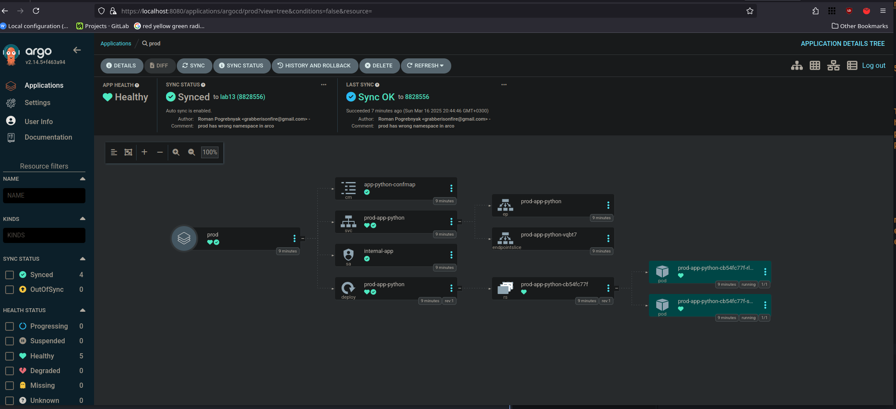
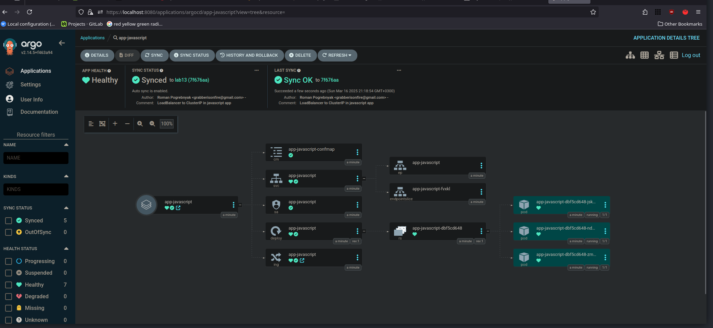

# ArgoCD for GitOps Deployment

## Task 1

First we install the argocd:

```bash
❯ helm install argo argo/argo-cd --namespace argocd --create-namespace
NAME: argo
LAST DEPLOYED: Sun Mar 16 16:27:00 2025
NAMESPACE: argocd
STATUS: deployed
REVISION: 1
TEST SUITE: None
NOTES:
In order to access the server UI you have the following options:

1. kubectl port-forward service/argo-argocd-server -n argocd 8080:443

    and then open the browser on http://localhost:8080 and accept the certificate

2. enable ingress in the values file `server.ingress.enabled` and either
      - Add the annotation for ssl passthrough: https://argo-cd.readthedocs.io/en/stable/operator-manual/ingress/#option-1-ssl-passthrough
      - Set the `configs.params."server.insecure"` in the values file and terminate SSL at your ingress: https://argo-cd.readthedocs.io/en/stable/operator-manual/ingress/#option-2-multiple-ingress-objects-and-hosts


After reaching the UI the first time you can login with username: admin and the random password generated during the installation. You can find the password by running:

kubectl -n argocd get secret argocd-initial-admin-secret -o jsonpath="{.data.password}" | base64 -d

(You should delete the initial secret afterwards as suggested by the Getting Started Guide: https://argo-cd.readthedocs.io/en/stable/getting_started/#4-login-using-the-cli)
```

And make sure that it's installed propery:

```bash
❯ kubectl wait --for=condition=ready pod -l app.kubernetes.io/name=argocd-server -n argocd --timeout=90s
pod/argo-argocd-server-7b688c6d85-75l4s condition met
```

```bash
❯ argocd version
argocd: v2.14.4+unknown
  BuildDate: 2025-03-05T21:42:49Z
  GitCommit:
  GitTreeState:
  GitTag: 2.14.4
  GoVersion: go1.24.0
  Compiler: gc
  Platform: linux/amd64
FATA[0000] Argo CD server address unspecified
```

After that we can start up the apps (I made some adjustments in env and other like hooks, though javascript deployment showed that it wasn't that necessary later):

```bash
❯ argocd app get python-app
Name:               argocd/python-app
Project:            default
Server:             https://kubernetes.default.svc
Namespace:          default
URL:                https://argocd.example.com/applications/python-app
Source:
- Repo:             https://github.com/Gendiro/S25-core-course-labs.git
  Target:           lab13
  Path:             k8s/app-python
  Helm Values:      values.yaml
SyncWindow:         Sync Allowed
Sync Policy:        Automated
Sync Status:        Synced to lab13 (dddd818)
Health Status:      Progressing

GROUP  KIND            NAMESPACE  NAME                   STATUS  HEALTH       HOOK  MESSAGE
       ServiceAccount  default    internal-app           Synced                     serviceaccount/internal-app unchanged
       ConfigMap       default    app-python-confmap     Synced                     configmap/app-python-confmap unchanged
       Service         default    python-app-app-python  Synced  Progressing        service/python-app-app-python unchanged
apps   Deployment      default    python-app-app-python  Synced  Healthy            deployment.apps/python-app-app-python unchanged
E0316 18:20:24.692760   21140 portforward.go:391] "Unhandled Error" err="error copying from remote stream to local connection: readfrom tcp6 [::1]:8080->[::1]:45986: write tcp6 [::1]:8080->[::1]:45986: write: broken pipe"
```

The same app after change in git:

```bash
❯ argocd app get python-app
Name:               argocd/python-app
Project:            default
Server:             https://kubernetes.default.svc
Namespace:          default
URL:                https://argocd.example.com/applications/python-app
Source:
- Repo:             https://github.com/Gendiro/S25-core-course-labs.git
  Target:           lab13
  Path:             k8s/app-python
  Helm Values:      values.yaml
SyncWindow:         Sync Allowed
Sync Policy:        Automated
Sync Status:        Synced to lab13 (dddd818)
Health Status:      Progressing

GROUP  KIND            NAMESPACE  NAME                   STATUS  HEALTH       HOOK  MESSAGE
       ServiceAccount  default    internal-app           Synced                     serviceaccount/internal-app unchanged
       ConfigMap       default    app-python-confmap     Synced                     configmap/app-python-confmap unchanged
       Service         default    python-app-app-python  Synced  Progressing        service/python-app-app-python unchanged
apps   Deployment      default    python-app-app-python  Synced  Healthy            deployment.apps/python-app-app-python unchanged
```


## Task 2

Here are dev and prod applcations running:

```bash
❯ kubectl create namespace dev
namespace/dev created
❯ kubectl create namespace prod
namespace/prod created
```

```bash
❯ argocd app get dev
Name:               argocd/dev
Project:            default
Server:             https://kubernetes.default.svc
Namespace:          dev
URL:                https://argocd.example.com/applications/dev
Source:
- Repo:             https://github.com/Gendiro/S25-core-course-labs.git
  Target:           lab13
  Path:             k8s/app-python
  Helm Values:      values-dev.yaml
SyncWindow:         Sync Allowed
Sync Policy:        Automated
Sync Status:        OutOfSync from lab13 (4e738b4)
Health Status:      Progressing

CONDITION              MESSAGE                                                                   LAST TRANSITION
SharedResourceWarning  ConfigMap/app-python-confmap is part of applications argocd/dev and prod  2025-03-16 20:26:07 +0300 MSK
SharedResourceWarning  ServiceAccount/internal-app is part of applications argocd/dev and prod   2025-03-16 20:26:16 +0300 MSK


GROUP  KIND            NAMESPACE  NAME                STATUS     HEALTH       HOOK  MESSAGE
       ServiceAccount  dev        internal-app        OutOfSync                     serviceaccount/internal-app unchanged
       ConfigMap       dev        app-python-confmap  OutOfSync                     configmap/app-python-confmap unchanged
       Service         dev        dev-app-python      Synced     Progressing        service/dev-app-python unchanged
apps   Deployment      dev        dev-app-python      Synced     Healthy            deployment.apps/dev-app-python unchanged
```

```bash
❯ argocd app get prod
Name:               argocd/prod
Project:            default
Server:             https://kubernetes.default.svc
Namespace:          dev
URL:                https://argocd.example.com/applications/prod
Source:
- Repo:             https://github.com/Gendiro/S25-core-course-labs.git
  Target:           lab13
  Path:             k8s/app-python
  Helm Values:      values-prod.yaml
SyncWindow:         Sync Allowed
Sync Policy:        Automated
Sync Status:        Synced to lab13 (4e738b4)
Health Status:      Progressing

GROUP  KIND            NAMESPACE  NAME                STATUS  HEALTH       HOOK  MESSAGE
       ServiceAccount  dev        internal-app        Synced                     serviceaccount/internal-app configured
       ConfigMap       dev        app-python-confmap  Synced                     configmap/app-python-confmap configured
       Service         dev        prod-app-python     Synced  Progressing        services "prod-app-python" already exists
apps   Deployment      dev        prod-app-python     Synced  Healthy            deployment.apps/prod-app-python unchanged
```

### Test 1

```bash
❯ argocd app get prod
Name:               argocd/prod
Project:            default
Server:             https://kubernetes.default.svc
Namespace:          prod
URL:                https://argocd.example.com/applications/prod
Source:
- Repo:             https://github.com/Gendiro/S25-core-course-labs.git
  Target:           lab13
  Path:             k8s/app-python
  Helm Values:      values-prod.yaml
SyncWindow:         Sync Allowed
Sync Policy:        Automated
Sync Status:        OutOfSync from lab13 (8828556)
Health Status:      Healthy

GROUP  KIND            NAMESPACE  NAME                STATUS     HEALTH   HOOK  MESSAGE
       ServiceAccount  prod       internal-app        Synced                    serviceaccount/internal-app unchanged
       ConfigMap       prod       app-python-confmap  Synced                    configmap/app-python-confmap unchanged
       Service         prod       prod-app-python     Synced     Healthy        service/prod-app-python unchanged
apps   Deployment      prod       prod-app-python     OutOfSync  Healthy        deployment.apps/prod-app-python unchanged
```

After the auto-sync:

```bash
❯ argocd app get prod
Handling connection for 8080
Handling connection for 8080
Handling connection for 8080
Handling connection for 8080
Handling connection for 8080
Name:               argocd/prod
Project:            default
Server:             https://kubernetes.default.svc
Namespace:          prod
URL:                https://argocd.example.com/applications/prod
Source:
- Repo:             https://github.com/Gendiro/S25-core-course-labs.git
  Target:           lab13
  Path:             k8s/app-python
  Helm Values:      values-prod.yaml
SyncWindow:         Sync Allowed
Sync Policy:        Automated
Sync Status:        Synced to lab13 (8828556)
Health Status:      Healthy

GROUP  KIND            NAMESPACE  NAME                STATUS  HEALTH   HOOK  MESSAGE
       ServiceAccount  prod       internal-app        Synced                 serviceaccount/internal-app unchanged
       ConfigMap       prod       app-python-confmap  Synced                 configmap/app-python-confmap unchanged
       Service         prod       prod-app-python     Synced  Healthy        service/prod-app-python unchanged
apps   Deployment      prod       prod-app-python     Synced  Healthy        deployment.apps/prod-app-python configured

```

### Test 2

```bash
❯ kubectl delete pod -n prod -l app.kubernetes.io/name=app-python
pod "prod-app-python-cb54fc77f-4589q" deleted
pod "prod-app-python-cb54fc77f-szjth" deleted
❯ kubectl get pods -n prod
NAME                              READY   STATUS    RESTARTS   AGE
prod-app-python-cb54fc77f-rd6dg   0/1     Running   0          12s
prod-app-python-cb54fc77f-whdrw   0/1     Running   0          12s
```

No results from:

```bash
❯ argocd app diff prod
```

means that nothing is different from the provided scheme despite the deletion of two pods (they were already recreated).



### Configuration Drift vs Runtime Events in ArgoCD
Configuration Drift in ArgoCD is the discrepancy between Git-defined desired state and the cluster's actual state, which it can sync to correct, while Runtime Events are real-time cluster occurrences like pod crashes that ArgoCD monitors but doesn’t manage.

## Bonus Task

```bash
❯ kubectl get pods
NAME                                    READY   STATUS    RESTARTS      AGE
app-javascript-dbf5cd648-jsk66          1/1     Running   0             81s
app-javascript-dbf5cd648-nd8qb          1/1     Running   0             81s
app-javascript-dbf5cd648-zmxfk          1/1     Running   0             81s
vault-0                                 1/1     Running   6 (13m ago)   7d1h
vault-agent-injector-66f45b5fd5-kdlvj   1/1     Running   6 (13m ago)   7d1h
```


