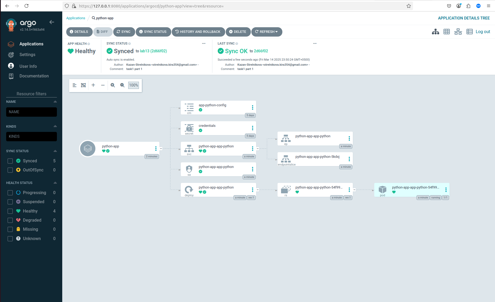
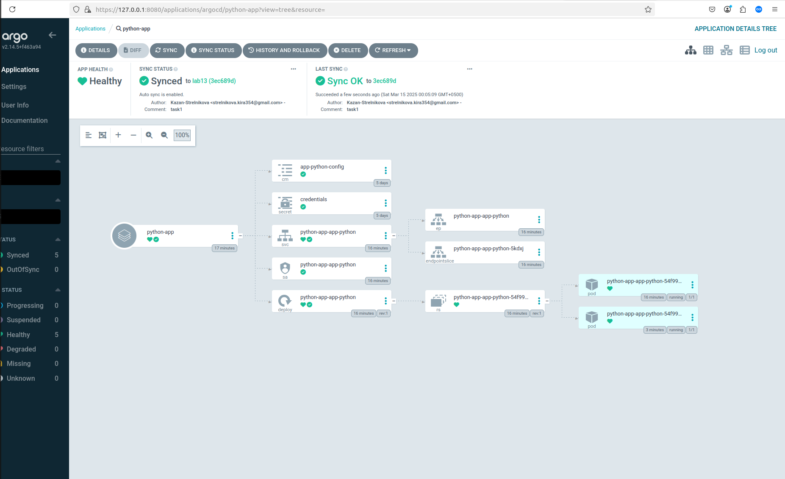
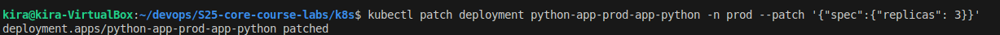
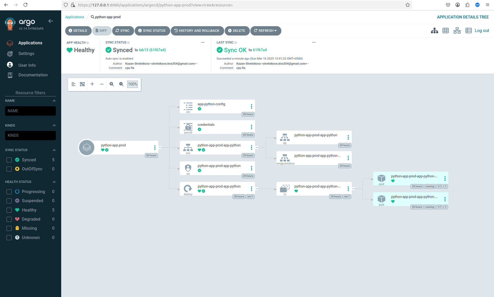
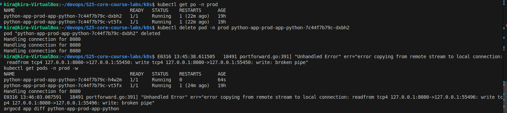
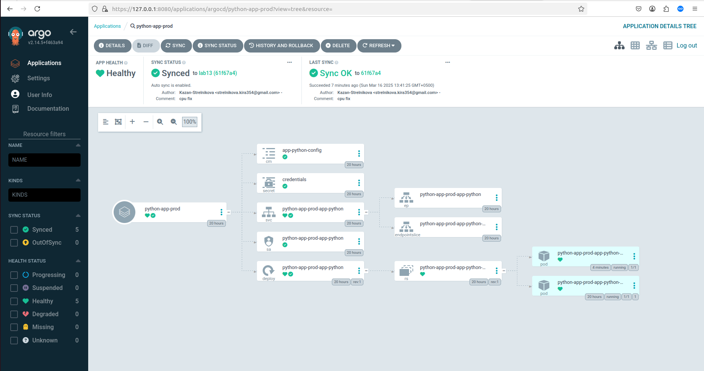

# Lab 13

## Task 1

### Sync verify

### After changing values.yaml

## Task 2

### Enable Auto-Sync

### Test 1

### Test 2

### Configuration Drift vs. Runtime Events in ArgoCD

- **Configuration Drift:** Happens when the Git-defined state differs from the Kubernetes cluster (e.g., manually changing replica count). ArgoCD detects and corrects it automatically unless manual sync is required.  

- **Runtime Events:** Temporary failures (e.g., pod crash, node drain) are handled by Kubernetes (ReplicaSets, Deployments). ArgoCD does not react unless the issue persists beyond Kubernetes' recovery mechanisms.
