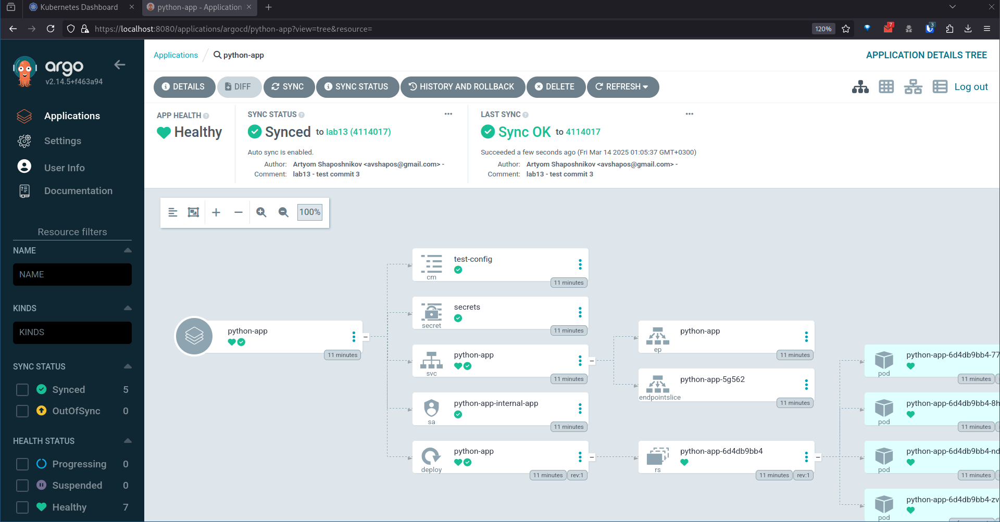
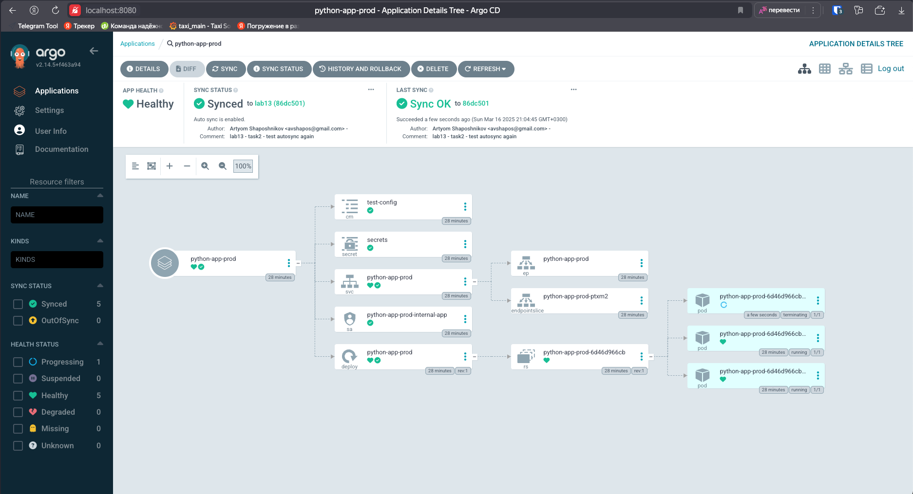
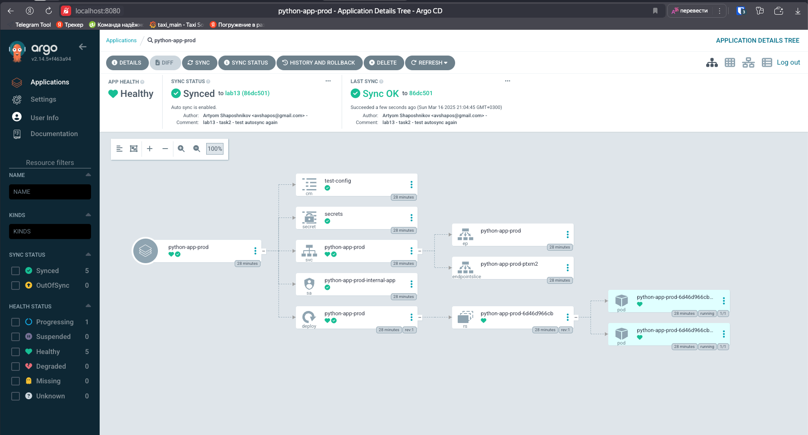
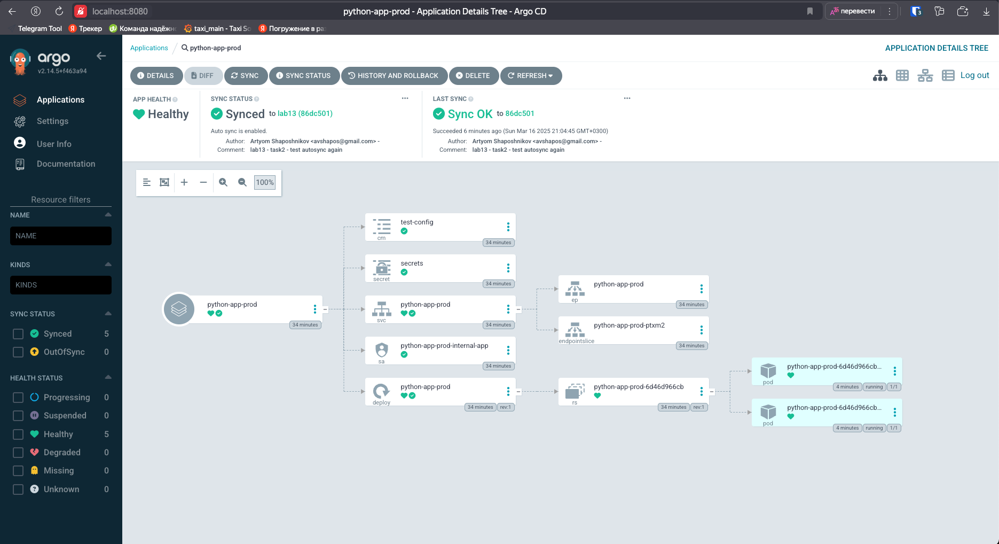
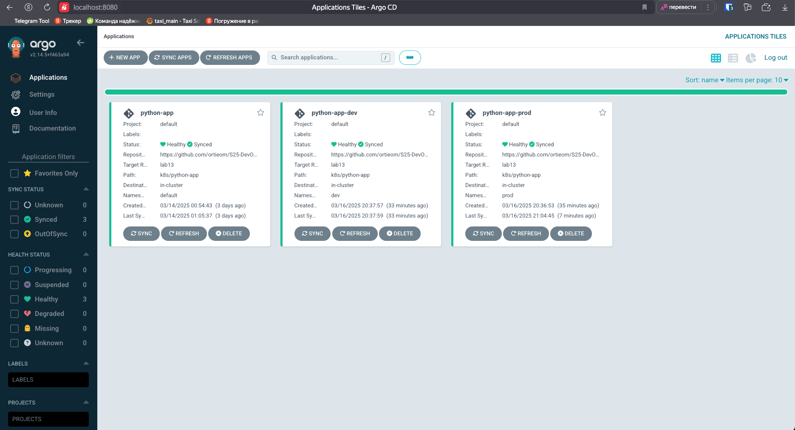

# ArgoCD

## Task 1



## Task 2

### Test 1

Applying:

```bash
ubuntu@fhmhd8tturtcnb6bcjnt:~/S25-DevOps-labs/k8s/ArgoCD$ kubectl patch deployment python-app-prod -n prod --patch '{"spec":{"replicas": 3}}'
deployment.apps/python-app-prod patched

ubuntu@fhmhd8tturtcnb6bcjnt:~/S25-DevOps-labs/k8s/ArgoCD$ argocd app sync python-app-prod
TIMESTAMP                  GROUP        KIND       NAMESPACE                  NAME            STATUS    HEALTH            HOOK  MESSAGE
2025-03-16T18:04:45+00:00          ConfigMap            prod           test-config            Synced                            
2025-03-16T18:04:45+00:00             Secret            prod               secrets            Synced                            
2025-03-16T18:04:45+00:00            Service            prod       python-app-prod            Synced   Healthy                  
2025-03-16T18:04:45+00:00         ServiceAccount        prod  python-app-prod-internal-app    Synced                            
2025-03-16T18:04:45+00:00   apps  Deployment            prod       python-app-prod          OutOfSync  Progressing              
2025-03-16T18:04:46+00:00         ServiceAccount        prod  python-app-prod-internal-app    Synced                            serviceaccount/python-app-prod-internal-app unchanged
2025-03-16T18:04:46+00:00             Secret            prod               secrets            Synced                            secret/secrets unchanged
2025-03-16T18:04:46+00:00          ConfigMap            prod           test-config            Synced                            configmap/test-config unchanged
2025-03-16T18:04:46+00:00            Service            prod       python-app-prod            Synced   Healthy                  service/python-app-prod unchanged
2025-03-16T18:04:46+00:00   apps  Deployment            prod       python-app-prod          OutOfSync  Progressing              deployment.apps/python-app-prod configured
2025-03-16T18:04:46+00:00   apps  Deployment        prod       python-app-prod    Synced  Progressing              deployment.apps/python-app-prod configured

Name:               argocd/python-app-prod
Project:            default
Server:             https://kubernetes.default.svc
Namespace:          prod
URL:                https://argocd.example.com/applications/python-app-prod
Source:
- Repo:             https://github.com/ortieom/S25-DevOps-labs.git
  Target:           lab13
  Path:             k8s/python-app
  Helm Values:      values-prod.yaml
SyncWindow:         Sync Allowed
Sync Policy:        Automated
Sync Status:        Synced to lab13 (86dc501)
Health Status:      Healthy

Operation:          Sync
Sync Revision:      86dc501721f80d485ca7d241a69121a64b68af26
Phase:              Succeeded
Start:              2025-03-16 18:04:45 +0000 UTC
Finished:           2025-03-16 18:04:45 +0000 UTC
Duration:           0s
Message:            successfully synced (all tasks run)

GROUP  KIND            NAMESPACE  NAME                          STATUS  HEALTH   HOOK  MESSAGE
       ServiceAccount  prod       python-app-prod-internal-app  Synced                 serviceaccount/python-app-prod-internal-app unchanged
       Secret          prod       secrets                       Synced                 secret/secrets unchanged
       ConfigMap       prod       test-config                   Synced                 configmap/test-config unchanged
       Service         prod       python-app-prod               Synced  Healthy        service/python-app-prod unchanged
apps   Deployment      prod       python-app-prod               Synced  Healthy        deployment.apps/python-app-prod configured
```

Screenshot during pod termination:



After test:



### Test 2

Before deletion:
```bash
ubuntu@fhmhd8tturtcnb6bcjnt:~/S25-DevOps-labs/k8s/ArgoCD$ kubectl get pods -n prod
NAME                               READY   STATUS    RESTARTS   AGE
python-app-prod-6d46d966cb-6hnww   1/1     Running   0          30m
python-app-prod-6d46d966cb-qpkzc   1/1     Running   0          30m
```

After deletion:
```bash
ubuntu@fhmhd8tturtcnb6bcjnt:~/S25-DevOps-labs/k8s/ArgoCD$ kubectl get pods -n prod -w
NAME                               READY   STATUS    RESTARTS   AGE
python-app-prod-6d46d966cb-6vnfw   1/1     Running   0          41s
python-app-prod-6d46d966cb-p27v4   1/1     Running   0          41s
```



### Resulting dashboard



### Configuration drift vs runtime events

Configuration drift happened when we manually changed replicas count to 3. ArgoCD detected this as configuration drift and automatically reverted the change back to 2 replicas (as defined in values-prod.yaml)

Runtime event happened when we deleted a pod. ArgoCD showed no drift because pod deletion is a runtime event handled by Kubernetes and the deployment controller maintained the desired state (2 replicas). ArgoCD only manages the desired state, not runtime instances.
