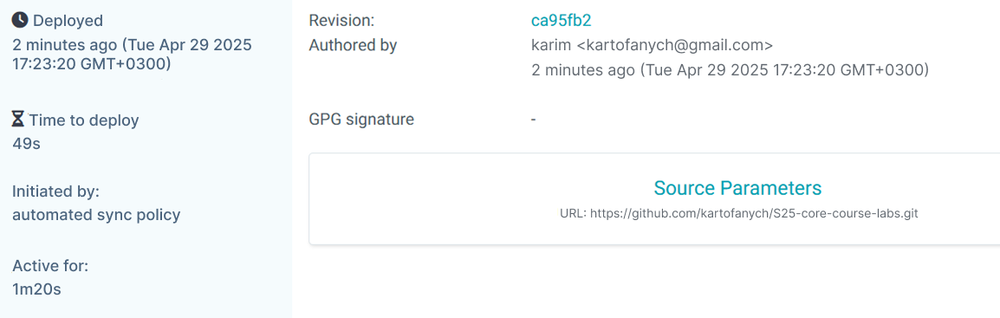
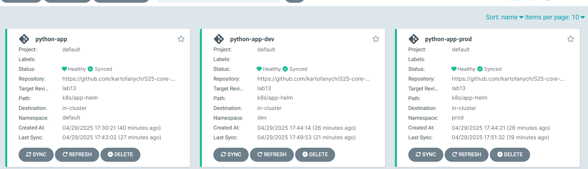
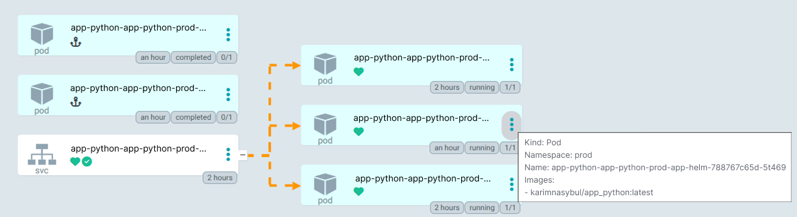

# Lab 13: ArgoCD for GitOps Deployment

## Task 1

### Access the ArgoCD UI

```bash
  > kubectl port-forward svc/argo-argocd-server -n argocd 8080:443

  Forwarding from 127.0.0.1:8080 -> 8080
  Forwarding from [::1]:8080 -> 8080
  Handling connection for 8080
  ...
```

added `argo_cd_app.yaml`

```bash
  > argocd app get app-python
  
  Name:               argocd/app-python
  Project:            default
  Server:             https://kubernetes.default.svc
  ...
```

### Test

ArgoCD auto-sync the update:

```bash
  > argocd app get app-python

  Name:               argocd/app-python
  Project:            default
  Server:             https://kubernetes.default.svc
  Namespace:          default
  URL:                https://argocd.example.com/applications/app-python
  Source:
  - Repo:             https://github.com/kartofanych/S25-core-course-labs.git
    Target:           lab13
    Path:             k8s/app-helm
    Helm Values:      values.yaml
  SyncWindow:         Sync Allowed
  Sync Policy:        Automated
  Sync Status:        Synced to lab13 (519fce5)
  Health Status:      Healthy

  GROUP  KIND            NAMESPACE  NAME                                    STATUS     HEALTH   HOOK      MESSAGE
        Pod             default    app-python-python-helm-preinstall   Succeeded           PreSync   pod/app-python-python-helm-preinstall created
        ServiceAccount  default    app-python-python-helm              Synced                        serviceaccount/app-python-python-helm unchanged
        Secret          default    helm-secret                             Synced                        secret/helm-secret unchanged
        ConfigMap       default    app-python-python-helm-config       Synced                        configmap/app-python-python-helm-config unchanged
        Service         default    app-python-python-helm              Synced     Healthy            service/app-python-python-helm unchanged
  apps   Deployment      default    app-python-python-helm              Synced     Healthy            deployment.apps/app-python-python-helm unchanged
        Pod             default    app-python-python-helm-postinstall  Succeeded           PostSync  pod/app-python-python-helm-postinstall created
```



## Task 2



`argo_cd_prod.yaml` and `argo_cd_dev.yaml`

```yaml
  apiversion:
    argoproj.io/v1alpha1
  kind:
    Application
  metadata:
    name: app-python-dev
    namespace: argocd
  spec:
    project: default
    source:
      repoURL: https://github.com/kartofanych/S25-core-course-labs.git
      targetRevision: lab13
      path: k8s/app-helm
      helm:
        valueFiles:
          - values-dev.yaml
    destination:
      server: https://kubernetes.default.svc
      namespace: dev
    syncPolicy:
      automated: { }
```

### Self-Heal Testing

**Explanation:** `Configuration Draft` occurs when the live configuration (manifests applied in the cluster) differs from what is declared in Git. For example, if someone manually changes a deployment’s replica count, ArgoCD will detect these differences during its sync checks. If auto-sync is enabled, ArgoCD will automatically revert the changes to match the Git configuration. `Runtime events` are not considered configuration drift. These events do not affect the configuration stored in Git. ArgoCD allows runtime events to occur without intervention.

#### Test 1

Modify the deployment’s replica count manually:

```bash
  > kubectl patch deployment app-python-prod-app-helm -n prod --patch "{\"spec\":{\"replicas\":4}}"

  deployment.apps/app-python-prod-app-helm patched
```

ArgoCD auto-reverted the change:

```bash
  > argocd app sync app-python-prod     

  TIMESTAMP                  GROUP        KIND       NAMESPACE                  NAME                           STATUS    HEALTH        HOOK  MESSAGE
  2025-03-16T21:05:48+03:00   apps  Deployment            prod  app-python-prod-app-helm              OutOfSync  Healthy
  2025-03-16T21:05:48+03:00          ConfigMap            prod  app-python-prod-app-helm-config         Synced
  2025-03-16T21:05:48+03:00                Pod            prod  app-python-prod-app-helm-postinstall
  2025-03-16T21:05:48+03:00                Pod            prod  app-python-prod-app-helm-preinstall
  2025-03-16T21:05:48+03:00             Secret            prod           helm-secret                           Synced
  2025-03-16T21:05:48+03:00            Service            prod  app-python-prod-app-helm                Synced   Healthy
  2025-03-16T21:05:48+03:00         ServiceAccount        prod  app-python-prod-app-helm                Synced
  2025-03-16T21:05:52+03:00                Pod        prod  app-python-prod-app-helm-preinstall   Running   Synced     PreSync  pod/app-python-prod-app-helm-preinstall created
  2025-03-16T21:06:16+03:00   apps  Deployment        prod  app-python-prod-app-helm    Synced  Progressing
  2025-03-16T21:06:17+03:00          ConfigMap            prod  app-python-prod-app-helm-config        Synced                            configmap/app-python-prod-app-helm-config unchanged
  2025-03-16T21:06:17+03:00            Service            prod  app-python-prod-app-helm               Synced   Healthy                  service/app-python-prod-app-helm unchanged
  2025-03-16T21:06:17+03:00   apps  Deployment            prod  app-python-prod-app-helm               Synced   Progressing              deployment.apps/app-python-prod-app-helm configured
  2025-03-16T21:06:17+03:00                Pod            prod  app-python-prod-app-helm-preinstall  Succeeded   Synced         PreSync  pod/app-python-prod-app-helm-preinstall created
  2025-03-16T21:06:17+03:00         ServiceAccount        prod  app-python-prod-app-helm               Synced                            serviceaccount/app-python-prod-app-helm unchanged
  2025-03-16T21:06:17+03:00             Secret            prod           helm-secret                          Synced                            secret/helm-secret unchanged
  2025-03-16T21:06:18+03:00   apps  Deployment        prod  app-python-prod-app-helm    Synced  Healthy              deployment.apps/app-python-prod-app-helm configured
  2025-03-16T21:06:18+03:00                Pod        prod  app-python-prod-app-helm-postinstall   Running   Synced    PostSync  pod/app-python-prod-app-helm-postinstall created
  2025-03-16T21:06:55+03:00                Pod        prod  app-python-prod-app-helm-postinstall  Succeeded   Synced    PostSync  pod/app-python-prod-app-helm-postinstall created

  Name:               argocd/app-python-prod
  Project:            default
  Server:             https://kubernetes.default.svc
  Namespace:          prod
  URL:                https://argocd.example.com/applications/app-python-prod
  Source:
  - Repo:             https://github.com/kartofanych/S25-core-course-labs.git
    Target:           lab13
    Path:             k8s/app-helm
    Helm Values:      values-prod.yaml
  SyncWindow:         Sync Allowed
  Sync Policy:        Automated
  Sync Status:        Synced to lab13 (89a67e8)
  Health Status:      Healthy

  Operation:          Sync
  Sync Revision:      89a67e85e7639640697b08b302e59310551f5970
  Phase:              Succeeded
  Start:              2025-03-16 21:05:47 +0300 MSK
  Finished:           2025-03-16 21:06:55 +0300 MSK
  Duration:           1m8s
  Message:            successfully synced (no more tasks)

  GROUP  KIND            NAMESPACE  NAME                                         STATUS     HEALTH   HOOK      MESSAGE
        Pod             prod       app-python-prod-app-helm-preinstall   Succeeded           PreSync   pod/app-python-prod-app-helm-preinstall created     
        ServiceAccount  prod       app-python-prod-app-helm              Synced                        serviceaccount/app-python-prod-app-helm unchanged   
        Secret          prod       helm-secret                                  Synced                        secret/helm-secret unchanged
        ConfigMap       prod       app-python-prod-app-helm-config       Synced                        configmap/app-python-prod-app-helm-config unchanged 
        Service         prod       app-python-prod-app-helm              Synced     Healthy            service/app-python-prod-app-helm unchanged
  apps   Deployment      prod       app-python-prod-app-helm              Synced     Healthy            deployment.apps/app-python-prod-app-helm configured 
        Pod             prod       app-python-prod-app-helm-postinstall  Succeeded           PostSync  pod/app-python-prod-app-helm-postinstall created    
```

```bash
  > argocd app get app-python-prod   

    Path:             k8s/app-helm
    Helm Values:      values-prod.yaml
  SyncWindow:         Sync Allowed
  Sync Policy:        Automated
  Sync Status:        Synced to lab13 (89a67e8)
  Health Status:      Healthy

  GROUP  KIND            NAMESPACE  NAME                                         STATUS     HEALTH   HOOK      MESSAGE
        Pod             prod       app-python-prod-app-helm-preinstall   Succeeded           PreSync   pod/app-python-prod-app-helm-preinstall created
        ServiceAccount  prod       app-python-prod-app-helm              Synced                        serviceaccount/app-python-prod-app-helm unchanged
  Health Status:      Healthy

  GROUP  KIND            NAMESPACE  NAME                                         STATUS     HEALTH   HOOK      MESSAGE
  GROUP  KIND            NAMESPACE  NAME                                         STATUS     HEALTH   HOOK      MESSAGE
    HEALTH   HOOK      MESSAGE
        Pod             prod       app-python-prod-app-helm-preinstall   Succeeded       Pod             prod       app-python-prod-app-helm-preinstall   Succeeded           PreSync   pod/app-python-prod-app-helm-preinstall created
        ServiceAccount  prod       app-python-prod-app-helm              Synced                        serviceaccount/app-python-prod-app-helm unchanged
        Secret          prod       helm-secret                                  Synced              PreSync   pod/app-python-prod-app-helm-preinstall created
        ServiceAccount  prod       app-python-prod-app-helm              Synced                        serviceaccount/app-python-prod-app-helm unchanged
        Secret          prod       helm-secret                                  Synced              PreSync   pod/app-python-prod-app-helm-preinstall created
        ServiceAccount  prod       app-python-prod-app-helm              Synced                        serviceaccount/app-python-prod-app-helm unchanged
            PreSync   pod/app-python-prod-app-helm-preinstall created
        ServiceAccount  prod       app-python-prod-app-helm              Synced              PreSync   pod/app-python-prod-app-helm-preinstall created
                  configmap/app-python-prod-app-helm-config unchanged
        Service         prod       app-python-prod-app-helm              Synced     Healthy            service/app-python-prod-app-helm unchanged
  apps   Deployment      prod       app-python-prod-app-helm              Synced     Healthy            deployment.apps/app-python-prod-app-helm configured
        Pod             prod       app-python-prod-app-helm-postinstall  Succeeded           PostSync  pod/app-python-prod-app-helm-postinstall created
```

#### Test 2: Delete

Delete a pod in the `prod` namespace `app-python-prod-app-helm-788767c65d-8cwp5`:

```bash
  > kubectl get pod -n prod

  NAME                                               READY   STATUS      RESTARTS   AGE
  app-python-prod-app-helm-788767c65d-2l87z   1/1     Running     0          45m
  app-python-prod-app-helm-788767c65d-8cwp5   1/1     Running     0          4m54s
  app-python-prod-app-helm-788767c65d-t9jn4   1/1     Running     0          45m
  27s
  app-python-prod-app-helm-preinstall         0/1     Completed   0          7m55s
  27s
  app-python-prod-app-helm-preinstall         0/1     Completed   0          7m55s 
```

```bash
  > kubectl delete pod -n prod app-python-prod-app-helm-788767c65d-8cwp5

  pod "app-python-prod-app-helm-788767c65d-8cwp5" deleted
```

Kubernetes recreates the pod to match the deployment’s `replicaCount` and created new pod `app-python-prod-app-helm-788767c65d-5t469`:

```bash
  > kubectl get pods -n prod -w

  app-python-prod-app-helm-788767c65d-2l87z   1/1     Running     0          49m
  app-python-prod-app-helm-788767c65d-5t469   1/1     Running     0          8s
  app-python-prod-app-helm-788767c65d-t9jn4   1/1     Running     0          49m
  app-python-prod-app-helm-postinstall        0/1     Completed   0          8m58s
  app-python-prod-app-helm-preinstall         0/1     Completed   0          9m26s
```

Confirm ArgoCD shows no drift:

```bash
  PS C:\S25-core-course-labs\k8s> argocd app diff app-python-prod
  PS C:\S25-core-course-labs\k8s> argocd app diff app-python-prod
```

