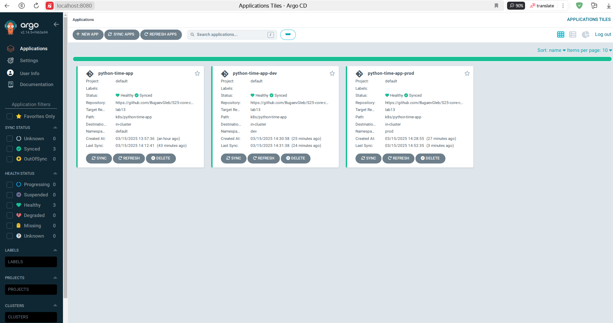
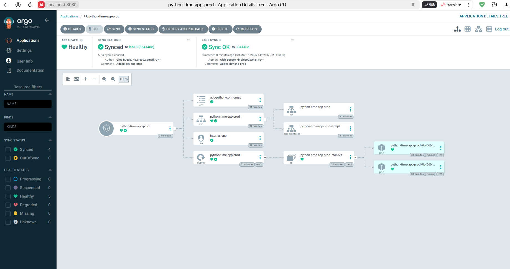
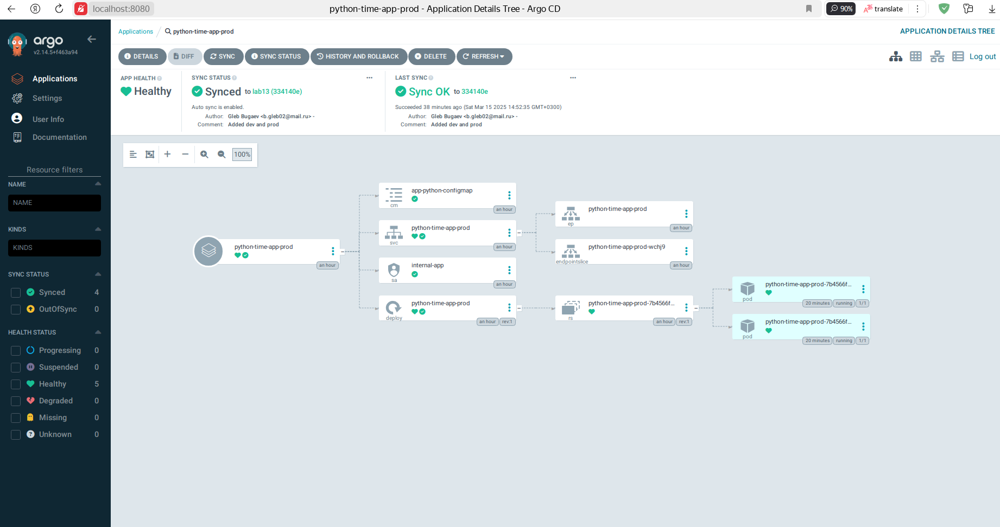
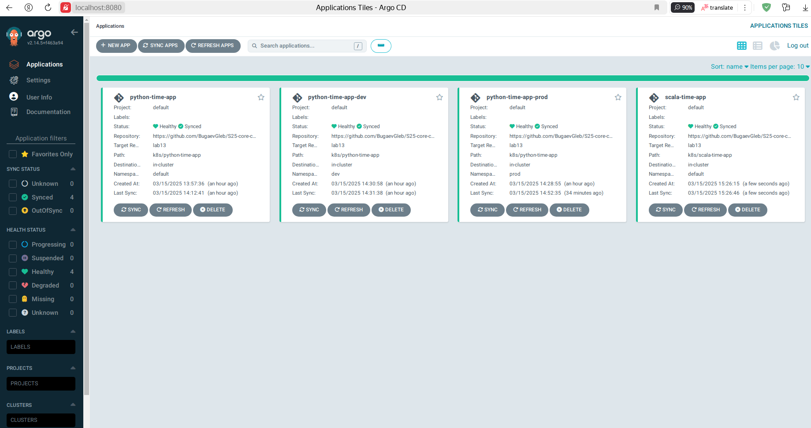
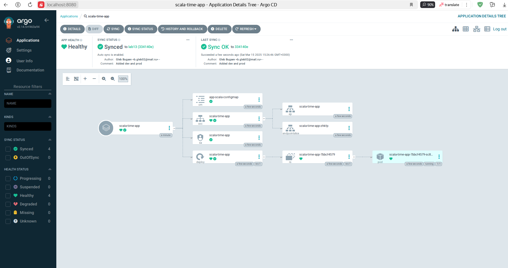

# ArgoCD for GitOps Deployment

## Task 2

### Test 1: Manual Override of Replica Count

I manually patched it, wait some time and get these results after ArgoCD auto-revert the changes:

```bash
gleb@gleb-VMware-Virtual-Platform:~/Desktop/DevOps/Labs/S25-core-course-labs/k8s$ kubectl patch deployment python-time-app-prod -n prod --patch '{"spec":
{"replicas": 3}}'

deployment.apps/python-time-app-prod patched

gleb@gleb-VMware-Virtual-Platform:~/Desktop/DevOps/Labs/S25-core-course-labs/k8s$ argocd app sync python-time-app-prod

TIMESTAMP                  GROUP        KIND       NAMESPACE                  NAME    STATUS    HEALTH        HOOK  MESSAGE
2025-03-15T14:52:08+03:00   apps  Deployment            prod  python-time-app-prod  OutOfSync  Healthy              
2025-03-15T14:52:08+03:00          ConfigMap            prod  app-python-configmap    Synced                        
2025-03-15T14:52:08+03:00            Service            prod  python-time-app-prod    Synced   Healthy              
2025-03-15T14:52:08+03:00         ServiceAccount        prod          internal-app    Synced                        
2025-03-15T14:52:08+03:00                Pod        prod       preinstall-hook                                 
2025-03-15T14:52:10+03:00                Pod        prod       preinstall-hook   Running   Synced     PreSync  pod/preinstall-hook created
2025-03-15T14:52:22+03:00   apps  Deployment        prod  python-time-app-prod    Synced  Healthy              
2025-03-15T14:52:24+03:00         ServiceAccount        prod          internal-app    Synced                        serviceaccount/internal-app unchanged
2025-03-15T14:52:24+03:00          ConfigMap            prod  app-python-configmap    Synced                        configmap/app-python-configmap unchanged
2025-03-15T14:52:24+03:00            Service            prod  python-time-app-prod    Synced   Healthy              service/python-time-app-prod unchanged
2025-03-15T14:52:24+03:00   apps  Deployment            prod  python-time-app-prod    Synced   Healthy              deployment.apps/python-time-app-prod configured
2025-03-15T14:52:24+03:00                Pod            prod       preinstall-hook  Succeeded   Synced     PreSync  pod/preinstall-hook created
2025-03-15T14:52:24+03:00                Pod        prod      postinstall-hook   Running   Synced    PostSync  pod/postinstall-hook created
2025-03-15T14:52:35+03:00                Pod        prod      postinstall-hook  Succeeded   Synced    PostSync  pod/postinstall-hook created

Name:               argocd/python-time-app-prod
Project:            default
Server:             https://kubernetes.default.svc
Namespace:          prod
URL:                https://argocd.example.com/applications/python-time-app-prod
Source:
- Repo:             https://github.com/BugaevGleb/S25-core-course-labs.git
  Target:           lab13
  Path:             k8s/python-time-app
  Helm Values:      values-prod.yaml
SyncWindow:         Sync Allowed
Sync Policy:        Automated
Sync Status:        Synced to lab13 (334140e)
Health Status:      Healthy

Operation:          Sync
Sync Revision:      334140e03de7eec9d2b9a18c8339d63886cae990
Phase:              Succeeded
Start:              2025-03-15 14:52:08 +0300 MSK
Finished:           2025-03-15 14:52:35 +0300 MSK
Duration:           27s
Message:            successfully synced (no more tasks)

GROUP  KIND            NAMESPACE  NAME                  STATUS     HEALTH   HOOK      MESSAGE
       Pod             prod       preinstall-hook       Succeeded           PreSync   pod/preinstall-hook created
       ServiceAccount  prod       internal-app          Synced                        serviceaccount/internal-app unchanged
       ConfigMap       prod       app-python-configmap  Synced                        configmap/app-python-configmap unchanged
       Service         prod       python-time-app-prod  Synced     Healthy            service/python-time-app-prod unchanged
apps   Deployment      prod       python-time-app-prod  Synced     Healthy            deployment.apps/python-time-app-prod configured
       Pod             prod       postinstall-hook      Succeeded           PostSync  pod/postinstall-hook created
```





```bash
gleb@gleb-VMware-Virtual-Platform:~/Desktop/DevOps/Labs/S25-core-course-labs/k8s$ kubectl get pods -n prod

NAME                                    READY   STATUS    RESTARTS   AGE
python-time-app-prod-7b4566f4cd-2q9ql   1/1     Running   0          26m
python-time-app-prod-7b4566f4cd-zrgtz   1/1     Running   0          26m
```

### Test 2: Delete a Pod (Replica)

Before deletion of pods:

```bash
gleb@gleb-VMware-Virtual-Platform:~/Desktop/DevOps/Labs/S25-core-course-labs/k8s$ kubectl get pods -n prod

NAME                                    READY   STATUS    RESTARTS   AGE
python-time-app-prod-7b4566f4cd-pznkc   1/1     Running   0          10m
python-time-app-prod-7b4566f4cd-xh5xz   1/1     Running   0          10m
```

And after the deletion of pods:

```bash
gleb@gleb-VMware-Virtual-Platform:~/Desktop/DevOps/Labs/S25-core-course-labs/k8s$ kubectl delete pod -n prod -l app.kubernetes.io/name=python-time-app

pod "python-time-app-prod-7b4566f4cd-2q9ql" deleted
pod "python-time-app-prod-7b4566f4cd-zrgtz" deleted

gleb@gleb-VMware-Virtual-Platform:~/Desktop/DevOps/Labs/S25-core-course-labs/k8s$ kubectl get pods -n prod -w

NAME                                    READY   STATUS    RESTARTS   AGE
python-time-app-prod-7b4566f4cd-pznkc   1/1     Running   0          80s
python-time-app-prod-7b4566f4cd-xh5xz   1/1     Running   0          80s

gleb@gleb-VMware-Virtual-Platform:~/Desktop/DevOps/Labs/S25-core-course-labs/k8s$ argocd app diff python-time-app-prod
```

*`argocd app diff python-time-app-prod` did not produce any output*



---

## Bonus Task

I completed all provided steps from Task 1, but now for my Scala application. And these are the results:





```bash
gleb@gleb-VMware-Virtual-Platform:~/Desktop/DevOps/Labs/S25-core-course-labs/k8s$ kubectl get pods

NAME                               READY   STATUS    RESTARTS   AGE
python-time-app-7784b5b74d-xftgw   1/1     Running   0          74m
python-time-app-7784b5b74d-z8fgx   1/1     Running   0          88m
scala-time-app-7bbcf4579-sc8v8     1/1     Running   0          28s
vault-0                            1/1     Running   0          109m
```

---
