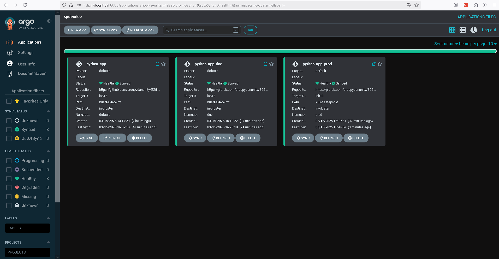
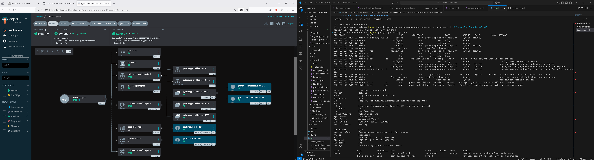
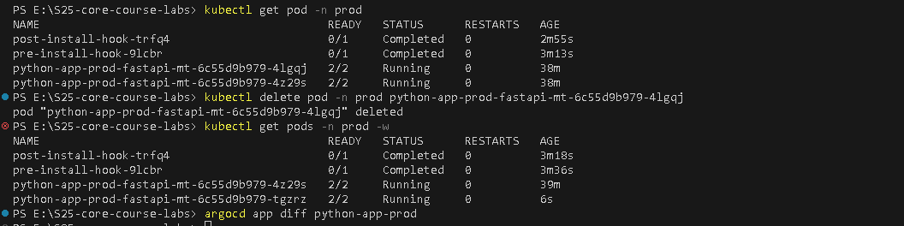
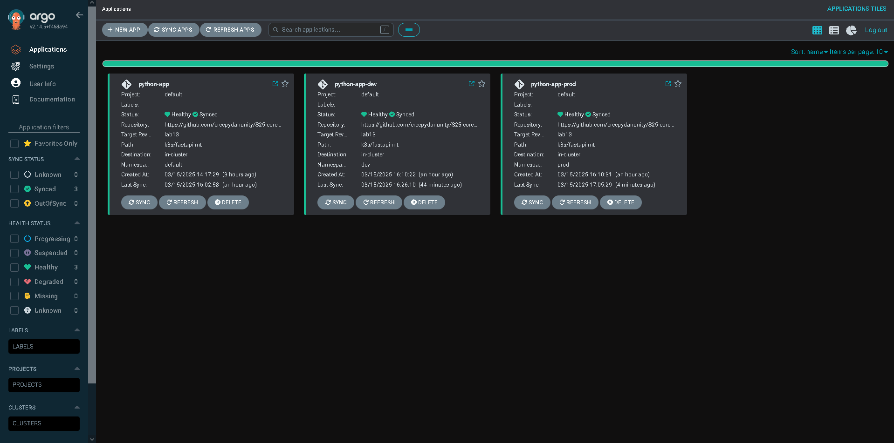
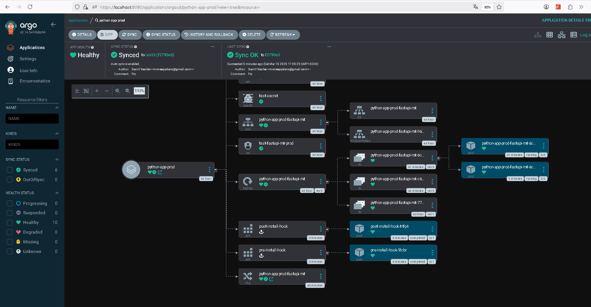
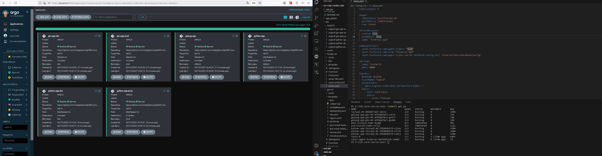

## Lab 13: ArgoCD for GitOps Deployment
- Daniil Vasilev, d.vasilev@innopolis.university

### Task 1 & 2
#### Task 1 Step 1: Installation via Helm
- Completed without any troubles with the guide from `lab13.md`

#### Task 1 Step 2: Installation CLI
- Completed following `Download With PowerShell: Invoke-WebRequest` section from official documentatino

#### Task 1 Step 3: Access the ArgoCD UI
- Completed with some troubleshooting: admin password was accepted via ArgoCD UI but was not via CLI. Restoring the password solved the problem.

#### Task 1 Step 4: Configure Python App Sync
- Created `argocd-python-app.yaml` in the `ArgoCD` folder
- Applied configuration:
```bash
kubectl apply -f ArgoCD/argocd-python-app.yaml
```
- Verified sync via UI

#### Task 1 Step 5: Test Sync Workflow
- Tested. It works as expected.

#### Task 2 Step 1-2: Set Up Multi-Environment Configurations
- Created environment-specific values files: `./k8s/fastapi-mt/values-dev.yaml` and `./k8s/fastapi-mt/values-prod.yaml`
- Created Namespaces using:
```bash
kubectl create namespace dev
kubectl create namespace prod
```

#### Task 2 Step 3: Deploy Multi-Environment via ArgoCD
- Created `argocd-python-dev.yaml` and `argocd-python-prod.yaml` in the `ArgoCD` folder.
- The main differences are:
```yaml
spec.syncPolicy:
    automated:
      prune: true
      selfHeal: true

spec.source.helm.valueFiles:
    - values-dev.yaml # or values-prod.yaml
```
- Applied changes:
```bash
kubectl apply -f argocd-python-dev.yaml
kubectl apply -f argocd-python-prod.yaml
```

#### Task 2 Step 4: Test Sync Workflow
- Tested. It works as expected.

#### Task 2 Step 5-6: Self-Heal Testing & Documentation

- After Task 2.4 was done: 

- Self-Healing Test 1 (Sync Included)
    1. 
- Self-Healing Test 2
    1. 
- Sync after self-healing test 2
    1. 
    2. 

#### How ArgoCD handles configuration drift vs. runtime events?

ArgoCD continuously monitors the desired state of applications defined in **Git** and ensures that the actual state in the cluster matches this desired state

- **1. Configuration Drift**
    - If someone modifies a Kubernetes resource manually (e.g., changing replica count via `kubectl patch`) ArgoCD detects the drift
    - The app’s status changes to **"OutOfSync"** in ArgoCD
    - If **auto-sync** is enabled, ArgoCD will revert the changes to match the Git repository

- **2. Runtime Events**
    - Some events happen naturally in Kubernetes, such as:
        1. Pod restarts due to node failures
        2. Recreations of missing pods
        3. Horizontal Autoscalings

    - ArgoCD does **not** consider these as drift because they do not modify the desired configuration in Git
    - Pods can restart or be replaced, but ArgoCD will still show the app as **"Synced"** as long as the Deployment spec remains unchanged

- **Summing up:**
    - **Configuration Drift** (manual changes via `kubectl apply`, `patch`, etc.) → ArgoCD detects and fixes it
    - **Runtime Events** (pod crashes, node failures) → Kubernetes handles it; ArgoCD does NOT intervene

### Bonus Task
- 
- Added ./k8s/ArgoCD/argocd-go-*.yaml files (3) as for python app in tasks 1-2.
- Added go-app-related roles to the Vault mapping for bonus app.