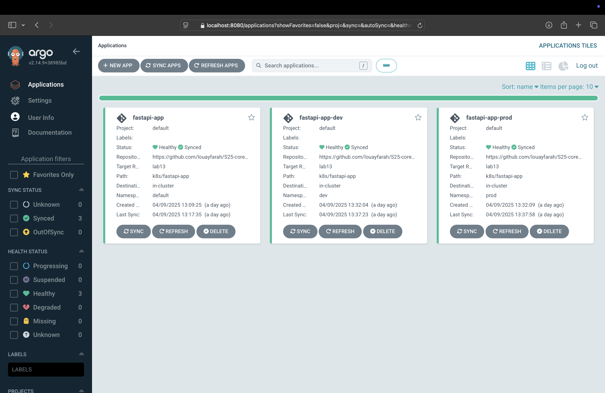

# Lab 13: ArgoCD for GitOps Deployment

---

## 1. Installing ArgoCD via Helm

```bash
(venv) louayfarah@Louays-MacBook-Pro k8s % helm repo add argo https://argoproj.github.io/argo-helm

"argo" already exists with the same configuration, skipping
(venv) louayfarah@Louays-MacBook-Pro k8s % helm repo update

Hang tight while we grab the latest from your chart repositories...
...Successfully got an update from the "hashicorp" chart repository
...Successfully got an update from the "argo" chart repository
...Successfully got an update from the "prometheus-community" chart repository
...Successfully got an update from the "bitnami" chart repository
Update Complete. ⎈Happy Helming!⎈
(venv) louayfarah@Louays-MacBook-Pro k8s % helm install argo argo/argo-cd --namespace argocd --create-namespace

NAME: argo
LAST DEPLOYED: Wed Apr  9 10:35:29 2025
NAMESPACE: argocd
STATUS: deployed
REVISION: 1
TEST SUITE: None
NOTES:
In order to access the server UI you have the following options:

1. kubectl port-forward service/argo-argocd-server -n argocd 8080:443

    and then open the browser on http://localhost:8080 and accept the certificate

2. enable ingress in the values file `server.ingress.enabled` and either
      - Add the annotation for ssl passthrough: https://argo-cd.readthedocs.io/en/stable/operator-manual/ingress/#option-1-ssl-passthrough
      - Set the `configs.params."server.insecure"` in the values file and terminate SSL at your ingress: https://argo-cd.readthedocs.io/en/stable/operator-manual/ingress/#option-2-multiple-ingress-objects-and-hosts


After reaching the UI the first time you can login with username: admin and the random password generated during the installation. You can find the password by running:

kubectl -n argocd get secret argocd-initial-admin-secret -o jsonpath="{.data.password}" | base64 -d

(You should delete the initial secret afterwards as suggested by the Getting Started Guide: https://argo-cd.readthedocs.io/en/stable/getting_started/#4-login-using-the-cli)
(venv) louayfarah@Louays-MacBook-Pro k8s % kubectl wait --for=condition=ready pod -l app.kubernetes.io/name=argocd-server -n argocd --timeout=90s

pod/argo-argocd-server-84b89d4c4f-858zc condition met
(venv) louayfarah@Louays-MacBook-Pro k8s % kubectl get pods -n argocd

NAME                                                    READY   STATUS    RESTARTS   AGE
argo-argocd-application-controller-0                    1/1     Running   0          2m56s
argo-argocd-applicationset-controller-c878c89dd-22kc5   1/1     Running   0          2m56s
argo-argocd-dex-server-79b67d5dc-jc6xd                  1/1     Running   0          2m56s
argo-argocd-notifications-controller-7f5468d644-t92rm   1/1     Running   0          2m56s
argo-argocd-redis-549bd4fd5b-sg4w9                      1/1     Running   0          2m56s
argo-argocd-repo-server-6ff5786d5f-xsn8w                1/1     Running   0          2m56s
argo-argocd-server-84b89d4c4f-858zc                     1/1     Running   0          2m56s
```

---

## 2. Installing ArgoCD CLI

```bash
(venv) louayfarah@Louays-MacBook-Pro k8s % brew install argocd

==> Auto-updating Homebrew...
[...trimmed auto-update logs...]
argocd 2.14.5 is already installed but outdated (so it will be upgraded).
==> Downloading https://ghcr.io/v2/homebrew/core/argocd/manifests/2.14.9
###################################################################################################################################################### 100.0%
==> Fetching argocd
==> Downloading https://ghcr.io/v2/homebrew/core/argocd/blobs/sha256:d60f591e2c01014dd155dcedaf2015ad4fe18292a1af42bfaacd5ab5b6e1072a
###################################################################################################################################################### 100.0%
==> Upgrading argocd
  2.14.5 -> 2.14.9 
==> Pouring argocd--2.14.9.arm64_sequoia.bottle.tar.gz
==> Caveats
zsh completions have been installed to:
  /opt/homebrew/share/zsh/site-functions
==> Summary
🍺  /opt/homebrew/Cellar/argocd/2.14.9: 10 files, 190.2MB
==> Running `brew cleanup argocd`...
[...trimmed cleanup logs...]
(venv) louayfarah@Louays-MacBook-Pro k8s % argocd version --client

argocd: v2.14.9+38985bd.dirty
  BuildDate: 2025-04-02T22:58:27Z
  GitCommit: 38985bdcd6c3b031fb83757a1fb0c39a55bf6a24
  GitTreeState: dirty
  GoVersion: go1.24.2
  Compiler: gc
  Platform: darwin/arm64
(venv) louayfarah@Louays-MacBook-Pro k8s %
```

> `kubectl port-forward svc/argo-argocd-server -n argocd 8080:443 &` is run successfully in the background.

---

## 3. Obtaining the Initial Admin Password and Logging In

```bash
(venv) louayfarah@Mac k8s % kubectl -n argocd get secret argocd-initial-admin-secret \
  -o jsonpath="{.data.password}" | base64 --decode

u4VNo5TV4H-Tbni8% 

(venv) louayfarah@Mac k8s % argocd login localhost:8080 --insecure \
  --username admin \
  --password u4VNo5TV4H-Tbni8
'admin:login' logged in successfully
Context 'localhost:8080' updated
(venv) louayfarah@Mac k8s %
```

---

## 4. Creating and Applying the ArgoCD Application (fastapi-app)

```bash
(venv) louayfarah@Mac k8s % mkdir ArgoCD
(venv) louayfarah@Mac k8s % touch ArgoCD/argocd-python-app.yaml
(venv) louayfarah@Mac k8s % kubectl apply -f ArgoCD/argocd-python-app.yaml

application.argoproj.io/fastapi-app created
```

```bash
(venv) louayfarah@Mac k8s % argocd app list

NAME                CLUSTER                         NAMESPACE  PROJECT  STATUS  HEALTH   SYNCPOLICY  CONDITIONS  REPO                                                    PATH             TARGET
argocd/fastapi-app  https://kubernetes.default.svc  default    default  Synced  Healthy  Auto        <none>      https://github.com/louayfarah/S25-core-course-labs.git  k8s/fastapi-app  lab13
```

### Syncing the Application

```bash
(venv) louayfarah@Mac k8s % argocd app sync fastapi-app     

TIMESTAMP                  GROUP        KIND       NAMESPACE                  NAME    STATUS   HEALTH        HOOK  MESSAGE
2025-04-09T11:17:09+01:00             Secret         default             my-secret    Synced                       
2025-04-09T11:17:09+01:00            Service         default           fastapi-app    Synced  Healthy              
2025-04-09T11:17:09+01:00         ServiceAccount     default           fastapi-app    Synced                       
2025-04-09T11:17:09+01:00   apps  Deployment         default           fastapi-app    Synced  Healthy              
2025-04-09T11:17:09+01:00          ConfigMap         default    fastapi-app-config    Synced                       
2025-04-09T11:17:11+01:00            Service         default           fastapi-app    Synced  Healthy              service/fastapi-app unchanged
2025-04-09T11:17:11+01:00   apps  Deployment         default           fastapi-app    Synced  Healthy              deployment.apps/fastapi-app unchanged
2025-04-09T11:17:11+01:00         ServiceAccount     default           fastapi-app    Synced                       serviceaccount/fastapi-app unchanged
2025-04-09T11:17:11+01:00             Secret         default             my-secret    Synced                       secret/my-secret unchanged
2025-04-09T11:17:11+01:00          ConfigMap         default    fastapi-app-config    Synced                       configmap/fastapi-app-config unchanged
2025-04-09T11:17:12+01:00                Pod     default      postinstall-hook   Running   Synced    PostSync  pod/postinstall-hook created
2025-04-09T11:17:35+01:00                Pod     default      postinstall-hook  Succeeded   Synced    PostSync  pod/postinstall-hook created

Name:               argocd/fastapi-app
Project:            default
Server:             https://kubernetes.default.svc
Namespace:          default
URL:                https://argocd.example.com/applications/fastapi-app
Source:
- Repo:             https://github.com/louayfarah/S25-core-course-labs.git
  Target:           lab13
  Path:             k8s/fastapi-app
  Helm Values:      values.yaml
SyncWindow:         Sync Allowed
Sync Policy:        Automated
Sync Status:        Synced to lab13 (2aecd22)
Health Status:      Healthy

Operation:          Sync
Sync Revision:      2aecd229f4d218a70726b985b0227a313c0a05a9
Phase:              Succeeded
Start:              2025-04-09 11:17:09 +0100 CET
Finished:           2025-04-09 11:17:35 +0100 CET
Duration:           26s
Message:            successfully synced (no more tasks)

GROUP  KIND            NAMESPACE  NAME                STATUS     HEALTH   HOOK      MESSAGE
       ServiceAccount  default    fastapi-app         Synced                        serviceaccount/fastapi-app unchanged
       Secret          default    my-secret           Synced                        secret/my-secret unchanged
       ConfigMap       default    fastapi-app-config  Synced                        configmap/fastapi-app-config unchanged
       Service         default    fastapi-app         Synced     Healthy            service/fastapi-app unchanged
apps   Deployment      default    fastapi-app         Synced     Healthy            deployment.apps/fastapi-app unchanged
       Pod             default    postinstall-hook    Succeeded           PostSync  pod/postinstall-hook created
```

**We then changed `values.yaml` to increase the replicaset from 1 to 2, committed, and pushed.**

```bash
(venv) louayfarah@Mac k8s % argocd app history fastapi-app
SOURCE  https://github.com/louayfarah/S25-core-course-labs.git
ID      DATE                           REVISION
0       2025-04-09 11:16:35 +0100 CET  lab13 (2aecd22)
1       2025-04-09 11:17:35 +0100 CET  lab13 (2aecd22)
```

---

## 5. Multi-Environment Setup (dev/prod)

```bash
(venv) louayfarah@Mac k8s % kubectl create namespace dev

namespace/dev created
(venv) louayfarah@Mac k8s % kubectl create namespace prod

namespace/prod created
```

**We added environment-specific values files** (dev/prod). Then we created two ArgoCD application manifests and applied them:

```bash
(venv) louayfarah@Mac k8s % kubectl apply -f ArgoCD/argocd-python-dev.yaml

application.argoproj.io/fastapi-app-dev created
(venv) louayfarah@Mac k8s % kubectl apply -f ArgoCD/argocd-python-prod.yaml

application.argoproj.io/fastapi-app-prod created
(venv) louayfarah@Mac k8s % argocd app list

NAME                     CLUSTER                         NAMESPACE  PROJECT  STATUS   HEALTH   SYNCPOLICY  CONDITIONS       REPO                                                    PATH             TARGET
argocd/fastapi-app       https://kubernetes.default.svc  default    default  Synced   Healthy  Auto        <none>           https://github.com/louayfarah/S25-core-course-labs.git  k8s/fastapi-app  lab13
argocd/fastapi-app-dev   https://kubernetes.default.svc  dev        default  Unknown  Healthy  Auto        ComparisonError  https://github.com/louayfarah/S25-core-course-labs.git  k8s/fastapi-app  lab13
argocd/fastapi-app-prod  https://kubernetes.default.svc  prod       default  Unknown  Healthy  Auto        ComparisonError  https://github.com/louayfarah/S25-core-course-labs.git  k8s/fastapi-app  lab13
```

We **enabled auto-sync** by adjusting the ArgoCD Application spec. Then we **pushed** a new commit changing the production replicas from 3 to 4:

```bash
(venv) louayfarah@Mac k8s % git push
Enumerating objects: 13, done.
Counting objects: 100% (13/13), done.
Delta compression using up to 11 threads
Compressing objects: 100% (9/9), done.
Writing objects: 100% (9/9), 1.10 KiB | 1.10 MiB/s, done.
Total 9 (delta 4), reused 0 (delta 0), pack-reused 0 (from 0)
remote: Resolving deltas: 100% (4/4), completed with 3 local objects.
To https://github.com/louayfarah/S25-core-course-labs.git
   850c05f..5da8450  lab13 -> lab13
```

---

## 6. Self-Healing Tests

### 6.1 Manual Patch of Deployment

```bash
(venv) louayfarah@Mac k8s % kubectl patch deployment fastapi-app-prod -n prod --patch '{"spec":{"replicas": 3}}'
deployment.apps/fastapi-app-prod patched
```

```bash
(venv) louayfarah@Mac k8s % argocd app sync fastapi-app-prod

TIMESTAMP                  GROUP        KIND       NAMESPACE                  NAME    STATUS    HEALTH        HOOK  MESSAGE
2025-04-09T11:37:32+01:00         ServiceAccount        prod      fastapi-app-prod    Synced                        
2025-04-09T11:37:32+01:00   apps  Deployment            prod      fastapi-app-prod  OutOfSync  Healthy              
2025-04-09T11:37:32+01:00          ConfigMap            prod    fastapi-app-config    Synced                        
2025-04-09T11:37:32+01:00             Secret            prod             my-secret    Synced                        
2025-04-09T11:37:32+01:00            Service            prod      fastapi-app-prod    Synced   Healthy              
2025-04-09T11:37:32+01:00   apps  Deployment        prod      fastapi-app-prod    Synced  Progressing              
2025-04-09T11:37:33+01:00   apps  Deployment        prod      fastapi-app-prod    Synced  Healthy              
2025-04-09T11:37:34+01:00         ServiceAccount        prod      fastapi-app-prod    Synced                       serviceaccount/fastapi-app-prod unchanged
2025-04-09T11:37:34+01:00             Secret            prod             my-secret    Synced                       secret/my-secret unchanged
2025-04-09T11:37:34+01:00          ConfigMap            prod    fastapi-app-config    Synced                       configmap/fastapi-app-config unchanged
2025-04-09T11:37:34+01:00            Service            prod      fastapi-app-prod    Synced  Healthy              service/fastapi-app-prod unchanged
2025-04-09T11:37:34+01:00   apps  Deployment            prod      fastapi-app-prod    Synced  Healthy              deployment.apps/fastapi-app-prod configured
2025-04-09T11:37:34+01:00                Pod        prod      postinstall-hook   Running   Synced    PostSync  pod/postinstall-hook created
2025-04-09T11:37:58+01:00                Pod        prod      postinstall-hook  Succeeded   Synced    PostSync  pod/postinstall-hook created

Name:               argocd/fastapi-app-prod
Project:            default
Server:             https://kubernetes.default.svc
Namespace:          prod
URL:                https://argocd.example.com/applications/fastapi-app-prod
Source:
- Repo:             https://github.com/louayfarah/S25-core-course-labs.git
  Target:           lab13
  Path:             k8s/fastapi-app
  Helm Values:      values-prod.yaml
SyncWindow:         Sync Allowed
Sync Policy:        Automated
Sync Status:        Synced to lab13 (5da8450)
Health Status:      Healthy

Operation:          Sync
Sync Revision:      5da84501ac37069ff5a4ce2a2df5f7a283bd4e35
Phase:              Succeeded
Start:              2025-04-09 11:37:32 +0100 CET
Finished:           2025-04-09 11:37:58 +0100 CET
Duration:           26s
Message:            successfully synced (no more tasks)

GROUP  KIND            NAMESPACE  NAME                STATUS     HEALTH   HOOK      MESSAGE
       ServiceAccount  prod       fastapi-app-prod    Synced                        serviceaccount/fastapi-app-prod unchanged
       Secret          prod       my-secret           Synced                        secret/my-secret unchanged
       ConfigMap       prod       fastapi-app-config  Synced                        configmap/fastapi-app-config unchanged
       Service         prod       fastapi-app-prod    Synced     Healthy            service/fastapi-app-prod unchanged
apps   Deployment      prod       fastapi-app-prod    Synced     Healthy            deployment.apps/fastapi-app-prod configured
       Pod             prod       postinstall-hook    Succeeded           PostSync  pod/postinstall-hook created
```

### 6.2 Deleting a Pod

**Before**:

```bash
(venv) louayfarah@Mac k8s % kubectl get pods -n prod
NAME                               READY   STATUS    RESTARTS   AGE
fastapi-app-prod-9cc4d4b76-c4zjn   1/1     Running   0          2m54s
fastapi-app-prod-9cc4d4b76-dxpjx   1/1     Running   0          2m54s
fastapi-app-prod-9cc4d4b76-kzvn6   1/1     Running   0          2m20s
fastapi-app-prod-9cc4d4b76-p52hq   1/1     Running   0          2m54s
```

**Deleting** the first pod:

```bash
(venv) louayfarah@Mac k8s % kubectl delete pod -n prod fastapi-app-prod-9cc4d4b76-c4zjn       
pod "fastapi-app-prod-9cc4d4b76-c4zjn" deleted
(venv) louayfarah@Mac k8s % kubectl get pods -n prod                                   
NAME                               READY   STATUS    RESTARTS   AGE
fastapi-app-prod-9cc4d4b76-dxpjx   1/1     Running   0          3m25s
fastapi-app-prod-9cc4d4b76-kzvn6   1/1     Running   0          3m25s
fastapi-app-prod-9cc4d4b76-p52hq   1/1     Running   0          3m25s
fastapi-app-prod-9cc4d4b76-tfcbw   1/1     Running   0          7s
```

Kubernetes **recreates the Pod** to match the desired replica count. ArgoCD sees **no drift** because the configuration in Git hasn’t changed:

```bash
(venv) louayfarah@Mac k8s % argocd app diff fastapi-app-prod

(venv) louayfarah@Mac k8s %
```

*(No output indicates no differences.)*

---

### Screenshot


---

## 7. How ArgoCD Handles Configuration Drift vs. Runtime Events

```text
ArgoCD always uses the Git repository as the single source of truth for an application’s desired configuration. It continuously compares the live state (resources in the cluster) to the desired state (manifests or Helm charts in Git).

1. Configuration Drift
   - Occurs when a Kubernetes resource’s specification changes in the cluster and no longer matches what is in the Git repository.
   - Example: Someone manually patches a Deployment’s replica count to a value different from what the repo defines.
   - If ArgoCD is configured with syncPolicy.automated, it will automatically detect this drift and revert the cluster resource to match the Git config. This ensures the actual state always aligns with the declared state in Git.

2. Runtime Events
   - Involve transient or ephemeral changes that do not modify the resource specifications stored in Git.
   - Example: A Pod is deleted or crashes, causing the Deployment to create a new one. This does not constitute a specification change, so there is no difference in the resource’s desired configuration. Kubernetes self-healing also handles these events automatically.
   - Since the spec for the Deployment remains identical to what’s in Git, ArgoCD sees no drift. There is nothing to revert because the cluster is still aligned with the Git-based specification.

```


## Bonus Task

```bash
(venv) louayfarah@Louays-MacBook-Pro S25-core-course-labs % argocd app list
NAME                     CLUSTER                         NAMESPACE     PROJECT  STATUS     HEALTH   SYNCPOLICY  CONDITIONS  REPO                                                    PATH             TARGET
argocd/fastapi-app       https://kubernetes.default.svc  default       default  Synced     Healthy  Auto        <none>      https://github.com/louayfarah/S25-core-course-labs.git  k8s/fastapi-app  lab13
argocd/fastapi-app-dev   https://kubernetes.default.svc  dev           default  Synced     Healthy  Auto        <none>      https://github.com/louayfarah/S25-core-course-labs.git  k8s/fastapi-app  lab13
argocd/fastapi-app-prod  https://kubernetes.default.svc  prod          default  Synced     Healthy  Auto        <none>      https://github.com/louayfarah/S25-core-course-labs.git  k8s/fastapi-app  lab13
argocd/nodejs-app        https://kubernetes.default.svc  argocd-bonus  default  OutOfSync  Missing  Auto        <none>      https://github.com/louayfarah/S25-core-course-labs.git  k8s/nodejs-app   lab13
(venv) louayfarah@Louays-MacBook-Pro S25-core-course-labs % kubectl get all -n argocd-bonus 
No resources found in argocd-bonus namespace.
(venv) louayfarah@Louays-MacBook-Pro S25-core-course-labs % argocd app sync nodejs-app

TIMESTAMP                  GROUP        KIND              NAMESPACE                    NAME    STATUS    HEALTH        HOOK  MESSAGE
2025-04-10T19:39:59+03:00         PersistentVolumeClaim  argocd-bonus        nodejs-app-pvc  OutOfSync  Missing              
2025-04-10T19:39:59+03:00            Service             argocd-bonus            nodejs-app  OutOfSync  Missing              
2025-04-10T19:39:59+03:00         ServiceAccount         argocd-bonus            nodejs-app  OutOfSync  Missing              
2025-04-10T19:39:59+03:00   apps  Deployment             argocd-bonus            nodejs-app  OutOfSync  Missing              
2025-04-10T19:39:59+03:00         ServiceAccount  argocd-bonus            nodejs-app    Synced  Missing              
2025-04-10T19:39:59+03:00         PersistentVolumeClaim  argocd-bonus        nodejs-app-pvc    Synced  Progressing              
2025-04-10T19:39:59+03:00         PersistentVolumeClaim  argocd-bonus        nodejs-app-pvc    Synced  Healthy              
2025-04-10T19:39:59+03:00            Service             argocd-bonus            nodejs-app    Synced  Healthy              
2025-04-10T19:39:59+03:00         ServiceAccount         argocd-bonus            nodejs-app    Synced   Missing              serviceaccount/nodejs-app created
2025-04-10T19:39:59+03:00         PersistentVolumeClaim  argocd-bonus        nodejs-app-pvc    Synced   Healthy              persistentvolumeclaim/nodejs-app-pvc created
2025-04-10T19:39:59+03:00            Service             argocd-bonus            nodejs-app    Synced   Healthy              service/nodejs-app created
2025-04-10T19:39:59+03:00   apps  Deployment             argocd-bonus            nodejs-app  OutOfSync  Missing              deployment.apps/nodejs-app created
2025-04-10T19:39:59+03:00   apps  Deployment  argocd-bonus            nodejs-app    Synced  Progressing              deployment.apps/nodejs-app created

Name:               argocd/nodejs-app
Project:            default
Server:             https://kubernetes.default.svc
Namespace:          argocd-bonus
URL:                https://argocd.example.com/applications/nodejs-app
Source:
- Repo:             https://github.com/louayfarah/S25-core-course-labs.git
  Target:           lab13
  Path:             k8s/nodejs-app
  Helm Values:      values.yaml
SyncWindow:         Sync Allowed
Sync Policy:        Automated
Sync Status:        Synced to lab13 (5da8450)
Health Status:      Progressing

Operation:          Sync
Sync Revision:      5da84501ac37069ff5a4ce2a2df5f7a283bd4e35
Phase:              Succeeded
Start:              2025-04-10 19:39:59 +0300 +03
Finished:           2025-04-10 19:39:59 +0300 +03
Duration:           0s
Message:            successfully synced (all tasks run)

GROUP  KIND                   NAMESPACE     NAME            STATUS  HEALTH       HOOK  MESSAGE
       ServiceAccount         argocd-bonus  nodejs-app      Synced                     serviceaccount/nodejs-app created
       PersistentVolumeClaim  argocd-bonus  nodejs-app-pvc  Synced  Healthy            persistentvolumeclaim/nodejs-app-pvc created
       Service                argocd-bonus  nodejs-app      Synced  Healthy            service/nodejs-app created
apps   Deployment             argocd-bonus  nodejs-app      Synced  Progressing        deployment.apps/nodejs-app created
(venv) louayfarah@Louays-MacBook-Pro S25-core-course-labs % kubectl get pods -n argocd-bonus 
NAME                         READY   STATUS    RESTARTS   AGE
nodejs-app-89fd4d685-ddn5f   1/1     Running   0          17s
```