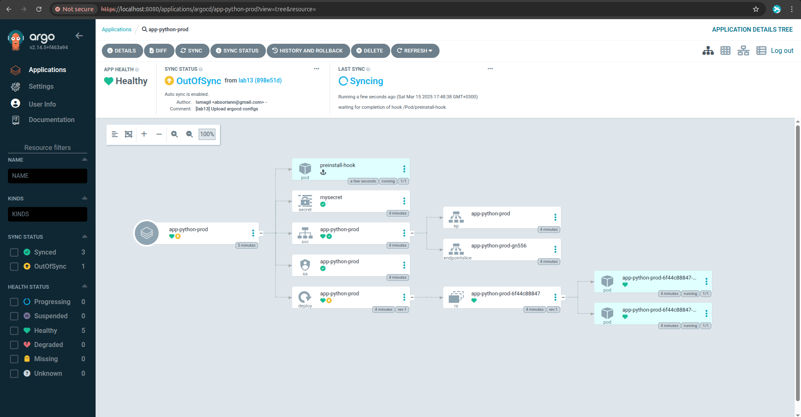
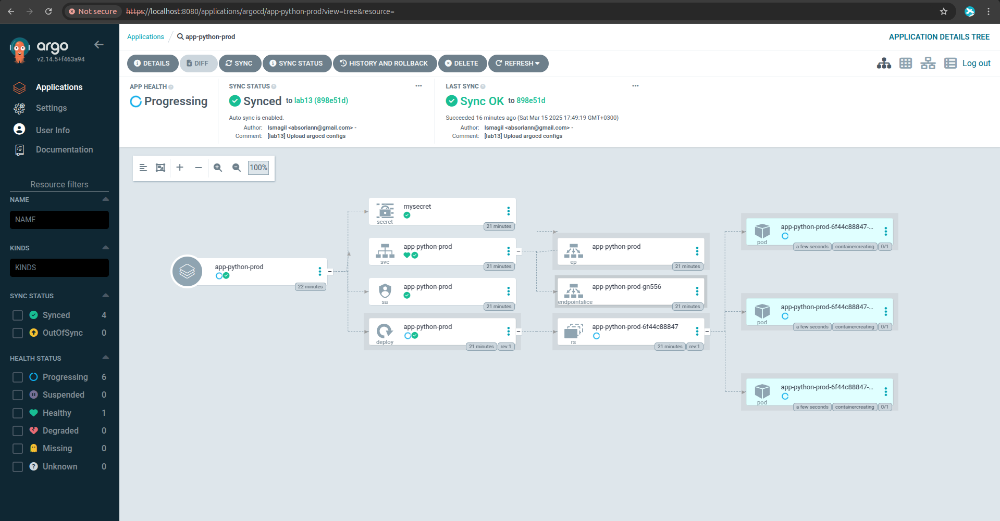

# ArgoCD management

## Test 1

```bash
kubectl patch deployment python-app-prod -n prod --patch '{"spec":{"replicas": 2}}'
```



## Test 2

Before pods deletion

```text
$ kubectl get pods -n prod
NAME                               READY   STATUS    RESTARTS   AGE
app-python-prod-6f44c88847-hjzl9   1/1     Running   0          6m
app-python-prod-6f44c88847-pvw2t   1/1     Running   0          73s
app-python-prod-6f44c88847-vtqgq   1/1     Running   0          6m
```

After pods deletion

```text
$ kubectl get pods -n prod
NAME                               READY   STATUS    RESTARTS   AGE
app-python-prod-6f44c88847-d2f6r   1/1     Running   0          9s
app-python-prod-6f44c88847-hblr5   1/1     Running   0          9s
app-python-prod-6f44c88847-w2925   1/1     Running   0          9s
```



## Configuration drift vs Runtime events

ArgoCD ensures the declared infrastructure (Deployments, ConfigMaps, etc.) matches Git. Kubernetes handles runtime state (pods, scaling). Drift in declared resources is ArgoCD's domain, transient pod disruptions are Kubernetes' responsibility.
