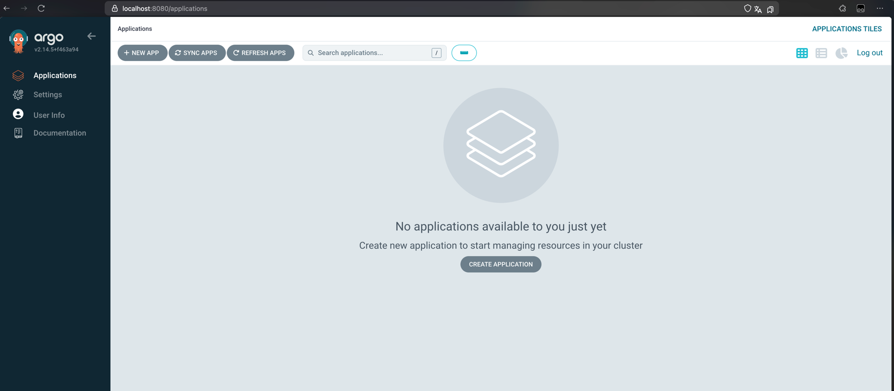

# ArgoCD

## Deploy and Configure

### Add to Helm repository

```shell
helm repo add argo https://argoproj.github.io/argo-helm
```

```text
"argo" has been added to your repositories
```

### Install ArgoCD

```shell
helm install argo argo/argo-cd --namespace argocd --create-namespace
```

```text
NAME: argo
LAST DEPLOYED: Sun Mar 16 15:05:10 2025
NAMESPACE: argocd
STATUS: deployed
REVISION: 1
TEST SUITE: None
NOTES:
In order to access the server UI you have the following options:

1. kubectl port-forward service/argo-argocd-server -n argocd 8080:443

    and then open the browser on http://localhost:8080 and accept the certificate

2. enable ingress in the values file `server.ingress.enabled` and either
      - Add the annotation for ssl passthrough: https://argo-cd.readthedocs.io/en/stable/operator-manual/ingress/#option-1-ssl-passthrough
      - Set the `configs.params."server.insecure"` in the values file and terminate SSL at your ingress: https://argo-cd.readthedocs.io/en/stable/operator-manual/ingress/#option-2-multiple-ingress-objects-and-hosts


After reaching the UI the first time you can login with username: admin and the random password generated during the installation. You can find the password by running:

kubectl -n argocd get secret argocd-initial-admin-secret -o jsonpath="{.data.password}" | base64 -d

(You should delete the initial secret afterwards as suggested by the Getting Started Guide: https://argo-cd.readthedocs.io/en/stable/getting_started/#4-login-using-the-cli)
```

### Verify installation

```shell
kubectl wait --for=condition=ready pod -l app.kubernetes.io/name=argocd-server -n argocd --timeout=90s
```

```text
pod/argo-argocd-server-7b688c6d85-lm76d condition met
```

### Install ArgoCD CLI

```shell
brew install argocd
```

```shell
argocd version
```

```text
argocd: v2.14.5+f463a94
  BuildDate: 2025-03-11T04:57:25Z
  GitCommit: f463a945d57267e9691cede37021d9ddc5994f36
  GitTreeState: clean
  GoVersion: go1.24.1
  Compiler: gc
  Platform: darwin/arm64
```

### Access the ArgoCD UI

#### Forward server port

```shell
kubectl port-forward svc/argo-argocd-server -n argocd 8080:443 &
```

```text
Forwarding from 127.0.0.1:8080 -> 8080
Forwarding from [::1]:8080 -> 8080
```

Now UI is available on http://localhost:8080:



#### Log in

Get password:

```shell
kubectl -n argocd get secret argocd-initial-admin-secret -o jsonpath="{.data.password}" | base64 --decode
```

Log in via CLI:

```shell
argocd login localhost:8080 --insecure
```

```text
Username: admin
Password: 
'admin:login' logged in successfully
Context 'localhost:8080' updated
```

### Configure Python app sync

#### Apply configuration

```shell
kubectl apply -f ArgoCD/argocd-python-app.yaml
```

```text
application.argoproj.io/python-app created
```

#### Sync

```shell
agrocd app sync moscow-time-app
```

```text
TIMESTAMP  GROUP        KIND   NAMESPACE                  NAME    STATUS   HEALTH        HOOK  MESSAGE
2025-03-16T18:14:59+03:00                Pod     default       preinstall-hook   Running   Synced     PreSync  pod/preinstall-hook created
2025-03-16T18:15:21+03:00                Pod         default       preinstall-hook    Succeeded   Synced     PreSync  pod/preinstall-hook created
2025-03-16T18:15:21+03:00         ServiceAccount     default          internal-app     Running    Synced              serviceaccount/internal-app configured. Warning: resource serviceaccounts/internal-app is missing the kubectl.kubernetes.io/last-applied-configuration annotation which is required by  apply.  apply should only be used on resources created declaratively by either  create --save-config or  apply. The missing annotation will be patched automatically.
2025-03-16T18:15:21+03:00          ConfigMap         default  moscow-time-app-config   Running    Synced              configmap/moscow-time-app-config configured. Warning: resource configmaps/moscow-time-app-config is missing the kubectl.kubernetes.io/last-applied-configuration annotation which is required by  apply.  apply should only be used on resources created declaratively by either  create --save-config or  apply. The missing annotation will be patched automatically.
2025-03-16T18:15:21+03:00            Service         default       moscow-time-app     Running    Synced              service/moscow-time-app configured. Warning: resource services/moscow-time-app is missing the kubectl.kubernetes.io/last-applied-configuration annotation which is required by  apply.  apply should only be used on resources created declaratively by either  create --save-config or  apply. The missing annotation will be patched automatically.
2025-03-16T18:15:21+03:00   apps  Deployment         default       moscow-time-app     Running    Synced              deployment.apps/moscow-time-app configured. Warning: resource deployments/moscow-time-app is missing the kubectl.kubernetes.io/last-applied-configuration annotation which is required by  apply.  apply should only be used on resources created declaratively by either  create --save-config or  apply. The missing annotation will be patched automatically.
2025-03-16T18:15:22+03:00         ServiceAccount     default          internal-app    Succeeded   Synced              serviceaccount/internal-app configured. Warning: resource serviceaccounts/internal-app is missing the kubectl.kubernetes.io/last-applied-configuration annotation which is required by  apply.  apply should only be used on resources created declaratively by either  create --save-config or  apply. The missing annotation will be patched automatically.
2025-03-16T18:15:22+03:00          ConfigMap         default  moscow-time-app-config  Succeeded   Synced              configmap/moscow-time-app-config configured. Warning: resource configmaps/moscow-time-app-config is missing the kubectl.kubernetes.io/last-applied-configuration annotation which is required by  apply.  apply should only be used on resources created declaratively by either  create --save-config or  apply. The missing annotation will be patched automatically.
2025-03-16T18:15:22+03:00            Service         default       moscow-time-app    Succeeded   Synced              service/moscow-time-app configured. Warning: resource services/moscow-time-app is missing the kubectl.kubernetes.io/last-applied-configuration annotation which is required by  apply.  apply should only be used on resources created declaratively by either  create --save-config or  apply. The missing annotation will be patched automatically.
2025-03-16T18:15:22+03:00   apps  Deployment         default       moscow-time-app    Succeeded   Synced              deployment.apps/moscow-time-app configured. Warning: resource deployments/moscow-time-app is missing the kubectl.kubernetes.io/last-applied-configuration annotation which is required by  apply.  apply should only be used on resources created declaratively by either  create --save-config or  apply. The missing annotation will be patched automatically.
2025-03-16T18:15:22+03:00                Pod         default      postinstall-hook     Running    Synced    PostSync  pod/postinstall-hook created
2025-03-16T18:15:43+03:00                Pod     default      postinstall-hook  Succeeded   Synced    PostSync  pod/postinstall-hook created

Name:               argocd/moscow-time-app
Project:            default
Server:             https://kubernetes.default.svc
Namespace:          default
URL:                https://argocd.example.com/applications/moscow-time-app
Source:
- Repo:             https://github.com/innoenjoyer/S25-core-course-labs.git
  Target:           lab-13
  Path:             k8s/moscow-time-app
  Helm Values:      values.yaml
SyncWindow:         Sync Allowed
Sync Policy:        Automated
Sync Status:        OutOfSync from lab-13 (3a35082)
Health Status:      Healthy

Operation:          Sync
Sync Revision:      3a35082a030ae6f1800033dee3dfaeeec7d4daeb
Phase:              Succeeded
Start:              2025-03-16 18:14:56 +0300 MSK
Finished:           2025-03-16 18:15:43 +0300 MSK
Duration:           47s
Message:            successfully synced (no more tasks)

GROUP  KIND            NAMESPACE  NAME                    STATUS     HEALTH   HOOK      MESSAGE
       Pod             default    preinstall-hook         Succeeded           PreSync   pod/preinstall-hook created
       ServiceAccount  default    internal-app            Synced                        serviceaccount/internal-app configured. Warning: resource serviceaccounts/internal-app is missing the kubectl.kubernetes.io/last-applied-configuration annotation which is required by  apply.  apply should only be used on resources created declaratively by either  create --save-config or  apply. The missing annotation will be patched automatically.
       ConfigMap       default    moscow-time-app-config  Synced                        configmap/moscow-time-app-config configured. Warning: resource configmaps/moscow-time-app-config is missing the kubectl.kubernetes.io/last-applied-configuration annotation which is required by  apply.  apply should only be used on resources created declaratively by either  create --save-config or  apply. The missing annotation will be patched automatically.
       Service         default    moscow-time-app         Synced     Healthy            service/moscow-time-app configured. Warning: resource services/moscow-time-app is missing the kubectl.kubernetes.io/last-applied-configuration annotation which is required by  apply.  apply should only be used on resources created declaratively by either  create --save-config or  apply. The missing annotation will be patched automatically.
apps   Deployment      default    moscow-time-app         OutOfSync  Healthy            deployment.apps/moscow-time-app configured. Warning: resource deployments/moscow-time-app is missing the kubectl.kubernetes.io/last-applied-configuration annotation which is required by  apply.  apply should only be used on resources created declaratively by either  create --save-config or  apply. The missing annotation will be patched automatically.
       Pod             default    postinstall-hook        Succeeded           PostSync  pod/postinstall-hook created
```