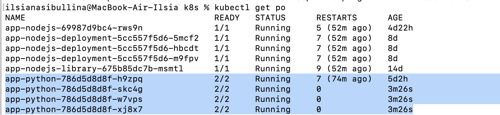
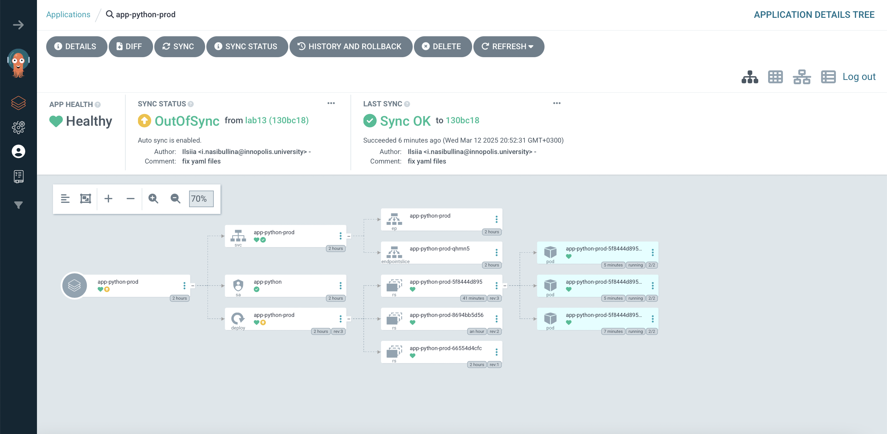
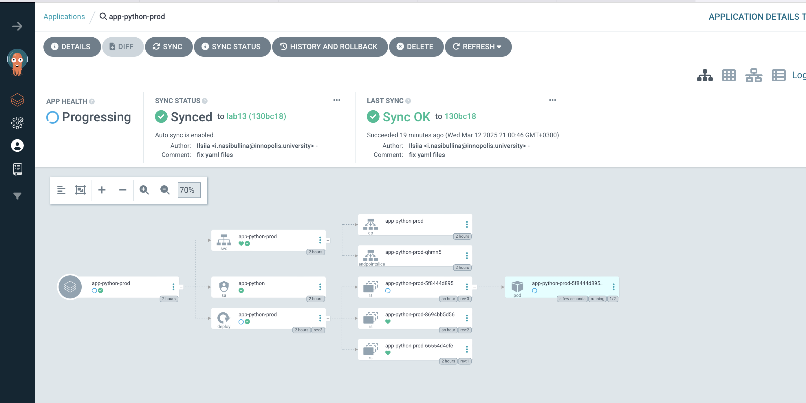
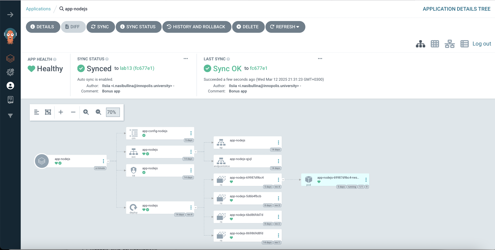

# ArgoCD for GitOps Deployment

## Task 1

The verification of successfull ArgoCD installation:

```bash
% kubectl wait --for=condition=ready pod -l app.kubernetes.io/name=argocd-server -n argocd --timeout=90s

pod/argo-argocd-server-6f848cf7f7-xsw7n condition met
```

The result of synchronization:

```bash
% argocd app sync app-python                                           
TIMESTAMP                  GROUP        KIND       NAMESPACE                  NAME    STATUS   HEALTH        HOOK  MESSAGE
2025-03-12T14:14:29+03:00   apps  Deployment         default            app-python    Synced  Healthy              
2025-03-12T14:14:29+03:00          ConfigMap         default            app-config    Synced                       
2025-03-12T14:14:29+03:00            Service         default            app-python    Synced  Healthy              
2025-03-12T14:14:29+03:00         ServiceAccount     default            app-python    Synced                       
2025-03-12T14:14:30+03:00                Pod     default       preinstall-hook                                 
2025-03-12T14:14:31+03:00                Pod     default       preinstall-hook   Running   Synced     PreSync  pod/preinstall-hook created
2025-03-12T14:14:55+03:00         ServiceAccount     default            app-python    Synced                        serviceaccount/app-python unchanged
2025-03-12T14:14:55+03:00          ConfigMap         default            app-config    Synced                        configmap/app-config unchanged
2025-03-12T14:14:55+03:00            Service         default            app-python    Synced   Healthy              service/app-python unchanged
2025-03-12T14:14:55+03:00   apps  Deployment         default            app-python    Synced   Healthy              deployment.apps/app-python unchanged
2025-03-12T14:14:55+03:00                Pod         default       preinstall-hook  Succeeded   Synced     PreSync  pod/preinstall-hook created
2025-03-12T14:14:56+03:00                Pod     default      postinstall-hook   Running   Synced    PostSync  pod/postinstall-hook created
2025-03-12T14:15:55+03:00                Pod     default      postinstall-hook  Succeeded   Synced    PostSync  pod/postinstall-hook created

Name:               argocd/app-python
Project:            default
Server:             https://kubernetes.default.svc
Namespace:          default
URL:                https://argocd.example.com/applications/app-python
Source:
- Repo:             https://github.com/IlsiyaNasibullina/S25-core-course-labs.git
  Target:           lab13
  Path:             k8s/app-python
  Helm Values:      values.yaml
SyncWindow:         Sync Allowed
Sync Policy:        Automated
Sync Status:        Synced to lab13 (0f6f4f3)
Health Status:      Healthy

Operation:          Sync
Sync Revision:      0f6f4f3fbaf506a9f3b21cd5bcd2433a5720c501
Phase:              Succeeded
Start:              2025-03-12 14:14:28 +0300 MSK
Finished:           2025-03-12 14:15:55 +0300 MSK
Duration:           1m27s
Message:            successfully synced (no more tasks)

GROUP  KIND            NAMESPACE  NAME              STATUS     HEALTH   HOOK      MESSAGE
       Pod             default    preinstall-hook   Succeeded           PreSync   pod/preinstall-hook created
       ServiceAccount  default    app-python        Synced                        serviceaccount/app-python unchanged
       ConfigMap       default    app-config        Synced                        configmap/app-config unchanged
       Service         default    app-python        Synced     Healthy            service/app-python unchanged
apps   Deployment      default    app-python        Synced     Healthy            deployment.apps/app-python unchanged
       Pod             default    postinstall-hook  Succeeded           PostSync  pod/postinstall-hook created
```

After commiting number of replicas change I observed ArgoCD auto-sync:

```bash
argocd app get app-python
Name:               argocd/app-python
Project:            default
Server:             https://kubernetes.default.svc
Namespace:          default
URL:                https://argocd.example.com/applications/app-python
Source:
- Repo:             https://github.com/IlsiyaNasibullina/S25-core-course-labs.git
  Target:           lab13
  Path:             k8s/app-python
  Helm Values:      values.yaml
SyncWindow:         Sync Allowed
Sync Policy:        Automated
Sync Status:        Synced to lab13 (018d57c)
Health Status:      Healthy

GROUP  KIND            NAMESPACE  NAME              STATUS     HEALTH   HOOK      MESSAGE
       Pod             default    preinstall-hook   Succeeded           PreSync   pod/preinstall-hook created
       ServiceAccount  default    app-python        Synced                        serviceaccount/app-python unchanged
       ConfigMap       default    app-config        Synced                        configmap/app-config unchanged
       Service         default    app-python        Synced     Healthy            service/app-python unchanged
apps   Deployment      default    app-python        Synced     Healthy            deployment.apps/app-python configured
       Pod             default    postinstall-hook  Running             PostSync  pod/postinstall-hook created

```

Also the number of pods increased from 1 to 3:



## Task 2

### Part 1

The pods before modification of replicas number:

```bash
% kubectl get pod -n prod                                                   
NAME                               READY   STATUS    RESTARTS   AGE
app-python-prod-5f8444d895-vfkzx   2/2     Running   0          3m59s
```

The number of pods increased after setting replicas number to 3:

```bash
% kubectl patch deployment app-python-prod -n prod --patch '{"spec":{"replicas": 3}}'
deployment.apps/app-python-prod patched

 % kubectl get po -n prod
NAME                               READY   STATUS    RESTARTS   AGE
app-python-prod-5f8444d895-2ckjs   2/2     Running   0          106s
app-python-prod-5f8444d895-kcq6l   2/2     Running   0          106s
app-python-prod-5f8444d895-rt4gf   2/2     Running   0          3m55s
```



The result of commands `argocd app sync app-python-prod` and `argocd app get  app-python-prod`:

```bash
% argocd app sync app-python-prod
TIMESTAMP                  GROUP        KIND       NAMESPACE                  NAME    STATUS    HEALTH            HOOK  MESSAGE
2025-03-12T20:46:23+03:00            Service            prod       app-python-prod    Synced   Healthy                  
2025-03-12T20:46:23+03:00         ServiceAccount        prod            app-python    Synced                            
2025-03-12T20:46:23+03:00   apps  Deployment            prod       app-python-prod  OutOfSync  Progressing              
2025-03-12T20:46:24+03:00                Pod        prod       preinstall-hook                                 
2025-03-12T20:46:26+03:00                Pod        prod       preinstall-hook   Running   Synced     PreSync  pod/preinstall-hook created
2025-03-12T20:46:49+03:00   apps  Deployment        prod       app-python-prod    Synced  Progressing              
2025-03-12T20:46:51+03:00                Pod            prod       preinstall-hook  Succeeded   Synced         PreSync  pod/preinstall-hook created
2025-03-12T20:46:51+03:00         ServiceAccount        prod            app-python    Synced                            serviceaccount/app-python unchanged
2025-03-12T20:46:51+03:00            Service            prod       app-python-prod    Synced   Healthy                  service/app-python-prod unchanged
2025-03-12T20:46:51+03:00   apps  Deployment            prod       app-python-prod    Synced   Progressing              deployment.apps/app-python-prod configured
2025-03-12T20:51:30+03:00   apps  Deployment        prod       app-python-prod    Synced  Healthy              deployment.apps/app-python-prod configured
2025-03-12T20:51:31+03:00                Pod        prod      postinstall-hook   Running   Synced    PostSync  pod/postinstall-hook created
2025-03-12T20:52:31+03:00                Pod        prod      postinstall-hook  Succeeded   Synced    PostSync  pod/postinstall-hook created

Name:               argocd/app-python-prod
Project:            default
Server:             https://kubernetes.default.svc
Namespace:          prod
URL:                https://argocd.example.com/applications/app-python-prod
Source:
- Repo:             https://github.com/IlsiyaNasibullina/S25-core-course-labs.git
  Target:           lab13
  Path:             k8s/app-python
  Helm Values:      values-prod.yaml
SyncWindow:         Sync Allowed
Sync Policy:        Automated
Sync Status:        Synced to lab13 (130bc18)
Health Status:      Healthy

Operation:          Sync
Sync Revision:      130bc18e2a975851ae66b1f84d700ac60cb676c2
Phase:              Succeeded
Start:              2025-03-12 20:46:23 +0300 MSK
Finished:           2025-03-12 20:52:31 +0300 MSK
Duration:           6m8s
Message:            successfully synced (no more tasks)

GROUP  KIND            NAMESPACE  NAME              STATUS     HEALTH   HOOK      MESSAGE
       Pod             prod       preinstall-hook   Succeeded           PreSync   pod/preinstall-hook created
       ServiceAccount  prod       app-python        Synced                        serviceaccount/app-python unchanged
       Service         prod       app-python-prod   Synced     Healthy            service/app-python-prod unchanged
apps   Deployment      prod       app-python-prod   Synced     Healthy            deployment.apps/app-python-prod configured
       Pod             prod       postinstall-hook  Succeeded           PostSync  pod/postinstall-hook created


% argocd app get  app-python-prod
Name:               argocd/app-python-prod
Project:            default
Server:             https://kubernetes.default.svc
Namespace:          prod
URL:                https://argocd.example.com/applications/app-python-prod
Source:
- Repo:             https://github.com/IlsiyaNasibullina/S25-core-course-labs.git
  Target:           lab13
  Path:             k8s/app-python
  Helm Values:      values-prod.yaml
SyncWindow:         Sync Allowed
Sync Policy:        Automated
Sync Status:        OutOfSync from lab13 (130bc18)
Health Status:      Healthy

GROUP  KIND            NAMESPACE  NAME              STATUS     HEALTH   HOOK      MESSAGE
       Pod             prod       preinstall-hook   Succeeded           PreSync   pod/preinstall-hook created
       ServiceAccount  prod       app-python        Synced                        serviceaccount/app-python unchanged
       Service         prod       app-python-prod   Synced     Healthy            service/app-python-prod unchanged
apps   Deployment      prod       app-python-prod   OutOfSync  Healthy            deployment.apps/app-python-prod configured
       Pod             prod       postinstall-hook  Succeeded           PostSync  pod/postinstall-hook created
```

### Part 2

The result of `kubectl get pods -n prod` before deleting pod:

```bash
% kubectl get pods -n prod                                       
NAME                               READY   STATUS    RESTARTS   AGE
app-python-prod-5f8444d895-2bc22   2/2     Running   0          46s
```

As we see after deleteing a pod there is no shift and just new pod is created:

```bash
 % kubectl delete pod -n prod -l app.kubernetes.io/name=app-python
pod "app-python-prod-5f8444d895-2bc22" deleted

% kubectl get pods -n prod -w                                    
NAME                               READY   STATUS    RESTARTS   AGE
app-python-prod-5f8444d895-rf4sd   1/2     Running   0          5s
app-python-prod-5f8444d895-rf4sd   2/2     Running   0          25s

% argocd app diff app-python-prod                                
ilsianasibullina@MacBook-Air-Ilsia k8s %
```

After deletion the pod was recreating:



The result of `kubectl get pods -n prod` after deleting pod:

```bash
% kubectl get pods -n prod
NAME                               READY   STATUS    RESTARTS   AGE
app-python-prod-5f8444d895-rf4sd   2/2     Running   0          2m33s
```

## Bonus

The result of creating ArgoCD for Bonus App:

```bash
% argocd app sync app-nodejs                    
TIMESTAMP                  GROUP        KIND       NAMESPACE                  NAME    STATUS   HEALTH        HOOK  MESSAGE
2025-03-12T21:33:30+03:00            Service         default            app-nodejs    Synced  Healthy              
2025-03-12T21:33:30+03:00         ServiceAccount     default            app-nodejs    Synced                       
2025-03-12T21:33:30+03:00   apps  Deployment         default            app-nodejs    Synced  Healthy              
2025-03-12T21:33:30+03:00          ConfigMap         default     app-config-nodejs    Synced                       
2025-03-12T21:33:32+03:00                Pod     default       preinstall-hook                                 
2025-03-12T21:33:34+03:00                Pod     default       preinstall-hook   Running   Synced     PreSync  pod/preinstall-hook created
2025-03-12T21:33:58+03:00   apps  Deployment         default            app-nodejs    Synced   Healthy              deployment.apps/app-nodejs unchanged
2025-03-12T21:33:58+03:00                Pod         default       preinstall-hook  Succeeded   Synced     PreSync  pod/preinstall-hook created
2025-03-12T21:33:58+03:00         ServiceAccount     default            app-nodejs    Synced                        serviceaccount/app-nodejs unchanged
2025-03-12T21:33:58+03:00          ConfigMap         default     app-config-nodejs    Synced                        configmap/app-config-nodejs unchanged
2025-03-12T21:33:58+03:00            Service         default            app-nodejs    Synced   Healthy              service/app-nodejs unchanged
2025-03-12T21:33:58+03:00                Pod     default      postinstall-hook   Running   Synced    PostSync  pod/postinstall-hook created
2025-03-12T21:34:19+03:00                Pod     default      postinstall-hook  Succeeded   Synced    PostSync  pod/postinstall-hook created

Name:               argocd/app-nodejs
Project:            default
Server:             https://kubernetes.default.svc
Namespace:          default
URL:                https://argocd.example.com/applications/app-nodejs
Source:
- Repo:             https://github.com/IlsiyaNasibullina/S25-core-course-labs.git
  Target:           lab13
  Path:             k8s/app-nodejs
  Helm Values:      values.yaml
SyncWindow:         Sync Allowed
Sync Policy:        Automated
Sync Status:        Synced to lab13 (a5d4f4f)
Health Status:      Healthy

Operation:          Sync
Sync Revision:      a5d4f4fd7a616cb7aff9d2e174b6e4b2e2b9f015
Phase:              Succeeded
Start:              2025-03-12 21:33:29 +0300 MSK
Finished:           2025-03-12 21:34:18 +0300 MSK
Duration:           49s
Message:            successfully synced (no more tasks)

GROUP  KIND            NAMESPACE  NAME               STATUS     HEALTH   HOOK      MESSAGE
       Pod             default    preinstall-hook    Succeeded           PreSync   pod/preinstall-hook created
       ServiceAccount  default    app-nodejs         Synced                        serviceaccount/app-nodejs unchanged
       ConfigMap       default    app-config-nodejs  Synced                        configmap/app-config-nodejs unchanged
       Service         default    app-nodejs         Synced     Healthy            service/app-nodejs unchanged
apps   Deployment      default    app-nodejs         Synced     Healthy            deployment.apps/app-nodejs unchanged
       Pod             default    postinstall-hook   Succeeded           PostSync  pod/postinstall-hook created


% kubectl get pods    
NAME                                     READY   STATUS      RESTARTS       AGE
app-nodejs-69987d9bc4-rws9n              1/1     Running     9 (55m ago)    5d5h
```


