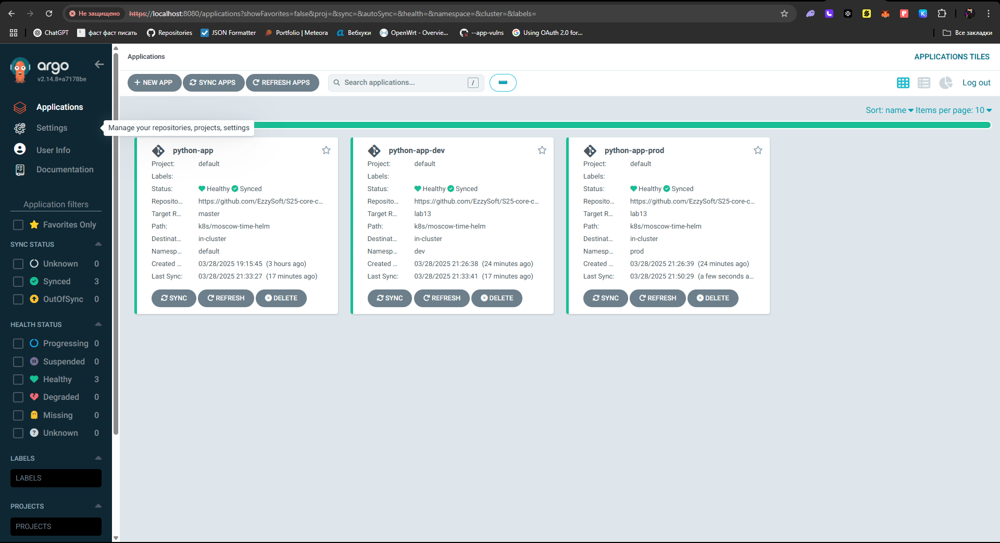

#### Output before and after pod deletion

```bash
PS C:\Users\EzzySoft\PycharmProjects\S25-core-course-labs\k8s\ArgoCD> kubectl get pods -n prod
NAME                                                READY   STATUS    RESTARTS   AGE
python-app-prod-moscow-time-helm-66f5976fb6-g2jjc   1/1     Running   0          34s
python-app-prod-moscow-time-helm-66f5976fb6-jkbkf   1/1     Running   0          2m27s
python-app-prod-moscow-time-helm-66f5976fb6-p4mhx   1/1     Running   0          11m
python-app-prod-moscow-time-helm-66f5976fb6-sjczk   1/1     Running   0          11m
python-app-prod-moscow-time-helm-66f5976fb6-xs88l   1/1     Running   0          2m27s
PS C:\Users\EzzySoft\PycharmProjects\S25-core-course-labs\k8s\ArgoCD> kubectl delete pod python-app-prod-moscow-time-helm-66f5976fb6-jkbkf -n prod
pod "python-app-prod-moscow-time-helm-66f5976fb6-jkbkf" deleted
PS C:\Users\EzzySoft\PycharmProjects\S25-core-course-labs\k8s\ArgoCD> kubectl get pods -n prod
NAME                                                READY   STATUS        RESTARTS   AGE
python-app-prod-moscow-time-helm-66f5976fb6-g2jjc   1/1     Running       0          63s
python-app-prod-moscow-time-helm-66f5976fb6-jkbkf   1/1     Terminating   0          2m56s
python-app-prod-moscow-time-helm-66f5976fb6-p4mhx   1/1     Running       0          12m
python-app-prod-moscow-time-helm-66f5976fb6-pnbsg   1/1     Running       0          3s
python-app-prod-moscow-time-helm-66f5976fb6-sjczk   1/1     Running       0          12m
python-app-prod-moscow-time-helm-66f5976fb6-xs88l   1/1     Running       0          2m56s
PS C:\Users\EzzySoft\PycharmProjects\S25-core-course-labs\k8s\ArgoCD>
```

#### Argo panel



#### Explanation

ArgoCD continuously monitors the desired state (as defined in Git) and the live state. Manual changes to deployments,
such as changing the replica count, are automatically reverted to match the Git state. Similarly, if a pod is deleted,
Kubernetes recreates it to meet the desired replica count without showing configuration drift.