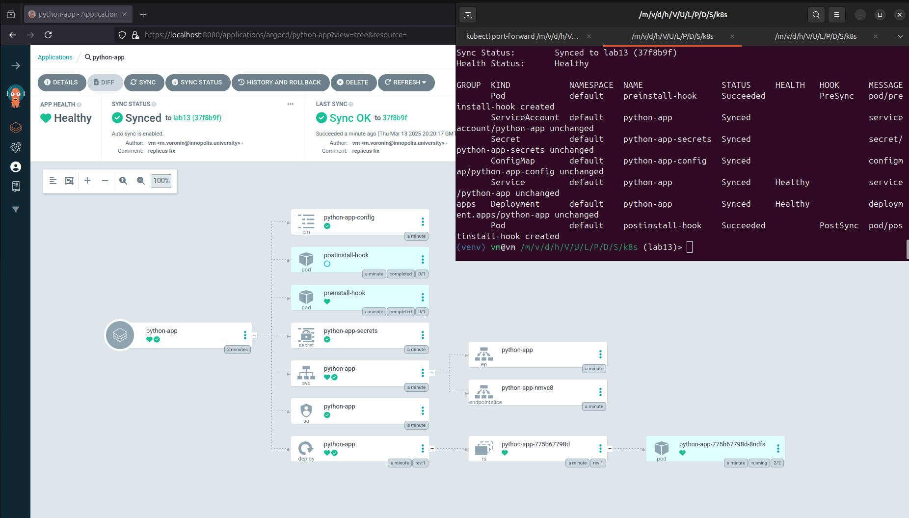
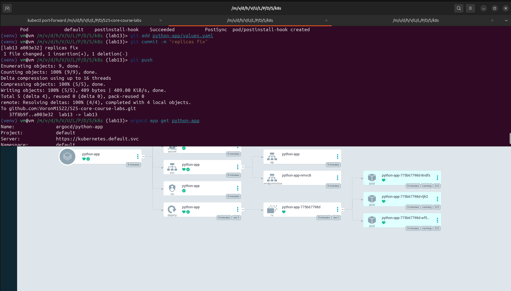
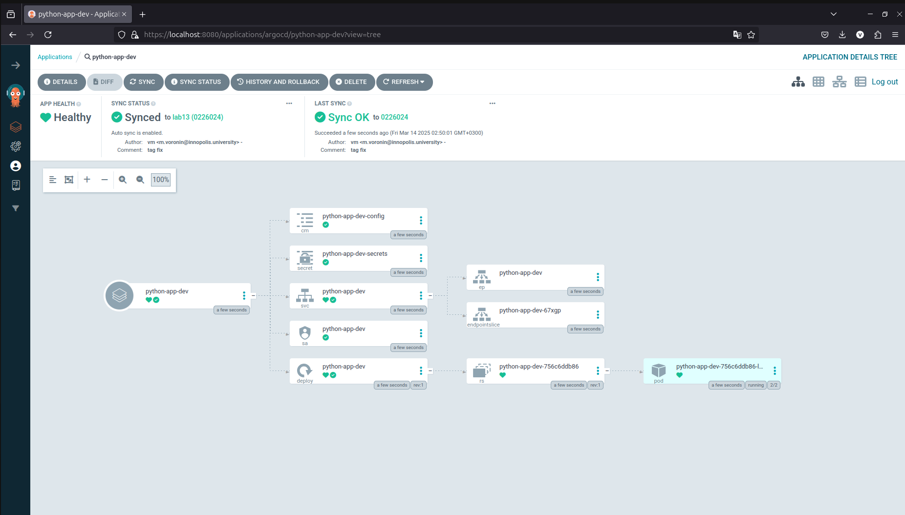
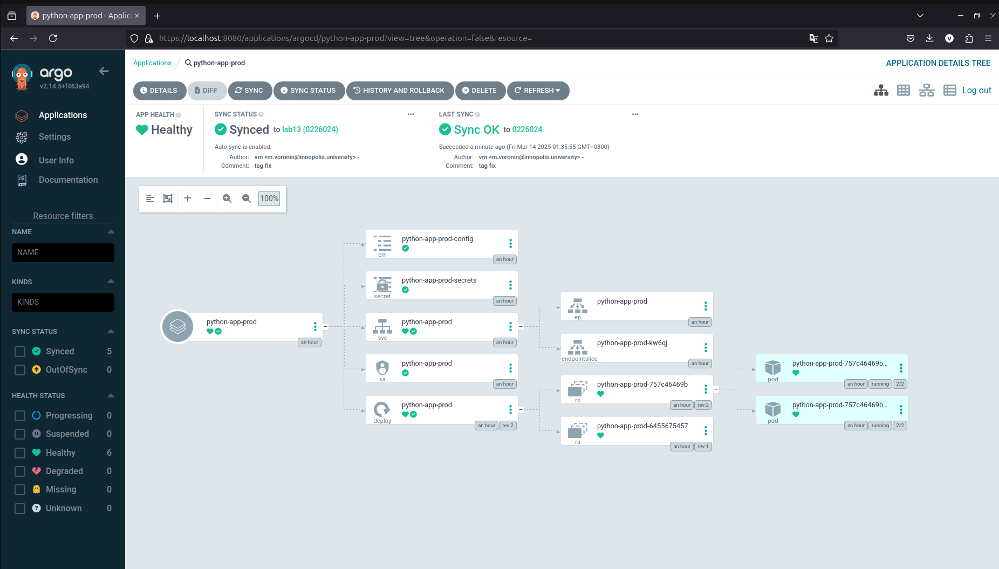
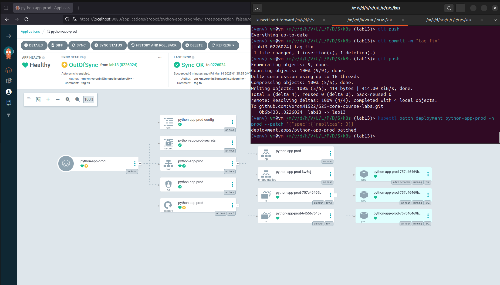
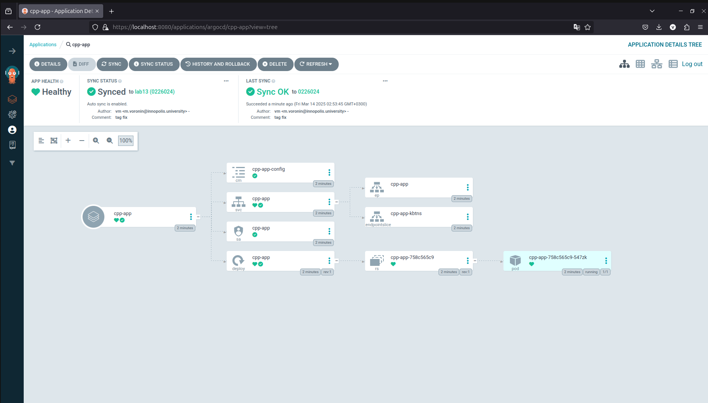
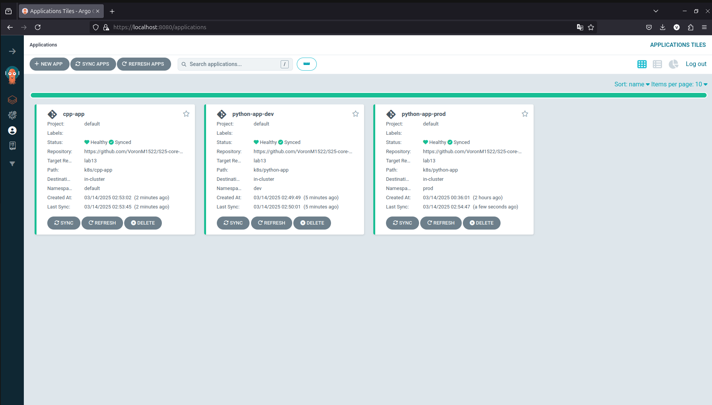

# ArgoCD for GitOps Deployment

## Task 1

In this task I deployed and configured ArgoCD. After that I created  `argocd-python-app.yaml`, applied it. After synchronization I changed replicas `values.yaml` and made sure autosunc works properly:





```sh
(venv) vm@vm /m/v/d/h/V/U/L/P/D/S/k8s (lab13)> kubectl apply -f ArgoCD/argocd-python-app.yaml
application.argoproj.io/python-app created
(venv) vm@vm /m/v/d/h/V/U/L/P/D/S/k8s (lab13)> argocd app sync python-app
TIMESTAMP                  GROUP        KIND       NAMESPACE                  NAME    STATUS   HEALTH        HOOK  MESSAGE
2025-03-13T20:20:05+03:00             Secret         default    python-app-secrets    Synced         
2025-03-13T20:20:05+03:00            Service         default            python-app    Synced  Healthy  
2025-03-13T20:20:05+03:00         ServiceAccount     default            python-app    Synced         
2025-03-13T20:20:05+03:00   apps  Deployment         default            python-app    Synced  Healthy  
2025-03-13T20:20:05+03:00          ConfigMap         default     python-app-config    Synced         
2025-03-13T20:20:05+03:00                Pod     default       preinstall-hook                   
2025-03-13T20:20:07+03:00                Pod     default       preinstall-hook   Running   Synced     PreSync  pod/preinstall-hook created
2025-03-13T20:20:12+03:00             Secret         default    python-app-secrets    Synced                        secret/python-app-secrets unchanged
2025-03-13T20:20:12+03:00          ConfigMap         default     python-app-config    Synced                        configmap/python-app-config unchanged
2025-03-13T20:20:12+03:00            Service         default            python-app    Synced   Healthy              service/python-app unchanged
2025-03-13T20:20:12+03:00   apps  Deployment         default            python-app    Synced   Healthy              deployment.apps/python-app unchanged
2025-03-13T20:20:12+03:00                Pod         default       preinstall-hook  Succeeded   Synced     PreSync  pod/preinstall-hook created
2025-03-13T20:20:12+03:00         ServiceAccount     default            python-app    Synced                        serviceaccount/python-app unchanged
2025-03-13T20:20:12+03:00                Pod     default      postinstall-hook   Running   Synced    PostSync  pod/postinstall-hook created
2025-03-13T20:20:17+03:00                Pod     default      postinstall-hook  Succeeded   Synced    PostSync  pod/postinstall-hook created

Name:               argocd/python-app
Project:            default
Server:             https://kubernetes.default.svc
Namespace:          default
URL:                https://argocd.example.com/applications/python-app
Source:
- Repo:             https://github.com/VoronM1522/S25-core-course-labs.git
  Target:           lab13
  Path:             k8s/python-app
  Helm Values:      values.yaml
SyncWindow:         Sync Allowed
Sync Policy:        Automated
Sync Status:        Synced to lab13 (37f8b9f)
Health Status:      Healthy

Operation:          Sync
Sync Revision:      37f8b9f2040e6f2f52b48cc31295f8675bf1284b
Phase:              Succeeded
Start:              2025-03-13 20:20:05 +0300 MSK
Finished:           2025-03-13 20:20:17 +0300 MSK
Duration:           12s
Message:            successfully synced (no more tasks)

GROUP  KIND            NAMESPACE  NAME                STATUS     HEALTH   HOOK      MESSAGE
       Pod             default    preinstall-hook     Succeeded           PreSync   pod/preinstall-hook created
       ServiceAccount  default    python-app          Synced                        serviceaccount/python-app unchanged
       Secret          default    python-app-secrets  Synced                        secret/python-app-secrets unchanged
       ConfigMap       default    python-app-config   Synced                        configmap/python-app-config unchanged
       Service         default    python-app          Synced     Healthy            service/python-app unchanged
apps   Deployment      default    python-app          Synced     Healthy            deployment.apps/python-app unchanged
       Pod             default    postinstall-hook    Succeeded           PostSync  pod/postinstall-hook created
(venv) vm@vm /m/v/d/h/V/U/L/P/D/S/k8s (lab13)> argocd app get python-app
Name:               argocd/python-app
Project:            default
Server:             https://kubernetes.default.svc
Namespace:          default
URL:                https://argocd.example.com/applications/python-app
Source:
- Repo:             https://github.com/VoronM1522/S25-core-course-labs.git
  Target:           lab13
  Path:             k8s/python-app
  Helm Values:      values.yaml
SyncWindow:         Sync Allowed
Sync Policy:        Automated
Sync Status:        Synced to lab13 (37f8b9f)
Health Status:      Healthy

GROUP  KIND            NAMESPACE  NAME                STATUS     HEALTH   HOOK      MESSAGE
       Pod             default    preinstall-hook     Succeeded           PreSync   pod/preinstall-hook created
       ServiceAccount  default    python-app          Synced                        serviceaccount/python-app unchanged
       Secret          default    python-app-secrets  Synced                        secret/python-app-secrets unchanged
       ConfigMap       default    python-app-config   Synced                        configmap/python-app-config unchanged
       Service         default    python-app          Synced     Healthy            service/python-app unchanged
apps   Deployment      default    python-app          Synced     Healthy            deployment.apps/python-app unchanged
       Pod             default    postinstall-hook    Succeeded           PostSync  pod/postinstall-hook created
(venv) vm@vm /m/v/d/h/V/U/L/P/D/S/k8s (lab13)> git add python-app/values.yaml
(venv) vm@vm /m/v/d/h/V/U/L/P/D/S/k8s (lab13)> git commit -m "replicas fix"
[lab13 a003e32] replicas fix
 1 file changed, 1 insertion(+), 1 deletion(-)
(venv) vm@vm /m/v/d/h/V/U/L/P/D/S/k8s (lab13)> git push
Enumerating objects: 9, done.
Counting objects: 100% (9/9), done.
Delta compression using up to 16 threads
Compressing objects: 100% (5/5), done.
Writing objects: 100% (5/5), 409 bytes | 409.00 KiB/s, done.
Total 5 (delta 4), reused 0 (delta 0), pack-reused 0
remote: Resolving deltas: 100% (4/4), completed with 4 local objects.
To github.com:VoronM1522/S25-core-course-labs.git
   37f8b9f..a003e32  lab13 -> lab13
(venv) vm@vm /m/v/d/h/V/U/L/P/D/S/k8s (lab13)> argocd app get python-app
Name:               argocd/python-app
Project:            default
Server:             https://kubernetes.default.svc
Namespace:          default
URL:                https://argocd.example.com/applications/python-app
Source:
- Repo:             https://github.com/VoronM1522/S25-core-course-labs.git
  Target:           lab13
  Path:             k8s/python-app
  Helm Values:      values.yaml
SyncWindow:         Sync Allowed
Sync Policy:        Automated
Sync Status:        Synced to lab13 (a003e32)
Health Status:      Healthy

GROUP  KIND            NAMESPACE  NAME                STATUS     HEALTH   HOOK      MESSAGE
       Pod             default    preinstall-hook     Succeeded           PreSync   pod/preinstall-hook created
       ServiceAccount  default    python-app          Synced                        serviceaccount/python-app unchanged
       Secret          default    python-app-secrets  Synced                        secret/python-app-secrets unchanged
       ConfigMap       default    python-app-config   Synced                        configmap/python-app-config unchanged
       Service         default    python-app          Synced     Healthy            service/python-app unchanged
apps   Deployment      default    python-app          Synced     Healthy            deployment.apps/python-app configured
       Pod             default    postinstall-hook    Succeeded           PostSync  pod/postinstall-hook created

```


## Task 2

To solve problems with namespaces and serviceaccounts I prepared envirounment

```sh
(venv) vm@vm /m/v/d/h/V/U/L/P/D/S/k8s (lab13)> kubectl get namespace
NAME              STATUS   AGE
argocd            Active   28h
default           Active   8d
dev               Active   124m
kube-node-lease   Active   8d
kube-public       Active   8d
kube-system       Active   8d
prod              Active   124m
(venv) vm@vm /m/v/d/h/V/U/L/P/D/S/k8s (lab13)> kubectl get serviceaccounts 
NAME                   SECRETS   AGE
default                0         8d
internal-app           0         5d4h
vault                  0         5d5h
vault-agent-injector   0         5d5h
(venv) vm@vm /m/v/d/h/V/U/L/P/D/S/k8s (lab13) [0|1]> kubectl get serviceaccounts -n prod
NAME              SECRETS   AGE
default           0         124m
internal-app      0         73m
python-app-prod   0         77m
(venv) vm@vm /m/v/d/h/V/U/L/P/D/S/k8s (lab13) [0|1]> kubectl get serviceaccounts -n dev
NAME           SECRETS   AGE
default        0         125m
internal-app   0         73m
(venv) vm@vm /m/v/d/h/V/U/L/P/D/S/k8s (lab13) [0|SIGINT]> kubectl get pods -n prod
NAME                               READY   STATUS    RESTARTS   AGE
python-app-prod-757c46469b-5t8mr   2/2     Running   0          21m
python-app-prod-757c46469b-rmrnv   2/2     Running   0          75m
python-app-prod-757c46469b-stbs4   2/2     Running   0          75m
```

`python-app-dev` work demonstration:



**Test 1:**





**Test 2:**

```sh
(venv) vm@vm /m/v/d/h/V/U/L/P/D/S/k8s (lab13)> kubectl get pod -n prod
NAME                               READY   STATUS    RESTARTS   AGE
python-app-prod-757c46469b-5t8mr   2/2     Running   0          32m
python-app-prod-757c46469b-rmrnv   2/2     Running   0          86m
python-app-prod-757c46469b-stbs4   2/2     Running   0          86m
(venv) vm@vm /m/v/d/h/V/U/L/P/D/S/k8s (lab13)> kubectl delete pod -n prod python-app-prod-757c46469b-5t8mr
pod "python-app-prod-757c46469b-5t8mr" deleted
(venv) vm@vm /m/v/d/h/V/U/L/P/D/S/k8s (lab13)> kubectl get pods -n prod -w
NAME                               READY   STATUS    RESTARTS   AGE
python-app-prod-757c46469b-7d2qz   2/2     Running   0          19s
python-app-prod-757c46469b-rmrnv   2/2     Running   0          87m
python-app-prod-757c46469b-stbs4   2/2     Running   0          87m
(venv) vm@vm /m/v/d/h/V/U/L/P/D/S/k8s (lab13) [0|1]> argocd app diff python-app-prod

===== apps/Deployment prod/python-app-prod ======
193c193
<   replicas: 3
---
>   replicas: 2
```

There is a difference in `argocd app diff python-app-prod`, since there must be 2 replicas according to configuration, however we patched it to have 3 replicas.

**Configuration drift and Runtime events**

Argo CD tracks differences between the state of the Kubernetes cluster and the manifests in Git. If configuration drift occurs (e.g. manual resource changes in the cluster), Argo CD automatically restores the state according to Git (if Auto-Sync is enabled). However, runtime events (e.g. Pod deletions) are not considered drift, as Kubernetes automatically restores the runtime state (e.g. Pod re-creation). Argo CD does not interfere with runtime events unless they change the desired state described in Git. This allows maintaining a consistent cluster using Git as the source of truth.

## Bonus task

Here are console output and screen shots with `Bonus task` implementation acknowledgement:

```sh
(venv) vm@vm /m/v/d/h/V/U/L/P/D/S/k8s (lab13)> kubectl get pods 
NAME                                 READY   STATUS    RESTARTS      AGE
cpp-app-758c565c9-547zk              1/1     Running   0             2m57s
vault-0                              1/1     Running   9 (16h ago)   5d6h
vault-agent-injector-cb67b46-qgcmt   1/1     Running   9 (16h ago)   5d6h
(venv) vm@vm /m/v/d/h/V/U/L/P/D/S/k8s (lab13)> kubectl get pods -n dev
NAME                              READY   STATUS    RESTARTS   AGE
python-app-dev-756c6ddb86-lmwf5   2/2     Running   0          6m17s
(venv) vm@vm /m/v/d/h/V/U/L/P/D/S/k8s (lab13)> kubectl get pods -n prod
NAME                               READY   STATUS    RESTARTS   AGE
python-app-prod-757c46469b-rmrnv   2/2     Running   0          129m
python-app-prod-757c46469b-stbs4   2/2     Running   0          129m
```





