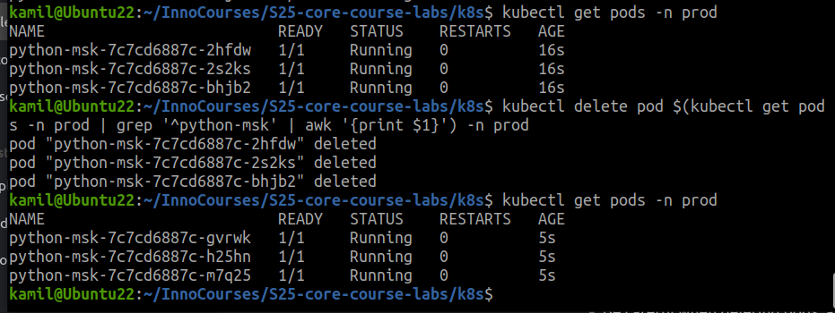

```bash
kubectl get pods -n prod
```
```NAME                          READY   STATUS    RESTARTS   AGE
python-msk-7c7cd6887c-glr6n   1/1     Running   0          51s
python-msk-7c7cd6887c-h65tl   1/1     Running   0          18s
python-msk-7c7cd6887c-pcwwf   1/1     Running   0          15s
```
After deletion
```
NAME                          READY   STATUS    RESTARTS   AGE
python-msk-7c7cd6887c-gvrwk   1/1     Running   0          88s
python-msk-7c7cd6887c-h25hn   1/1     Running   0          88s
python-msk-7c7cd6887c-m7q25   1/1     Running   0          88s
```



```bash
argocd app diff python-app-prod
```

```
===== apps/Deployment prod/orgchart ======
0a1,23
> apiVersion: apps/v1
> kind: Deployment
> metadata:
>   labels:
>     app: orgchart
>     argocd.argoproj.io/instance: python-app-prod
>   name: orgchart
>   namespace: prod
> spec:
>   replicas: 1
>   selector:
>     matchLabels:
>       app: orgchart
>   template:
>     metadata:
>       annotations: {}
>       labels:
>         app: orgchart
>     spec:
>       containers:
>       - image: jweissig/app:0.0.1
>         name: orgchart
>       serviceAccountName: internal-app

===== apps/Deployment prod/secrets-lab ======
0a1,42
> apiVersion: apps/v1
> kind: Deployment
> metadata:
>   labels:
>     argocd.argoproj.io/instance: python-app-prod
>   name: secrets-lab
>   namespace: prod
> spec:
>   replicas: 1
>   selector:
>     matchLabels:
>       app: secrets-lab
>   template:
>     metadata:
>       labels:
>         app: secrets-lab
>     spec:
>       containers:
>       - env:
>         - name: LOGIN
>           valueFrom:
>             secretKeyRef:
>               key: LOGIN
>               name: secrets-lab-secret
>         - name: PASS
>           valueFrom:
>             secretKeyRef:
>               key: PASS
>               name: secrets-lab-secret
>         image: nginx
>         name: demo-container
>       - image: python-msk:latest
>         name: python-msk
>         volumeMounts:
>         - mountPath: /config.json
>           name: config-volume
>           subPath: config.json
>       serviceAccountName: internal-app
>       volumes:
>       - configMap:
>           name: python-app-prod-python-msk-config
>         name: config-volume

===== apps/StatefulSet prod/nginx-statefulset ======
0a1,23
> apiVersion: apps/v1
> kind: StatefulSet
> metadata:
>   labels:
>     argocd.argoproj.io/instance: python-app-prod
>   name: nginx-statefulset
>   namespace: prod
> spec:
>   replicas: 1
>   selector:
>     matchLabels:
>       name: nginx-statefulset
>   servicename: nginx-statefulset
>   template:
>     metadata:
>       labels:
>         name: nginx-statefulset
>     spec:
>       containers:
>       - image: nginx
>         imagePullPolicy: Always
>         name: nginx-statefulset
>       terminationGracePeriodSeconds: 10
```