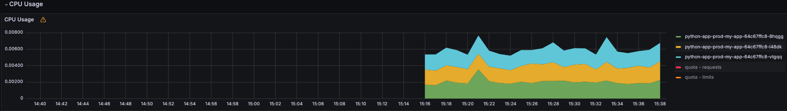
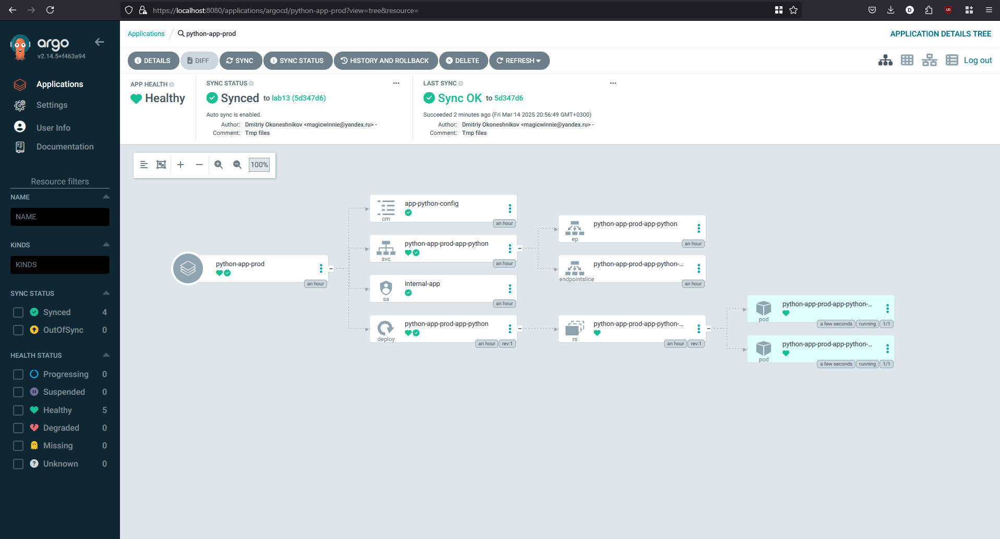
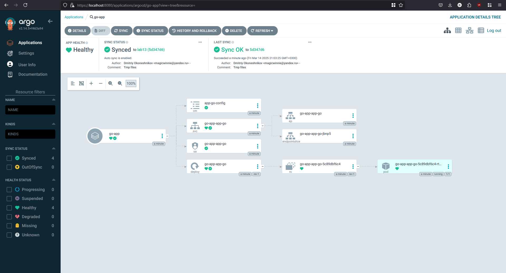

# Lab 13

## Task 1

I removed secrets and hooks in `k8s/app-python/templates/` as they were causing issues with ArgoCD.

### First sync

```bash
>argocd app sync python-app
TIMESTAMP                  GROUP        KIND       NAMESPACE                  NAME     STATUS   HEALTH        HOOK  MESSAGE
2025-03-13T22:45:58+03:00          ConfigMap         default     app-python-config     Synced
2025-03-13T22:45:58+03:00            Service         default  python-app-app-python    Synced  Healthy
2025-03-13T22:45:58+03:00         ServiceAccount     default          internal-app     Synced
2025-03-13T22:45:58+03:00   apps  Deployment         default  python-app-app-python    Synced  Healthy
2025-03-13T22:46:00+03:00          ConfigMap         default     app-python-config     Synced                       configmap/app-python-config unchanged
2025-03-13T22:46:00+03:00            Service         default  python-app-app-python    Synced  Healthy              service/python-app-app-python unchanged
2025-03-13T22:46:00+03:00   apps  Deployment         default  python-app-app-python    Synced  Healthy              deployment.apps/python-app-app-python unchanged
2025-03-13T22:46:00+03:00         ServiceAccount     default          internal-app     Synced                       serviceaccount/internal-app unchanged

Name:               argocd/python-app
Project:            default
Server:             https://kubernetes.default.svc
Namespace:          default
URL:                https://argocd.example.com/applications/python-app
Source:
- Repo:             https://github.com/MagicWinnie/S25-core-course-labs.git
  Target:           lab13
  Path:             k8s/app-python
  Helm Values:      values.yaml
SyncWindow:         Sync Allowed
Sync Policy:        Automated
Sync Status:        Synced to lab13 (afadfd1)
Health Status:      Healthy

Operation:          Sync
Sync Revision:      afadfd10ea6541624cd77df906a8e9a7bffbfe70
Phase:              Succeeded
Start:              2025-03-13 22:45:57 +0300 MSK
Finished:           2025-03-13 22:46:00 +0300 MSK
Duration:           3s
Message:            successfully synced (all tasks run)

GROUP  KIND            NAMESPACE  NAME                   STATUS  HEALTH   HOOK  MESSAGE
       ServiceAccount  default    internal-app           Synced                 serviceaccount/internal-app unchanged
       ConfigMap       default    app-python-config      Synced                 configmap/app-python-config unchanged
       Service         default    python-app-app-python  Synced  Healthy        service/python-app-app-python unchanged
apps   Deployment      default    python-app-app-python  Synced  Healthy        deployment.apps/python-app-app-python unchanged
```

```bash
>argocd app get python-app
Name:               argocd/python-app
Project:            default
Server:             https://kubernetes.default.svc
Namespace:          default
URL:                https://argocd.example.com/applications/python-app
Source:
- Repo:             https://github.com/MagicWinnie/S25-core-course-labs.git
  Target:           lab13
  Path:             k8s/app-python
  Helm Values:      values.yaml
SyncWindow:         Sync Allowed
Sync Policy:        Automated
Sync Status:        Synced to lab13 (afadfd1)
Health Status:      Healthy

GROUP  KIND            NAMESPACE  NAME                   STATUS  HEALTH   HOOK  MESSAGE
       ServiceAccount  default    internal-app           Synced                 serviceaccount/internal-app unchanged
       ConfigMap       default    app-python-config      Synced                 configmap/app-python-config unchanged
       Service         default    python-app-app-python  Synced  Healthy        service/python-app-app-python unchanged
apps   Deployment      default    python-app-app-python  Synced  Healthy        deployment.apps/python-app-app-python unchanged
```

### After changing in Git

Commit hash is different:

```bash
>argocd app get python-app
Name:               argocd/python-app
Project:            default
Server:             https://kubernetes.default.svc
Namespace:          default
URL:                https://argocd.example.com/applications/python-app
Source:
- Repo:             https://github.com/MagicWinnie/S25-core-course-labs.git
  Target:           lab13
  Path:             k8s/app-python
  Helm Values:      values.yaml
SyncWindow:         Sync Allowed
Sync Policy:        Automated
Sync Status:        Synced to lab13 (ac73e25)
Health Status:      Healthy

GROUP  KIND            NAMESPACE  NAME                   STATUS  HEALTH   HOOK  MESSAGE
       ServiceAccount  default    internal-app           Synced                 serviceaccount/internal-app unchanged
       ConfigMap       default    app-python-config      Synced                 configmap/app-python-config unchanged
       Service         default    python-app-app-python  Synced  Healthy        service/python-app-app-python unchanged
apps   Deployment      default    python-app-app-python  Synced  Healthy        deployment.apps/python-app-app-python configured
```

## Task 2

### Dev and Prod

```bash
>argocd app get python-app-dev
Name:               argocd/python-app-dev
Project:            default
Server:             https://kubernetes.default.svc
Namespace:          default
URL:                https://argocd.example.com/applications/python-app-dev
Source:
- Repo:             https://github.com/MagicWinnie/S25-core-course-labs.git
  Target:           lab13
  Path:             k8s/app-python
  Helm Values:      values-dev.yaml
SyncWindow:         Sync Allowed
Sync Policy:        Automated
Sync Status:        OutOfSync from lab13 (7e7cc1d)
Health Status:      Healthy

CONDITION              MESSAGE                                                                                   LAST TRANSITION
SharedResourceWarning  ConfigMap/app-python-config is part of applications argocd/python-app-dev and python-app  2025-03-13 23:07:16 +0300 MSK
SharedResourceWarning  ServiceAccount/internal-app is part of applications argocd/python-app-dev and python-app  2025-03-13 23:07:15 +0300 MSK


GROUP  KIND            NAMESPACE  NAME                       STATUS     HEALTH   HOOK  MESSAGE
       ServiceAccount  default    internal-app               OutOfSync                 serviceaccount/internal-app configured
       ConfigMap       default    app-python-config          OutOfSync                 configmap/app-python-config configured
       Service         default    python-app-dev-app-python  Synced     Healthy        service/python-app-dev-app-python created
apps   Deployment      default    python-app-dev-app-python  Synced     Healthy        deployment.apps/python-app-dev-app-python created
```

```bash
>argocd app get python-app-prod
Name:               argocd/python-app-prod
Project:            default
Server:             https://kubernetes.default.svc
Namespace:          default
URL:                https://argocd.example.com/applications/python-app-prod
Source:
- Repo:             https://github.com/MagicWinnie/S25-core-course-labs.git
  Target:           lab13
  Path:             k8s/app-python
  Helm Values:      values-prod.yaml
SyncWindow:         Sync Allowed
Sync Policy:        Automated
Sync Status:        Synced to lab13 (7e7cc1d)
Health Status:      Healthy

GROUP  KIND            NAMESPACE  NAME                        STATUS  HEALTH   HOOK  MESSAGE
       ServiceAccount  default    internal-app                Synced                 serviceaccount/internal-app configured
       ConfigMap       default    app-python-config           Synced                 configmap/app-python-config configured
       Service         default    python-app-prod-app-python  Synced  Healthy        service/python-app-prod-app-python created
apps   Deployment      default    python-app-prod-app-python  Synced  Healthy        deployment.apps/python-app-prod-app-python created
```

### Prod after changing values-prod.yaml

```bash
>argocd app get python-app-prod
Name:               argocd/python-app-prod
Project:            default
Server:             https://kubernetes.default.svc
Namespace:          default
URL:                https://argocd.example.com/applications/python-app-prod
Source:
- Repo:             https://github.com/MagicWinnie/S25-core-course-labs.git
  Target:           lab13
  Path:             k8s/app-python
  Helm Values:      values-prod.yaml
SyncWindow:         Sync Allowed
Sync Policy:        Automated
Sync Status:        Synced to lab13 (1a2675f)
Health Status:      Healthy

GROUP  KIND            NAMESPACE  NAME                        STATUS  HEALTH   HOOK  MESSAGE
       ServiceAccount  default    internal-app                Synced                 serviceaccount/internal-app configured
       ConfigMap       default    app-python-config           Synced                 configmap/app-python-config configured
       Service         default    python-app-prod-app-python  Synced  Healthy        service/python-app-prod-app-python unchanged
apps   Deployment      default    python-app-prod-app-python  Synced  Healthy        deployment.apps/python-app-prod-app-python unchanged
```

### Test 1

```bash
>kubectl patch deployment python-app-prod-app-python -n prod --patch "{\"spec\":{\"replicas\": 3}}"
deployment.apps/python-app-prod-app-python patched
```

```bash
>argocd app sync python-app-prod
TIMESTAMP                  GROUP        KIND       NAMESPACE                  NAME          STATUS    HEALTH        HOOK  MESSAGE
2025-03-14T20:40:07+03:00          ConfigMap            prod     app-python-config          Synced
2025-03-14T20:40:07+03:00            Service            prod  python-app-prod-app-python    Synced   Healthy
2025-03-14T20:40:07+03:00         ServiceAccount        prod          internal-app          Synced
2025-03-14T20:40:07+03:00   apps  Deployment            prod  python-app-prod-app-python  OutOfSync  Healthy
2025-03-14T20:40:09+03:00          ConfigMap            prod     app-python-config          Synced                        configmap/app-python-config unchanged
2025-03-14T20:40:09+03:00            Service            prod  python-app-prod-app-python    Synced   Healthy              service/python-app-prod-app-python unchanged
2025-03-14T20:40:09+03:00   apps  Deployment            prod  python-app-prod-app-python  OutOfSync  Healthy              deployment.apps/python-app-prod-app-python configured
2025-03-14T20:40:09+03:00         ServiceAccount        prod          internal-app          Synced                        serviceaccount/internal-app unchanged
2025-03-14T20:40:09+03:00   apps  Deployment        prod  python-app-prod-app-python    Synced  Progressing              deployment.apps/python-app-prod-app-python configured

Name:               argocd/python-app-prod
Project:            default
Server:             https://kubernetes.default.svc
Namespace:          prod
URL:                https://argocd.example.com/applications/python-app-prod
Source:
- Repo:             https://github.com/MagicWinnie/S25-core-course-labs.git
  Target:           lab13
  Path:             k8s/app-python
  Helm Values:      values-prod.yaml
SyncWindow:         Sync Allowed
Sync Policy:        Automated
Sync Status:        Synced to lab13 (5d347d6)
Health Status:      Healthy

Operation:          Sync
Sync Revision:      5d347d6c067f0ffd5746771ca99931a76dff3419
Phase:              Succeeded
Start:              2025-03-14 20:40:07 +0300 MSK
Finished:           2025-03-14 20:40:08 +0300 MSK
Duration:           1s
Message:            successfully synced (all tasks run)

GROUP  KIND            NAMESPACE  NAME                        STATUS  HEALTH   HOOK  MESSAGE
       ServiceAccount  prod       internal-app                Synced                 serviceaccount/internal-app unchanged
       ConfigMap       prod       app-python-config           Synced                 configmap/app-python-config unchanged
       Service         prod       python-app-prod-app-python  Synced  Healthy        service/python-app-prod-app-python unchanged
apps   Deployment      prod       python-app-prod-app-python  Synced  Healthy        deployment.apps/python-app-prod-app-python configured
```

```bash
>argocd app get python-app-prod
Name:               argocd/python-app-prod
Project:            default
Server:             https://kubernetes.default.svc
Namespace:          prod
URL:                https://argocd.example.com/applications/python-app-prod
Source:
- Repo:             https://github.com/MagicWinnie/S25-core-course-labs.git
  Target:           lab13
  Path:             k8s/app-python
  Helm Values:      values-prod.yaml
SyncWindow:         Sync Allowed
Sync Policy:        Automated
Sync Status:        Synced to lab13 (5d347d6)
Health Status:      Healthy

GROUP  KIND            NAMESPACE  NAME                        STATUS  HEALTH   HOOK  MESSAGE
       ServiceAccount  prod       internal-app                Synced                 serviceaccount/internal-app unchanged
       ConfigMap       prod       app-python-config           Synced                 configmap/app-python-config unchanged
       Service         prod       python-app-prod-app-python  Synced  Healthy        service/python-app-prod-app-python unchanged
apps   Deployment      prod       python-app-prod-app-python  Synced  Healthy        deployment.apps/python-app-prod-app-python configured
```



### Test 2

Before the change:

```bash
>kubectl get pods -n prod
NAME                                          READY   STATUS    RESTARTS   AGE
python-app-prod-app-python-5488c974fb-8zpk9   1/1     Running   0          47m
python-app-prod-app-python-5488c974fb-nxkcw   1/1     Running   0          47m
```

Deleting:

```bash
>kubectl delete pod -n prod -l app.kubernetes.io/name=app-python
pod "python-app-prod-app-python-5488c974fb-8zpk9" deleted
pod "python-app-prod-app-python-5488c974fb-nxkcw" deleted
```

After the change:

```bash
>kubectl get pods -n prod
NAME                                          READY   STATUS    RESTARTS   AGE
python-app-prod-app-python-5488c974fb-4p7tg   1/1     Running   0          41s
python-app-prod-app-python-5488c974fb-vrf2z   1/1     Running   0          41s
```

```bash
>argocd app diff python-app-prod
```



## Task Bonus

```bash
>kubectl get pods
NAME                                    READY   STATUS    RESTARTS      AGE
app-python-66dcb856cd-62wbn             1/1     Running   1 (69m ago)   22h
go-app-app-go-5c89dbf6c4-rtbdw          1/1     Running   0             55s
python-app-app-python-bb4d47554-9244v   1/1     Running   1 (69m ago)   22h
python-app-app-python-bb4d47554-v9gsd   1/1     Running   1 (69m ago)   22h
```


