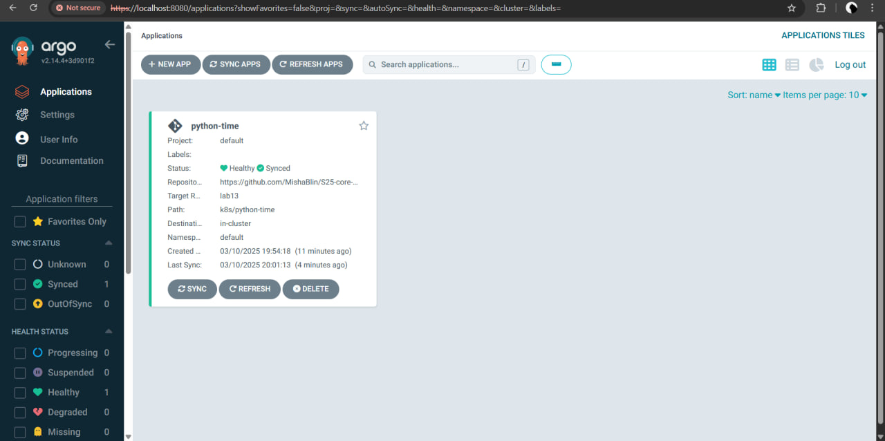
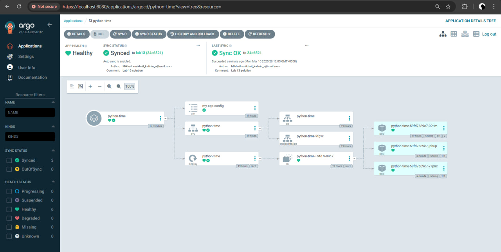
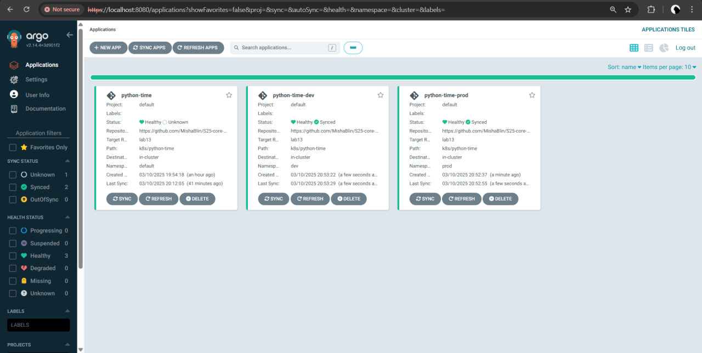
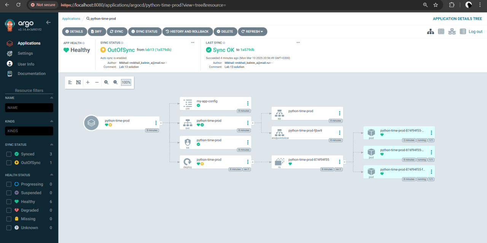
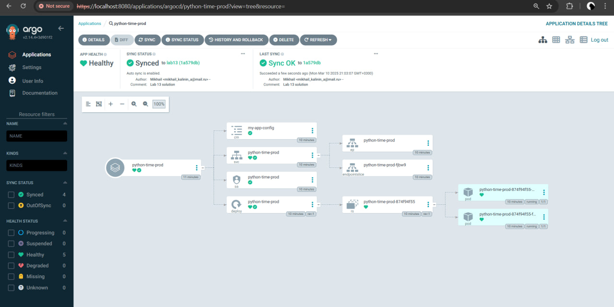
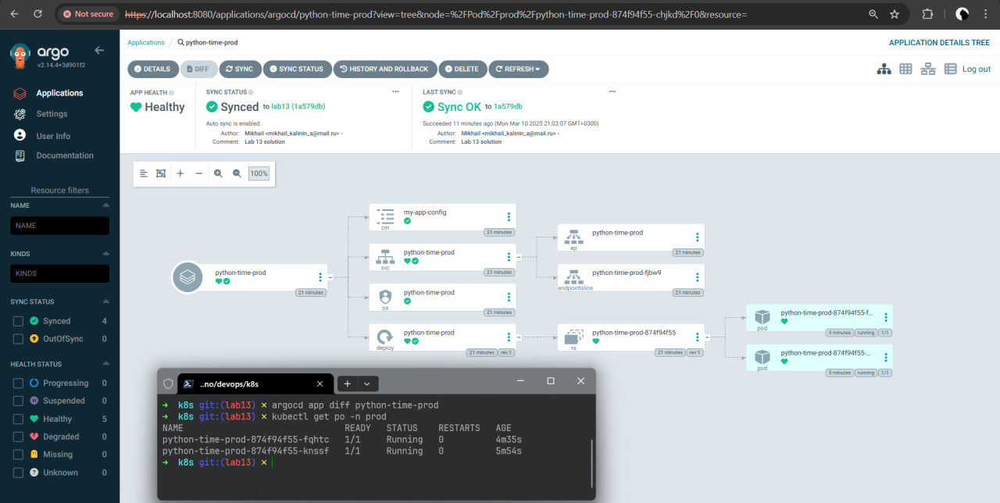

# Lab 13

## ArgoCD

### Verify argocd installation

```text
kubectl wait --for=condition=ready pod -l app.kubernetes.io/name=argocd-server -n argocd --timeout=90s
pod/argo-argocd-server-6f848cf7f7-s4d5m condition met
pod/argocd-server-55896669d5-fzz9c condition met
```

### Syncing

```text
argocd app sync python-time
Handling connection for 8080
Handling connection for 8080
Handling connection for 8080
Handling connection for 8080
TIMESTAMP                  GROUP        KIND   NAMESPACE                  NAME    STATUS   HEALTH        HOOK  MESSAGE
2025-03-10T20:01:11+03:00          ConfigMap     default         my-app-config    Synced
2025-03-10T20:01:11+03:00            Service     default           python-time    Synced  Healthy
2025-03-10T20:01:11+03:00   apps  Deployment     default           python-time    Synced  Healthy
2025-03-10T20:01:13+03:00          ConfigMap     default         my-app-config    Synced                       configmap/my-app-config unchanged
2025-03-10T20:01:13+03:00            Service     default           python-time    Synced  Healthy              service/python-time unchanged
2025-03-10T20:01:13+03:00   apps  Deployment     default           python-time    Synced  Healthy              deployment.apps/python-time unchanged
Handling connection for 8080

Handling connection for 8080
E0310 20:01:14.199388    7317 portforward.go:391] "Unhandled Error" err="error copying from remote stream to local connection: readfrom tcp4 127.0.0.1:8080->127.0.0.1:40640: write tcp4 127.0.0.1:8080->127.0.0.1:40640: write: broken pipe"
Name:               argocd/python-time
Project:            default
Server:             https://kubernetes.default.svc
Namespace:          default
URL:                https://argocd.example.com/applications/python-time
Source:
- Repo:             https://github.com/MishaBlin/S25-core-course-labs.git
  Target:           lab13
  Path:             k8s/python-time
  Helm Values:      values.yaml
SyncWindow:         Sync Allowed
Sync Policy:        Automated
Sync Status:        Synced to lab13 (9438ef0)
Health Status:      Healthy

Operation:          Sync
Sync Revision:      9438ef0d02605e24a8f5a653bfe648bad46ab81e
Phase:              Succeeded
Start:              2025-03-10 20:01:11 +0300 MSK
Finished:           2025-03-10 20:01:13 +0300 MSK
Duration:           2s
Message:            successfully synced (all tasks run)

GROUP  KIND        NAMESPACE  NAME           STATUS  HEALTH   HOOK  MESSAGE
       ConfigMap   default    my-app-config  Synced                 configmap/my-app-config unchanged
       Service     default    python-time    Synced  Healthy        service/python-time unchanged
apps   Deployment  default    python-time    Synced  Healthy        deployment.apps/python-time unchanged
```

### App status

```text
argocd app get python-time
Handling connection for 8080
Handling connection for 8080
Handling connection for 8080
Handling connection for 8080
Handling connection for 8080
Name:               argocd/python-time
Project:            default
Server:             https://kubernetes.default.svc
Namespace:          default
URL:                https://argocd.example.com/applications/python-time
Source:
- Repo:             https://github.com/MishaBlin/S25-core-course-labs.git
  Target:           lab13
  Path:             k8s/python-time
  Helm Values:      values.yaml
SyncWindow:         Sync Allowed
Sync Policy:        Automated
Sync Status:        Synced to lab13 (9438ef0)
Health Status:      Healthy

GROUP  KIND        NAMESPACE  NAME           STATUS  HEALTH   HOOK  MESSAGE
       ConfigMap   default    my-app-config  Synced                 configmap/my-app-config configured. Warning: resource configmaps/my-app-config is missing the kubectl.kubernetes.io/last-applied-configuration annotation which is required by  apply.  apply should only be used on resources created declaratively by either  create --save-config or  apply. The missing annotation will be patched automatically.
       Service     default    python-time    Synced  Healthy        service/python-time configured. Warning: resource services/python-time is missing the kubectl.kubernetes.io/last-applied-configuration annotation which is required by  apply.  apply should only be used on resources created declaratively by either  create --save-config or  apply. The missing annotation will be patched automatically.
apps   Deployment  default    python-time    Synced  Healthy        deployment.apps/python-time configured. Warning: resource deployments/python-time is missing the kubectl.kubernetes.io/last-applied-configuration annotation which is required by  apply.  apply should only be used on resources created declaratively by either  create --save-config or  apply. The missing annotation will be patched automatically.
```

### ArgoCD UI



### Test Sync Workflow

The result after updating replica count to 3

```text
argocd app get python-time
Name:               argocd/python-time
Project:            default
Server:             https://kubernetes.default.svc
Namespace:          default
URL:                https://argocd.example.com/applications/python-time
Source:
- Repo:             https://github.com/MishaBlin/S25-core-course-labs.git
  Target:           lab13
  Path:             k8s/python-time
  Helm Values:      values.yaml
SyncWindow:         Sync Allowed
Sync Policy:        Automated
Sync Status:        Synced to lab13 (34c6521)
Health Status:      Healthy

GROUP  KIND        NAMESPACE  NAME           STATUS  HEALTH   HOOK  MESSAGE
       ConfigMap   default    my-app-config  Synced                 configmap/my-app-config unchanged
       Service     default    python-time    Synced  Healthy        service/python-time unchanged
apps   Deployment  default    python-time    Synced  Healthy        deployment.apps/python-time configured
```

We also can see the change in UI



## Task 2

### Creating namespaces

```bash
kubectl create namespace dev
kubectl create namespace prod
```

```text
namespace/dev created
namespace/prod created
```

### Multi-Environment deployment

```text
➜  k8s git:(lab13) ✗ kubectl apply -f ArgoCD/argocd-python-dev.yaml
application.argoproj.io/python-time-dev created
➜  k8s git:(lab13) ✗ kubectl apply -f ArgoCD/argocd-python-prod.yaml
application.argoproj.io/python-time-prod created
```

```text
➜  k8s git:(lab13) ✗ argocd app sync argocd/python-time-prod
TIMESTAMP                  GROUP        KIND       NAMESPACE                  NAME    STATUS   HEALTH        HOOK  MESSAGE
2025-03-10T20:52:54+03:00          ConfigMap            prod         my-app-config    Synced
2025-03-10T20:52:54+03:00            Service            prod      python-time-prod    Synced  Healthy
2025-03-10T20:52:54+03:00         ServiceAccount        prod      python-time-prod    Synced
2025-03-10T20:52:54+03:00   apps  Deployment            prod      python-time-prod    Synced  Healthy
2025-03-10T20:52:55+03:00         ServiceAccount        prod      python-time-prod    Synced                       serviceaccount/python-time-prod unchanged
2025-03-10T20:52:55+03:00          ConfigMap            prod         my-app-config    Synced                       configmap/my-app-config unchanged
2025-03-10T20:52:55+03:00            Service            prod      python-time-prod    Synced  Healthy              service/python-time-prod unchanged
2025-03-10T20:52:55+03:00   apps  Deployment            prod      python-time-prod    Synced  Healthy              deployment.apps/python-time-prod unchanged

Name:               argocd/python-time-prod
Project:            default
Server:             https://kubernetes.default.svc
Namespace:          prod
URL:                https://argocd.example.com/applications/argocd/python-time-prod
Source:
- Repo:             https://github.com/MishaBlin/S25-core-course-labs.git
  Target:           lab13
  Path:             k8s/python-time
  Helm Values:      values-prod.yaml
SyncWindow:         Sync Allowed
Sync Policy:        Automated
Sync Status:        Synced to lab13 (1a579db)
Health Status:      Healthy

Operation:          Sync
Sync Revision:      1a579dbfb08c487f2462587f68e6c28e32cf8ed2
Phase:              Succeeded
Start:              2025-03-10 20:52:54 +0300 MSK
Finished:           2025-03-10 20:52:55 +0300 MSK
Duration:           1s
Message:            successfully synced (all tasks run)

GROUP  KIND            NAMESPACE  NAME              STATUS  HEALTH   HOOK  MESSAGE
       ServiceAccount  prod       python-time-prod  Synced                 serviceaccount/python-time-prod unchanged
       ConfigMap       prod       my-app-config     Synced                 configmap/my-app-config unchanged
       Service         prod       python-time-prod  Synced  Healthy        service/python-time-prod unchanged
apps   Deployment      prod       python-time-prod  Synced  Healthy        deployment.apps/python-time-prod unchanged
```

```text
➜  k8s git:(lab13) ✗ argocd app sync argocd/python-time-dev
TIMESTAMP                  GROUP        KIND       NAMESPACE                  NAME    STATUS   HEALTH        HOOK  MESSAGE
2025-03-10T20:53:28+03:00          ConfigMap             dev         my-app-config    Synced
2025-03-10T20:53:28+03:00            Service             dev       python-time-dev    Synced  Healthy
2025-03-10T20:53:28+03:00         ServiceAccount         dev       python-time-dev    Synced
2025-03-10T20:53:28+03:00   apps  Deployment             dev       python-time-dev    Synced  Healthy
2025-03-10T20:53:29+03:00         ServiceAccount         dev       python-time-dev    Synced                       serviceaccount/python-time-dev unchanged
2025-03-10T20:53:29+03:00          ConfigMap             dev         my-app-config    Synced                       configmap/my-app-config unchanged
2025-03-10T20:53:29+03:00            Service             dev       python-time-dev    Synced  Healthy              service/python-time-dev unchanged
2025-03-10T20:53:29+03:00   apps  Deployment             dev       python-time-dev    Synced  Healthy              deployment.apps/python-time-dev unchanged

Name:               argocd/python-time-dev
Project:            default
Server:             https://kubernetes.default.svc
Namespace:          dev
URL:                https://argocd.example.com/applications/argocd/python-time-dev
Source:
- Repo:             https://github.com/MishaBlin/S25-core-course-labs.git
  Target:           lab13
  Path:             k8s/python-time
  Helm Values:      values-dev.yaml
SyncWindow:         Sync Allowed
Sync Policy:        Automated
Sync Status:        Synced to lab13 (1a579db)
Health Status:      Healthy

Operation:          Sync
Sync Revision:      1a579dbfb08c487f2462587f68e6c28e32cf8ed2
Phase:              Succeeded
Start:              2025-03-10 20:53:28 +0300 MSK
Finished:           2025-03-10 20:53:29 +0300 MSK
Duration:           1s
Message:            successfully synced (all tasks run)

GROUP  KIND            NAMESPACE  NAME             STATUS  HEALTH   HOOK  MESSAGE
       ServiceAccount  dev        python-time-dev  Synced                 serviceaccount/python-time-dev unchanged
       ConfigMap       dev        my-app-config    Synced                 configmap/my-app-config unchanged
       Service         dev        python-time-dev  Synced  Healthy        service/python-time-dev unchanged
apps   Deployment      dev        python-time-dev  Synced  Healthy        deployment.apps/python-time-dev unchanged
```



### Self-heal testing

#### Test 1

```text
➜  k8s git:(lab13) ✗ kubectl patch deployment python-time-prod -n prod --patch '{"spec":{"replicas": 3}}'
deployment.apps/python-time-prod patched
```

We can notice that app is out of sync



```text
➜  k8s git:(lab13) ✗ argocd app sync python-time-prod
TIMESTAMP                  GROUP        KIND       NAMESPACE                  NAME    STATUS    HEALTH        HOOK  MESSAGE
2025-03-10T20:56:48+03:00          ConfigMap            prod         my-app-config    Synced
2025-03-10T20:56:48+03:00            Service            prod      python-time-prod    Synced   Healthy
2025-03-10T20:56:48+03:00         ServiceAccount        prod      python-time-prod    Synced
2025-03-10T20:56:48+03:00   apps  Deployment            prod      python-time-prod  OutOfSync  Healthy
2025-03-10T20:56:49+03:00   apps  Deployment            prod      python-time-prod  OutOfSync  Healthy              deployment.apps/python-time-prod configured
2025-03-10T20:56:49+03:00         ServiceAccount        prod      python-time-prod    Synced                        serviceaccount/python-time-prod unchanged
2025-03-10T20:56:49+03:00          ConfigMap            prod         my-app-config    Synced                        configmap/my-app-config unchanged
2025-03-10T20:56:49+03:00            Service            prod      python-time-prod    Synced   Healthy              service/python-time-prod unchanged
2025-03-10T20:56:49+03:00   apps  Deployment        prod      python-time-prod    Synced  Progressing              deployment.apps/python-time-prod configured
2025-03-10T20:56:49+03:00   apps  Deployment        prod      python-time-prod    Synced  Progressing              deployment.apps/python-time-prod unchanged
2025-03-10T20:56:49+03:00   apps  Deployment        prod      python-time-prod    Synced  Healthy              deployment.apps/python-time-prod unchanged

Name:               argocd/python-time-prod
Project:            default
Server:             https://kubernetes.default.svc
Namespace:          prod
URL:                https://argocd.example.com/applications/python-time-prod
Source:
- Repo:             https://github.com/MishaBlin/S25-core-course-labs.git
  Target:           lab13
  Path:             k8s/python-time
  Helm Values:      values-prod.yaml
SyncWindow:         Sync Allowed
Sync Policy:        Automated
Sync Status:        Synced to lab13 (1a579db)
Health Status:      Healthy

Operation:          Sync
Sync Revision:      1a579dbfb08c487f2462587f68e6c28e32cf8ed2
Phase:              Succeeded
Start:              2025-03-10 20:56:48 +0300 MSK
Finished:           2025-03-10 20:56:49 +0300 MSK
Duration:           1s
Message:            successfully synced (all tasks run)

GROUP  KIND            NAMESPACE  NAME              STATUS  HEALTH   HOOK  MESSAGE
       ServiceAccount  prod       python-time-prod  Synced                 serviceaccount/python-time-prod unchanged
       ConfigMap       prod       my-app-config     Synced                 configmap/my-app-config unchanged
       Service         prod       python-time-prod  Synced  Healthy        service/python-time-prod unchanged
apps   Deployment      prod       python-time-prod  Synced  Healthy        deployment.apps/python-time-prod unchanged
```

And the app syncs back



#### Test 2

Initial state (all pods running)

```text
➜  k8s git:(lab13) ✗ kubectl get po -n prod
NAME                               READY   STATUS    RESTARTS   AGE
python-time-prod-874f94f55-fct5r   1/1     Running   0          16m
python-time-prod-874f94f55-knssf   1/1     Running   0          45s
```

Delete a pod

```text
➜ k8s git:(lab13) ✗ kubectl delete pods -n prod python-time-prod-874f94f55-fct5r
pod "python-time-prod-874f94f55-fct5r" deleted
```

No drift in argocd

```text
➜ k8s git:(lab13) ✗ argocd app diff python-time-prod
```

Check that the pod was recreated



### How ArgoCD handles configuration drift vs. runtime events

ArgoCD monitors the state of a cluster and checks if it is different from the state in git repository.
If a drift is detected, ArgoCD syncs the cluster with git repository and restores the state accoriding to
its configuration.

Runtime events like pod deletion are not detected by ArgoCD. Kubernetes detects the changes by itself and runs
self-healing processes to react to these events. For ArgoCD the state remains unchanged in such cases.
