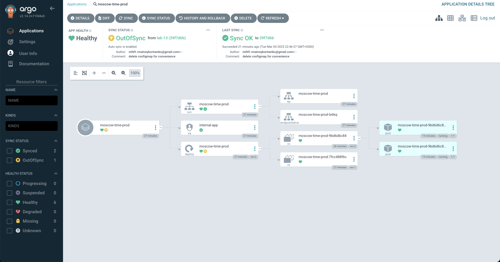
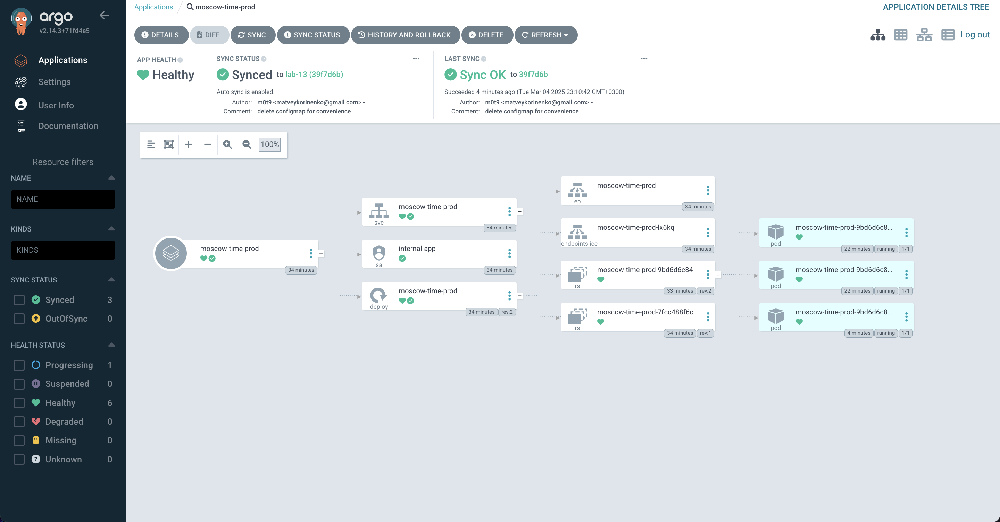
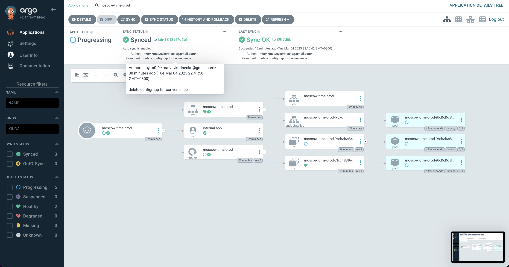

# ArgoCD

In this task I deleted hooks, secrets and configmap for deployment convenience.
It does not affect ArgoCD component of the assignment.

## Task 1

```bash
➜  k8s git:(lab-13) argocd app sync moscow-time
TIMESTAMP  GROUP        KIND   NAMESPACE                  NAME    STATUS   HEALTH        HOOK  MESSAGE
2025-03-04T21:39:03+03:00         ServiceAccount     default          internal-app   Running   Synced              serviceaccount/internal-app created
2025-03-04T21:39:03+03:00          ConfigMap         default            app-config   Running   Synced              configmap/app-config created
2025-03-04T21:39:03+03:00            Service         default           moscow-time   Running   Synced              service/moscow-time created
2025-03-04T21:39:03+03:00   apps  Deployment         default           moscow-time   Running   Synced              deployment.apps/moscow-time created
2025-03-04T21:39:03+03:00   apps  Deployment         default           moscow-time   Running   Synced              deployment.apps/moscow-time unchanged
2025-03-04T21:39:03+03:00         ServiceAccount     default          internal-app   Running   Synced              serviceaccount/internal-app unchanged
2025-03-04T21:39:03+03:00          ConfigMap         default            app-config   Running   Synced              configmap/app-config unchanged
2025-03-04T21:39:03+03:00            Service         default           moscow-time   Running   Synced              service/moscow-time unchanged
2025-03-04T21:39:03+03:00   apps  Deployment         default           moscow-time    Synced  Progressing              deployment.apps/moscow-time unchanged
2025-03-04T21:39:03+03:00         ServiceAccount     default          internal-app    Synced   Synced                  serviceaccount/internal-app unchanged
2025-03-04T21:39:03+03:00          ConfigMap         default            app-config    Synced   Synced                  configmap/app-config unchanged
2025-03-04T21:39:03+03:00            Service         default           moscow-time    Synced  Healthy                  service/moscow-time unchanged

Name:               argocd/moscow-time
Project:            default
Server:             https://kubernetes.default.svc
Namespace:          default
URL:                https://argocd.example.com/applications/moscow-time
Source:
- Repo:             https://github.com/m0t9/S25-core-course-labs.git
  Target:           lab-13
  Path:             k8s/moscow-time
  Helm Values:      values.yaml
SyncWindow:         Sync Allowed
Sync Policy:        Automated
Sync Status:        Synced to lab-13 (083a005)
Health Status:      Progressing

Operation:          Sync
Sync Revision:      083a005bf3a7e9da50f380373e88cd88a104414b
Phase:              Succeeded
Start:              2025-03-04 21:39:01 +0300 MSK
Finished:           2025-03-04 21:39:03 +0300 MSK
Duration:           2s
Message:            successfully synced (all tasks run)

GROUP  KIND            NAMESPACE  NAME          STATUS  HEALTH       HOOK  MESSAGE
       ServiceAccount  default    internal-app  Synced                     serviceaccount/internal-app unchanged
       ConfigMap       default    app-config    Synced                     configmap/app-config unchanged
       Service         default    moscow-time   Synced  Healthy            service/moscow-time unchanged
apps   Deployment      default    moscow-time   Synced  Progressing        deployment.apps/moscow-time unchanged
➜  k8s git:(lab-13) argocd app get moscow-time
Name:               argocd/moscow-time
Project:            default
Server:             https://kubernetes.default.svc
Namespace:          default
URL:                https://argocd.example.com/applications/moscow-time
Source:
- Repo:             https://github.com/m0t9/S25-core-course-labs.git
  Target:           lab-13
  Path:             k8s/moscow-time
  Helm Values:      values.yaml
SyncWindow:         Sync Allowed
Sync Policy:        Automated
Sync Status:        Synced to lab-13 (083a005)
Health Status:      Healthy

GROUP  KIND            NAMESPACE  NAME          STATUS  HEALTH   HOOK  MESSAGE
       ServiceAccount  default    internal-app  Synced                 serviceaccount/internal-app unchanged
       ConfigMap       default    app-config    Synced                 configmap/app-config unchanged
       Service         default    moscow-time   Synced  Healthy        service/moscow-time unchanged
apps   Deployment      default    moscow-time   Synced  Healthy        deployment.apps/moscow-time unchanged
➜  k8s git:(lab-13) kubectl get po
NAME                          READY   STATUS    RESTARTS   AGE
moscow-time-95578bf5c-47rl8   1/1     Running   0          9m58s
moscow-time-95578bf5c-msvcx   1/1     Running   0          9m58s
moscow-time-95578bf5c-r5nnf   1/1     Running   0          9m58s
```

After the increase of replica count one can see changes in the sync status and number of pods.

```bash
➜  k8s git:(lab-13) ✗ argocd app get moscow-time
Name:               argocd/moscow-time
Project:            default
Server:             https://kubernetes.default.svc
Namespace:          default
URL:                https://argocd.example.com/applications/moscow-time
Source:
- Repo:             https://github.com/m0t9/S25-core-course-labs.git
  Target:           lab-13
  Path:             k8s/moscow-time
  Helm Values:      values.yaml
SyncWindow:         Sync Allowed
Sync Policy:        Automated
Sync Status:        Synced to lab-13 (52a833c)
Health Status:      Healthy

GROUP  KIND            NAMESPACE  NAME          STATUS  HEALTH   HOOK  MESSAGE
       ServiceAccount  default    internal-app  Synced                 serviceaccount/internal-app unchanged
       ConfigMap       default    app-config    Synced                 configmap/app-config unchanged
       Service         default    moscow-time   Synced  Healthy        service/moscow-time unchanged
apps   Deployment      default    moscow-time   Synced  Healthy        deployment.apps/moscow-time unchanged
➜  k8s git:(lab-13) ✗ kubectl get po
NAME                          READY   STATUS    RESTARTS   AGE
moscow-time-95578bf5c-47rl8   1/1     Running   0          19m
moscow-time-95578bf5c-dcw97   1/1     Running   0          3m31s
moscow-time-95578bf5c-msvcx   1/1     Running   0          19m
moscow-time-95578bf5c-r5nnf   1/1     Running   0          19m
```

After that I returned parameter to 3 replicas.

## Task 2

### Test 1 (patch)

```bash
➜  k8s git:(lab-13) kubectl get po -n prod
NAME                               READY   STATUS    RESTARTS   AGE
moscow-time-prod-9bd6d6c84-fvqgn   1/1     Running   0          2m42s
moscow-time-prod-9bd6d6c84-l8gk5   1/1     Running   0          3m27s
moscow-time-prod-9bd6d6c84-q58dt   1/1     Running   0          3m4s
➜  k8s git:(lab-13) kubectl patch deployment moscow-time-prod -n prod --patch '{"spec":{"replicas": 2}}'
deployment.apps/moscow-time-prod patched
➜  k8s git:(lab-13) kubectl get po -n prod
NAME                               READY   STATUS    RESTARTS   AGE
moscow-time-prod-9bd6d6c84-l8gk5   1/1     Running   0          4m30s
moscow-time-prod-9bd6d6c84-q58dt   1/1     Running   0          4m7s
➜  k8s git:(lab-13) argocd app sync moscow-time-prod
TIMESTAMP                  GROUP        KIND       NAMESPACE                  NAME    STATUS    HEALTH        HOOK  MESSAGE
2025-03-04T22:46:57+03:00            Service            prod      moscow-time-prod    Synced   Healthy
2025-03-04T22:46:57+03:00         ServiceAccount        prod          internal-app    Synced
2025-03-04T22:46:57+03:00   apps  Deployment            prod      moscow-time-prod  OutOfSync  Healthy
2025-03-04T22:46:57+03:00   apps  Deployment            prod      moscow-time-prod  OutOfSync  Healthy              deployment.apps/moscow-time-prod configured
2025-03-04T22:46:57+03:00         ServiceAccount        prod          internal-app    Synced                        serviceaccount/internal-app unchanged
2025-03-04T22:46:57+03:00            Service            prod      moscow-time-prod    Synced   Healthy              service/moscow-time-prod unchanged
2025-03-04T22:46:57+03:00   apps  Deployment        prod      moscow-time-prod    Synced  Progressing              deployment.apps/moscow-time-prod configured

Name:               argocd/moscow-time-prod
Project:            default
Server:             https://kubernetes.default.svc
Namespace:          prod
URL:                https://argocd.example.com/applications/moscow-time-prod
Source:
- Repo:             https://github.com/m0t9/S25-core-course-labs.git
  Target:           lab-13
  Path:             k8s/moscow-time
  Helm Values:      values-prod.yaml
SyncWindow:         Sync Allowed
Sync Policy:        Automated
Sync Status:        Synced to lab-13 (39f7d6b)
Health Status:      Progressing

Operation:          Sync
Sync Revision:      39f7d6bdf74c2a001f6126cedf5ee03784f836ca
Phase:              Succeeded
Start:              2025-03-04 22:46:57 +0300 MSK
Finished:           2025-03-04 22:46:57 +0300 MSK
Duration:           0s
Message:            successfully synced (all tasks run)

GROUP  KIND            NAMESPACE  NAME              STATUS  HEALTH       HOOK  MESSAGE
       ServiceAccount  prod       internal-app      Synced                     serviceaccount/internal-app unchanged
       Service         prod       moscow-time-prod  Synced  Healthy            service/moscow-time-prod unchanged
apps   Deployment      prod       moscow-time-prod  Synced  Progressing        deployment.apps/moscow-time-prod configured
➜  k8s git:(lab-13) kubectl get po -n prod
NAME                               READY   STATUS    RESTARTS   AGE
moscow-time-prod-9bd6d6c84-jwwtd   0/1     Running   0          3s
moscow-time-prod-9bd6d6c84-l8gk5   1/1     Running   0          4m52s
moscow-time-prod-9bd6d6c84-q58dt   1/1     Running   0          4m29s
```

As one can see, the creation of a new pod is actually started only after sync.



 

### Test 2 (manual pod deletion)

```bash
➜  k8s git:(lab-13) ✗ kubectl delete pod -n prod -l app.kubernetes.io/name=moscow-time
pod "moscow-time-prod-9bd6d6c84-9gpr7" deleted
pod "moscow-time-prod-9bd6d6c84-ff6kw" deleted
pod "moscow-time-prod-9bd6d6c84-g8tkv" deleted
➜  k8s git:(lab-13) ✗ kubectl get pods -n prod -w
NAME                               READY   STATUS    RESTARTS   AGE
moscow-time-prod-9bd6d6c84-b59nh   0/1     Running   0          2s
moscow-time-prod-9bd6d6c84-bsblv   0/1     Running   0          2s
moscow-time-prod-9bd6d6c84-t4lp9   0/1     Running   0          2s
moscow-time-prod-9bd6d6c84-b59nh   1/1     Running   0          13s
moscow-time-prod-9bd6d6c84-t4lp9   1/1     Running   0          13s
moscow-time-prod-9bd6d6c84-bsblv   1/1     Running   0          23s
^C%
➜  k8s git:(lab-13) ✗ argocd app diff moscow-time-prod
➜  k8s git:(lab-13) ✗
```

Right after the pods deletion k8s started to recreate pods



### Explanation

ArgoCD checks the state of the application with the certain time interval and compares
its state with the repo (source) state. So, before the sync, configuration drift may affect
app functionality. And only after sync, it restores its initial configuration.
Vanilla k8s does not do it.

However, if the manual deletion of resource occurs, the k8s recreates it by itself.
ArgoCD is not involved in this process. If one will try to delete a pod in vanilla k8s, it
still will spawn a new one :)
