# ArgoCD for GitOps Deployment

## Task 1: Deploy and Configure ArgoCD

### 1. Install ArgoCD via Helm

I have added ArgoCD Helm repository, installed ArgoCD and verified installation. It was successful.

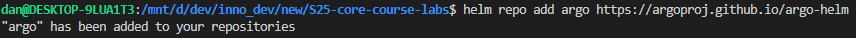
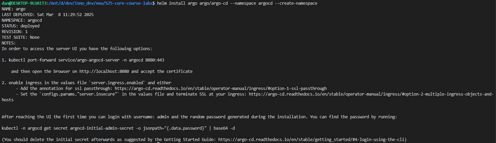
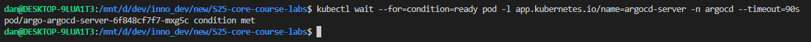

### 2. Install ArgoCD CLI

I have installed the ArgoCD CLI tool and verified its installation.

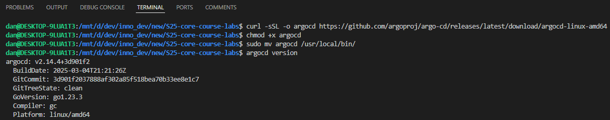

### 3. Access the ArgoCD UI

I have forwarded the ArgoCD server port and successfully logged in using initial admin password.

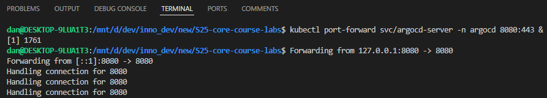
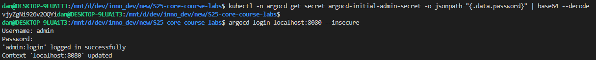

### 4. Configure Python App Sync

I have created an ArgoCD folder and defined the ArgoCD application.

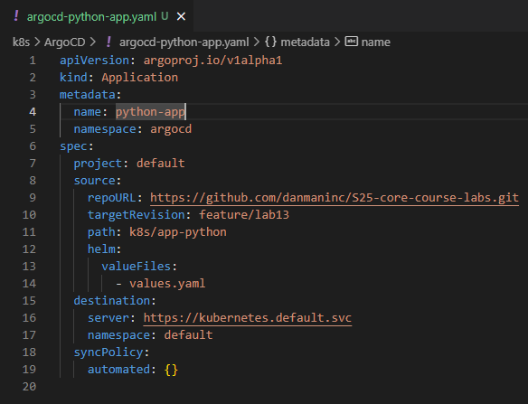

After that, I applied the configuration and verified sync:

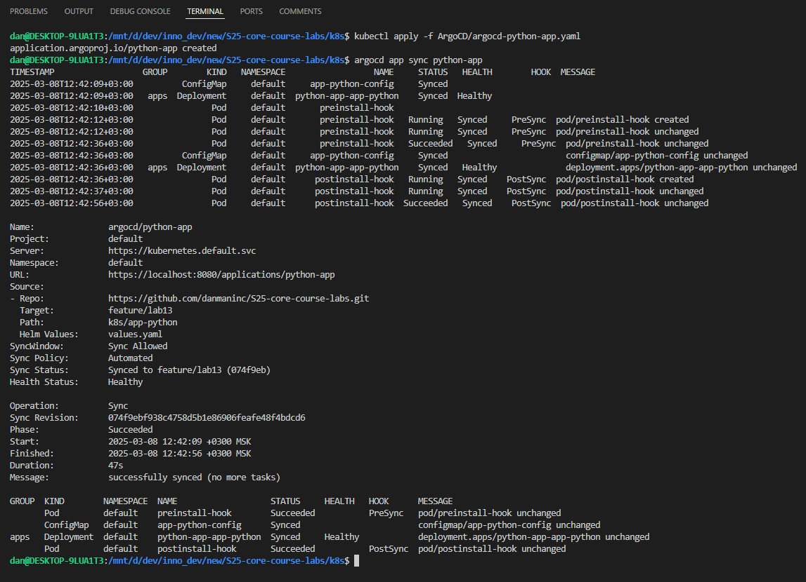
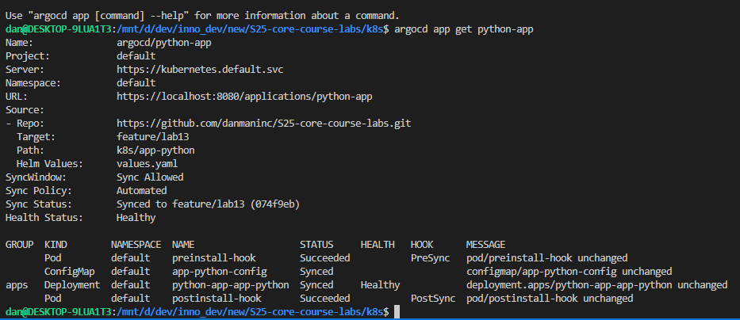

### 5. Test Sync Workflow

I modified the `values.yaml` (changed the `replicaCount` from 1 to 3).
Then, I committed and pushed these changes to the target branch from the config (in my case, it is `feature/lab13`).
The commit hash is [f5cf33d](https://github.com/danmaninc/S25-core-course-labs/commit/f5cf33d94abd3fe2a03355ed5f20e3a8d08de46c).

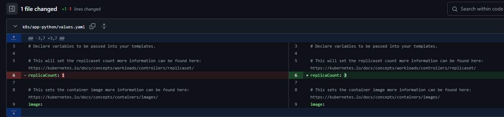

Then I observed that ArgoCD auto-synced the update. You can notice, that `deployment.apps/python-app-app-python configured`, which means that ArgoCD auto-synced the update successfully.

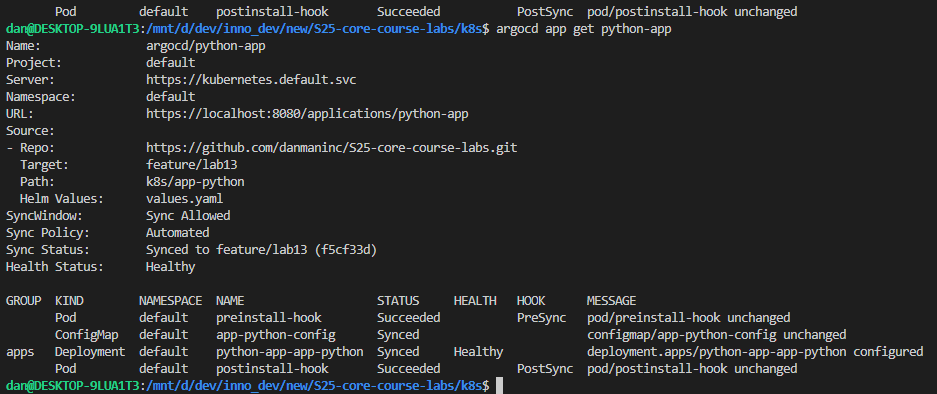

Also, we can notice that the number of pods indeed was increased.

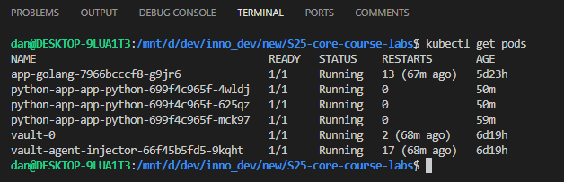

Therefore, the Task 1 was completed successfully.

## Task 2: Multi-Environment Deployment & Auto-Sync

### Set Up Multi-Environment Configurations

I have extended my Python app's Helm chart to support `dev` and `prod` environments by creating environment-specific values files (`values-dev.yaml`, `values-prod.yaml`).

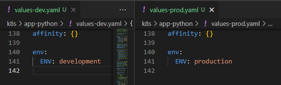

### Create Namespaces

I have created `dev` and `prod` namespaces via `kubectl`.

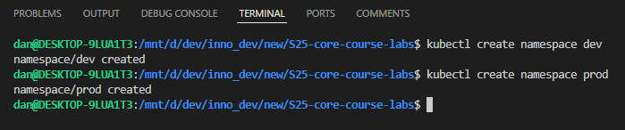

### Deploy Multi-Environment via ArgoCD

I have defined two ArgoCD applications with auto-sync: `argocd-python-dev.yaml` and `argocd-python-prod.yaml`.

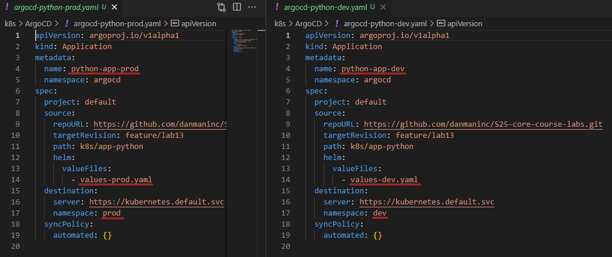

### Enable Auto-Sync

Let's test auto-sync. Firstly, I will apply the `prod` configuration and verify auto-sync.
As we can see from the following screenshot, it works correctly.

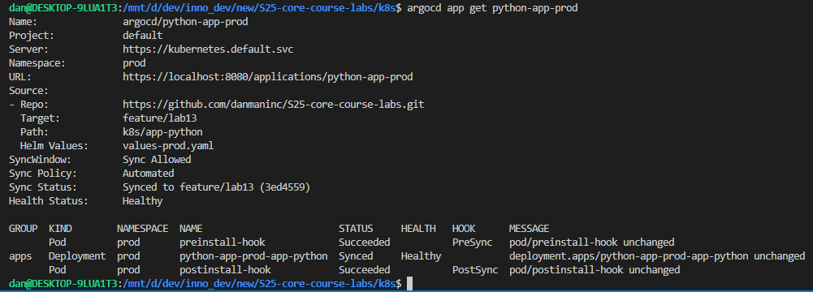

### Self-Heal Testing

#### Test 1: Manual Override of Replica Count

Let's modify the deployment's replica count manually:

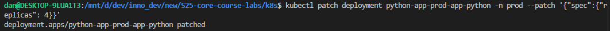

Then, let's check if it is auto-synced:

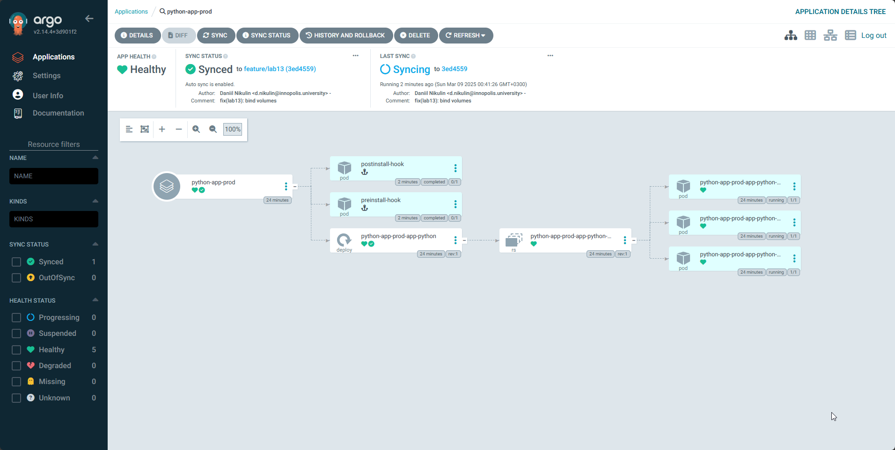

#### Test 2: Delete a Pod (Replica)

I have checked the number of pods before deletion.
After that, I deleted one pod, and retrieved the list of pods again with the watch mode. As you can see, the pod auto-created and became ready after 9 seconds.

Also, I runned `argocd app diff` to confirm that ArgoCD shows no drift.

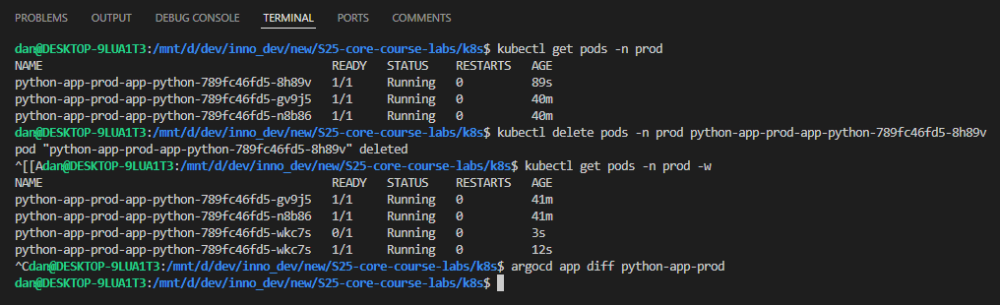

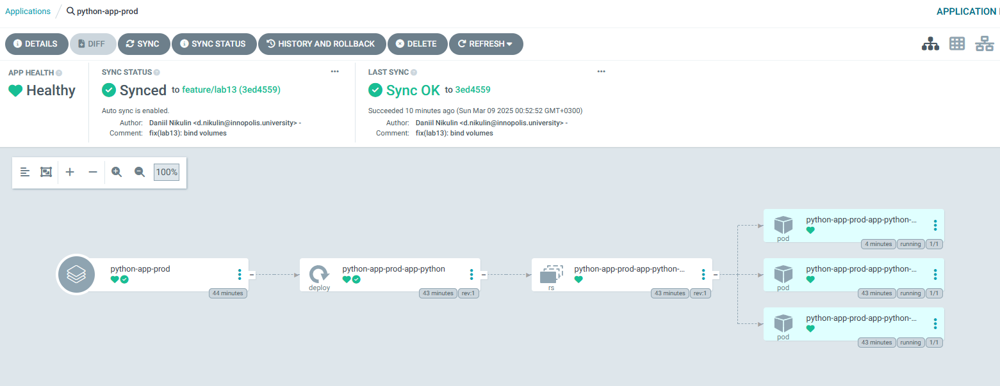

#### Explanation

ArgoCD handles the configuration drift by constantly comparing the defined application state from the Git repository with the actual state on the host machine. The configuration drift is eliminated after the sync process.

The pod was recreated automatically by Kubernetes, so that is why ArgoCD shows no drift (state was not affected, only the pod itself by deletion).
