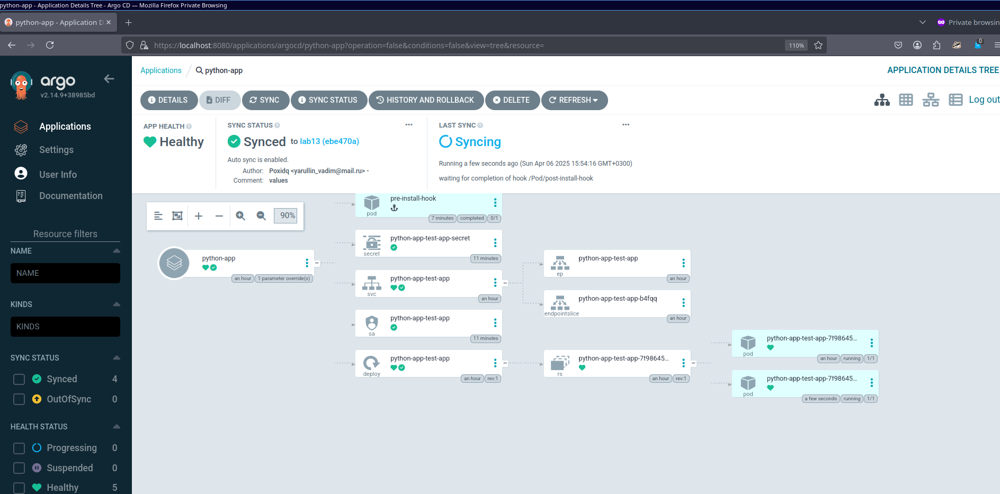
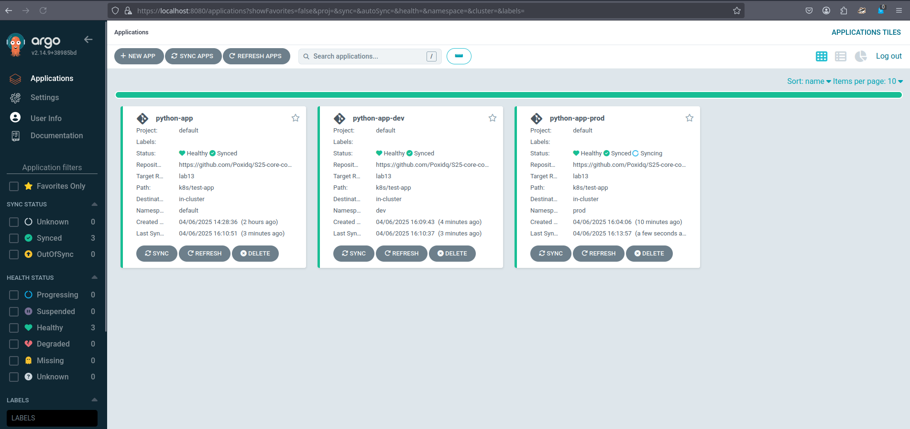
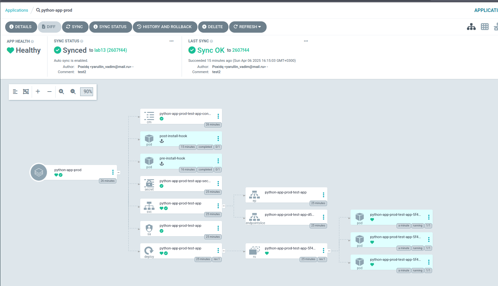

# Lab 13: ArgoCD for GitOps Deployment

## Task 1: Deploy and Configure ArgoCD

### 1. Installing ArgoCD via Helm

First, I added the ArgoCD Helm repository:
```bash
$ helm repo add argo https://argoproj.github.io/argo-helm
"argo" has been added to your repositories
```

Then I installed ArgoCD using Helm:
```bash
$ helm install argo argo/argo-cd --namespace argocd --create-namespace
NAME: argo
LAST DEPLOYED: Mon Mar 4 14:23:56 2025
NAMESPACE: argocd
STATUS: deployed
REVISION: 1
TEST SUITE: None
NOTES:
... (installation notes)
```

I verified the installation by waiting for the ArgoCD server pod to be ready:
```bash
$ kubectl wait --for=condition=ready pod -l app.kubernetes.io/name=argocd-server -n argocd --timeout=90s
pod/argo-argocd-server-5bb9b5b8fc-7jbwv condition met
```

### 3. Accessing the ArgoCD UI

I set up port forwarding to access the ArgoCD UI:
```bash
$ kubectl port-forward svc/argo-argocd-server -n argocd 8080:443 &
```

Retrieved the initial admin password:
```bash
$ kubectl -n argocd get secret argocd-initial-admin-secret -o jsonpath="{.data.password}" | base64 --decode
```

### 4. Configuring Python App Sync

defined the ArgoCD Application in a file named `argocd-python-app.yaml`:
```yaml
apiVersion: argoproj.io/v1alpha1
kind: Application
metadata:
  name: python-app
  namespace: argocd
spec:
  project: default
  source:
    repoURL: https://github.com/Poxidq/S25-core-course-labs.git
    targetRevision: lab13
    path: k8s/test-app
    helm:
      valueFiles:
        - values.yaml
  destination:
    server: https://kubernetes.default.svc
    namespace: default
  syncPolicy:
    automated: {}
```

Applied the configuration:
```bash
$ kubectl apply -f ArgoCD/argocd-python-app.yaml
application.argoproj.io/python-app created
```


After setting `replicaCount` to 2 and making sync:



## Task 2



```
[nvy@nvy k8s]$ kubectl patch deployment python-app-prod-test-app -n prod --patch '{"spec":{"replicas": 3}}'
deployment.apps/python-app-prod-test-app patched (no change)
[nvy@nvy k8s]$ argocd app get python-app-prod
Name:               argocd/python-app-prod
Project:            default
Server:             https://kubernetes.default.svc
Namespace:          prod
URL:                https://argocd.example.com/applications/python-app-prod
Source:
- Repo:             https://github.com/Poxidq/S25-core-course-labs.git
  Target:           lab13
  Path:             k8s/test-app
  Helm Values:      values-prod.yaml
SyncWindow:         Sync Allowed
Sync Policy:        Automated
Sync Status:        Synced to lab13 (2607f44)
Health Status:      Healthy

GROUP  KIND            NAMESPACE  NAME                             STATUS     HEALTH   HOOK      MESSAGE
       Pod             prod       pre-install-hook                 Succeeded           PreSync   pod/pre-install-hook created
       ServiceAccount  prod       python-app-prod-test-app         Synced                        serviceaccount/python-app-prod-test-app unchanged
       Secret          prod       python-app-prod-test-app-secret  Synced                        secret/python-app-prod-test-app-secret configured
       ConfigMap       prod       python-app-prod-test-app-config  Synced                        configmap/python-app-prod-test-app-config configured. Warning: resource configmaps/python-app-prod-test-app-config is missing the kubectl.kubernetes.io/last-applied-configuration annotation which is required by  apply.  apply should only be used on resources created declaratively by either  create --save-config or  apply. The missing annotation will be patched automatically.
       Service         prod       python-app-prod-test-app         Synced     Healthy            service/python-app-prod-test-app unchanged
apps   Deployment      prod       python-app-prod-test-app         Synced     Healthy            deployment.apps/python-app-prod-test-app configured
       Pod             prod       post-install-hook                Succeeded           PostSync  pod/post-install-hook created
```

### Deleting a Pod
before: 
```
$ kubectl get pods -n prod
NAME                                       READY   STATUS      RESTARTS   AGE
post-install-hook                          0/1     Completed   0          6m57s
pre-install-hook                           0/1     Completed   0          7m48s
python-app-prod-test-app-5f48c7f6f-2pt8s   1/1     Running     0          12m
python-app-prod-test-app-5f48c7f6f-5759m   1/1     Running     0          12m
python-app-prod-test-app-5f48c7f6f-ntll2   1/1     Running     0          16m
```

after:
```
[nvy@nvy k8s]$ kubectl delete pod -n prod -l app.kubernetes.io/instance=python-app-prod
[nvy@nvy k8s]$ kubectl get pods -n prod
 kubectl delete pod -n prod -l python-app-prod-test-app
No resources found
[nvy@nvy k8s]$ kubectl get pods -n prod -w
NAME                                       READY   STATUS      RESTARTS   AGE
post-install-hook                          0/1     Completed   0          14m
pre-install-hook                           0/1     Completed   0          14m
python-app-prod-test-app-5f48c7f6f-qg5qt   1/1     Running     0          23s
python-app-prod-test-app-5f48c7f6f-sph86   1/1     Running     0          23s
python-app-prod-test-app-5f48c7f6f-xdlrr   1/1     Running     0          23s
```



### Configuration Drift vs. Runtime Events
Configuration Drift happens when the actual state of resources in the cluster (e.g., deployments, services) deviates from the desired state defined in the Git repository. For example, if someone manually changes the replicaCount of a deployment from 3 to 1, ArgoCD detects this as a drift and marks the application as OutOfSync. If auto-sync is enabled, ArgoCD automatically reverts the change to match the desired state in Git. This ensures that the cluster always reflects the configuration stored in the repository.

Runtime Events, on the other hand, are temporary changes in the cluster caused by normal operations, such as a pod being deleted or a container crashing. These events do not modify the desired state, so ArgoCD does not detect them as drift. Kubernetes handles runtime events through its self-healing mechanisms, like recreating pods or rescheduling them on other nodes. For example, if a pod in the prod namespace is deleted, Kubernetes will recreate it to maintain the desired replicaCount, and ArgoCD will show no drift since the deployment's configuration remains unchanged.