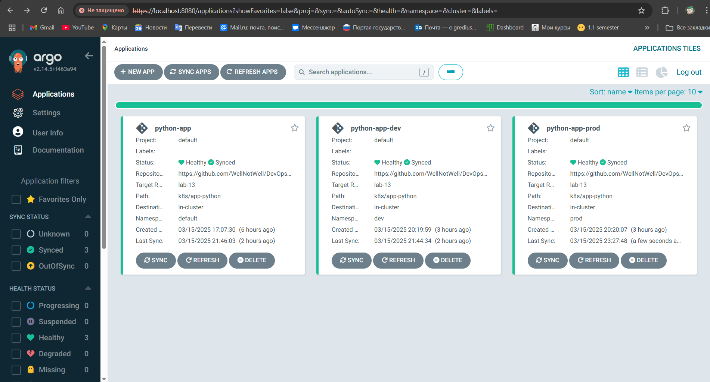
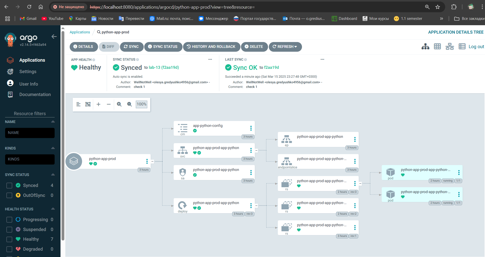

# Lab13

## Install ArgoCD via Helm

```sh
helm repo add argo https://argoproj.github.io/argo-helm
```
```text
"argo" has been added to your repositories
```

```sh
helm install argo argo/argo-cd --namespace argocd --create-namespace
```
```text
NAME: argo
LAST DEPLOYED: Sun Mar 16 00:36:53 2025
NAMESPACE: argocd
STATUS: deployed
REVISION: 1
TEST SUITE: None
NOTES:
In order to access the server UI you have the following options:

1. kubectl port-forward service/argo-argocd-server -n argocd 8080:443

    and then open the browser on http://localhost:8080 and accept the certificate

2. enable ingress in the values file `server.ingress.enabled` and either
      - Add the annotation for ssl passthrough: https://argo-cd.readthedocs.io/en/stable/operator-manual/ingress/#option-1-ssl-passthrough
      - Set the `configs.params."server.insecure"` in the values file and terminate SSL at your ingress: https://argo-cd.readthedocs.io/en/stable/operator-manual/ingress/#option-2-multiple-ingress-objects-and-hosts


After reaching the UI the first time you can login with username: admin and the random password generated during the installation. You can find the password by running:

kubectl -n argocd get secret argocd-initial-admin-secret -o jsonpath="{.data.password}" | base64 -d

(You should delete the initial secret afterwards as suggested by the Getting Started Guide: https://argo-cd.readthedocs.io/en/stable/getting_started/#4-login-using-the-cli)

```

```sh
kubectl wait --for=condition=ready pod -l app.kubernetes.io/name=argocd-server -n argocd --timeout=90s
```
```text
pod/argo-argocd-server-7b688c6d85-gzbj8 condition met
```

## Install ArgoCD CLI

```sh
curl -sSL -o argocd https://github.com/argoproj/argo-cd/releases/latest/download/argocd-linux-amd64
chmod +x argocd
sudo mv argocd /usr/local/bin/
```

```sh
argocd version
```
```text
argocd: v2.14.5+f463a94
  BuildDate: 2025-03-11T03:40:10Z
  GitCommit: f463a945d57267e9691cede37021d9ddc5994f36
  GitTreeState: clean
  GoVersion: go1.23.3
  Compiler: gc
  Platform: linux/amd64
FATA[0000] Argo CD server address unspecified  
```

## Access the ArgoCD UI

```sh
kubectl port-forward svc/argo-argocd-server -n argocd 8080:443 &
```
```text
Forwarding from [::1]:8080 -> 8080
```

```sh
kubectl -n argocd get secret argocd-initial-admin-secret -o jsonpath="{.data.password}" | base64 --decode
```
```text
jk-QHx0Td3rWS5kg
```

```sh
argocd login localhost:8080 --insecure
```
```text
Username: admin
Password: 
'admin:login' logged in successfully
Context 'localhost:8080' updated
```

## Configure Python App Sync

```sh
kubectl apply -f ArgoCD/argocd-python-app.yaml
```
```text
application.argoproj.io/arhocd-app created
```

```sh 
argocd app sync arhocd-app --server localhost:8080 --insecure
```
```text
TIMESTAMP  GROUP        KIND   NAMESPACE                  NAME    STATUS   HEALTH        HOOK  MESSAGE
2025-03-16T01:13:48+00:00   apps  Deployment         default  arhocd-app-helm-python  OutOfSync  Missing              
2025-03-16T01:13:48+00:00             Secret         default           some-secret    OutOfSync  Missing              
2025-03-16T01:13:48+00:00            Service         default  arhocd-app-helm-python  OutOfSync  Missing              
2025-03-16T01:13:48+00:00         ServiceAccount     default          internal-app    OutOfSync  Missing              
2025-03-16T01:13:49+00:00                Pod     default       preinstall-hook                                 
2025-03-16T01:13:51+00:00                Pod     default       preinstall-hook   Running   Synced     PreSync  pod/preinstall-hook created
2025-03-16T01:14:12+00:00         ServiceAccount     default          internal-app    Synced  Missing              
2025-03-16T01:14:12+00:00             Secret     default           some-secret    Synced  Missing              
2025-03-16T01:14:12+00:00            Service     default  arhocd-app-helm-python    Synced  Healthy                  
2025-03-16T01:14:12+00:00   apps  Deployment     default  arhocd-app-helm-python    Synced  Progressing              
2025-03-16T01:14:14+00:00            Service         default  arhocd-app-helm-python    Synced   Healthy                  service/arhocd-app-helm-python created
2025-03-16T01:14:14+00:00   apps  Deployment         default  arhocd-app-helm-python    Synced   Progressing              deployment.apps/arhocd-app-helm-python created
2025-03-16T01:14:14+00:00                Pod         default       preinstall-hook    Succeeded   Synced         PreSync  pod/preinstall-hook created
2025-03-16T01:14:14+00:00         ServiceAccount     default          internal-app      Synced   Missing                  serviceaccount/internal-app created
2025-03-16T01:14:14+00:00             Secret         default           some-secret      Synced   Missing                  secret/some-secret created
2025-03-16T01:14:25+00:00   apps  Deployment     default  arhocd-app-helm-python    Synced  Healthy              deployment.apps/arhocd-app-helm-python created
2025-03-16T01:14:26+00:00                Pod     default      postinstall-hook   Running   Synced    PostSync  pod/postinstall-hook created
2025-03-16T01:14:45+00:00                Pod     default      postinstall-hook  Succeeded   Synced    PostSync  pod/postinstall-hook created

Name:               argocd/arhocd-app
Project:            default
Server:             https://kubernetes.default.svc
Namespace:          default
URL:                https://argocd.example.com/applications/arhocd-app
Source:
- Repo:             https://github.com/Petrel321/S25-core-course-labs.git
  Target:           lab13-solution
  Path:             k8s/helm-python
  Helm Values:      values.yaml
SyncWindow:         Sync Allowed
Sync Policy:        Automated
Sync Status:        Synced to lab13-solution (e84e82d)
Health Status:      Healthy

Operation:          Sync
Sync Revision:      e84e82d86fde0673786ca7af313d54f3b95aa937
Phase:              Succeeded
Start:              2025-03-16 01:13:48 +0000 UTC
Finished:           2025-03-16 01:14:45 +0000 UTC
Duration:           57s
Message:            successfully synced (no more tasks)

GROUP  KIND            NAMESPACE  NAME                    STATUS     HEALTH   HOOK      MESSAGE
       Pod             default    preinstall-hook         Succeeded           PreSync   pod/preinstall-hook created
       ServiceAccount  default    internal-app            Synced                        serviceaccount/internal-app created
       Secret          default    some-secret             Synced                        secret/some-secret created
       Service         default    arhocd-app-helm-python  Synced     Healthy            service/arhocd-app-helm-python created
apps   Deployment      default    arhocd-app-helm-python  Synced     Healthy            deployment.apps/arhocd-app-helm-python created
       Pod             default    postinstall-hook        Succeeded           PostSync  pod/postinstall-hook created
```

```sh
argocd app get arhocd-app
```
```text
Name:               argocd/arhocd-app
Project:            default
Server:             https://kubernetes.default.svc
Namespace:          default
URL:                https://argocd.example.com/applications/arhocd-app
Source:
- Repo:             https://github.com/Petrel321/S25-core-course-labs.git
  Target:           lab13-solution
  Path:             k8s/helm-python
  Helm Values:      values.yaml
SyncWindow:         Sync Allowed
Sync Policy:        Automated
Sync Status:        Synced to lab13-solution (e84e82d)
Health Status:      Healthy

GROUP  KIND            NAMESPACE  NAME                    STATUS     HEALTH   HOOK      MESSAGE
       Pod             default    preinstall-hook         Succeeded           PreSync   pod/preinstall-hook created
       ServiceAccount  default    internal-app            Synced                        serviceaccount/internal-app created
       Secret          default    some-secret             Synced                        secret/some-secret created
       Service         default    arhocd-app-helm-python  Synced     Healthy            service/arhocd-app-helm-python created
apps   Deployment      default    arhocd-app-helm-python  Synced     Healthy            deployment.apps/arhocd-app-helm-python created
       Pod             default    postinstall-hook        Succeeded           PostSync  pod/postinstall-hook created
```


## Test Sync Workflow. Changing `replicaCount` to `2`
```sh
argocd app get arhocd-app
```
```text
Name:               argocd/arhocd-app
Project:            default
Server:             https://kubernetes.default.svc
Namespace:          default
URL:                https://argocd.example.com/applications/arhocd-app
Source:
- Repo:             https://github.com/Petrel321/S25-core-course-labs.git
  Target:           lab13-solution
  Path:             k8s/helm-python
  Helm Values:      values.yaml
SyncWindow:         Sync Allowed
Sync Policy:        Automated
Sync Status:        Synced to lab13-solution (2f029bb)
Health Status:      Healthy

GROUP  KIND            NAMESPACE  NAME                    STATUS     HEALTH   HOOK      MESSAGE
       Pod             default    preinstall-hook         Succeeded           PreSync   pod/preinstall-hook created
       ServiceAccount  default    internal-app            Synced                        serviceaccount/internal-app unchanged
       Secret          default    some-secret             Synced                        secret/some-secret unchanged
       Service         default    arhocd-app-helm-python  Synced     Healthy            service/arhocd-app-helm-python unchanged
apps   Deployment      default    arhocd-app-helm-python  Synced     Healthy            deployment.apps/arhocd-app-helm-python configured
       Pod             default    postinstall-hook        Running             PostSync  pod/postinstall-hook created
```


### Verify number of replicas:
```sh
kubectl get deployments.apps
```

```text
arhocd-app-helm-python   2/2     2            2           76m
```

```sh
kubectl describe deployment arhocd-app-helm-python | grep "Replicas"
```
```sh
Replicas:               2 desired | 2 updated | 2 total | 2 available | 0 unavailable
  Available      True    MinimumReplicasAvailable
```


# Task 2

## Deploy Multi-Environment via ArgoCD

## Create Namespaces

```sh
kubectl create namespace dev
kubectl create namespace prod
```
```text
namespace/dev created
namespace/prod created
```

## Test Auto-Sync 

```sh
kubectl apply -f k8s/ArgoCD/argocd-python-dev.yaml
kubectl apply -f k8s/ArgoCD/argocd-python-prod.yaml
```

```text
application.argoproj.io/arhocd-app-dev configured
application.argoproj.io/arhocd-app-prod created
```

```sh
argocd app list
```


```sh
argocd app get arhocd-app-prod
```

```text
Name:               argocd/arhocd-app-prod
Project:            default
Server:             https://kubernetes.default.svc
Namespace:          prod
URL:                https://argocd.example.com/applications/arhocd-app-prod
Source:
- Repo:             https://github.com/Petrel321/S25-core-course-labs.git
  Target:           lab13-solution
  Path:             k8s/helm-python
  Helm Values:      values-prod.yaml
SyncWindow:         Sync Allowed
Sync Policy:        Automated (Prune)
Sync Status:        Synced to lab13-solution (b6080a7)
Health Status:      Healthy

GROUP  KIND            NAMESPACE  NAME                         STATUS     HEALTH   HOOK      MESSAGE
       Pod             prod       preinstall-hook              Succeeded           PreSync   pod/preinstall-hook created
       ServiceAccount  prod       internal-app                 Synced                        serviceaccount/internal-app unchanged
       Secret          prod       some-secret                  Synced                        secret/some-secret unchanged
       Service         prod       arhocd-app-prod-helm-python  Synced     Healthy            service/arhocd-app-prod-helm-python unchanged
apps   Deployment      prod       arhocd-app-prod-helm-python  Synced     Healthy            deployment.apps/arhocd-app-prod-helm-python unchanged
       Pod             prod       postinstall-hook             Succeeded           PostSync  pod/postinstall-hook created
```

```sh
argocd app get arhocd-app-dev
```

```text
Name:               argocd/arhocd-app-dev
Project:            default
Server:             https://kubernetes.default.svc
Namespace:          dev
URL:                https://argocd.example.com/applications/arhocd-app-dev
Source:
- Repo:             https://github.com/Petrel321/S25-core-course-labs.git
  Target:           lab13-solution
  Path:             k8s/helm-python
  Helm Values:      values-dev.yaml
SyncWindow:         Sync Allowed
Sync Policy:        Automated (Prune)
Sync Status:        Synced to lab13-solution (b6080a7)
Health Status:      Healthy

GROUP  KIND            NAMESPACE  NAME                        STATUS     HEALTH   HOOK      MESSAGE
       Pod             dev        preinstall-hook             Succeeded           PreSync   pod/preinstall-hook created
       ServiceAccount  dev        internal-app                Synced                        serviceaccount/internal-app created
       Secret          dev        some-secret                 Synced                        secret/some-secret created
       Service         dev        arhocd-app-dev-helm-python  Synced     Healthy            service/arhocd-app-dev-helm-python created
apps   Deployment      dev        arhocd-app-dev-helm-python  Synced     Healthy            deployment.apps/arhocd-app-dev-helm-python created
       Pod             dev        postinstall-hook            Succeeded           PostSync  pod/postinstall-hook created
```

### After update replicaCount to 4 in `values-prod.yaml`

```sh
argocd app get python-app-prod
```
```text
Name:               argocd/arhocd-app-prod
Project:            default
Server:             https://kubernetes.default.svc
Namespace:          prod
URL:                https://argocd.example.com/applications/arhocd-app-prod
Source:
- Repo:             https://github.com/Petrel321/S25-core-course-labs.git
  Target:           lab13-solution
  Path:             k8s/helm-python
  Helm Values:      values-prod.yaml
SyncWindow:         Sync Allowed
Sync Policy:        Automated (Prune)
Sync Status:        OutOfSync from lab13-solution (deaa6d2)
Health Status:      Healthy

GROUP  KIND            NAMESPACE  NAME                         STATUS     HEALTH   HOOK     MESSAGE
       Pod             prod       preinstall-hook              Running             PreSync  pod/preinstall-hook created
       Secret          prod       some-secret                  Synced                       
       Service         prod       arhocd-app-prod-helm-python  Synced     Healthy           
       ServiceAccount  prod       internal-app                 Synced                       
apps   Deployment      prod       arhocd-app-prod-helm-python  OutOfSync  Healthy 
```

## Self-Heal Testing

### Test 1: Manual Override of Replica Count

```sh
> kubectl patch deployment python-app-prod-app-python -n prod --patch '{"spec": {"replicas": 3}}'
```
```sh
deployment.apps/python-app-prod-app-python patched
```

```sh
> argocd app sync python-app-prod
```
```sh
TIMESTAMP                  GROUP        KIND       NAMESPACE                  NAME          STATUS   HEALTH        HOOK  MESSAGE
2025-03-15T22:19:05+03:00          ConfigMap            prod     app-python-config          Synced
2025-03-15T22:19:05+03:00            Service            prod  python-app-prod-app-python    Synced  Healthy
2025-03-15T22:19:05+03:00         ServiceAccount        prod  python-app-prod-app-python    Synced
2025-03-15T22:19:05+03:00   apps  Deployment            prod  python-app-prod-app-python    Synced  Healthy
2025-03-15T22:19:05+03:00                Pod        prod       preinstall-hook                                 
2025-03-15T22:19:07+03:00                Pod        prod       preinstall-hook   Running   Synced     PreSync  pod/preinstall-hook created
2025-03-15T22:19:30+03:00                Pod            prod       preinstall-hook        Succeeded   Synced     PreSync  pod/preinstall-hook created
2025-03-15T22:19:30+03:00         ServiceAccount        prod  python-app-prod-app-python    Synced                        serviceaccount/python-app-prod-app-python unchanged
2025-03-15T22:19:30+03:00          ConfigMap            prod     app-python-config          Synced                        configmap/app-python-config unchanged
2025-03-15T22:19:30+03:00            Service            prod  python-app-prod-app-python    Synced   Healthy              service/python-app-prod-app-python unchanged
2025-03-15T22:19:30+03:00   apps  Deployment            prod  python-app-prod-app-python    Synced   Healthy              deployment.apps/python-app-prod-app-python configured
2025-03-15T22:19:30+03:00                Pod        prod      postinstall-hook   Running   Synced    PostSync  pod/postinstall-hook created
2025-03-15T22:19:51+03:00                Pod        prod      postinstall-hook  Succeeded   Synced    PostSync  pod/postinstall-hook created

Name:               argocd/python-app-prod
Project:            default
Server:             https://kubernetes.default.svc
Namespace:          prod
URL:                https://argocd.example.com/applications/python-app-prod
Source:
- Repo:             https://github.com/WellNotWell/DevOps-labs.git
  Target:           lab-13
  Path:             k8s/app-python
  Helm Values:      values-prod.yaml
SyncWindow:         Sync Allowed
Sync Policy:        Automated (Prune)
Sync Status:        Synced to lab-13 (f2aa19d)
Health Status:      Healthy

Operation:          Sync
Sync Revision:      f2aa19d3f88d7645f462e3a758aecd676c4b7d18
Phase:              Succeeded
Start:              2025-03-15 22:19:05 +0300 MSK
Finished:           2025-03-15 22:19:51 +0300 MSK
Duration:           46s
Message:            successfully synced (no more tasks)

GROUP  KIND            NAMESPACE  NAME                        STATUS     HEALTH   HOOK      MESSAGE
       Pod             prod       preinstall-hook             Succeeded           PreSync   pod/preinstall-hook created
       ServiceAccount  prod       python-app-prod-app-python  Synced                        serviceaccount/python-app-prod-app-python unchanged
       ConfigMap       prod       app-python-config           Synced                        configmap/app-python-config unchanged
       Service         prod       python-app-prod-app-python  Synced     Healthy            service/python-app-prod-app-python unchanged
apps   Deployment      prod       python-app-prod-app-python  Synced     Healthy            deployment.apps/python-app-prod-app-python configured
       Pod             prod       postinstall-hook            Succeeded           PostSync  pod/postinstall-hook created
```

```sh
> argocd app get python-app-prod
```
```sh
Name:               argocd/python-app-prod
Project:            default
Server:             https://kubernetes.default.svc
Namespace:          prod
URL:                https://argocd.example.com/applications/python-app-prod
Source:
- Repo:             https://github.com/WellNotWell/DevOps-labs.git
  Target:           lab-13
  Path:             k8s/app-python
  Helm Values:      values-prod.yaml
SyncWindow:         Sync Allowed
Sync Policy:        Automated (Prune)
Sync Status:        Synced to lab-13 (f2aa19d)
Health Status:      Healthy

GROUP  KIND            NAMESPACE  NAME                        STATUS     HEALTH   HOOK      MESSAGE
       Pod             prod       preinstall-hook             Succeeded           PreSync   pod/preinstall-hook created
       ServiceAccount  prod       python-app-prod-app-python  Synced                        serviceaccount/python-app-prod-app-python unchanged
       ConfigMap       prod       app-python-config           Synced                        configmap/app-python-config unchanged
       Service         prod       python-app-prod-app-python  Synced     Healthy            service/python-app-prod-app-python unchanged
apps   Deployment      prod       python-app-prod-app-python  Synced     Healthy            deployment.apps/python-app-prod-app-python configured
       Pod             prod       postinstall-hook            Succeeded           PostSync  pod/postinstall-hook created
```

I forgot about images, so I tested one more time:



### Documentationlt

#### Before deletion


#### After deletion


#### Explanation of how ArgoCD handles configuration drift vs. runtime events

##### Configuration Drift
- ArgoCD continuously monitors the desired state (Git) vs. the actual state (Kubernetes)
- If a drift is detected, it marks the application as **OutOfSync**
- It can **automatically correct** drift based on sync policies

##### Runtime Events
- External runtime events (e.g., pod restarts, scaling) do **not** trigger a sync
- ArgoCD focuses on declarative state enforcement, not transient runtime changes
- It does not react to **ephemeral** Kubernetes events unless they cause drift


