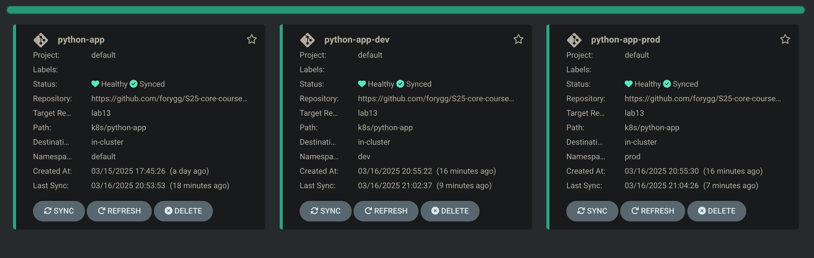

# ArgoCD Multi-Environment Configuration and Self-Healing

## 1. Multi-Environment Setup

### Environment-Specific Configurations

I created two environment-specific values files:
- `values-dev.yaml` for the development environment
- `values-prod.yaml` for the production environment

These files contain environment-specific settings like replica counts, resource limits, and environment variables.

### ArgoCD Applications

I defined two ArgoCD applications:
- `python-app-dev` targeting the `dev` namespace
- `python-app-prod` targeting the `prod` namespace

Both applications are configured with auto-sync and self-healing capabilities.

## 2. Self-Healing Tests

### Test 1: Manual Override of Replica Count

**Before the change:**
```bash
$ kubectl get pods -n prod
NAME                              READY   STATUS      RESTARTS   AGE
pre-install-hook-x5f5v            0/1     Completed   0          118s
python-app-prod-566fb4758-6xgzq   1/1     Running     0          88s
python-app-prod-566fb4758-kr5fn   1/1     Running     0          88s
```

**Applying the manual override:**
```bash
$ kubectl patch deployment python-app-prod -n prod --patch '{"spec":{"replicas": 3}}'
deployment.apps/python-app-prod patched
```

**After the override (temporary state):**
```bash
$ $ kubectl get pods -n prod
NAME                              READY   STATUS        RESTARTS   AGE
pre-install-hook-x5f5v            0/1     Completed     0          3m29s
python-app-prod-566fb4758-6xgzq   1/1     Running       0          2m59s
python-app-prod-566fb4758-kr5fn   1/1     Running       0          2m59s
python-app-prod-566fb4758-st9g2   0/1     Terminating   0          2s
```

**After ArgoCD self-healing:**
```bash
$ kubectl get pods -n prod
NAME                              READY   STATUS      RESTARTS   AGE
pre-install-hook-x5f5v            0/1     Completed   0          4m5s
python-app-prod-566fb4758-6xgzq   1/1     Running     0          3m35s
python-app-prod-566fb4758-kr5fn   1/1     Running     0          3m35s
```

### Test 2: Delete a Pod (Replica)

**Before pod deletion:**
```bash
$ kubectl get pods -n prod
NAME                              READY   STATUS      RESTARTS   AGE
pre-install-hook-x5f5v            0/1     Completed   0          4m36s
python-app-prod-566fb4758-6xgzq   1/1     Running     0          4m6s
python-app-prod-566fb4758-kr5fn   1/1     Running     0          4m6s
```

**Deleting a pod:**
```bash
$ kubectl delete pod -n prod python-app-prod-d8b9c5f7b-x4j2p
pod "python-app-prod-d8b9c5f7b-x4j2p" deleted
```

**After pod deletion (Kubernetes recreates the pod):**
```bash
$ kubectl get pods -n prod
NAME                              READY   STATUS      RESTARTS   AGE
pre-install-hook-x5f5v            0/1     Completed   0          5m28s
python-app-prod-566fb4758-6xgzq   1/1     Running     0          4m58s
python-app-prod-566fb4758-956vn   1/1     Running     0          2s
```

**ArgoCD status (no drift detected):**
```bash
$ argocd app diff python-app-prod

fory@pop-os:~/devops-labs/S25-core-course-labs/k8s$ argocd app diff python-app-prod
Handling connection for 8081
Handling connection for 8081
Handling connection for 8081
Handling connection for 8081
Handling connection for 8081
```

## 3. Understanding ArgoCD Self-Healing

ArgoCD handles two types of changes differently:

1. **Configuration Drift**: When the actual state of resources differs from the desired state defined in Git, ArgoCD will detect this as drift and automatically correct it if self-healing is enabled. This is what happened in Test 1 when we manually changed the replica count.

2. **Runtime Events**: When pods are deleted or crash, Kubernetes itself handles the recreation of pods to match the desired replica count. ArgoCD doesn't need to intervene because the deployment specification hasn't changed. This is what we observed in Test 2.

The key difference is that configuration drift involves changes to resource specifications (like deployments, services, etc.), while runtime events affect the instances of those resources without changing their specifications.


