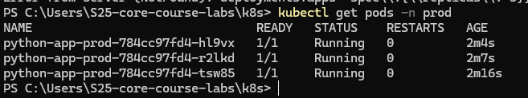
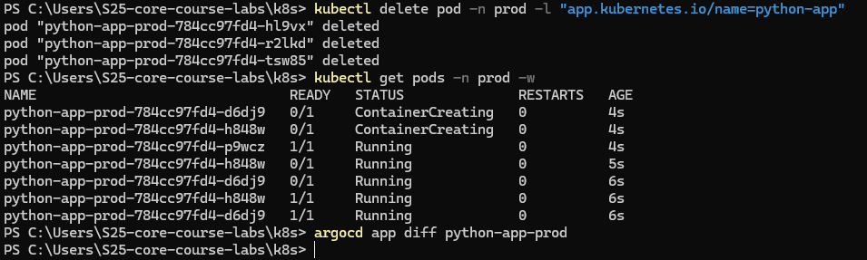
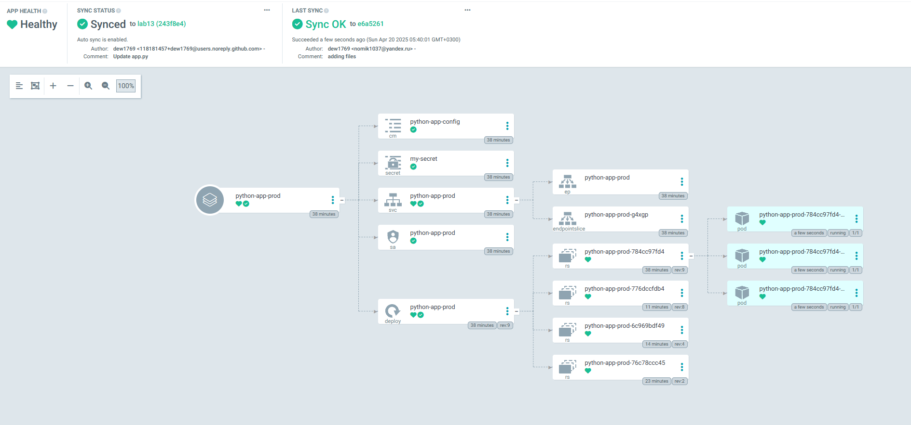

# Approving the work

## Output of kubectl get pods -n prod before and after pod deletion.

## Output of ArgoCD

## Explanation of how ArgoCD handles configuration drift vs. runtime events.

ArgoCD detects configuration drift by continuously monitoring the live state of the Kubernetes cluster and comparing it with the desired state in the Git repository, automatically syncing any discrepancies. For runtime events, it ensures the application's health is monitored and can trigger rollbacks or re-deployments if needed, maintaining the desired state over time.
