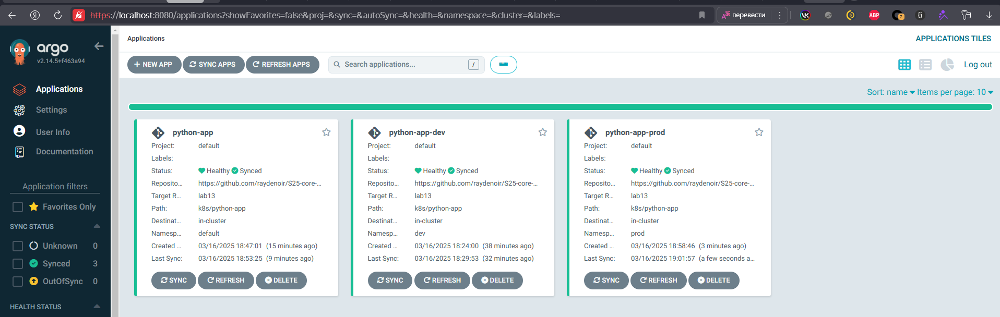

```bash
kubectl get pods -n prod -w

Output:
NAME                               READY   STATUS      RESTARTS   AGE
python-app-preinstall              0/1     Completed   0          2m36s
python-app-prod-5c6d848cb8-56z4p   1/1     Running     0          2m10s
python-app-prod-5c6d848cb8-78p9m   1/1     Running     0          2m10s
python-app-prod-5c6d848cb8-92abc   1/1     Running     0          2m10s
```



## Config Drift vs Runtime Events handling

Configuration Drift:
When someone manually changes a resource (like altering a replica count) so that it no longer matches the Git-declared configuration, ArgoCD notices this "drift." If auto-sync is enabled, it will automatically revert the changes to match the Git state.

Runtime Events:
Events such as pod restarts, temporary failures, or auto-scaling actions are normal Kubernetes behaviors. These do not change the declared configuration in Git, so ArgoCD doesn’t intervene—they’re handled by Kubernetes itself.