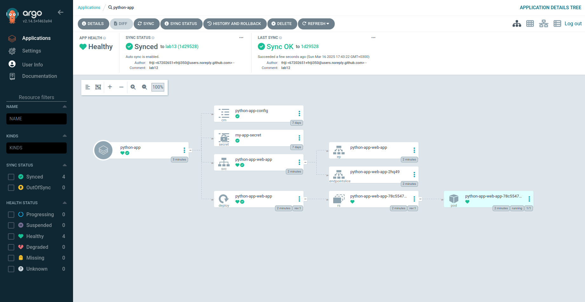

# ArgoCD

## Installation

```bash
helm repo add argo https://argoproj.github.io/argo-helm
"argo" has been added to your repositories
```

```bash
 helm install argo argo/argo-cd --namespace argocd --create-namespace
NAME: argo
LAST DEPLOYED: Tue Apr 29 21:08:32 2025
NAMESPACE: argocd
STATUS: deployed
REVISION: 1
TEST SUITE: None
NOTES:
In order to access the server UI you have the following options:

1. kubectl port-forward service/argo-argocd-server -n argocd 8080:443

    and then open the browser on http://localhost:8080 and accept the certificate

2. enable ingress in the values file `server.ingress.enabled` and either
      - Add the annotation for ssl passthrough: https://argo-cd.readthedocs.io/en/stable/operator-manual/ingress/#option-1-ssl-passthrough
      - Set the `configs.params."server.insecure"` in the values file and terminate SSL at your ingress: https://argo-cd.readthedocs.io/en/stable/operator-manual/ingress/#option-2-multiple-ingress-objects-and-hosts


After reaching the UI the first time you can login with username: admin and the random password generated during the installation. You can find the password by running:

kubectl -n argocd get secret argocd-initial-admin-secret -o jsonpath="{.data.password}" | base64 -d

(You should delete the initial secret afterwards as suggested by the Getting Started Guide: https://argo-cd.readthedocs.io/en/stable/getting_started/#4-login-using-the-cli)
```

```bash
kubectl wait --for=condition=ready pod -l app.kubernetes.io/name=argocd-server -n argocd --timeout=90s
pod/argo-argocd-server-5f68456cbb-ff8vn condition met
```

```bash
curl -sSL -o argocd-linux-amd64 https://github.com/argoproj/argo-cd/releases/latest/download/argocd-linux-amd64
  sudo install -m 555 argocd-linux-amd64 /usr/local/bin/argocd
  rm argocd-linux-amd64
```

```bash
 argocd version
argocd: v2.14.11+8283115
  BuildDate: 2025-04-22T16:01:54Z
  GitCommit: 82831155c2c1873b3b5d19449bfa3970dab9ce24
  GitTreeState: clean
  GoVersion: go1.23.3
  Compiler: gc
  Platform: linux/amd64
FATA[0000] Argo CD server address unspecified 
```

### Enter to ArgoCD

```bash
kubectl port-forward svc/argo-argocd-server -n argocd 8080:443 &

Forwarding from 127.0.0.1:8080 -> 8080
```

```bash
kubectl -n argocd get secret argocd-initial-admin-secret -o jsonpath="{.data.password}" | base64 --decode

YSm8qnbckXgFRkG2
```

```bash
argocd login localhost:8080 --insecure
Username: admin
Password: 
'admin:login' logged in successfully
Context 'localhost:8080' updated
```

### Configure app

```bash
kubectl apply -f ArgoCD/argocd-python-app.yaml
application.argoproj.io/python-app created
```

```bash
 argocd app get python-app
Name:               argocd/python-app
Project:            default
Server:             https://kubernetes.default.svc
Namespace:          default
URL:                https://argocd.example.com/applications/python-app
Source:
- Repo:             https://github.com/darrpyy/S25-core-course-labs.git
  Target:           lab13
  Path:             k8s/app-python-helm
  Helm Values:      values.yaml
SyncWindow:         Sync Allowed
Sync Policy:        Automated
Sync Status:        Synced to lab13 (c6f3e4c)
Health Status:      Healthy

GROUP  KIND            NAMESPACE  NAME                          STATUS     HEALTH   HOOK      MESSAGE
       Pod             default    python-app-pre-install-hook   Succeeded           PreSync   pod/python-app-pre-install-hook created
       ServiceAccount  default    app-python                    Synced                        serviceaccount/app-python unchanged
       ConfigMap       default    app-python-config             Synced                        configmap/app-python-config unchanged
       Service         default    python-app-app-python-helm    Synced     Healthy            service/python-app-app-python-helm unchanged
apps   Deployment      default    python-app-app-python-helm    Synced     Healthy            deployment.apps/python-app-app-python-helm unchanged
       Pod             default    python-app-post-install-hook  Succeeded           PostSync  pod/python-app-post-install-hook created
```

Updated replica count in `values.yaml` file

```bash
argocd app get python-app
Name:               argocd/python-app
Project:            default
Server:             https://kubernetes.default.svc
Namespace:          default
URL:                https://argocd.example.com/applications/python-app
Source:
- Repo:             https://github.com/darrpyy/S25-core-course-labs.git
  Target:           lab13
  Path:             k8s/app-python-helm
  Helm Values:      values.yaml
SyncWindow:         Sync Allowed
Sync Policy:        Automated
Sync Status:        OutOfSync from lab13 (c6f3e4c)
Health Status:      Healthy

GROUP  KIND            NAMESPACE  NAME                          STATUS     HEALTH   HOOK      MESSAGE
       Pod             default    python-app-pre-install-hook   Succeeded           PreSync   pod/python-app-pre-install-hook created
       ServiceAccount  default    app-python                    Synced                        serviceaccount/app-python unchanged
       ConfigMap       default    app-python-config             Synced                        configmap/app-python-config unchanged
       Service         default    python-app-app-python-helm    Synced     Healthy            service/python-app-app-python-helm unchanged
apps   Deployment      default    python-app-app-python-helm    OutOfSync  Healthy            deployment.apps/python-app-app-python-helm configured
       Pod             default    python-app-post-install-hook  Running             PostSync  pod/python-app-post-install-hook created
```

```bash
argocd app get python-app
Name:               argocd/python-app
Project:            default
Server:             https://kubernetes.default.svc
Namespace:          default
URL:                https://argocd.example.com/applications/python-app
Source:
- Repo:             https://github.com/darrpyy/S25-core-course-labs.git
  Target:           lab13
  Path:             k8s/app-python-helm
  Helm Values:      values.yaml
SyncWindow:         Sync Allowed
Sync Policy:        Automated
Sync Status:        Synced to lab13 (2dc3b06)
Health Status:      Healthy

GROUP  KIND            NAMESPACE  NAME                          STATUS     HEALTH   HOOK      MESSAGE
       Pod             default    python-app-pre-install-hook   Succeeded           PreSync   pod/python-app-pre-install-hook created
       ServiceAccount  default    app-python                    Synced                        serviceaccount/app-python unchanged
       ConfigMap       default    app-python-config             Synced                        configmap/app-python-config unchanged
       Service         default    python-app-app-python-helm    Synced     Healthy            service/python-app-app-python-helm unchanged
apps   Deployment      default    python-app-app-python-helm    Synced     Healthy            deployment.apps/python-app-app-python-helm configured
       Pod             default    python-app-post-install-hook  Succeeded           PostSync  pod/python-app-post-install-hook created
```

```bash
kubectl get po
NAME                                          READY   STATUS    RESTARTS   AGE
app-python-helm-64cc8b8494-6gd62              1/1     Running   0          61m
python-app-app-python-helm-7c46dd9d78-l85g6   1/1     Running   0          7m19s
python-app-app-python-helm-7c46dd9d78-mhkft   1/1     Running   0          7m19s
python-app-app-python-helm-7c46dd9d78-q2blc   1/1     Running   0          118s
vault-0                                       1/1     Running   0          126m
vault-agent-injector-75f9dfc9c8-994jj         1/1     Running   0          126m
```

As we can see, new pod added

## Multi env deployment

```bash
kubectl create namespace dev
namespace/dev created
```

```bash
kubectl create namespace prod
namespace/prod created
```

```bash
kubectl apply -f ArgoCD/argocd-python-dev.yaml
application.argoproj.io/python-app-dev created
```

```bash
kubectl get deployments.apps -n dev
NAME                             READY   UP-TO-DATE   AVAILABLE   AGE
python-app-dev-app-python-helm   1/1     1            1           12s
```

```bash
kubectl apply -f ArgoCD/argocd-python-prod.yaml
application.argoproj.io/python-app-prod created
```

```bash
kubectl get deployments.apps -n prod
NAME                              READY   UP-TO-DATE   AVAILABLE   AGE
python-app-prod-app-python-helm   4/4     4            4           4s
```

### Auto-sync

Updated prod values file

```bash
kubectl get deployments.apps -n prod
NAME                              READY   UP-TO-DATE   AVAILABLE   AGE
python-app-prod-app-python-helm   6/6     6            6           8m1s
```

### Self Heal 1

```bash
argocd app get python-app-prod
Name:               argocd/python-app-prod
Project:            default
Server:             https://kubernetes.default.svc
Namespace:          prod
URL:                https://argocd.example.com/applications/python-app-prod
Source:
- Repo:             https://github.com/darrpyy/S25-core-course-labs.git
  Target:           lab13
  Path:             k8s/app-python-helm
  Helm Values:      values-prod.yaml
SyncWindow:         Sync Allowed
Sync Policy:        Automated
Sync Status:        Synced to lab13 (044fad8)
Health Status:      Healthy

GROUP  KIND            NAMESPACE  NAME                               STATUS     HEALTH   HOOK      MESSAGE
       Pod             prod       python-app-prod-pre-install-hook   Succeeded           PreSync   pod/python-app-prod-pre-install-hook created
       ServiceAccount  prod       app-python                         Synced                        serviceaccount/app-python unchanged
       ConfigMap       prod       app-python-config                  Synced                        configmap/app-python-config unchanged
       Service         prod       python-app-prod-app-python-helm    Synced     Healthy            service/python-app-prod-app-python-helm unchanged
apps   Deployment      prod       python-app-prod-app-python-helm    Synced     Healthy            deployment.apps/python-app-prod-app-python-helm configured
       Pod             prod       python-app-prod-post-install-hook  Succeeded           PostSync  pod/python-app-prod-post-install-hook created
```

Patch app

```bash
kubectl patch deployment python-app-prod-app-python-helm -n prod --patch '{"spec":{"replicas": 10}}'
deployment.apps/python-app-prod-app-python-helm patched
```

```bash
argocd app get python-app-prod
Name:               argocd/python-app-prod
Project:            default
Server:             https://kubernetes.default.svc
Namespace:          prod
URL:                https://argocd.example.com/applications/python-app-prod
Source:
- Repo:             https://github.com/darrpyy/S25-core-course-labs.git
  Target:           lab13
  Path:             k8s/app-python-helm
  Helm Values:      values-prod.yaml
SyncWindow:         Sync Allowed
Sync Policy:        Automated
Sync Status:        OutOfSync from lab13 (044fad8)
Health Status:      Healthy

GROUP  KIND            NAMESPACE  NAME                               STATUS     HEALTH   HOOK      MESSAGE
       Pod             prod       python-app-prod-pre-install-hook   Succeeded           PreSync   pod/python-app-prod-pre-install-hook created
       ServiceAccount  prod       app-python                         Synced                        serviceaccount/app-python unchanged
       ConfigMap       prod       app-python-config                  Synced                        configmap/app-python-config unchanged
       Service         prod       python-app-prod-app-python-helm    Synced     Healthy            service/python-app-prod-app-python-helm unchanged
apps   Deployment      prod       python-app-prod-app-python-helm    OutOfSync  Healthy            deployment.apps/python-app-prod-app-python-helm configured
       Pod             prod       python-app-prod-post-install-hook  Succeeded           PostSync  pod/python-app-prod-post-install-hook created
```

```bash
kubectl get deployments.apps -n prod
NAME                              READY   UP-TO-DATE   AVAILABLE   AGE
python-app-prod-app-python-helm   10/10   10           10          9m38s
```

After some time

```bash
kubectl get deployments.apps -n prod
NAME                              READY   UP-TO-DATE   AVAILABLE   AGE
python-app-prod-app-python-helm   6/6     6            6           12m
```

### Self-heal 2

```bash
kubectl get pods -n prod
NAME                                               READY   STATUS    RESTARTS   AGE
python-app-prod-app-python-helm-7c4d7688dd-fz8ht   1/1     Running   0          7m35s
python-app-prod-app-python-helm-7c4d7688dd-pd8k8   1/1     Running   0          7m35s
python-app-prod-app-python-helm-7c4d7688dd-rsb6j   1/1     Running   0          15m
python-app-prod-app-python-helm-7c4d7688dd-t7vqw   1/1     Running   0          15m
python-app-prod-app-python-helm-7c4d7688dd-vcp6x   1/1     Running   0          15m
python-app-prod-app-python-helm-7c4d7688dd-zzwq7   1/1     Running   0          15m
```

```bash
kubectl delete pod -n prod python-app-prod-app-python-helm-7c4d7688dd-fz8ht
pod "python-app-prod-app-python-helm-7c4d7688dd-fz8ht" deleted
```

After some time:

```bash
kubectl get pods -n prod
NAME                                               READY   STATUS    RESTARTS   AGE
python-app-prod-app-python-helm-7c4d7688dd-pd8k8   1/1     Running   0          9m6s
python-app-prod-app-python-helm-7c4d7688dd-rsb6j   1/1     Running   0          16m
python-app-prod-app-python-helm-7c4d7688dd-t7vqw   1/1     Running   0          16m
python-app-prod-app-python-helm-7c4d7688dd-vcp6x   1/1     Running   0          16m
python-app-prod-app-python-helm-7c4d7688dd-xcq45   1/1     Running   0          65s
python-app-prod-app-python-helm-7c4d7688dd-zzwq7   1/1     Running   0          16m
```

As we can see new pod was created instead of deleted one

```bash
argocd app diff python-app-prod
```

No diff

