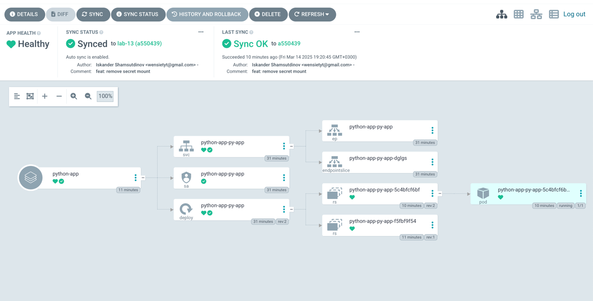
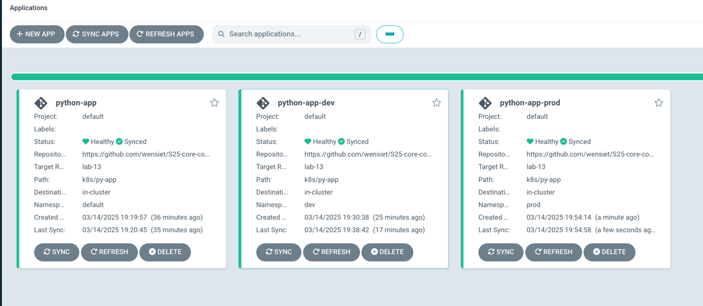
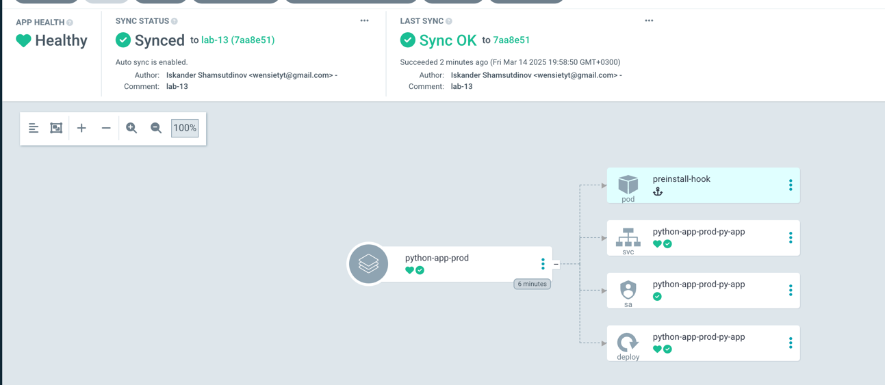

# No env deployment

Here is my app for first part of task.



# Env deployments

Here are two apps:



## Test 1

Pods before

```bash
➜  k8s git:(lab-13) ✗ kubectl get pods -n prod
NAME                                     READY   STATUS    RESTARTS   AGE
python-app-prod-py-app-84f488b7f-g5hxs   1/1     Running   0          110s
```

Patching deployment

```bash
➜  k8s git:(lab-13) ✗ k patch deployment python-app-prod-py-app -n prod --patch '{"spec":{"replicas": 3}}'
deployment.apps/python-app-prod-py-app patched
➜  k8s git:(lab-13) ✗ kubectl get pods -n prod
NAME                                     READY   STATUS    RESTARTS   AGE
python-app-prod-py-app-84f488b7f-7k9qb   1/1     Running   0          5s
python-app-prod-py-app-84f488b7f-b7rc7   1/1     Running   0          5s
python-app-prod-py-app-84f488b7f-g5hxs   1/1     Running   0          2m57s
```

Pods after sync

```bash
➜  k8s git:(lab-13) ✗ kubectl get pods -n prod
NAME                                     READY   STATUS    RESTARTS   AGE
python-app-prod-py-app-84f488b7f-g5hxs   1/1     Running   0          4m42s
```

App after sync
