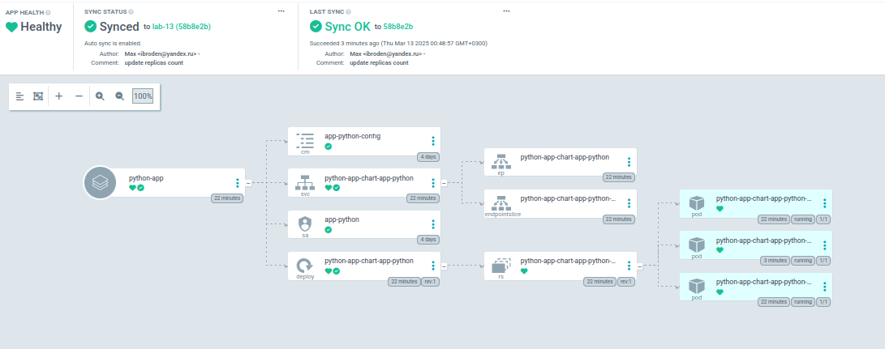

# ArgoCD

```bash

get actual service name

kubectl get svc -n argocd
NAME                                    TYPE        CLUSTER-IP       EXTERNAL-IP   PORT(S)             AGE
argo-argocd-applicationset-controller   ClusterIP   10.108.203.238   <none>        7000/TCP            22m
argo-argocd-dex-server                  ClusterIP   10.105.162.36    <none>        5556/TCP,5557/TCP   22m
argo-argocd-redis                       ClusterIP   10.98.102.101    <none>        6379/TCP            22m
argo-argocd-repo-server                 ClusterIP   10.107.79.248    <none>        8081/TCP            22m
argo-argocd-server                      ClusterIP   10.97.212.74     <none>        80/TCP,443/TCP      22m

provide it here

$ kubectl port-forward svc/argo-argocd-server -n argocd 8089:443
Forwarding from 127.0.0.1:8089 -> 8080
Forwarding from [::1]:8089 -> 8080

$ kubectl -n argocd get secret argocd-initial-admin-secret -o jsonpath="{.data.password}" | base64 --decode
toAJxIGpHORL41MO

~$ argocd login localhost:8089 --insecure
Username: admin
Password: toAJxIGpHORL41MO

'admin:login' logged in successfully
Context 'localhost:8089' updated


$ kubectl apply -f ArgoCD/argocd-python-app.yaml
application.argoproj.io/python-app created


max@max-Processor:~/vscdir/S25-core-course-labs/k8s$ argocd app sync python-app
TIMESTAMP                  GROUP        KIND       NAMESPACE                  NAME           STATUS   HEALTH            HOOK  MESSAGE
2025-03-13T00:30:10+03:00          ConfigMap         default     app-python-config           Synced
2025-03-13T00:30:10+03:00            Service         default  python-app-chart-app-python    Synced  Healthy
2025-03-13T00:30:10+03:00         ServiceAccount     default            app-python           Synced
2025-03-13T00:30:10+03:00   apps  Deployment         default  python-app-chart-app-python    Synced  Progressing
2025-03-13T00:30:11+03:00         ServiceAccount     default            app-python           Synced                           serviceaccount/app-python unchanged
2025-03-13T00:30:11+03:00          ConfigMap         default     app-python-config           Synced                           configmap/app-python-config unchanged
2025-03-13T00:30:11+03:00            Service         default  python-app-chart-app-python    Synced  Healthy                  service/python-app-chart-app-python unchanged
2025-03-13T00:30:11+03:00   apps  Deployment         default  python-app-chart-app-python    Synced  Progressing              deployment.apps/python-app-chart-app-python unchanged

Name:               argocd/python-app
Project:            default
Server:             https://kubernetes.default.svc
Namespace:          default
URL:                https://argocd.example.com/applications/python-app
Source:
- Repo:             https://github.com/Processor228/S25-core-course-labs.git
  Target:           lab-13
  Path:             k8s/chart-app-python
  Helm Values:      values.yaml
SyncWindow:         Sync Allowed
Sync Policy:        Automated
Sync Status:        Synced to lab-13 (c9844a7)
Health Status:      Progressing

Operation:          Sync
Sync Revision:      c9844a7be9552d8a3cb2cccbc99db61c2ed33e0a
Phase:              Succeeded
Start:              2025-03-13 00:30:10 +0300 MSK
Finished:           2025-03-13 00:30:10 +0300 MSK
Duration:           0s
Message:            successfully synced (all tasks run)

GROUP  KIND            NAMESPACE  NAME                         STATUS  HEALTH       HOOK  MESSAGE
       ServiceAccount  default    app-python                   Synced                     serviceaccount/app-python unchanged
       ConfigMap       default    app-python-config            Synced                     configmap/app-python-config unchanged
       Service         default    python-app-chart-app-python  Synced  Healthy            service/python-app-chart-app-python unchanged
apps   Deployment      default    python-app-chart-app-python  Synced  Progressing        deployment.apps/python-app-chart-app-python unchanged
```

when updating the replica count, i get to see this:



## Part 2

```bash
$ kubectl create namespace dev
namespace/dev created

$ kubectl create namespace prod
namespace/prod created
```
