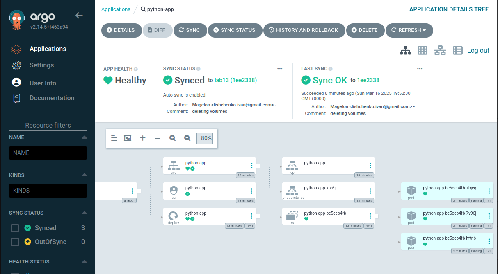
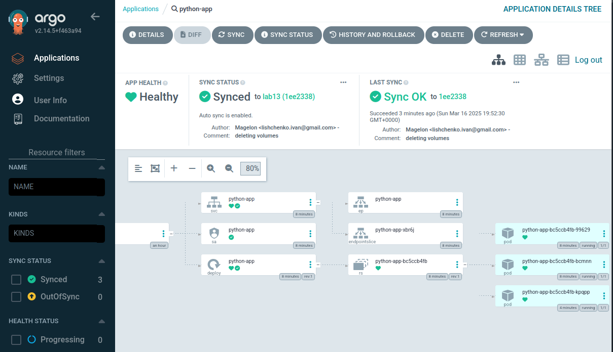

```bash
argocd app sync python-app
```
```bash
TIMESTAMP                  GROUP        KIND       NAMESPACE                  NAME    STATUS   HEALTH            HOOK  MESSAGE
2025-03-16T18:33:25+00:00          ConfigMap         default                config    Synced                           
2025-03-16T18:33:25+00:00            Service         default            python-app    Synced  Healthy                  
2025-03-16T18:33:25+00:00         ServiceAccount     default            python-app    Synced                           
2025-03-16T18:33:25+00:00   apps  Deployment         default            python-app    Synced  Progressing              
2025-03-16T18:33:27+00:00         ServiceAccount     default            python-app    Synced                           serviceaccount/python-app unchanged
2025-03-16T18:33:27+00:00          ConfigMap         default                config    Synced                           configmap/config unchanged
2025-03-16T18:33:27+00:00            Service         default            python-app    Synced  Healthy                  service/python-app unchanged
2025-03-16T18:33:27+00:00   apps  Deployment         default            python-app    Synced  Progressing              deployment.apps/python-app configured

Name:               argocd/python-app
Project:            default
Server:             https://kubernetes.default.svc
Namespace:          default
URL:                https://argocd.example.com/applications/python-app
Source:
- Repo:             https://github.com/Magel0n/S25-core-course-labs.git
  Target:           lab13
  Path:             k8s/python-app
  Helm Values:      values.yaml
SyncWindow:         Sync Allowed
Sync Policy:        Automated
Sync Status:        Synced to lab13 (63fbd84)
Health Status:      Progressing

Operation:          Sync
Sync Revision:      63fbd84c6cbdab7b528588f36bca9d795457e4ee
Phase:              Succeeded
Start:              2025-03-16 18:33:23 +0000 UTC
Finished:           2025-03-16 18:33:27 +0000 UTC
Duration:           4s
Message:            successfully synced (all tasks run)

GROUP  KIND            NAMESPACE  NAME        STATUS  HEALTH       HOOK  MESSAGE
       ServiceAccount  default    python-app  Synced                     serviceaccount/python-app unchanged
       ConfigMap       default    config      Synced                     configmap/config unchanged
       Service         default    python-app  Synced  Healthy            service/python-app unchanged
apps   Deployment      default    python-app  Synced  Progressing        deployment.apps/python-app configured
```

```bash
argocd app get python-app
```
```bash
Name:               argocd/python-app
Project:            default
Server:             https://kubernetes.default.svc
Namespace:          default
URL:                https://argocd.example.com/applications/python-app
Source:
- Repo:             https://github.com/Magel0n/S25-core-course-labs.git
  Target:           lab13
  Path:             k8s/python-app
  Helm Values:      values.yaml
SyncWindow:         Sync Allowed
Sync Policy:        Automated
Sync Status:        Synced to lab13 (63fbd84)
Health Status:      Healthy

GROUP  KIND            NAMESPACE  NAME        STATUS  HEALTH   HOOK  MESSAGE
       ServiceAccount  default    python-app  Synced                 serviceaccount/python-app unchanged
       ConfigMap       default    config      Synced                 configmap/config unchanged
       Service         default    python-app  Synced  Healthy        service/python-app unchanged
apps   Deployment      default    python-app  Synced  Healthy        deployment.apps/python-app configured
```

```bash
kubectl get po
```
```bash
NAME                          READY   STATUS    RESTARTS   AGE
python-app-7db4b5c56b-cmd8h   1/1     Running   0          4m45s
```

So, Argo works really well, now to change the replicaCount

```bash
argocd app get python-app
```
```bash
Name:               argocd/python-app
Project:            default
Server:             https://kubernetes.default.svc
Namespace:          default
URL:                https://argocd.example.com/applications/python-app
Source:
- Repo:             https://github.com/Magel0n/S25-core-course-labs.git
  Target:           lab13
  Path:             k8s/python-app
  Helm Values:      values.yaml
SyncWindow:         Sync Allowed
Sync Policy:        Automated
Sync Status:        Synced to lab13 (2b5d5f4)
Health Status:      Healthy

GROUP  KIND            NAMESPACE  NAME        STATUS  HEALTH   HOOK  MESSAGE
       ServiceAccount  default    python-app  Synced                 serviceaccount/python-app unchanged
       ConfigMap       default    config      Synced                 configmap/config unchanged
       Service         default    python-app  Synced  Healthy        service/python-app unchanged
apps   Deployment      default    python-app  Synced  Healthy        deployment.apps/python-app configured
```

```bash
kubectl get po
```
```bash
NAME                          READY   STATUS    RESTARTS   AGE
python-app-7db4b5c56b-58cn9   1/1     Running   0          85s
python-app-7db4b5c56b-cmd8h   1/1     Running   0          19m
python-app-7db4b5c56b-np48l   1/1     Running   0          85s
```

So, yes, the changes are affecting

## Tests:
After adding the prod and dev (deleted everything unnecessary in the process), here is what I have
```bash
kubectl get po -n prod
```
```bash
NAME                         READY   STATUS    RESTARTS   AGE
python-app-bc5ccb4fb-99629   1/1     Running   0          38s
python-app-bc5ccb4fb-bcmnn   1/1     Running   0          38s
python-app-bc5ccb4fb-w6gkj   1/1     Running   0          38s
```
Now I delete
```bash
kubectl patch deployment python-app -n prod --patch '{"spec":{"replicas": 2}}'
```
```bash
deployment.apps/python-app patched
```
And I get
```bash
kubectl get po -n prod
```
```bash
NAME                         READY   STATUS        RESTARTS   AGE
python-app-bc5ccb4fb-99629   1/1     Running       0          3m22s
python-app-bc5ccb4fb-bcmnn   1/1     Running       0          3m22s
python-app-bc5ccb4fb-w6gkj   1/1     Terminating   0          3m22s
```
After some waiting
```bash
kubectl get po -n prod
```
```bash
NAME                         READY   STATUS    RESTARTS   AGE
python-app-bc5ccb4fb-99629   1/1     Running   0          3m45s
python-app-bc5ccb4fb-bcmnn   1/1     Running   0          3m45s
```

So now I sync
```bash
argocd app sync python-app --prune
```bash
TIMESTAMP                  GROUP        KIND       NAMESPACE                  NAME    STATUS    HEALTH        HOOK  MESSAGE
2025-03-16T19:52:28+00:00   apps  Deployment            prod            python-app    Synced   Healthy              
2025-03-16T19:52:28+00:00            Service         default            python-app  OutOfSync  Healthy              
2025-03-16T19:52:28+00:00            Service            prod            python-app    Synced   Healthy              
2025-03-16T19:52:28+00:00         ServiceAccount     default            python-app  OutOfSync                       
2025-03-16T19:52:28+00:00         ServiceAccount        prod            python-app    Synced                        
2025-03-16T19:52:28+00:00   apps  Deployment         default            python-app  OutOfSync  Healthy              
2025-03-16T19:52:29+00:00            Service         default            python-app  OutOfSync  Progressing              
2025-03-16T19:52:29+00:00         ServiceAccount     default            python-app  OutOfSync  Progressing              
2025-03-16T19:52:29+00:00   apps  Deployment         default            python-app  OutOfSync  Progressing              
2025-03-16T19:52:30+00:00   apps  Deployment         default            python-app  OutOfSync  Progressing              pruned
2025-03-16T19:52:30+00:00         ServiceAccount        prod            python-app    Synced                            serviceaccount/python-app unchanged
2025-03-16T19:52:30+00:00            Service            prod            python-app    Synced   Healthy                  service/python-app unchanged
2025-03-16T19:52:30+00:00   apps  Deployment            prod            python-app    Synced   Healthy                  deployment.apps/python-app configured
2025-03-16T19:52:30+00:00            Service         default            python-app  Succeeded   Pruned                  pruned
2025-03-16T19:52:30+00:00         ServiceAccount     default            python-app  Succeeded   Pruned                  pruned

Name:               argocd/python-app
Project:            default
Server:             https://kubernetes.default.svc
Namespace:          prod
URL:                https://argocd.example.com/applications/python-app
Source:
- Repo:             https://github.com/Magel0n/S25-core-course-labs.git
  Target:           lab13
  Path:             k8s/python-app
  Helm Values:      values-prod.yaml
SyncWindow:         Sync Allowed
Sync Policy:        Automated
Sync Status:        OutOfSync from lab13 (1ee2338)
Health Status:      Progressing

Operation:          Sync
Sync Revision:      1ee23389ce18d8db59f832d35e881f4282a363cc
Phase:              Succeeded
Start:              2025-03-16 19:52:28 +0000 UTC
Finished:           2025-03-16 19:52:30 +0000 UTC
Duration:           2s
Message:            successfully synced (all tasks run)

GROUP  KIND            NAMESPACE  NAME        STATUS     HEALTH       HOOK  MESSAGE
       Service         default    python-app  Succeeded  Pruned             pruned
       ServiceAccount  default    python-app  Succeeded  Pruned             pruned
apps   Deployment      default    python-app  OutOfSync  Progressing        pruned
       ServiceAccount  prod       python-app  Synced                        serviceaccount/python-app unchanged
       Service         prod       python-app  Synced     Healthy            service/python-app unchanged
apps   Deployment      prod       python-app  Synced     Healthy            deployment.apps/python-app configured
```

And I get
```bash
kubectl get po -n prod
```
```bash
NAME                         READY   STATUS    RESTARTS   AGE
python-app-bc5ccb4fb-99629   1/1     Running   0          4m53s
python-app-bc5ccb4fb-bcmnn   1/1     Running   0          4m53s
python-app-bc5ccb4fb-kpqpp   1/1     Running   0          22s
```
Here is what is in the ArgoCD UI


## Test 2

```bash
kubectl delete pod -n prod -l app.kubernetes.io/name=python-app
```
```bash
pod "python-app-bc5ccb4fb-99629" deleted
pod "python-app-bc5ccb4fb-bcmnn" deleted
pod "python-app-bc5ccb4fb-kpqpp" deleted
```
```bash
kubectl get pods -n prod -w
```
```bash
NAME                         READY   STATUS              RESTARTS   AGE
python-app-bc5ccb4fb-7bjcq   0/1     ContainerCreating   0          8s
python-app-bc5ccb4fb-7v2q8   1/1     Terminating         0          2m20s
python-app-bc5ccb4fb-7v96j   0/1     ContainerCreating   0          8s
python-app-bc5ccb4fb-bwdqb   1/1     Terminating         0          2m20s
python-app-bc5ccb4fb-dtrdk   1/1     Terminating         0          2m20s
python-app-bc5ccb4fb-hftnb   0/1     ContainerCreating   0          9s
```

```bash
argocd app diff python-app-prod
```
(Nothing was there)


## Explanation

ArgoCD simply checks the repo and compares it with the current application, but does so at certain time intervals, thus
meaning that before the sync the configuration may be out of date and app functionality may be hindered. 
Once the sync has occurred the ArgoCD restores the initial configuration.

When I try to delete a resource manually, k8s notices that and starts creating new ones 
(I even had to retry test 2 since by the time I tried to view the 3 dying and 3 creating pods, it already finished).

ArgoCD wasn't touched in this process, I had it on the previous labs, too (and it's really nice).
