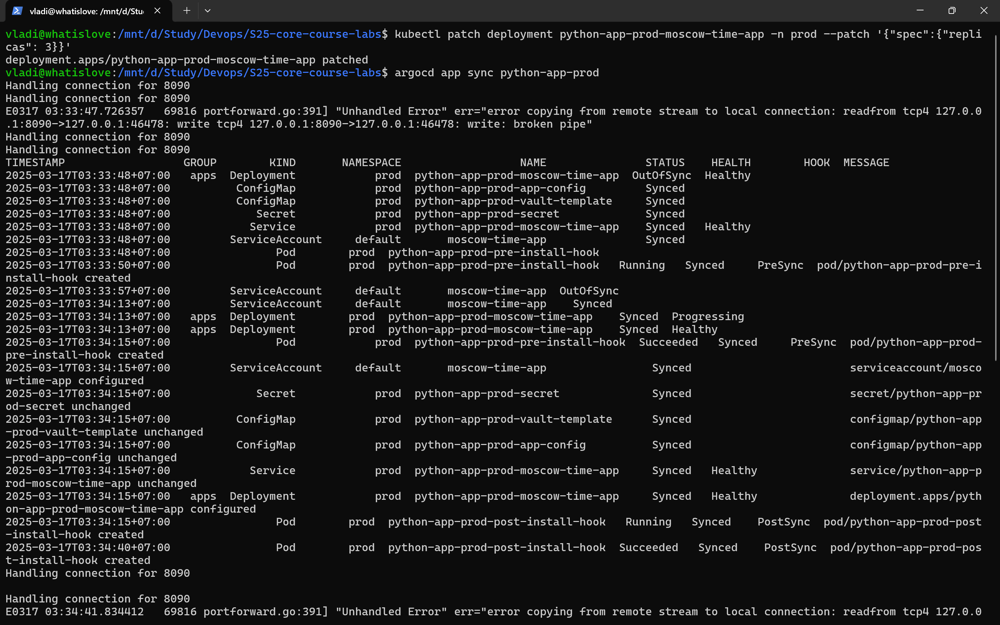
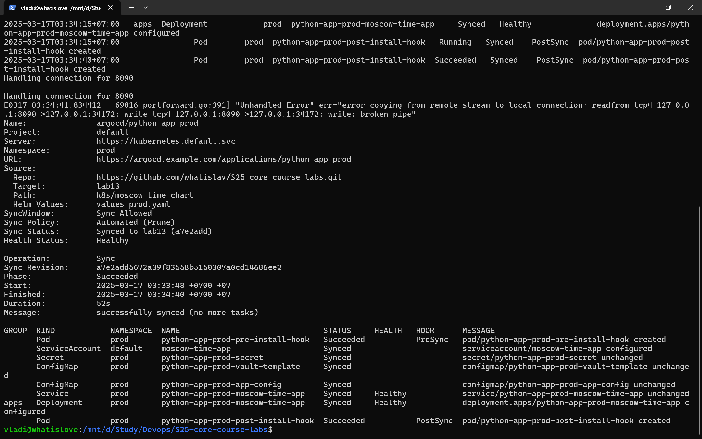
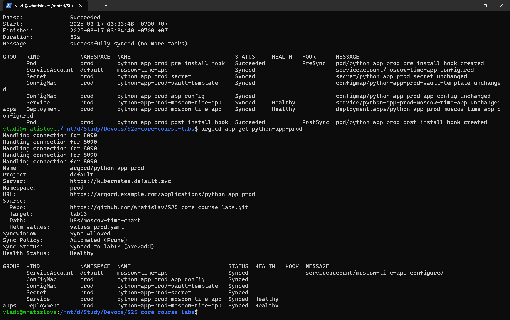
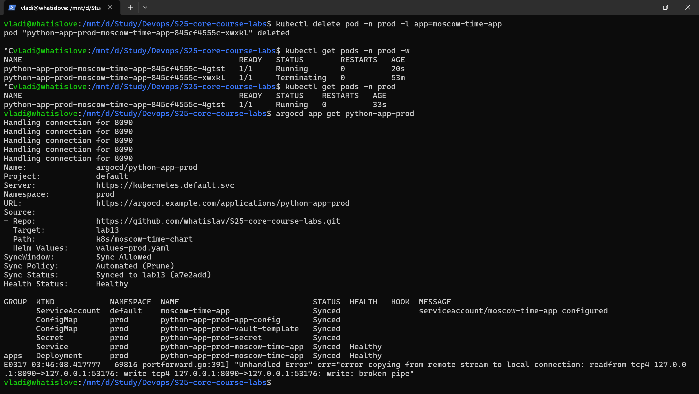

# Lab 13

## Test 1

 

## Test 2

Before pod deletion:

kubectl get pods -n prod

NAME                                               READY   STATUS    RESTARTS   AGE
python-app-prod-moscow-time-app-845cf4555c-xwxkl   1/1     Running   0          48m

After pod deletion:

kubectl get pods -n prod

NAME                                               READY   STATUS    RESTARTS   AGE
python-app-prod-moscow-time-app-845cf4555c-4gtst   1/1     Running   0          33s

