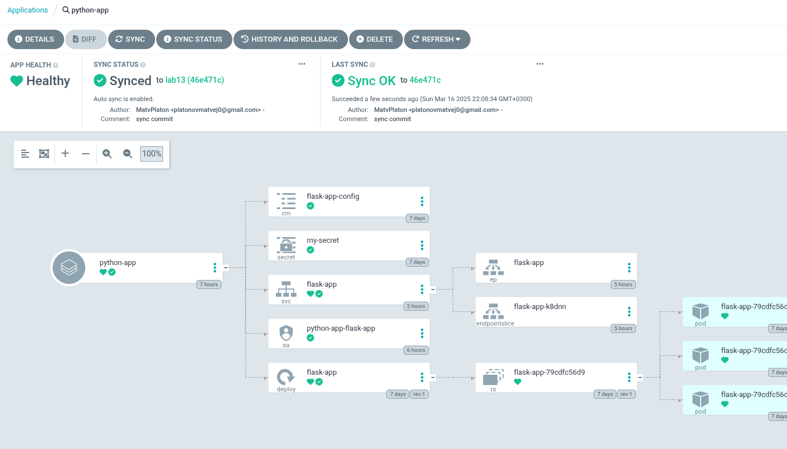
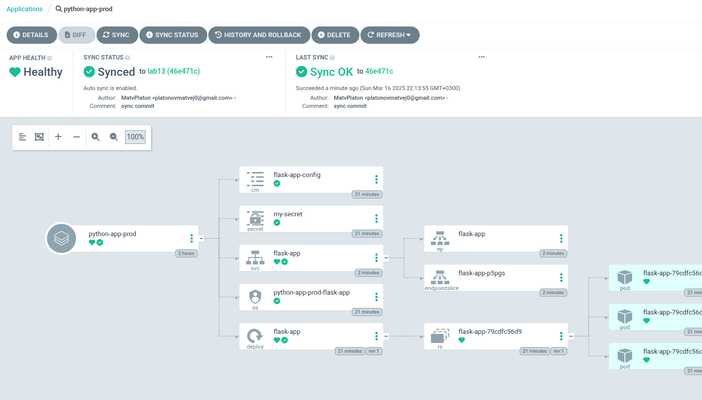
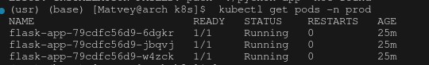

# Argo UI results

# ouput of command in terminal

# ArgoCD Configuration Drift vs Runtime Events

## Configuration Drift

- **Definition**: Configuration drift occurs when the actual state of a deployed application diverges from its desired state defined in Git. This can happen due to manual changes made directly to the Kubernetes cluster or other untracked modifications.
  
- **Detection**: ArgoCD continuously monitors the state of applications deployed in clusters against the configurations stored in Git. It performs this comparison through synchronization and health checks on a scheduled basis or in real-time.

- **Management**: When drift is detected, ArgoCD provides several options to manage it:
  - **Sync**: Users can manually synchronize the application with the desired state defined in Git, reverting any unintended changes.
  - **Auto-Sync**: If enabled, ArgoCD can automatically synchronize the application whenever a drift is detected, ensuring that the deployed state matches the Git repository.
  - **Notifications**: ArgoCD can send alerts to notify users of any drift, allowing them to review changes before automatic actions are taken.

## Runtime Events

- **Definition**: Runtime events refer to occurrences or changes that happen while the application is running, such as scaling operations, pod restarts, or resource usage fluctuations.

- **Handling**: ArgoCD does not directly manage these runtime events, as its primary focus is on managing the desired state. However, it indirectly responds to these events:
  - **K8s Integration**: Since ArgoCD is built on top of Kubernetes, it relies fundamentally on Kubernetes mechanisms to manage pods, deployments, and services. It cannot prevent Kubernetes from executing runtime events, like scaling up/down based on load.
  - **Observability**: ArgoCD displays the health and status of applications, which includes information about the current running state of the application as reported by Kubernetes. This helps users understand how runtime events might affect the overall application performance or stability.

- **Interaction with Drift**: While runtime events do not directly trigger a drift state, they can lead to successful transitions or disruptions in the application. If runtime events cause the state of the application to deviate from the intended configuration, ArgoCD's drift detection mechanisms will notice this inconsistency.

## Conclusion

In summary, ArgoCD effectively manages configuration drift by continuously monitoring and allowing for quick remediation actions, while embracing the Kubernetes ecosystem for handling runtime events. The focus on desired application state through a GitOps approach ensures that any deviations are promptly addressed, providing a reliable mechanism for maintaining application stability and consistency in Kubernetes environments.
