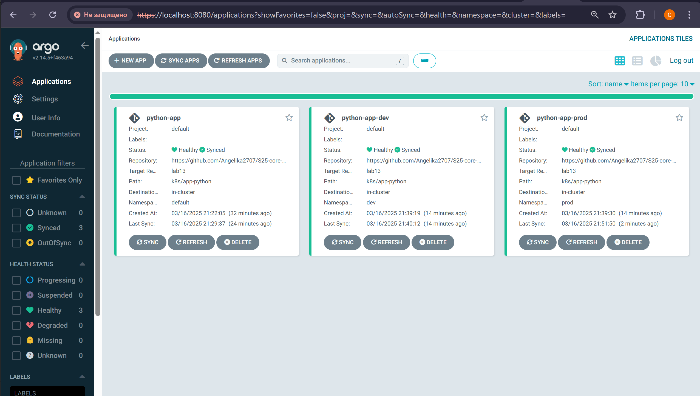
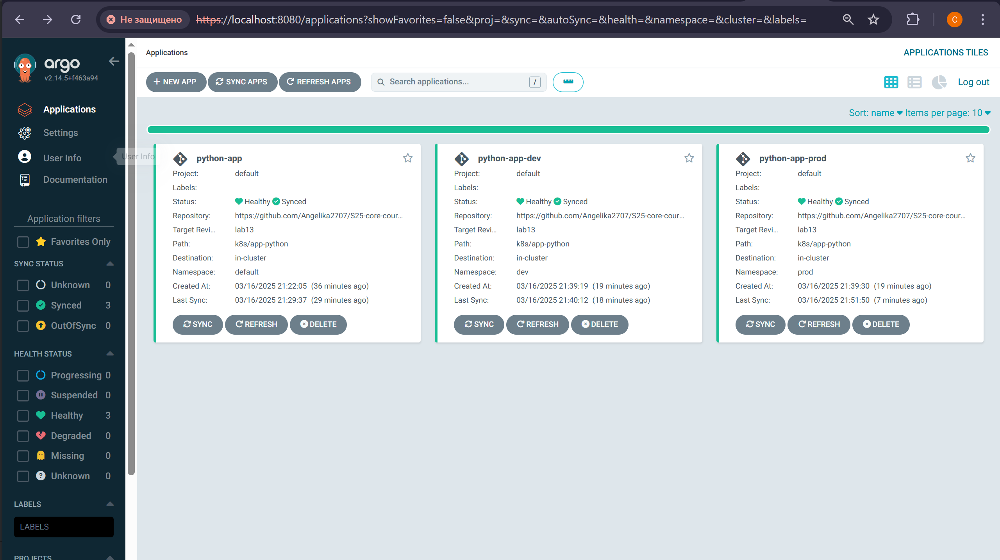
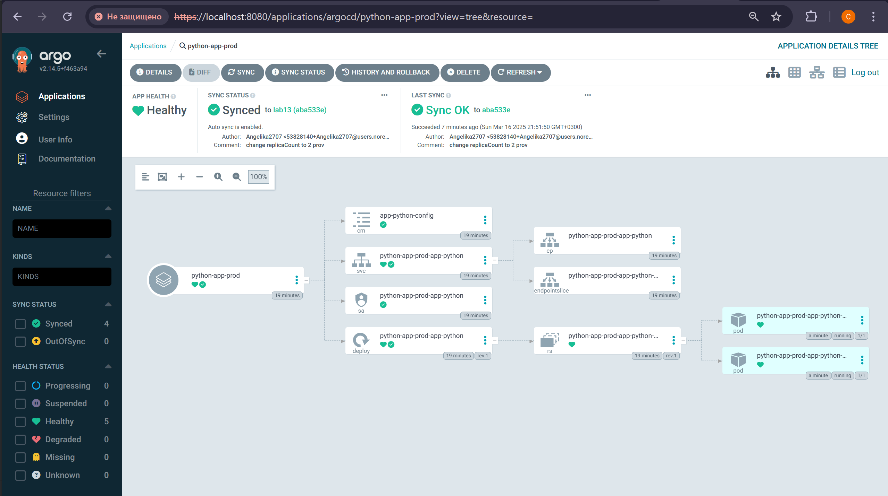

# Lab 13: ArgoCD for GitOps Deployment

## Task 1: Deploy and Configure ArgoCD

### Add the ArgoCD Helm repository
```bash
helm repo add argo https://argoproj.github.io/argo-helm
"argo" has been added to your repositories
```
### Install ArgoCD
```bash
helm install argo argo/argo-cd --namespace argocd --create-namespace
NAME: argo
LAST DEPLOYED: Sun Mar 16 15:34:54 2025
NAMESPACE: argocd
STATUS: deployed
REVISION: 1
TEST SUITE: None
NOTES:
In order to access the server UI you have the following options:

1. kubectl port-forward service/argo-argocd-server -n argocd 8080:443

    and then open the browser on http://localhost:8080 and accept the certificate

2. enable ingress in the values file `server.ingress.enabled` and either
      - Add the annotation for ssl passthrough: https://argo-cd.readthedocs.io/en/stable/operator-manual/ingress/#option-1-ssl-passthrough
      - Set the `configs.params."server.insecure"` in the values file and terminate SSL at your ingress: https://argo-cd.readthedocs.io/en/stable/operator-manual/ingress/#option-2-multiple-ingress-objects-and-hosts


After reaching the UI the first time you can login with username: admin and the random password generated during the installation. You can find the password by running:

kubectl -n argocd get secret argocd-initial-admin-secret -o jsonpath="{.data.password}" | base64 -d

(You should delete the initial secret afterwards as suggested by the Getting Started Guide: https://argo-cd.readthedocs.io/en/stable/getting_started/#4-login-using-the-cli)
```

### Verify installation
```bash
kubectl wait --for=condition=ready pod -l app.kubernetes.io/name=argocd-server -n argocd --timeout=90s
pod/argo-argocd-server-7b688c6d85-lsk7s condition met
```

## Install ArgoCD CLI

### Install the ArgoCD CLI 

```bash
choco install argocd-cli
Chocolatey v2.3.0
Installing the following packages:
argocd-cli
By installing, you accept licenses for the packages.
Downloading package from source 'https://community.chocolatey.org/api/v2/'
Progress: Downloading argocd-cli 2.14.5... 100%

argocd-cli v2.14.5 [Approved]
argocd-cli package files install completed. Performing other installation steps.
The package argocd-cli wants to run 'chocolateyinstall.ps1'.
Note: If you don't run this script, the installation will fail.
Note: To confirm automatically next time, use '-y' or consider:
choco feature enable -n allowGlobalConfirmation
Do you want to run the script?([Y]es/[A]ll - yes to all/[N]o/[P]rint): A

Environment Vars (like PATH) have changed. Close/reopen your shell to
 see the changes (or in powershell/cmd.exe just type `refreshenv`).
 ShimGen has successfully created a shim for argocd.exe
 The install of argocd-cli was successful.
  Software install location not explicitly set, it could be in package or
  default install location of installer.

Chocolatey installed 1/1 packages.
 See the log for details (C:\ProgramData\chocolatey\logs\chocolatey.log).
```

### Verify CLI installation

```bash
argocd version
argocd: v2.14.5+f463a94
  BuildDate: 2025-03-11T03:40:10Z
  GitCommit: f463a945d57267e9691cede37021d9ddc5994f36
  GitTreeState: clean
  GoVersion: go1.23.3
  Compiler: gc
  Platform: windows/amd64
time="2025-03-16T16:11:44+03:00" level=fatal msg="Argo CD server address unspecified"
```

## Access the ArgoCD UI

### Forward the ArgoCD server port

```bash
kubectl port-forward svc/argo-argocd-server -n argocd 8080:443 &
[1] 1413
Forwarding from 127.0.0.1:8080 -> 8080
Forwarding from [::1]:8080 -> 8080
```
 ### Retrive password
```bash
kubectl -n argocd get secret argocd-initial-admin-secret -o jsonpath="{.data.password}" | base64 --decode
D1Vdfh0kfHykW6iI
```

### Log in
```bash
argocd login localhost:8080 --insecure
Username: admin
Password:
'admin:login' logged in successfully
Context 'localhost:8080' updated
```

## Configure Python App Sync

```bash
kubectl apply -f ArgoCD/argocd-python-app.yaml
application.argoproj.io/python-app created
```
```bash
argocd app sync python-app
TIMESTAMP                  GROUP        KIND       NAMESPACE                  NAME     STATUS   HEALTH        HOOK  MESSAGE
2025-03-16T21:22:57+03:00   apps  Deployment         default  python-app-app-python    Synced  Healthy
2025-03-16T21:22:57+03:00          ConfigMap         default     app-python-config     Synced
2025-03-16T21:22:57+03:00                Pod         default       preinstall-hook
2025-03-16T21:22:57+03:00            Service         default  python-app-app-python    Synced  Healthy
2025-03-16T21:22:57+03:00         ServiceAccount     default  python-app-app-python    Synced
2025-03-16T21:22:59+03:00                Pod     default       preinstall-hook   Running   Synced     PreSync  pod/preinstall-hook created
2025-03-16T21:23:21+03:00                Pod         default       preinstall-hook   Succeeded   Synced     PreSync  pod/preinstall-hook created
2025-03-16T21:23:21+03:00         ServiceAccount     default  python-app-app-python    Synced                        serviceaccount/python-app-app-python unchanged
2025-03-16T21:23:21+03:00          ConfigMap         default     app-python-config     Synced                        configmap/app-python-config unchanged
2025-03-16T21:23:21+03:00            Service         default  python-app-app-python    Synced   Healthy              service/python-app-app-python unchanged
2025-03-16T21:23:21+03:00   apps  Deployment         default  python-app-app-python    Synced   Healthy              deployment.apps/python-app-app-python configured
2025-03-16T21:23:21+03:00                Pod     default      postinstall-hook   Running   Synced    PostSync  pod/postinstall-hook created
2025-03-16T21:23:42+03:00                Pod     default      postinstall-hook  Succeeded   Synced    PostSync  pod/postinstall-hook created

Name:               argocd/python-app
Project:            default
Server:             https://kubernetes.default.svc
Namespace:          default
URL:                https://argocd.example.com/applications/python-app
Source:
- Repo:             https://github.com/Angelika2707/S25-core-course-labs.git
  Target:           lab13
  Path:             k8s/app-python
  Helm Values:      values.yaml
SyncWindow:         Sync Allowed
Sync Policy:        Automated
Sync Status:        Synced to lab13 (7f6440a)
Health Status:      Healthy

Operation:          Sync
Sync Revision:      7f6440a06e4d3c4f9269f5e600dbfb3807af2a92
Phase:              Succeeded
Start:              2025-03-16 21:22:56 +0300 MSK
Finished:           2025-03-16 21:23:42 +0300 MSK
Duration:           46s
Message:            successfully synced (no more tasks)

GROUP  KIND            NAMESPACE  NAME                   STATUS     HEALTH   HOOK      MESSAGE
       Pod             default    preinstall-hook        Succeeded           PreSync   pod/preinstall-hook created
       ServiceAccount  default    python-app-app-python  Synced                        serviceaccount/python-app-app-python unchanged
       ConfigMap       default    app-python-config      Synced                        configmap/app-python-config unchanged
       Service         default    python-app-app-python  Synced     Healthy            service/python-app-app-python unchanged
apps   Deployment      default    python-app-app-python  Synced     Healthy            deployment.apps/python-app-app-python configured
       Pod             default    postinstall-hook       Succeeded           PostSync  pod/postinstall-hook created
```

```bash
argocd app get python-app
Name:               argocd/python-app
Project:            default
Server:             https://kubernetes.default.svc
Namespace:          default
URL:                https://argocd.example.com/applications/python-app
Source:
- Repo:             https://github.com/Angelika2707/S25-core-course-labs.git
  Target:           lab13
  Path:             k8s/app-python
  Helm Values:      values.yaml
SyncWindow:         Sync Allowed
Sync Policy:        Automated
Sync Status:        Synced to lab13 (7f6440a)
Health Status:      Healthy

GROUP  KIND            NAMESPACE  NAME                   STATUS     HEALTH   HOOK      MESSAGE
       Pod             default    preinstall-hook        Succeeded           PreSync   pod/preinstall-hook created
       ServiceAccount  default    python-app-app-python  Synced                        serviceaccount/python-app-app-python unchanged
       ConfigMap       default    app-python-config      Synced                        configmap/app-python-config unchanged
       Service         default    python-app-app-python  Synced     Healthy            service/python-app-app-python unchanged
apps   Deployment      default    python-app-app-python  Synced     Healthy            deployment.apps/python-app-app-python configured
       Pod             default    postinstall-hook       Succeeded           PostSync  pod/postinstall-hook created
```

### Test Sync Workflow

`replicaCount` is `2`:

```bash
argocd app get python-app
Name:               argocd/python-app
Project:            default
Server:             https://kubernetes.default.svc
Namespace:          default
URL:                https://argocd.example.com/applications/python-app
Source:
- Repo:             https://github.com/Angelika2707/S25-core-course-labs.git
  Target:           lab13
  Path:             k8s/app-python
  Helm Values:      values.yaml
SyncWindow:         Sync Allowed
Sync Policy:        Automated
Sync Status:        OutOfSync from lab13 (bf3ff42)
Health Status:      Healthy

GROUP  KIND            NAMESPACE  NAME                   STATUS     HEALTH   HOOK  MESSAGE
       ConfigMap       default    app-python-config      Synced
       Pod             default    preinstall-hook
       Service         default    python-app-app-python  Synced     Healthy
       ServiceAccount  default    python-app-app-python  Synced
apps   Deployment      default    python-app-app-python  OutOfSync  Healthy
```


Check the number of replicas:

```bash
kubectl describe deployment python-app-app-python | grep "Replicas"
Replicas:               2 desired | 2 updated | 2 total | 2 available | 0 unavailable
  Available      True    MinimumReplicasAvailable
```

# Task 2: Multi-Environment Deployment & Auto-Sync

## Deploy Multi-Environment via ArgoCD

### Create Namespaces

```bash
kubectl create namespace dev
namespace/dev created
kubectl create namespace prod
namespace/prod created
```

### Test Auto-Sync

`replicaCount: 1` in `values-prod.yaml`:
```bash
kubectl apply -f argocd/argocd-python-dev.yaml
application.argoproj.io/python-app-dev created
kubectl apply -f argocd/argocd-python-prod.yaml
application.argoproj.io/python-app-prod created
```

```bash
argocd app list
NAME                    CLUSTER                         NAMESPACE  PROJECT  STATUS  HEALTH   SYNCPOLICY  CONDITIONS  REPO                           
                           PATH            TARGET
argocd/python-app       https://kubernetes.default.svc  default    default  Synced  Healthy  Auto        <none>      https://github.com/Angelika2707/S25-core-course-labs.git  k8s/app-python  lab13
argocd/python-app-dev   https://kubernetes.default.svc  dev        default  Synced  Healthy  Auto-Prune  <none>      https://github.com/Angelika2707/S25-core-course-labs.git  k8s/app-python  lab13
argocd/python-app-prod  https://kubernetes.default.svc  prod       default  Synced  Healthy  Auto-Prune  <none>      https://github.com/Angelika2707/S25-core-course-labs.git  k8s/app-python  lab13
```

```bash
argocd app get python-app-prod
Name:               argocd/python-app-prod
Project:            default
Server:             https://kubernetes.default.svc
Namespace:          prod
URL:                https://argocd.example.com/applications/python-app-prod
Source:
- Repo:             https://github.com/Angelika2707/S25-core-course-labs.git
  Target:           lab13
  Path:             k8s/app-python
  Helm Values:      values-prod.yaml
SyncWindow:         Sync Allowed
Sync Policy:        Automated (Prune)
Sync Status:        Synced to lab13 (e50120e)
Health Status:      Healthy

GROUP  KIND            NAMESPACE  NAME                        STATUS     HEALTH   HOOK      MESSAGE
       Pod             prod       preinstall-hook             Succeeded           PreSync   pod/preinstall-hook created
       ServiceAccount  prod       python-app-prod-app-python  Synced                        serviceaccount/python-app-prod-app-python created       
       ConfigMap       prod       app-python-config           Synced                        configmap/app-python-config created
       Service         prod       python-app-prod-app-python  Synced     Healthy            service/python-app-prod-app-python created
apps   Deployment      prod       python-app-prod-app-python  Synced     Healthy            deployment.apps/python-app-prod-app-python created      
       Pod             prod       postinstall-hook            Succeeded           PostSync  pod/postinstall-hook created
```

```bash
argocd app get python-app-dev
Name:               argocd/python-app-dev
Project:            default
Server:             https://kubernetes.default.svc
Namespace:          dev
URL:                https://argocd.example.com/applications/python-app-dev
Source:
- Repo:             https://github.com/Angelika2707/S25-core-course-labs.git
  Target:           lab13
  Path:             k8s/app-python
  Helm Values:      values-dev.yaml
SyncWindow:         Sync Allowed
Sync Policy:        Automated (Prune)
Sync Status:        Synced to lab13 (e50120e)
Health Status:      Healthy

GROUP  KIND            NAMESPACE  NAME                       STATUS     HEALTH   HOOK      MESSAGE
       Pod             dev        preinstall-hook            Succeeded           PreSync   pod/preinstall-hook created
       ServiceAccount  dev        python-app-dev-app-python  Synced                        serviceaccount/python-app-dev-app-python created
       ConfigMap       dev        app-python-config          Synced                        configmap/app-python-config created
       Service         dev        python-app-dev-app-python  Synced     Healthy            service/python-app-dev-app-python created
apps   Deployment      dev        python-app-dev-app-python  Synced     Healthy            deployment.apps/python-app-dev-app-python created        
       Pod             dev        postinstall-hook           Succeeded           PostSync  pod/postinstall-hook created
```

Change `replicaCount: 2` in `values-prod.yaml`:

```bash
argocd app get python-app-prod
Name:               argocd/python-app-prod
Project:            default
Server:             https://kubernetes.default.svc
Namespace:          prod
URL:                https://argocd.example.com/applications/python-app-prod
Source:
- Repo:             https://github.com/Angelika2707/S25-core-course-labs.git
  Target:           lab13
  Path:             k8s/app-python
  Helm Values:      values-prod.yaml
SyncWindow:         Sync Allowed
Sync Policy:        Automated (Prune)
Sync Status:        OutOfSync from lab13 (aba533e)
Health Status:      Healthy

GROUP  KIND            NAMESPACE  NAME                        STATUS     HEALTH   HOOK     MESSAGE
       Pod             prod       preinstall-hook             Running             PreSync  pod/preinstall-hook created
       ConfigMap       prod       app-python-config           Synced
       Service         prod       python-app-prod-app-python  Synced     Healthy
       ServiceAccount  prod       python-app-prod-app-python  Synced
apps   Deployment      prod       python-app-prod-app-python  OutOfSync  Healthy
```

## Self-Heal Testing

### Test 1: Manual Override of Replica Count

```bash
kubectl patch deployment python-app-prod-app-python -n prod --patch '{"spec": {"replicas": 3}}'
deployment.apps/python-app-prod-app-python patched

argocd app sync python-app-prod
TIMESTAMP                  GROUP        KIND       NAMESPACE                  NAME          STATUS   HEALTH        HOOK  MESSAGE
2025-03-16T21:51:06+03:00          ConfigMap            prod     app-python-config          Synced
2025-03-16T21:51:06+03:00            Service            prod  python-app-prod-app-python    Synced  Healthy
2025-03-16T21:51:06+03:00         ServiceAccount        prod  python-app-prod-app-python    Synced
2025-03-16T21:51:06+03:00   apps  Deployment            prod  python-app-prod-app-python    Synced  Healthy
2025-03-16T21:51:06+03:00                Pod        prod       preinstall-hook                                 
2025-03-16T21:51:08+03:00                Pod        prod       preinstall-hook   Running   Synced     PreSync  pod/preinstall-hook created
2025-03-16T21:51:31+03:00                Pod            prod       preinstall-hook        Succeeded   Synced     PreSync  pod/preinstall-hook created
2025-03-16T21:51:31+03:00         ServiceAccount        prod  python-app-prod-app-python    Synced                        serviceaccount/python-app-prod-app-python unchanged
2025-03-16T21:51:31+03:00          ConfigMap            prod     app-python-config          Synced                        configmap/app-python-config unchanged
2025-03-16T21:51:31+03:00            Service            prod  python-app-prod-app-python    Synced   Healthy              service/python-app-prod-app-python unchanged
2025-03-16T21:51:31+03:00   apps  Deployment            prod  python-app-prod-app-python    Synced   Healthy              deployment.apps/python-app-prod-app-python configured
2025-03-16T21:51:31+03:00                Pod        prod      postinstall-hook   Running   Synced    PostSync  pod/postinstall-hook created
2025-03-16T21:51:50+03:00                Pod        prod      postinstall-hook  Succeeded   Synced    PostSync  pod/postinstall-hook created

Name:               argocd/python-app-prod
Project:            default
Server:             https://kubernetes.default.svc
Namespace:          prod
URL:                https://argocd.example.com/applications/python-app-prod
Source:
- Repo:             https://github.com/Angelika2707/S25-core-course-labs.git
  Target:           lab13
  Path:             k8s/app-python
  Helm Values:      values-prod.yaml
SyncWindow:         Sync Allowed
Sync Policy:        Automated (Prune)
Sync Status:        Synced to lab13 (aba533e)
Health Status:      Healthy

Operation:          Sync
Sync Revision:      aba533e0fc6be1695d6f259b667f37dfa71978b0
Phase:              Succeeded
Start:              2025-03-16 21:51:06 +0300 MSK
Finished:           2025-03-16 21:51:50 +0300 MSK
Duration:           44s
Message:            successfully synced (no more tasks)

GROUP  KIND            NAMESPACE  NAME                        STATUS     HEALTH   HOOK      MESSAGE
       Pod             prod       preinstall-hook             Succeeded           PreSync   pod/preinstall-hook created
       ServiceAccount  prod       python-app-prod-app-python  Synced                        serviceaccount/python-app-prod-app-python unchanged     
       ConfigMap       prod       app-python-config           Synced                        configmap/app-python-config unchanged
       Service         prod       python-app-prod-app-python  Synced     Healthy            service/python-app-prod-app-python unchanged
apps   Deployment      prod       python-app-prod-app-python  Synced     Healthy            deployment.apps/python-app-prod-app-python configured   
       Pod             prod       postinstall-hook            Succeeded           PostSync  pod/postinstall-hook created


argocd app get python-app-prod
Name:               argocd/python-app-prod
Project:            default
Server:             https://kubernetes.default.svc
Namespace:          prod
URL:                https://argocd.example.com/applications/python-app-prod
Source:
- Repo:             https://github.com/Angelika2707/S25-core-course-labs.git
  Target:           lab13
  Path:             k8s/app-python
  Helm Values:      values-prod.yaml
SyncWindow:         Sync Allowed
Sync Policy:        Automated (Prune)
Sync Status:        Synced to lab13 (aba533e)
Health Status:      Healthy

GROUP  KIND            NAMESPACE  NAME                        STATUS     HEALTH   HOOK      MESSAGE
       Pod             prod       preinstall-hook             Succeeded           PreSync   pod/preinstall-hook created
       ServiceAccount  prod       python-app-prod-app-python  Synced                        serviceaccount/python-app-prod-app-python unchanged     
       ConfigMap       prod       app-python-config           Synced                        configmap/app-python-config unchanged
       Service         prod       python-app-prod-app-python  Synced     Healthy            service/python-app-prod-app-python unchanged
apps   Deployment      prod       python-app-prod-app-python  Synced     Healthy            deployment.apps/python-app-prod-app-python configured   
       Pod             prod       postinstall-hook            Succeeded           PostSync  pod/postinstall-hook created
```




### Test 2: Delete a Pod (Replica)

```bash
kubectl get pods -n prod
NAME                                          READY   STATUS    RESTARTS   AGE
python-app-prod-app-python-5f764df676-g7hsq   1/1     Running   0          6m58s
python-app-prod-app-python-5f764df676-gf7lg   1/1     Running   0          17m


kubectl delete pod -n prod -l app.kubernetes.io/name=app-python
pod "python-app-prod-app-python-5f764df676-g7hsq" deleted
pod "python-app-prod-app-python-5f764df676-gf7lg" deleted

kubectl get pods -n prod -w
NAME                                          READY   STATUS    RESTARTS   AGE
python-app-prod-app-python-5f764df676-bqbkb   1/1     Running   0          11s
python-app-prod-app-python-5f764df676-pf76m   1/1     Running   0          11s

argocd app diff python-app-prod


```




### Explanation of how ArgoCD handles configuration drift vs. runtime events

ArgoCD implements a GitOps strategy for managing Kubernetes resources. It continuously monitors the configuration 
stored in git. This process ensures that the live cluster remains in sync with the desired state.

**Configuration Drift:** This occurs when the actual state of the cluster differs from the planned configuration. 
When ArgoCD notices this, it automatically updates the cluster to return it to the desired state.  
**Runtime Events:**  Events like pod deletions do not change the intended configuration because Kubernetes automatically 
recreates the pods to maintain the correct number of replicas. Therefore, ArgoCD ignores these changes and does not consider them as configuration drift.

