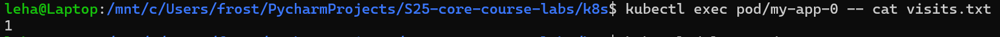
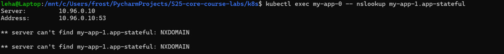

# Lab #13

---

## ArgoCD in k8s


### Correct logic in ArgoCD


### Starting application with ArgoCD

* To reduce the amount of unnecessary work, I just commented out the parts of the manifests of application
  (such as secrets and pre-install-hook)

* Also, I have problems with correctly deleting the ArgoCD deployment, then I use the next command
  to properly remove all the deprecated things:
  `kubectl patch application/APP_NAME --type json --patch='[ { "op": "remove", "path": "/metadata/finalizers" } ]' -n argocd`

```bash
catorleader@CatOrLeader:/mnt/d/Studying/S25-core-course-labs/k8s$ argocd app get python-app
Name:               argocd/python-app
Project:            default
Server:             https://kubernetes.default.svc
Namespace:          default
URL:                https://argocd.example.com/applications/python-app
Source:
- Repo:             https://github.com/CatOrLeader/S25-core-course-labs.git
  Target:           lab13
  Path:             k8s/python-app
  Helm Values:      values.yaml
SyncWindow:         Sync Allowed
Sync Policy:        Automated
Sync Status:        Synced to lab13 (b64af8e)
Health Status:      Healthy

GROUP  KIND            NAMESPACE  NAME                   STATUS     HEALTH   HOOK      MESSAGE
       ServiceAccount  default    python-app             Synced                        serviceaccount/python-app created
       ConfigMap       default    config-map-python-app  Synced                        configmap/config-map-python-app created
       Service         default    python-app             Synced     Healthy            service/python-app created
apps   Deployment      default    python-app             Synced     Healthy            deployment.apps/python-app created
       Pod             default    post-hook-python-app   Succeeded           PostSync  pod/post-hook-python-app created
catorleader@CatOrLeader:/mnt/d/Studying/S25-core-course-labs/k8s$ argocd app sync python-app
TIMESTAMP                  GROUP        KIND       NAMESPACE                  NAME     STATUS   HEALTH        HOOK  MESSAGE
2025-03-04T10:56:10+03:00         ServiceAccount     default            python-app     Synced
2025-03-04T10:56:10+03:00   apps  Deployment         default            python-app     Synced  Healthy
2025-03-04T10:56:10+03:00          ConfigMap         default  config-map-python-app    Synced
2025-03-04T10:56:10+03:00            Service         default            python-app     Synced  Healthy
2025-03-04T10:56:12+03:00         ServiceAccount     default            python-app     Synced                       serviceaccount/python-app unchanged
2025-03-04T10:56:12+03:00          ConfigMap         default  config-map-python-app    Synced                       configmap/config-map-python-app unchanged
2025-03-04T10:56:12+03:00            Service         default            python-app     Synced  Healthy              service/python-app unchanged
2025-03-04T10:56:12+03:00   apps  Deployment         default            python-app     Synced  Healthy              deployment.apps/python-app unchanged
2025-03-04T10:56:12+03:00                Pod     default  post-hook-python-app   Running   Synced    PostSync  pod/post-hook-python-app created
2025-03-04T10:56:32+03:00                Pod     default  post-hook-python-app  Succeeded   Synced    PostSync  pod/post-hook-python-app created

Name:               argocd/python-app
Project:            default
Server:             https://kubernetes.default.svc
Namespace:          default
URL:                https://argocd.example.com/applications/python-app
Source:
- Repo:             https://github.com/CatOrLeader/S25-core-course-labs.git
  Target:           lab13
  Path:             k8s/python-app
  Helm Values:      values.yaml
SyncWindow:         Sync Allowed
Sync Policy:        Automated
Sync Status:        Synced to lab13 (b64af8e)
Health Status:      Healthy

Operation:          Sync
Sync Revision:      b64af8e476e4c940b253718cf1b975037a70416d
Phase:              Succeeded
Start:              2025-03-04 10:56:10 +0300 MSK
Finished:           2025-03-04 10:56:32 +0300 MSK
Duration:           22s
Message:            successfully synced (no more tasks)

GROUP  KIND            NAMESPACE  NAME                   STATUS     HEALTH   HOOK      MESSAGE
       ServiceAccount  default    python-app             Synced                        serviceaccount/python-app unchanged
       ConfigMap       default    config-map-python-app  Synced                        configmap/config-map-python-app unchanged
       Service         default    python-app             Synced     Healthy            service/python-app unchanged
apps   Deployment      default    python-app             Synced     Healthy            deployment.apps/python-app unchanged
       Pod             default    post-hook-python-app   Succeeded           PostSync  pod/post-hook-python-app created
catorleader@CatOrLeader:/mnt/d/Studying/S25-core-course-labs/k8s$
```

### Updating application

* Then, I set the application `replicaCount` to 3, and push changes into the repository. It takes time to
  ArgoCD synchronization process (by default: 3 minutes)

* On the screenshot, you can check the sha commit value


### Additional application

* I delete hooks for the additional application and sync it using the ArgoCD

```bash
catorleader@CatOrLeader:/mnt/d/Studying/S25-core-course-labs/k8s$ kubectl -n argocd get secret argocd-initial-admin-secret -o jsonpath="{.data.password}" | base64 --decode
AD6Fqwq4b1Vz5q-Wcatorleader@CatOrLeader:/mnt/d/Studying/S25-core-course-labs/k8s$ kubectl apply -f ArgoCD/argocd-java-app.yaml
Warning: metadata.finalizers: "resources-finalizer.argocd.argoproj.io": prefer a domain-qualified finalizer name including a path (/) to avoid accidental conflicts with other finalizer writers
application.argoproj.io/java-app created
catorleader@CatOrLeader:/mnt/d/Studying/S25-core-course-labs/k8s$ argocd app sync java-app
TIMESTAMP                  GROUP        KIND       NAMESPACE                  NAME    STATUS   HEALTH        HOOK  MESSAGE
2025-03-04T11:07:38+03:00            Service         default              java-app    Synced  Healthy
2025-03-04T11:07:38+03:00         ServiceAccount     default              java-app    Synced
2025-03-04T11:07:38+03:00   apps  Deployment         default              java-app    Synced  Healthy
2025-03-04T11:07:38+03:00   apps  Deployment         default              java-app    Synced  Healthy              deployment.apps/java-app unchanged
2025-03-04T11:07:38+03:00         ServiceAccount     default              java-app    Synced                       serviceaccount/java-app unchanged
2025-03-04T11:07:38+03:00            Service         default              java-app    Synced  Healthy              service/java-app configured

Name:               argocd/java-app
Project:            default
Server:             https://kubernetes.default.svc
Namespace:          default
URL:                https://argocd.example.com/applications/java-app
Source:
- Repo:             https://github.com/CatOrLeader/S25-core-course-labs.git
  Target:           lab13
  Path:             k8s/java-app
  Helm Values:      values.yaml
SyncWindow:         Sync Allowed
Sync Policy:        Automated
Sync Status:        Synced to lab13 (7e09b0b)
Health Status:      Healthy

Operation:          Sync
Sync Revision:      7e09b0b1d468905c034d3d5f97def8f2d72a4e29
Phase:              Succeeded
Start:              2025-03-04 11:07:38 +0300 MSK
Finished:           2025-03-04 11:07:38 +0300 MSK
Duration:           0s
Message:            successfully synced (all tasks run)

GROUP  KIND            NAMESPACE  NAME      STATUS  HEALTH   HOOK  MESSAGE
       ServiceAccount  default    java-app  Synced                 serviceaccount/java-app unchanged
       Service         default    java-app  Synced  Healthy        service/java-app configured
apps   Deployment      default    java-app  Synced  Healthy        deployment.apps/java-app unchanged
catorleader@CatOrLeader:/mnt/d/Studying/S25-core-course-labs/k8s$ argocd app get java-app
Name:               argocd/java-app
Project:            default
Server:             https://kubernetes.default.svc
Namespace:          default
URL:                https://argocd.example.com/applications/java-app
Source:
- Repo:             https://github.com/CatOrLeader/S25-core-course-labs.git
  Target:           lab13
  Path:             k8s/java-app
  Helm Values:      values.yaml
SyncWindow:         Sync Allowed
Sync Policy:        Automated
Sync Status:        Synced to lab13 (7e09b0b)
Health Status:      Healthy

GROUP  KIND            NAMESPACE  NAME      STATUS  HEALTH   HOOK  MESSAGE
       ServiceAccount  default    java-app  Synced                 serviceaccount/java-app unchanged
       Service         default    java-app  Synced  Healthy        service/java-app configured
apps   Deployment      default    java-app  Synced  Healthy        deployment.apps/java-app unchanged
catorleader@CatOrLeader:/mnt/d/Studying/S25-core-course-labs/k8s$
```

### ArgoCD UI




---

### Environment Isolation

```bash
catorleader@CatOrLeader:/mnt/d/Studying/S25-core-course-labs/k8s$ kubectl apply -f ArgoCD/argocd-python-dev.yaml
Warning: metadata.finalizers: "resources-finalizer.argocd.argoproj.io": prefer a domain-qualified finalizer name including a path (/) to avoid accidental conflicts with other finalizer writers
application.argoproj.io/python-app-dev created
catorleader@CatOrLeader:/mnt/d/Studying/S25-core-course-labs/k8s$ kubectl apply -f ArgoCD/argocd-python-prod.yaml
Warning: metadata.finalizers: "resources-finalizer.argocd.argoproj.io": prefer a domain-qualified finalizer name including a path (/) to avoid accidental conflicts with other finalizer writers
application.argoproj.io/python-app-prod created
catorleader@CatOrLeader:/mnt/d/Studying/S25-core-course-labs/k8s$ argocd app list
NAME                    CLUSTER                         NAMESPACE  PROJECT  STATUS  HEALTH       SYNCPOLICY  CONDITIONS  REPO                                                     PATH            TARGET
argocd/java-app         https://kubernetes.default.svc  default    default  Synced  Healthy      Auto        <none>      https://github.com/CatOrLeader/S25-core-course-labs.git  k8s/java-app    lab13
argocd/python-app       https://kubernetes.default.svc  default    default  Synced  Healthy      Auto        <none>      https://github.com/CatOrLeader/S25-core-course-labs.git  k8s/python-app  lab13
argocd/python-app-dev   https://kubernetes.default.svc  dev        default  Synced  Progressing  Auto        <none>      https://github.com/CatOrLeader/S25-core-course-labs.git  k8s/python-app  lab13
argocd/python-app-prod  https://kubernetes.default.svc  prod       default  Synced  Healthy      Auto        <none>      https://github.com/CatOrLeader/S25-core-course-labs.git  k8s/python-app  lab13
catorleader@CatOrLeader:/mnt/d/Studying/S25-core-course-labs/k8s$ argocd app sync python-app-dev
TIMESTAMP                  GROUP        KIND       NAMESPACE                  NAME     STATUS   HEALTH        HOOK  MESSAGE
2025-03-04T11:21:51+03:00          ConfigMap             dev  config-map-python-app    Synced
2025-03-04T11:21:51+03:00            Service             dev        python-app-dev     Synced  Healthy
2025-03-04T11:21:51+03:00         ServiceAccount         dev        python-app-dev     Synced
2025-03-04T11:21:51+03:00   apps  Deployment             dev        python-app-dev     Synced  Healthy
2025-03-04T11:21:54+03:00         ServiceAccount         dev        python-app-dev     Synced                       serviceaccount/python-app-dev unchanged
2025-03-04T11:21:54+03:00          ConfigMap             dev  config-map-python-app    Synced                       configmap/config-map-python-app unchanged
2025-03-04T11:21:54+03:00            Service             dev        python-app-dev     Synced  Healthy              service/python-app-dev unchanged
2025-03-04T11:21:54+03:00   apps  Deployment             dev        python-app-dev     Synced  Healthy              deployment.apps/python-app-dev unchanged
2025-03-04T11:21:54+03:00                Pod         dev  post-hook-python-app   Running   Synced    PostSync  pod/post-hook-python-app created
2025-03-04T11:22:14+03:00                Pod         dev  post-hook-python-app  Succeeded   Synced    PostSync  pod/post-hook-python-app created

Name:               argocd/python-app-dev
Project:            default
Server:             https://kubernetes.default.svc
Namespace:          dev
URL:                https://argocd.example.com/applications/python-app-dev
Source:
- Repo:             https://github.com/CatOrLeader/S25-core-course-labs.git
  Target:           lab13
  Path:             k8s/python-app
  Helm Values:      values-dev.yaml
SyncWindow:         Sync Allowed
Sync Policy:        Automated
Sync Status:        Synced to lab13 (d43773f)
Health Status:      Healthy

Operation:          Sync
Sync Revision:      d43773f6c628f0700b9ff41be3c089aff33e5889
Phase:              Succeeded
Start:              2025-03-04 11:21:51 +0300 MSK
Finished:           2025-03-04 11:22:14 +0300 MSK
Duration:           23s
Message:            successfully synced (no more tasks)

GROUP  KIND            NAMESPACE  NAME                   STATUS     HEALTH   HOOK      MESSAGE
       ServiceAccount  dev        python-app-dev         Synced                        serviceaccount/python-app-dev unchanged
       ConfigMap       dev        config-map-python-app  Synced                        configmap/config-map-python-app unchanged
       Service         dev        python-app-dev         Synced     Healthy            service/python-app-dev unchanged
apps   Deployment      dev        python-app-dev         Synced     Healthy            deployment.apps/python-app-dev unchanged
       Pod             dev        post-hook-python-app   Succeeded           PostSync  pod/post-hook-python-app created
catorleader@CatOrLeader:/mnt/d/Studying/S25-core-course-labs/k8s$ argocd app sync python-app-prod
TIMESTAMP                  GROUP        KIND       NAMESPACE                  NAME     STATUS   HEALTH        HOOK  MESSAGE
2025-03-04T11:22:24+03:00            Service            prod       python-app-prod     Synced  Healthy
2025-03-04T11:22:24+03:00         ServiceAccount        prod       python-app-prod     Synced
2025-03-04T11:22:24+03:00   apps  Deployment            prod       python-app-prod     Synced  Healthy
2025-03-04T11:22:24+03:00          ConfigMap            prod  config-map-python-app    Synced
2025-03-04T11:22:26+03:00         ServiceAccount        prod       python-app-prod     Synced                       serviceaccount/python-app-prod unchanged
2025-03-04T11:22:26+03:00          ConfigMap            prod  config-map-python-app    Synced                       configmap/config-map-python-app unchanged
2025-03-04T11:22:26+03:00            Service            prod       python-app-prod     Synced  Healthy              service/python-app-prod unchanged
2025-03-04T11:22:26+03:00   apps  Deployment            prod       python-app-prod     Synced  Healthy              deployment.apps/python-app-prod unchanged
2025-03-04T11:22:26+03:00                Pod        prod  post-hook-python-app   Running   Synced    PostSync  pod/post-hook-python-app created
2025-03-04T11:22:47+03:00                Pod        prod  post-hook-python-app  Succeeded   Synced    PostSync  pod/post-hook-python-app created

Name:               argocd/python-app-prod
Project:            default
Server:             https://kubernetes.default.svc
Namespace:          prod
URL:                https://argocd.example.com/applications/python-app-prod
Source:
- Repo:             https://github.com/CatOrLeader/S25-core-course-labs.git
  Target:           lab13
  Path:             k8s/python-app
  Helm Values:      values-prod.yaml
SyncWindow:         Sync Allowed
Sync Policy:        Automated
Sync Status:        Synced to lab13 (d43773f)
Health Status:      Healthy

Operation:          Sync
Sync Revision:      d43773f6c628f0700b9ff41be3c089aff33e5889
Phase:              Succeeded
Start:              2025-03-04 11:22:24 +0300 MSK
Finished:           2025-03-04 11:22:47 +0300 MSK
Duration:           23s
Message:            successfully synced (no more tasks)

GROUP  KIND            NAMESPACE  NAME                   STATUS     HEALTH   HOOK      MESSAGE
       ServiceAccount  prod       python-app-prod        Synced                        serviceaccount/python-app-prod unchanged
       ConfigMap       prod       config-map-python-app  Synced                        configmap/config-map-python-app unchanged
       Service         prod       python-app-prod        Synced     Healthy            service/python-app-prod unchanged
apps   Deployment      prod       python-app-prod        Synced     Healthy            deployment.apps/python-app-prod unchanged
       Pod             prod       post-hook-python-app   Succeeded           PostSync  pod/post-hook-python-app created
```

* Now, I change the replicas count on prod `values-prod.yml` to the single pod and push changes to the repository




### Brief overall before tests


---

### Tests

* Patch replicaCount again to the 3 using direct kubectl command

```bash
catorleader@CatOrLeader:/mnt/d/Studying/S25-core-course-labs/k8s$ kubectl patch deployment python-app-prod -n prod --patch '{"spec":{"replicas": 3}}'
deployment.apps/python-app-prod patched
catorleader@CatOrLeader:/mnt/d/Studying/S25-core-course-labs/k8s$ argocd app sync python-app-prod
TIMESTAMP                  GROUP        KIND       NAMESPACE                  NAME     STATUS    HEALTH        HOOK  MESSAGE
2025-03-04T11:26:58+03:00          ConfigMap            prod  config-map-python-app    Synced
2025-03-04T11:26:58+03:00            Service            prod       python-app-prod     Synced   Healthy
2025-03-04T11:26:58+03:00         ServiceAccount        prod       python-app-prod     Synced
2025-03-04T11:26:58+03:00   apps  Deployment            prod       python-app-prod   OutOfSync  Healthy
2025-03-04T11:26:59+03:00   apps  Deployment        prod       python-app-prod    Synced  Progressing
2025-03-04T11:26:59+03:00   apps  Deployment        prod       python-app-prod    Synced  Healthy
2025-03-04T11:27:01+03:00   apps  Deployment            prod       python-app-prod     Synced  Healthy              deployment.apps/python-app-prod configured
2025-03-04T11:27:01+03:00         ServiceAccount        prod       python-app-prod     Synced                       serviceaccount/python-app-prod unchanged
2025-03-04T11:27:01+03:00          ConfigMap            prod  config-map-python-app    Synced                       configmap/config-map-python-app unchanged
2025-03-04T11:27:01+03:00            Service            prod       python-app-prod     Synced  Healthy              service/python-app-prod unchanged
2025-03-04T11:27:01+03:00                Pod        prod  post-hook-python-app   Running   Synced    PostSync  pod/post-hook-python-app created
2025-03-04T11:27:21+03:00                Pod        prod  post-hook-python-app  Succeeded   Synced    PostSync  pod/post-hook-python-app created

Name:               argocd/python-app-prod
Project:            default
Server:             https://kubernetes.default.svc
Namespace:          prod
URL:                https://argocd.example.com/applications/python-app-prod
Source:
- Repo:             https://github.com/CatOrLeader/S25-core-course-labs.git
  Target:           lab13
  Path:             k8s/python-app
  Helm Values:      values-prod.yaml
SyncWindow:         Sync Allowed
Sync Policy:        Automated
Sync Status:        Synced to lab13 (f561c1c)
Health Status:      Healthy

Operation:          Sync
Sync Revision:      f561c1c7d44fdecad931cb53b93955cbf0173675
Phase:              Succeeded
Start:              2025-03-04 11:26:58 +0300 MSK
Finished:           2025-03-04 11:27:21 +0300 MSK
Duration:           23s
Message:            successfully synced (no more tasks)

GROUP  KIND            NAMESPACE  NAME                   STATUS     HEALTH   HOOK      MESSAGE
       ServiceAccount  prod       python-app-prod        Synced                        serviceaccount/python-app-prod unchanged
       ConfigMap       prod       config-map-python-app  Synced                        configmap/config-map-python-app unchanged
       Service         prod       python-app-prod        Synced     Healthy            service/python-app-prod unchanged
apps   Deployment      prod       python-app-prod        Synced     Healthy            deployment.apps/python-app-prod configured
       Pod             prod       post-hook-python-app   Succeeded           PostSync  pod/post-hook-python-app created
catorleader@CatOrLeader:/mnt/d/Studying/S25-core-course-labs/k8s$ argocd app get python-app-prod
Name:               argocd/python-app-prod
Project:            default
Server:             https://kubernetes.default.svc
Namespace:          prod
URL:                https://argocd.example.com/applications/python-app-prod
Source:
- Repo:             https://github.com/CatOrLeader/S25-core-course-labs.git
  Target:           lab13
  Path:             k8s/python-app
  Helm Values:      values-prod.yaml
SyncWindow:         Sync Allowed
Sync Policy:        Automated
Sync Status:        Synced to lab13 (f561c1c)
Health Status:      Healthy

GROUP  KIND            NAMESPACE  NAME                   STATUS     HEALTH   HOOK      MESSAGE
       ServiceAccount  prod       python-app-prod        Synced                        serviceaccount/python-app-prod unchanged
       ConfigMap       prod       config-map-python-app  Synced                        configmap/config-map-python-app unchanged
       Service         prod       python-app-prod        Synced     Healthy            service/python-app-prod unchanged
apps   Deployment      prod       python-app-prod        Synced     Healthy            deployment.apps/python-app-prod configured
       Pod             prod       post-hook-python-app   Succeeded           PostSync  pod/post-hook-python-app created
```

* ArgoCD UI: seems like amount of pods goes down back to the single (as in the repository)


* Delete pod


* ArgoCD UI: no state changed, therefore there is no synchronization from ArgoCD side appeared


---

### Brief explanation on ArgoCD resolution strategy

* ArgoCD continuously monitors the state of the source and the current state of the environment (by default, checking
  process repeats every 3 minutes)

* The workflow of the detection process is quite simple: when ArgoCD sees that the actual configuration
  is not equal to the desired ones, then It marks the `app` (in terms of the ArgoCD definition) as `OutOfSync`

* When `auto-sync` is enabled, ArgoCD just takes the configuration from the sources and adjust all the runtime changes.
  that differ the cluster state during the work, against the desired state

* ArgoCD just takes the configuration from the sources and deletes all the runtime events.
  that change the cluster state during the work
