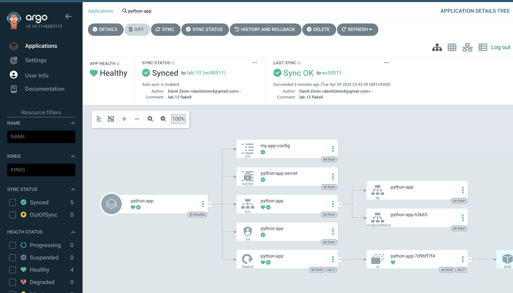

```bash
(devopss) daniilzimin@MacBook-Pro k8s % argocd app sync python-app --force                                               
TIMESTAMP                  GROUP        KIND       NAMESPACE                  NAME    STATUS   HEALTH        HOOK  MESSAGE
2025-04-29T23:44:52+03:00          ConfigMap         default         my-app-config    Synced                       
2025-04-29T23:44:52+03:00             Secret         default     python-app-secret    Synced                       
2025-04-29T23:44:52+03:00            Service         default            python-app    Synced  Healthy              
2025-04-29T23:44:52+03:00         ServiceAccount     default            python-app    Synced                       
2025-04-29T23:44:52+03:00   apps  Deployment         default            python-app    Synced  Healthy              
2025-04-29T23:44:53+03:00                Pod     default       preinstall-hook                                 
2025-04-29T23:44:55+03:00                Pod     default       preinstall-hook   Running   Synced     PreSync  pod/preinstall-hook created
2025-04-29T23:45:19+03:00   apps  Deployment         default            python-app    Synced   Healthy              deployment.apps/python-app unchanged
2025-04-29T23:45:19+03:00                Pod         default       preinstall-hook  Succeeded   Synced     PreSync  pod/preinstall-hook created
2025-04-29T23:45:19+03:00         ServiceAccount     default            python-app    Synced                        serviceaccount/python-app unchanged
2025-04-29T23:45:19+03:00             Secret         default     python-app-secret    Synced                        secret/python-app-secret unchanged
2025-04-29T23:45:19+03:00          ConfigMap         default         my-app-config    Synced                        configmap/my-app-config unchanged
2025-04-29T23:45:19+03:00            Service         default            python-app    Synced   Healthy              service/python-app unchanged
2025-04-29T23:45:19+03:00                Pod     default      postinstall-hook   Running   Synced    PostSync  pod/postinstall-hook created
2025-04-29T23:45:39+03:00                Pod     default      postinstall-hook  Succeeded   Synced    PostSync  pod/postinstall-hook created

Name:               argocd/python-app
Project:            default
Server:             https://kubernetes.default.svc
Namespace:          default
URL:                https://argocd.example.com/applications/python-app
Source:
- Repo:             https://github.com/daniilzimin4/S25-core-course-labs.git
  Target:           lab-13
  Path:             k8s/python-app
  Helm Values:      values.yaml
SyncWindow:         Sync Allowed
Sync Policy:        Automated
Sync Status:        Synced to lab-13 (ec50511)
Health Status:      Healthy

Operation:          Sync
Sync Revision:      ec50511fd7e6c7c48f4103dfa004a04818e610cb
Phase:              Succeeded
Start:              2025-04-29 23:44:52 +0300 MSK
Finished:           2025-04-29 23:45:39 +0300 MSK
Duration:           47s
Message:            successfully synced (no more tasks)

GROUP  KIND            NAMESPACE  NAME               STATUS     HEALTH   HOOK      MESSAGE
       Pod             default    preinstall-hook    Succeeded           PreSync   pod/preinstall-hook created
       ServiceAccount  default    python-app         Synced                        serviceaccount/python-app unchanged
       Secret          default    python-app-secret  Synced                        secret/python-app-secret unchanged
       ConfigMap       default    my-app-config      Synced                        configmap/my-app-config unchanged
       Service         default    python-app         Synced     Healthy            service/python-app unchanged
apps   Deployment      default    python-app         Synced     Healthy            deployment.apps/python-app unchanged
       Pod             default    postinstall-hook   Succeeded           PostSync  pod/postinstall-hook created
```



```bash
(devopss) daniilzimin@MacBook-Pro k8s % kubectl get pods        
NAME                         READY   STATUS    RESTARTS      AGE
python-app-7d9bff7f4-kz6bp   1/1     Running   1 (17m ago)   57m
```

```bash
(devopss) daniilzimin@MacBook-Pro k8s % kubectl get deployments --all-namespaces | grep python-app                         
default                python-app                              1/1     1            1           61m
prod                   python-app-prod                         3/3     3            3           118s
```

```bash
(devopss) daniilzimin@MacBook-Pro ArgoCD % kubectl get pods -n prod                
NAME                               READY   STATUS    RESTARTS   AGE
python-app-7d9bff7f4-rt5j6         1/1     Running   0          74s
python-app-prod-5cf5747d4c-gfsqr   1/1     Running   0          9m20s
python-app-prod-5cf5747d4c-x68gl   1/1     Running   0          9m7s
python-app-prod-5cf5747d4c-xhc65   1/1     Running   0          9m7s
```


## How ArgoCD Maintains Cluster State
ArgoCD manages cluster configurations by monitoring two distinct types of inconsistencies:

1. Configuration Drift
Occurs when live cluster resources deviate from their Git-declared specifications (e.g., someone manually edits a Deployment's replica count). ArgoCD:
   - Detects such changes through continuous comparison
   - Automatically reverts the cluster state to match Git
   - Logs these reconciliation events

2. Runtime Fluctuations
Temporary operational issues like pod crashes or node failures. Here:

   - Kubernetes' native controllers handle recovery (e.g., restarting pods)
   - ArgoCD observes but doesn't intervene
   - No sync action occurs because the declared spec remains unchanged

## Core Principles
- Git as Single Source of Truth: All intentional changes must flow through Git manifests
- Selective Intervention: ArgoCD only corrects non-transient deviations from Git state

This dual-layer approach ensures stability while maintaining strict GitOps compliance. The system deliberately ignores ephemeral issues that Kubernetes can resolve independently, focusing only on substantive configuration mismatches.