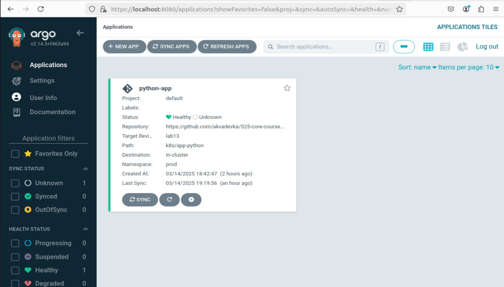

 ## Lab 13: ArgoCD for GitOps Deployment ##
### Task 1
The result of synchronization:

````
$ argocd app sync python-app
Handling connection for 8080
Handling connection for 8080
Handling connection for 8080
Handling connection for 8080
TIMESTAMP                  GROUP        KIND       NAMESPACE                  NAME     STATUS   HEALTH        HOOK  MESSAGE
2025-03-14T19:17:45+03:00             Secret         default             my-secret     Synced                       
2025-03-14T19:17:45+03:00            Service         default  python-app-app-python    Synced  Healthy              
2025-03-14T19:17:45+03:00         ServiceAccount     default  python-app-app-python    Synced                       
2025-03-14T19:17:45+03:00   apps  Deployment         default  python-app-app-python    Synced  Healthy              
2025-03-14T19:17:45+03:00          ConfigMap         default     app-python-config     Synced                       
2025-03-14T19:17:45+03:00                Pod         default      postinstall-hook                                  
2025-03-14T19:17:46+03:00                Pod     default       preinstall-hook                                 
2025-03-14T19:17:48+03:00                Pod     default       preinstall-hook   Running   Synced     PreSync  pod/preinstall-hook created
2025-03-14T19:18:50+03:00                Pod         default       preinstall-hook   Succeeded   Synced     PreSync  pod/preinstall-hook created
2025-03-14T19:18:50+03:00         ServiceAccount     default  python-app-app-python    Synced                        serviceaccount/python-app-app-python unchanged
2025-03-14T19:18:50+03:00             Secret         default             my-secret     Synced                        secret/my-secret unchanged
2025-03-14T19:18:50+03:00          ConfigMap         default     app-python-config     Synced                        configmap/app-python-config unchanged
2025-03-14T19:18:50+03:00            Service         default  python-app-app-python    Synced   Healthy              service/python-app-app-python unchanged
2025-03-14T19:18:50+03:00   apps  Deployment         default  python-app-app-python    Synced   Healthy              deployment.apps/python-app-app-python unchanged
2025-03-14T19:18:51+03:00                Pod     default      postinstall-hook   Running   Synced    PostSync  pod/postinstall-hook created
2025-03-14T19:19:56+03:00                Pod     default      postinstall-hook  Succeeded   Synced    PostSync  pod/postinstall-hook created
Handling connection for 8080

Handling connection for 8080
Name:               argocd/python-app
Project:            default
Server:             https://kubernetes.default.svc
Namespace:          default
URL:                https://argocd.example.com/applications/python-app
Source:
- Repo:             https://github.com/akvadevka/S25-core-course-labs.git
  Target:           lab13
  Path:             k8s/app-python
  Helm Values:      values.yaml
SyncWindow:         Sync Allowed
Sync Policy:        Automated
Sync Status:        Synced to lab13 (063ab19)
Health Status:      Healthy

Operation:          Sync
Sync Revision:      063ab19a0af88d937446413c25e68ab70c0247a3
Phase:              Succeeded
Start:              2025-03-14 19:17:45 +0300 MSK
Finished:           2025-03-14 19:19:56 +0300 MSK
Duration:           2m11s
Message:            successfully synced (no more tasks)

GROUP  KIND            NAMESPACE  NAME                   STATUS     HEALTH   HOOK      MESSAGE
       Pod             default    preinstall-hook        Succeeded           PreSync   pod/preinstall-hook created
       ServiceAccount  default    python-app-app-python  Synced                        serviceaccount/python-app-app-python unchanged
       Secret          default    my-secret              Synced                        secret/my-secret unchanged
       ConfigMap       default    app-python-config      Synced                        configmap/app-python-config unchanged
       Service         default    python-app-app-python  Synced     Healthy            service/python-app-app-python unchanged
apps   Deployment      default    python-app-app-python  Synced     Healthy            deployment.apps/python-app-app-python unchanged
       Pod             default    postinstall-hook       Succeeded           PostSync  pod/postinstall-hook created
````


## Multi-Environment deployment

synchronization of prod:


````
$ argocd app sync python-app-prod
Handling connection for 8080
Handling connection for 8080
Handling connection for 8080
Handling connection for 8080
TIMESTAMP                  GROUP        KIND       NAMESPACE                  NAME          STATUS   HEALTH        HOOK  MESSAGE
2025-03-14T20:59:06+03:00                Pod            prod      postinstall-hook                                       
2025-03-14T20:59:06+03:00             Secret            prod             my-secret          Synced                       
2025-03-14T20:59:06+03:00            Service            prod  python-app-prod-app-python    Synced  Healthy              
2025-03-14T20:59:06+03:00         ServiceAccount        prod  python-app-prod-app-python    Synced                       
2025-03-14T20:59:06+03:00   apps  Deployment            prod  python-app-prod-app-python    Synced  Healthy              
2025-03-14T20:59:06+03:00          ConfigMap            prod     app-python-config          Synced                       
2025-03-14T20:59:06+03:00                Pod        prod       preinstall-hook                                 
2025-03-14T20:59:08+03:00                Pod        prod       preinstall-hook   Running   Synced     PreSync  pod/preinstall-hook created
2025-03-14T21:00:11+03:00                Pod            prod       preinstall-hook        Succeeded   Synced     PreSync  pod/preinstall-hook created
2025-03-14T21:00:11+03:00         ServiceAccount        prod  python-app-prod-app-python    Synced                        serviceaccount/python-app-prod-app-python unchanged
2025-03-14T21:00:11+03:00             Secret            prod             my-secret          Synced                        secret/my-secret unchanged
2025-03-14T21:00:11+03:00          ConfigMap            prod     app-python-config          Synced                        configmap/app-python-config unchanged
2025-03-14T21:00:11+03:00            Service            prod  python-app-prod-app-python    Synced   Healthy              service/python-app-prod-app-python unchanged
2025-03-14T21:00:11+03:00   apps  Deployment            prod  python-app-prod-app-python    Synced   Healthy              deployment.apps/python-app-prod-app-python unchanged
2025-03-14T21:00:11+03:00                Pod        prod      postinstall-hook   Running   Synced    PostSync  pod/postinstall-hook created
2025-03-14T21:01:17+03:00                Pod        prod      postinstall-hook  Succeeded   Synced    PostSync  pod/postinstall-hook created
Handling connection for 8080

Handling connection for 8080
E0314 21:01:18.385036   18490 portforward.go:391] "Unhandled Error" err="error copying from remote stream to local connection: readfrom tcp4 127.0.0.1:8080->127.0.0.1:57248: write tcp4 127.0.0.1:8080->127.0.0.1:57248: write: broken pipe"
Name:               argocd/python-app-prod
Project:            default
Server:             https://kubernetes.default.svc
Namespace:          prod
URL:                https://argocd.example.com/applications/python-app-prod
Source:
- Repo:             https://github.com/akvadevka/S25-core-course-labs.git
  Target:           lab13
  Path:             k8s/app-python
  Helm Values:      values-prod.yaml
SyncWindow:         Sync Allowed
Sync Policy:        Automated
Sync Status:        Synced to lab13 (dc42d34)
Health Status:      Healthy

Operation:          Sync
Sync Revision:      dc42d34bb0551a7870d28b5f42cbbd5228252b34
Phase:              Succeeded
Start:              2025-03-14 20:59:06 +0300 MSK
Finished:           2025-03-14 21:01:17 +0300 MSK
Duration:           2m11s
Message:            successfully synced (no more tasks)

GROUP  KIND            NAMESPACE  NAME                        STATUS     HEALTH   HOOK      MESSAGE
       Pod             prod       preinstall-hook             Succeeded           PreSync   pod/preinstall-hook created
       ServiceAccount  prod       python-app-prod-app-python  Synced                        serviceaccount/python-app-prod-app-python unchanged
       Secret          prod       my-secret                   Synced                        secret/my-secret unchanged
       ConfigMap       prod       app-python-config           Synced                        configmap/app-python-config unchanged
       Service         prod       python-app-prod-app-python  Synced     Healthy            service/python-app-prod-app-python unchanged
apps   Deployment      prod       python-app-prod-app-python  Synced     Healthy            deployment.apps/python-app-prod-app-python unchanged
       Pod             prod       postinstall-hook            Succeeded           PostSync  pod/postinstall-hook created
````

synchronization of dev: 

````

argocd app sync python-app-dev
Handling connection for 8080
Handling connection for 8080
Handling connection for 8080
Handling connection for 8080
TIMESTAMP                  GROUP        KIND       NAMESPACE                  NAME         STATUS   HEALTH        HOOK  MESSAGE
2025-03-14T21:02:52+03:00          ConfigMap             dev     app-python-config         Synced                       
2025-03-14T21:02:52+03:00                Pod             dev      postinstall-hook                                      
2025-03-14T21:02:52+03:00             Secret             dev             my-secret         Synced                       
2025-03-14T21:02:52+03:00            Service             dev  python-app-dev-app-python    Synced  Healthy              
2025-03-14T21:02:52+03:00         ServiceAccount         dev  python-app-dev-app-python    Synced                       
2025-03-14T21:02:52+03:00   apps  Deployment             dev  python-app-dev-app-python    Synced  Healthy              
2025-03-14T21:02:53+03:00                Pod         dev       preinstall-hook                                 
2025-03-14T21:02:55+03:00                Pod         dev       preinstall-hook   Running   Synced     PreSync  pod/preinstall-hook created
2025-03-14T21:03:58+03:00   apps  Deployment             dev  python-app-dev-app-python    Synced   Healthy              deployment.apps/python-app-dev-app-python unchanged
2025-03-14T21:03:58+03:00                Pod             dev       preinstall-hook       Succeeded   Synced     PreSync  pod/preinstall-hook created
2025-03-14T21:03:58+03:00         ServiceAccount         dev  python-app-dev-app-python    Synced                        serviceaccount/python-app-dev-app-python unchanged
2025-03-14T21:03:58+03:00             Secret             dev             my-secret         Synced                        secret/my-secret unchanged
2025-03-14T21:03:58+03:00          ConfigMap             dev     app-python-config         Synced                        configmap/app-python-config unchanged
2025-03-14T21:03:58+03:00            Service             dev  python-app-dev-app-python    Synced   Healthy              service/python-app-dev-app-python unchanged
2025-03-14T21:03:58+03:00                Pod         dev      postinstall-hook   Running   Synced    PostSync  pod/postinstall-hook created
Handling connection for 8080
2025-03-14T21:05:02+03:00                Pod         dev      postinstall-hook  Succeeded   Synced    PostSync  pod/postinstall-hook created
Handling connection for 8080

Handling connection for 8080
E0314 21:05:03.735191   18490 portforward.go:391] "Unhandled Error" err="error copying from remote stream to local connection: readfrom tcp4 127.0.0.1:8080->127.0.0.1:43142: write tcp4 127.0.0.1:8080->127.0.0.1:43142: write: broken pipe"
Name:               argocd/python-app-dev
Project:            default
Server:             https://kubernetes.default.svc
Namespace:          dev
URL:                https://argocd.example.com/applications/python-app-dev
Source:
- Repo:             https://github.com/akvadevka/S25-core-course-labs.git
  Target:           lab13
  Path:             k8s/app-python
  Helm Values:      values-dev.yaml
SyncWindow:         Sync Allowed
Sync Policy:        Automated
Sync Status:        Synced to lab13 (dc42d34)
Health Status:      Healthy

Operation:          Sync
Sync Revision:      dc42d34bb0551a7870d28b5f42cbbd5228252b34
Phase:              Succeeded
Start:              2025-03-14 21:02:52 +0300 MSK
Finished:           2025-03-14 21:05:02 +0300 MSK
Duration:           2m10s
Message:            successfully synced (no more tasks)

GROUP  KIND            NAMESPACE  NAME                       STATUS     HEALTH   HOOK      MESSAGE
       Pod             dev        preinstall-hook            Succeeded           PreSync   pod/preinstall-hook created
       ServiceAccount  dev        python-app-dev-app-python  Synced                        serviceaccount/python-app-dev-app-python unchanged
       Secret          dev        my-secret                  Synced                        secret/my-secret unchanged
       ConfigMap       dev        app-python-config          Synced                        configmap/app-python-config unchanged
       Service         dev        python-app-dev-app-python  Synced     Healthy            service/python-app-dev-app-python unchanged
apps   Deployment      dev        python-app-dev-app-python  Synced     Healthy            deployment.apps/python-app-dev-app-python unchanged
       Pod             dev        postinstall-hook           Succeeded           PostSync  pod/postinstall-hook created

````


**Self-heal testing**

**Test 1**

$ kubectl patch deployment python-app-prod-app-python -n prod --patch '{"spec":{"replicas": 3}}'


````
(.venv) akvadevka@DevOps:~/PycharmProjects/Devops/S25-core-course-labs/k8s$ argocd app sync python-app-prod
Handling connection for 8080
Handling connection for 8080
Handling connection for 8080
Handling connection for 8080
TIMESTAMP                  GROUP        KIND       NAMESPACE                  NAME          STATUS    HEALTH        HOOK  MESSAGE
2025-03-14T21:35:22+03:00   apps  Deployment            prod  python-app-prod-app-python  OutOfSync  Healthy              
2025-03-14T21:35:22+03:00          ConfigMap            prod     app-python-config          Synced                        
2025-03-14T21:35:22+03:00                Pod            prod      postinstall-hook                                        
2025-03-14T21:35:22+03:00             Secret            prod             my-secret          Synced                        
2025-03-14T21:35:22+03:00            Service            prod  python-app-prod-app-python    Synced   Healthy              
2025-03-14T21:35:22+03:00         ServiceAccount        prod  python-app-prod-app-python    Synced                        
2025-03-14T21:35:22+03:00                Pod        prod       preinstall-hook                                 
2025-03-14T21:35:24+03:00                Pod        prod       preinstall-hook   Running   Synced     PreSync  pod/preinstall-hook created
2025-03-14T21:36:25+03:00   apps  Deployment        prod  python-app-prod-app-python    Synced  Progressing              
2025-03-14T21:36:25+03:00   apps  Deployment        prod  python-app-prod-app-python    Synced  Healthy              
2025-03-14T21:36:27+03:00             Secret            prod             my-secret          Synced                        secret/my-secret unchanged
2025-03-14T21:36:27+03:00          ConfigMap            prod     app-python-config          Synced                        configmap/app-python-config unchanged
2025-03-14T21:36:27+03:00            Service            prod  python-app-prod-app-python    Synced   Healthy              service/python-app-prod-app-python unchanged
2025-03-14T21:36:27+03:00   apps  Deployment            prod  python-app-prod-app-python    Synced   Healthy              deployment.apps/python-app-prod-app-python configured
2025-03-14T21:36:27+03:00                Pod            prod       preinstall-hook        Succeeded   Synced     PreSync  pod/preinstall-hook created
2025-03-14T21:36:27+03:00         ServiceAccount        prod  python-app-prod-app-python    Synced                        serviceaccount/python-app-prod-app-python unchanged
2025-03-14T21:36:27+03:00                Pod        prod      postinstall-hook   Running   Synced    PostSync  pod/postinstall-hook created
Handling connection for 8080
Handling connection for 8080
Handling connection for 8080
2025-03-14T21:37:31+03:00                Pod        prod      postinstall-hook  Succeeded   Synced    PostSync  pod/postinstall-hook created
Handling connection for 8080

Handling connection for 8080
Name:               argocd/python-app-prod
Project:            default
Server:             https://kubernetes.default.svc
Namespace:          prod
URL:                https://argocd.example.com/applications/python-app-prod
Source:
- Repo:             https://github.com/akvadevka/S25-core-course-labs.git
  Target:           lab13
  Path:             k8s/app-python
  Helm Values:      values-prod.yaml
SyncWindow:         Sync Allowed
Sync Policy:        Automated
Sync Status:        Synced to lab13 (dc42d34)
Health Status:      Healthy

Operation:          Sync
Sync Revision:      dc42d34bb0551a7870d28b5f42cbbd5228252b34
Phase:              Succeeded
Start:              2025-03-14 21:35:22 +0300 MSK
Finished:           2025-03-14 21:37:31 +0300 MSK
Duration:           2m9s
Message:            successfully synced (no more tasks)

GROUP  KIND            NAMESPACE  NAME                        STATUS     HEALTH   HOOK      MESSAGE
       Pod             prod       preinstall-hook             Succeeded           PreSync   pod/preinstall-hook created
       ServiceAccount  prod       python-app-prod-app-python  Synced                        serviceaccount/python-app-prod-app-python unchanged
       Secret          prod       my-secret                   Synced                        secret/my-secret unchanged
       ConfigMap       prod       app-python-config           Synced                        configmap/app-python-config unchanged
       Service         prod       python-app-prod-app-python  Synced     Healthy            service/python-app-prod-app-python unchanged
apps   Deployment      prod       python-app-prod-app-python  Synced     Healthy            deployment.apps/python-app-prod-app-python configured
       Pod             prod       postinstall-hook            Succeeded           PostSync  pod/postinstall-hook created
````
After auto-revert


**Test 2**

````
kubectl get pods -n prod
NAME                                          READY   STATUS      RESTARTS   AGE
postinstall-hook                              0/1     Completed   0          14m
python-app-app-python-76bc98887d-7mkq6        1/1     Running     0          72m
python-app-prod-app-python-5d48bb9dc6-86hnf   1/1     Running     0          52m

(.venv) akvadevka@DevOps:~/PycharmProjects/Devops/S25-core-course-labs/k8s$ kubectl delete pod -n prod -l app.kubernetes.io/name=app-python
pod "python-app-app-python-76bc98887d-7mkq6" deleted
pod "python-app-prod-app-python-5d48bb9dc6-86hnf" deleted
(.venv) akvadevka@DevOps:~/PycharmProjects/Devops/S25-core-course-labs/k8s$ kubectl get pods -n prod -w
NAME                                          READY   STATUS      RESTARTS   AGE
postinstall-hook                              0/1     Completed   0          18m
python-app-app-python-76bc98887d-6lqrr        1/1     Running     0          18s
python-app-prod-app-python-5d48bb9dc6-7cz56   1/1     Running     0          18s
````

After two tests


No drifts 

