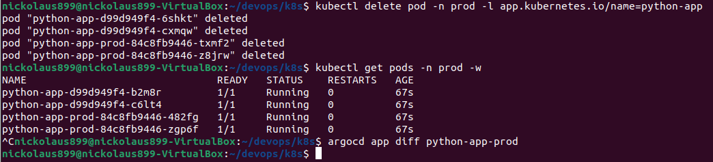

# Argo CD

For completing the first task, I followed the tutorial in the lab. Here are the results:

```
kubectl port-forward svc/argo-argocd-server -n argocd 8080:443 &
```


```
$ argocd app sync python-app
TIMESTAMP                  GROUP        KIND       NAMESPACE                  NAME    STATUS   HEALTH        HOOK  MESSAGE
2025-03-14T14:48:28+03:00   apps  Deployment         default            python-app    Synced  Healthy              
2025-03-14T14:48:28+03:00            Service         default            python-app    Synced  Healthy              
2025-03-14T14:48:28+03:00         ServiceAccount     default            python-app    Synced                       
2025-03-14T14:48:29+03:00         ServiceAccount     default            python-app    Synced                       serviceaccount/python-app unchanged
2025-03-14T14:48:29+03:00            Service         default            python-app    Synced  Healthy              service/python-app unchanged
2025-03-14T14:48:29+03:00   apps  Deployment         default            python-app    Synced  Healthy              deployment.apps/python-app configured

Name:               argocd/python-app
Project:            default
Server:             https://kubernetes.default.svc
Namespace:          default
URL:                https://argocd.example.com/applications/python-app
Source:
- Repo:             https://github.com/Nickolaus-899/S25-core-course-labs.git
  Target:           lab13
  Path:             k8s/python-app
  Helm Values:      values.yaml
SyncWindow:         Sync Allowed
Sync Policy:        Automated
Sync Status:        Synced to lab13 (076fdbd)
Health Status:      Healthy

Operation:          Sync
Sync Revision:      076fdbd87d621ea9f99d87e8c8113f62ec84ddd0
Phase:              Succeeded
Start:              2025-03-14 14:48:28 +0300 MSK
Finished:           2025-03-14 14:48:29 +0300 MSK
Duration:           1s
Message:            successfully synced (all tasks run)

GROUP  KIND            NAMESPACE  NAME        STATUS  HEALTH   HOOK  MESSAGE
       ServiceAccount  default    python-app  Synced                 serviceaccount/python-app unchanged
       Service         default    python-app  Synced  Healthy        service/python-app unchanged
apps   Deployment      default    python-app  Synced  Healthy        deployment.apps/python-app configured
```


### Now, let's update number of replicas to 2

```
$ argocd app sync python-app
TIMESTAMP                  GROUP        KIND       NAMESPACE                  NAME    STATUS   HEALTH        HOOK  MESSAGE
2025-03-14T14:56:02+03:00            Service         default            python-app    Synced  Healthy              
2025-03-14T14:56:02+03:00         ServiceAccount     default            python-app    Synced                       
2025-03-14T14:56:02+03:00   apps  Deployment         default            python-app    Synced  Healthy              
2025-03-14T14:56:03+03:00   apps  Deployment         default            python-app    Synced  Healthy              deployment.apps/python-app configured
2025-03-14T14:56:03+03:00         ServiceAccount     default            python-app    Synced                       serviceaccount/python-app unchanged
2025-03-14T14:56:03+03:00            Service         default            python-app    Synced  Healthy              service/python-app unchanged

Name:               argocd/python-app
Project:            default
Server:             https://kubernetes.default.svc
Namespace:          default
URL:                https://argocd.example.com/applications/python-app
Source:
- Repo:             https://github.com/Nickolaus-899/S25-core-course-labs.git
  Target:           lab13
  Path:             k8s/python-app
  Helm Values:      values.yaml
SyncWindow:         Sync Allowed
Sync Policy:        Automated
Sync Status:        Synced to lab13 (fb446f2)
Health Status:      Healthy

Operation:          Sync
Sync Revision:      fb446f2524976351c65cde5f0a1e7c9f71712eac
Phase:              Succeeded
Start:              2025-03-14 14:56:02 +0300 MSK
Finished:           2025-03-14 14:56:03 +0300 MSK
Duration:           1s
Message:            successfully synced (all tasks run)

GROUP  KIND            NAMESPACE  NAME        STATUS  HEALTH   HOOK  MESSAGE
       ServiceAccount  default    python-app  Synced                 serviceaccount/python-app unchanged
       Service         default    python-app  Synced  Healthy        service/python-app unchanged
apps   Deployment      default    python-app  Synced  Healthy        deployment.apps/python-app configured
```

### `Sync Status` has changed

And we can see 2 replicas:
```
$ kubectl get po
NAME                                    READY   STATUS    RESTARTS      AGE
js-app-d54cb5949-kwv8n                  1/1     Running   2 (15m ago)   6d16h
python-app-d99d949f4-kqcsj              1/1     Running   0             3m6s
python-app-d99d949f4-r2jwp              1/1     Running   2 (12m ago)   20m
vault-0                                 1/1     Running   7 (15m ago)   9d
vault-agent-injector-66f45b5fd5-dzmw9   1/1     Running   7 (15m ago)   9d
```


## And the same for JS app (bonus)

```
$ argocd app sync js-app
TIMESTAMP                  GROUP        KIND       NAMESPACE                  NAME    STATUS   HEALTH        HOOK  MESSAGE
2025-03-14T15:00:05+03:00          ConfigMap         default       jsapp-configmap    Synced                       
2025-03-14T15:00:05+03:00            Service         default                js-app    Synced  Healthy              
2025-03-14T15:00:05+03:00         ServiceAccount     default                js-app    Synced                       
2025-03-14T15:00:05+03:00   apps  Deployment         default                js-app    Synced  Healthy              
2025-03-14T15:00:06+03:00         ServiceAccount     default                js-app    Synced                       serviceaccount/js-app unchanged
2025-03-14T15:00:06+03:00          ConfigMap         default       jsapp-configmap    Synced                       configmap/jsapp-configmap unchanged
2025-03-14T15:00:06+03:00            Service         default                js-app    Synced  Healthy              service/js-app unchanged
2025-03-14T15:00:06+03:00   apps  Deployment         default                js-app    Synced  Healthy              deployment.apps/js-app unchanged

Name:               argocd/js-app
Project:            default
Server:             https://kubernetes.default.svc
Namespace:          default
URL:                https://argocd.example.com/applications/js-app
Source:
- Repo:             https://github.com/Nickolaus-899/S25-core-course-labs.git
  Target:           lab13
  Path:             k8s/js-app
  Helm Values:      values.yaml
SyncWindow:         Sync Allowed
Sync Policy:        Automated
Sync Status:        Synced to lab13 (fb446f2)
Health Status:      Healthy

Operation:          Sync
Sync Revision:      fb446f2524976351c65cde5f0a1e7c9f71712eac
Phase:              Succeeded
Start:              2025-03-14 15:00:05 +0300 MSK
Finished:           2025-03-14 15:00:06 +0300 MSK
Duration:           1s
Message:            successfully synced (all tasks run)

GROUP  KIND            NAMESPACE  NAME             STATUS  HEALTH   HOOK  MESSAGE
       ServiceAccount  default    js-app           Synced                 serviceaccount/js-app unchanged
       ConfigMap       default    jsapp-configmap  Synced                 configmap/jsapp-configmap unchanged
       Service         default    js-app           Synced  Healthy        service/js-app unchanged
apps   Deployment      default    js-app           Synced  Healthy        deployment.apps/js-app unchanged
```

```
$ kubectl get pods -n default
NAME                                    READY   STATUS    RESTARTS      AGE
js-app-d54cb5949-kwv8n                  1/1     Running   2 (19m ago)   6d16h
python-app-d99d949f4-kqcsj              1/1     Running   0             7m13s
python-app-d99d949f4-r2jwp              1/1     Running   2 (16m ago)   24m
vault-0                                 1/1     Running   7 (19m ago)   9d
vault-agent-injector-66f45b5fd5-dzmw9   1/1     Running   7 (19m ago)   9d
```


# Multi-Environment Deployment

After creating namespaces and appropriate `.yaml` files, we can test it (again change number of replicas)


Also, all apps are synced:


### For `prod`


## Deleting a pod


