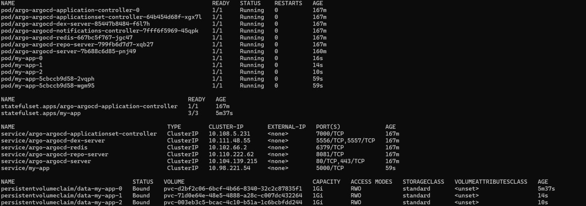

# Deploy and Configure ArgoCD

## Task 1

Check `sync` for the running app:
```
nikita@LAPTOP-DOBKKTS4:~/S25-core-course-labs/k8s$ argocd app sync python-app
TIMESTAMP  GROUP        KIND   NAMESPACE                  NAME    STATUS   HEALTH        HOOK  MESSAGE
2025-03-13T23:44:44+03:00         ServiceAccount     default          internal-app   Running   Synced              serviceaccount/internal-app created
2025-03-13T23:44:44+03:00            Service         default            python-app   Running   Synced              service/python-app created
2025-03-13T23:44:44+03:00   apps  Deployment         default            python-app   Running   Synced              deployment.apps/python-app created

Name:               argocd/python-app
Project:            default
Server:             https://kubernetes.default.svc
Namespace:          default
URL:                https://argocd.example.com/applications/python-app
Source:
- Repo:             https://github.com/Dyddxd/S25-core-course-labs.git
  Target:           lab13
  Path:             k8s/python-app
  Helm Values:      values.yaml
SyncWindow:         Sync Allowed
Sync Policy:        Automated
Sync Status:        Unknown
Health Status:      Progressing

Operation:          Sync
Sync Revision:      3e913b41adf593aad2086eb4f4d2a1f528629732
Phase:              Succeeded
Start:              2025-03-13 23:44:44 +0300 MSK
Finished:           2025-03-13 23:44:44 +0300 MSK
Duration:           0s
Message:            successfully synced (all tasks run)

GROUP  KIND            NAMESPACE  NAME          STATUS   HEALTH       HOOK  MESSAGE
       ServiceAccount  default    internal-app  Unknown                     serviceaccount/internal-app created
       Service         default    python-app    Unknown  Healthy            service/python-app created
apps   Deployment      default    python-app    Unknown  Progressing        deployment.apps/python-app created
```

```
Name:               argocd/python-app
Project:            default
Server:             https://kubernetes.default.svc
Namespace:          default
URL:                https://argocd.example.com/applications/python-app
Source:
- Repo:             https://github.com/Dyddxd/S25-core-course-labs.git
  Target:           lab13
  Path:             k8s/python-app
  Helm Values:      values.yaml
SyncWindow:         Sync Allowed
Sync Policy:        Automated
Sync Status:        Synced to lab13 (0b20bd1)
Health Status:      Healthy

GROUP  KIND            NAMESPACE  NAME          STATUS  HEALTH   HOOK  MESSAGE
       ServiceAccount  default    internal-app  Synced                 serviceaccount/internal-app created
       Service         default    python-app    Synced  Healthy        service/python-app created
apps   Deployment      default    python-app    Synced  Healthy        deployment.apps/python-app created
```


## Task 2

```
nikita@LAPTOP-DOBKKTS4:~/S25-core-course-labs/k8s$ argocd app sync python-app-dev
TIMESTAMP  GROUP        KIND   NAMESPACE                  NAME    STATUS   HEALTH        HOOK  MESSAGE
2025-03-14T00:34:47+03:00         ServiceAccount         dev          internal-app   Running   Synced              serviceaccount/internal-app created
2025-03-14T00:34:47+03:00            Service             dev        python-app-dev   Running   Synced              service/python-app-dev created
2025-03-14T00:34:47+03:00   apps  Deployment             dev        python-app-dev   Running   Synced              deployment.apps/python-app-dev created

Name:               argocd/python-app-dev
Project:            default
Server:             https://kubernetes.default.svc
Namespace:          dev
URL:                https://argocd.example.com/applications/python-app-dev
Source:
- Repo:             https://github.com/Dyddxd/S25-core-course-labs.git
  Target:           lab13
  Path:             k8s/python-app
  Helm Values:      values-dev.yaml
SyncWindow:         Sync Allowed
Sync Policy:        Automated
Sync Status:        Synced to lab13 (0ad1e7a)
Health Status:      Progressing

Operation:          Sync
Sync Revision:      0ad1e7ac686f45a762d22214410a93f5da671b95
Phase:              Succeeded
Start:              2025-03-14 00:34:45 +0300 MSK
Finished:           2025-03-14 00:34:47 +0300 MSK
Duration:           2s
Message:            successfully synced (all tasks run)

GROUP  KIND            NAMESPACE  NAME            STATUS  HEALTH       HOOK  MESSAGE
       ServiceAccount  dev        internal-app    Synced                     serviceaccount/internal-app created
       Service         dev        python-app-dev  Synced  Healthy            service/python-app-dev created
apps   Deployment      dev        python-app-dev  Synced  Progressing        deployment.apps/python-app-dev created
```


Let's check how many replicas we have for the `prod` environment:

```
nikita@LAPTOP-DOBKKTS4:~/S25-core-course-labs/k8s$ kubectl get pods -n prod
NAME                               READY   STATUS    RESTARTS   AGE
python-app-prod-764dd586f9-4xb4w   1/1     Running   0          106s
python-app-prod-764dd586f9-gcgxd   1/1     Running   0          106s
```
### Task2(patch)
```
nikita@LAPTOP-DOBKKTS4:~/S25-core-course-labs/k8s$ kubectl patch deployment python-app-prod -n prod --patch '{"spec":{"replicas": 1}}'
deployment.apps/python-app-prod patched
nikita@LAPTOP-DOBKKTS4:~/S25-core-course-labs/k8s$ kubectl get pods -n prod
NAME                               READY   STATUS    RESTARTS   AGE
python-app-prod-764dd586f9-gcgxd   1/1     Running   0          3m1s

nikita@LAPTOP-DOBKKTS4:~/S25-core-course-labs/k8s$ argocd app sync python-app-prod
TIMESTAMP                  GROUP        KIND       NAMESPACE                  NAME    STATUS    HEALTH        HOOK  MESSAGE
2025-03-15T16:19:37+03:00            Service            prod       python-app-prod    Synced   Healthy
2025-03-15T16:19:37+03:00         ServiceAccount        prod          internal-app    Synced
2025-03-15T16:19:37+03:00   apps  Deployment            prod       python-app-prod  OutOfSync  Healthy
2025-03-15T16:19:38+03:00         ServiceAccount        prod          internal-app    Synced                        serviceaccount/internal-app unchanged
2025-03-15T16:19:38+03:00            Service            prod       python-app-prod    Synced   Healthy              service/python-app-prod unchanged
2025-03-15T16:19:38+03:00   apps  Deployment            prod       python-app-prod  OutOfSync  Healthy              deployment.apps/python-app-prod configured
2025-03-15T16:19:39+03:00   apps  Deployment        prod       python-app-prod    Synced  Progressing              deployment.apps/python-app-prod configured

Name:               argocd/python-app-prod
Project:            default
Server:             https://kubernetes.default.svc
Namespace:          prod
URL:                https://argocd.example.com/applications/python-app-prod
Source:
- Repo:             https://github.com/Dyddxd/S25-core-course-labs.git
  Target:           lab13
  Path:             k8s/python-app
  Helm Values:      values-prod.yaml
SyncWindow:         Sync Allowed
Sync Policy:        Automated
Sync Status:        Synced to lab13 (0ad1e7a)
Health Status:      Progressing

Operation:          Sync
Sync Revision:      0ad1e7ac686f45a762d22214410a93f5da671b95
Phase:              Succeeded
Start:              2025-03-15 16:19:38 +0300 MSK
Finished:           2025-03-15 16:19:38 +0300 MSK
Duration:           0s
Message:            successfully synced (all tasks run)

GROUP  KIND            NAMESPACE  NAME             STATUS  HEALTH       HOOK  MESSAGE
       ServiceAccount  prod       internal-app     Synced                     serviceaccount/internal-app unchanged
       Service         prod       python-app-prod  Synced  Healthy            service/python-app-prod unchanged
apps   Deployment      prod       python-app-prod  Synced  Progressing        deployment.apps/python-app-prod configured

nikita@LAPTOP-DOBKKTS4:~/S25-core-course-labs/k8s$ kubectl get pods -n prod
NAME                               READY   STATUS    RESTARTS   AGE
python-app-prod-764dd586f9-57dq5   1/1     Running   0          49s
python-app-prod-764dd586f9-gcgxd   1/1     Running   0          4m26s
```
After manual `sync`, the process of creation the desired number of replicas for pods has started. It means, that the manual change of configuration does not affect the real state after `sync` process.




### Task2(manual pod deletion)
```
nikita@LAPTOP-DOBKKTS4:~/S25-core-course-labs/k8s$ kubectl delete pod -n prod -l app.kubernetes.io/name=python-app
pod "python-app-prod-764dd586f9-8jtqq" deleted
pod "python-app-prod-764dd586f9-gcgxd" deleted

nikita@LAPTOP-DOBKKTS4:~/S25-core-course-labs/k8s$ kubectl get pods -n prod
NAME                               READY   STATUS    RESTARTS   AGE
python-app-prod-764dd586f9-fjcdx   0/1     Running   0          9s
python-app-prod-764dd586f9-jtqlp   0/1     Running   0          9s

nikita@LAPTOP-DOBKKTS4:~/S25-core-course-labs/k8s$ kubectl get pods -n prod
NAME                               READY   STATUS    RESTARTS   AGE
python-app-prod-764dd586f9-fjcdx   1/1     Running   0          46s
python-app-prod-764dd586f9-jtqlp   1/1     Running   0          46s
```


### Explanation of the process of pod recreation
ArgoCD periodically checks the application's state and compares it with the state defined in the repository.
This means that before synchronization, configuration drift may impact the application's functionality.
The desired state is only restored during the sync process.

In contrast, vanilla Kubernetes behaves differently. If a resource is manually deleted, Kubernetes itself will automatically recreate it without ArgoCD's involvement.
For example, if a pod is deleted in default Kubernetes configuration, a new one will be spawned automatically.