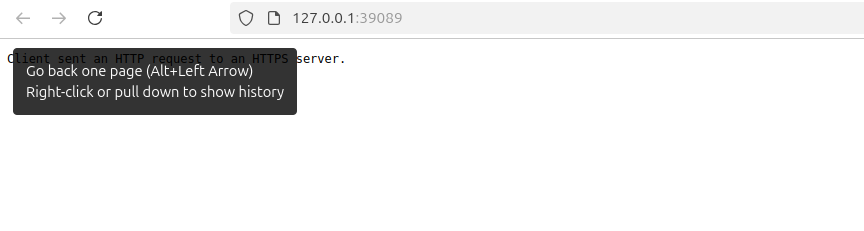

# Lab13

## Task 1

### `argocd app sync python-app`

```bash
Handling connection for 8080
Handling connection for 8080
Handling connection for 8080
Handling connection for 8080
TIMESTAMP                  GROUP        KIND       NAMESPACE                  NAME    STATUS   HEALTH         HOOK  MESSAGE
2025-03-16T15:57:53+03:00             Secret         default        my-helm-secret   Unknown
2025-03-16T15:57:53+03:00            Service         default     python-app-my-app   Unknown  Healthy
2025-03-16T15:57:53+03:00         ServiceAccount     default          internal-app   Unknown
2025-03-16T15:57:53+03:00   apps  Deployment         default                my-app   Unknown  Degraded
2025-03-16T15:57:53+03:00  batch         Job         default           pre-install   Unknown
2025-03-16T15:57:56+03:00  batch         Job     default           pre-install   Running   Synced     PreSync  job.batch/pre-install unchanged
2025-03-16T15:57:58+03:00  batch         Job         default           pre-install  Succeeded   Synced      PreSync  Reached expected number of succeeded pods
2025-03-16T15:57:58+03:00         ServiceAccount     default          internal-app   Unknown                         serviceaccount/internal-app unchanged
2025-03-16T15:57:58+03:00             Secret         default        my-helm-secret   Unknown                         secret/my-helm-secret unchanged
2025-03-16T15:57:58+03:00            Service         default     python-app-my-app   Unknown   Healthy               service/python-app-my-app unchanged
2025-03-16T15:57:58+03:00   apps  Deployment         default                my-app   Unknown   Degraded              deployment.apps/my-app configured
2025-03-16T15:58:03+03:00  batch         Job     default          post-install   Running   Synced    PostSync  job.batch/post-install created
2025-03-16T15:58:08+03:00  batch         Job     default          post-install  Succeeded   Synced    PostSync  Reached expected number of succeeded pods
Handling connection for 8080

Handling connection for 8080
Name:               argocd/python-app
Project:            default
Server:             https://kubernetes.default.svc
Namespace:          default
URL:                https://argocd.example.com/applications/python-app
Source:
- Repo:             https://github.com/UFA-MOROZOV/S25-core-course-labs.git
  Target:           feature/lab13
  Path:             k8s/my-app
  Helm Values:      values.yaml
SyncWindow:         Sync Allowed
Sync Policy:        Automated
Sync Status:        OutOfSync from feature/lab13 (5ec897a)
Health Status:      Healthy

Operation:          Sync
Sync Revision:      5ec897a0cfa0079314f5ac76a811430c18e76f37
Phase:              Succeeded
Start:              2025-03-16 15:57:53 +0300 MSK
Finished:           2025-03-16 15:58:08 +0300 MSK
Duration:           15s
Message:            successfully synced (no more tasks)

GROUP  KIND            NAMESPACE  NAME               STATUS     HEALTH   HOOK      MESSAGE
batch  Job             default    pre-install        Succeeded           PreSync   Reached expected number of succeeded pods
       ServiceAccount  default    internal-app       Synced                        serviceaccount/internal-app unchanged
       Secret          default    my-helm-secret     Synced                        secret/my-helm-secret unchanged
       Service         default    python-app-my-app  Synced     Healthy            service/python-app-my-app unchanged
apps   Deployment      default    my-app             OutOfSync  Healthy            deployment.apps/my-app configured
batch  Job             default    post-install       Succeeded           PostSync  Reached expected number of succeeded pods
```

### `argocd app get python-app`

```bash
Handling connection for 8080
Handling connection for 8080
Handling connection for 8080
Handling connection for 8080
Handling connection for 8080
Name:               argocd/python-app
Project:            default
Server:             https://kubernetes.default.svc
Namespace:          default
URL:                https://argocd.example.com/applications/python-app
Source:
- Repo:             https://github.com/UFA-MOROZOV/S25-core-course-labs.git
  Target:           feature/lab13
  Path:             k8s/my-app
  Helm Values:      values.yaml
SyncWindow:         Sync Allowed
Sync Policy:        Automated
Sync Status:        OutOfSync from feature/lab13 (5ec897a)
Health Status:      Healthy

GROUP  KIND            NAMESPACE  NAME               STATUS     HEALTH   HOOK      MESSAGE
batch  Job             default    pre-install        Succeeded           PreSync   Reached expected number of succeeded pods
       ServiceAccount  default    internal-app       Synced                        serviceaccount/internal-app unchanged
       Secret          default    my-helm-secret     Synced                        secret/my-helm-secret unchanged
       Service         default    python-app-my-app  Synced     Healthy            service/python-app-my-app unchanged
apps   Deployment      default    my-app             OutOfSync  Healthy            deployment.apps/my-app configured
batch  Job             default    post-install       Succeeded           PostSync  Reached expected number of succeeded pods
```

## Task 2

### Before deletion




### After deletion


## ArgoCD: Configuration Drift vs Runtime Events

1. **Configuration Drift**: Occurs when the live state of an app diverges from the desired state defined in Git.
2. ArgoCD detects drift by comparing the cluster’s state with Git and can auto-sync to fix drift.
3. **Handling Drift**: ArgoCD can auto-sync with the repository using the `selfHeal` feature to restore consistency.
4. **Runtime Events**: Include application crashes, pod restarts, or scaling events affecting app behavior.
5. ArgoCD does not directly handle runtime events but monitors app health through health checks.
6. For runtime issues, ArgoCD allows re-syncing or rolling back to previous states.
7. **Impact**: Drift leads to configuration issues, while runtime events affect app stability or performance.
8. ArgoCD focuses on configuration drift resolution, not on managing runtime failures.
9. ArgoCD's sync policy ensures drift is corrected, but runtime issues need external monitoring.
10. Use ArgoCD for configuration consistency and external tools for runtime event management.
