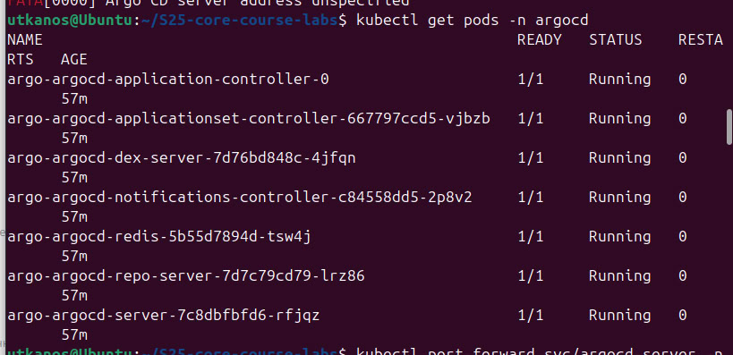

# Lab 13

## Test 1: Manual Override of Replica Count

```bash
PS C:\Users\Elizoveta\Desktop\S25-core-course-labs> kubectl scale deployment python-app-prod-myapp --replicas=2 -n prod
deployment.apps/python-app-prod-myapp scaled
```

```bash
PS C:\Users\Elizoveta\Desktop\S25-core-course-labs> kubectl get deployment python-app-prod-myapp -n prod
NAME                    READY   UP-TO-DATE   AVAILABLE   AGE
python-app-prod-myapp   0/2     2            0           20m
```

```bash
PS C:\Users\Elizoveta\Desktop\S25-core-course-labs> argocd app sync python-app-prod
TIMESTAMP                  GROUP        KIND       NAMESPACE                  NAME     STATUS    HEALTH        HOOK  MESSAGE
2025-03-11T15:18:57+03:00             Secret         default             my-secret     Synced               

2025-03-11T15:18:57+03:00            Service            prod  python-app-prod-myapp    Synced   Healthy     

2025-03-11T15:18:57+03:00         ServiceAccount        prod  python-app-prod-myapp    Synced               

2025-03-11T15:18:57+03:00   apps  Deployment            prod  python-app-prod-myapp  OutOfSync  Missing     

2025-03-11T15:18:57+03:00          ConfigMap            prod                config     Synced               

2025-03-11T15:18:57+03:00                Pod        prod  python-app-prod-myapp-preinstall                  

2025-03-11T15:18:59+03:00                Pod        prod  python-app-prod-myapp-preinstall   Running   Synced     PreSync  pod/python-app-prod-myapp-preinstall created
2025-03-11T15:19:23+03:00   apps  Deployment        prod  python-app-prod-myapp    Synced  Progressing      

2025-03-11T15:19:25+03:00                Pod            prod  python-app-prod-myapp-preinstall  Succeeded   Synced         PreSync  pod/python-app-prod-myapp-preinstall created
2025-03-11T15:19:25+03:00         ServiceAccount        prod  python-app-prod-myapp               Synced                            serviceaccount/python-app-prod-myapp replaced
2025-03-11T15:19:25+03:00             Secret         default             my-secret                Synced                            secret/my-secret replaced
2025-03-11T15:19:25+03:00          ConfigMap            prod                config                Synced                            configmap/config replaced
2025-03-11T15:19:25+03:00            Service            prod  python-app-prod-myapp               Synced   Healthy                  service/python-app-prod-myapp replaced
2025-03-11T15:19:25+03:00   apps  Deployment            prod  python-app-prod-myapp               Synced   Progressing              deployment.apps/python-app-prod-myapp created
2025-03-11T15:19:27+03:00   apps  Deployment        prod  python-app-prod-myapp    Synced  Healthy          
    deployment.apps/python-app-prod-myapp created
2025-03-11T15:19:27+03:00                Pod        prod  python-app-prod-myapp-postinstall   Running   Synced    PostSync  pod/python-app-prod-myapp-postinstall created
2025-03-11T15:19:52+03:00                Pod        prod  python-app-prod-myapp-postinstall  Succeeded   Synced    PostSync  pod/python-app-prod-myapp-postinstall created

Name:               argocd/python-app-prod
Project:            default
Server:             https://kubernetes.default.svc
Namespace:          prod
URL:                https://argocd.example.com/applications/python-app-prod
Source:
- Repo:             https://github.com/nikolaevaElizaveta/S25-core-course-labs.git
  Target:           lab13
  Path:             k8s/myapp
  Helm Values:      values-prod.yaml
SyncWindow:         Sync Allowed
Sync Policy:        Automated
Sync Status:        Synced to lab13 (c4510f0)
Health Status:      Healthy

Operation:          Sync
Sync Revision:      c4510f011252eae4b45fbc68b79d9b44ac501e2a
Phase:              Succeeded
Start:              2025-03-11 15:18:57 +0300 MSK
Finished:           2025-03-11 15:19:52 +0300 MSK
Duration:           55s
Message:            successfully synced (no more tasks)

GROUP  KIND            NAMESPACE  NAME                               STATUS     HEALTH   HOOK      MESSAGE  
       Pod             prod       python-app-prod-myapp-preinstall   Succeeded           PreSync   pod/python-app-prod-myapp-preinstall created
       ServiceAccount  prod       python-app-prod-myapp              Synced                        serviceaccount/python-app-prod-myapp replaced
       Secret          default    my-secret                          Synced                        secret/my-secret replaced
       ConfigMap       prod       config                             Synced                        configmap/config replaced
       Service         prod       python-app-prod-myapp              Synced     Healthy            service/python-app-prod-myapp replaced
apps   Deployment      prod       python-app-prod-myapp              Synced     Healthy            deployment.apps/python-app-prod-myapp created
       Pod             prod       python-app-prod-myapp-postinstall  Succeeded           PostSync  pod/python-app-prod-myapp-postinstall created
```

```bash
PS C:\Users\Elizoveta\Desktop\S25-core-course-labs> argocd app get python-app-prod   
Name:               argocd/python-app-prod
Project:            default
Server:             https://kubernetes.default.svc
Namespace:          prod
URL:                https://argocd.example.com/applications/python-app-prod
Source:
- Repo:             https://github.com/nikolaevaElizaveta/S25-core-course-labs.git
  Target:           lab13
  Path:             k8s/myapp
  Helm Values:      values-prod.yaml
SyncWindow:         Sync Allowed
Sync Policy:        Automated
Sync Status:        Synced to lab13 (c4510f0)
Health Status:      Healthy

GROUP  KIND            NAMESPACE  NAME                               STATUS     HEALTH   HOOK      MESSAGE
       Pod             prod       python-app-prod-myapp-preinstall   Succeeded           PreSync   pod/python-app-prod-myapp-preinstall created
       ServiceAccount  prod       python-app-prod-myapp              Synced                        serviceaccount/python-app-prod-myapp replaced
       Secret          default    my-secret                          Synced                        secret/my-secret replaced
       ConfigMap       prod       config                             Synced                        configmap/config replaced
       Service         prod       python-app-prod-myapp              Synced     Healthy            service/python-app-prod-myapp replaced
apps   Deployment      prod       python-app-prod-myapp              Synced     Healthy            deployment.apps/python-app-prod-myapp created
       Pod             prod       python-app-prod-myapp-postinstall  Succeeded           PostSync  pod/python-app-prod-myapp-postinstall created
```

## Test 2: Delete a Pod (Replica)

```bash
PS C:\Users\Elizoveta\Desktop\S25-core-course-labs> kubectl get pods -n prod

NAME                                     READY   STATUS    RESTARTS   AGE
python-app-prod-myapp-796dc954d4-qbk2g   1/1     Running   0          7m49s
```

```bash
PS C:\Users\Elizoveta\Desktop\S25-core-course-labs> kubectl delete pod -n prod -l app.kubernetes.io/name=myapp    
pod "python-app-prod-myapp-796dc954d4-qbk2g" deleted
```

```bash
PS C:\Users\Elizoveta\Desktop\S25-core-course-labs> kubectl get pods -n prod

NAME                                     READY   STATUS    RESTARTS   AGE
python-app-prod-myapp-796dc954d4-bqlvn   1/1     Running   0          50s 
```

```bash
PS C:\Users\Elizoveta\Desktop\S25-core-course-labs> argocd app diff python-app-prod
PS C:\Users\Elizoveta\Desktop\S25-core-course-labs> 
```

## Screenshots



## Explanations

Configuration drift are the changes that contradict what is in Git (for example, if you manually change the replicaCount in Kubernetes, ArgoCD will automatically roll back)

Runtime events are the events that ArgoCD does not perceive as violations (for example, if the pod just crashed and was recreated, this is not considered "drift")