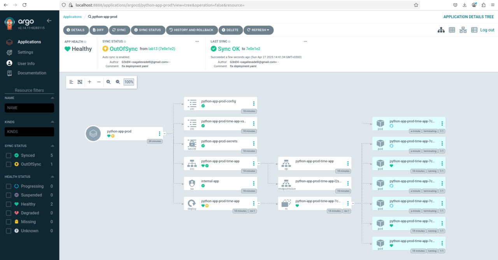

# Lab 13: ArgoCD for GitOps Deployment.

## Test 1.

In this test, we changed replica count manually from 7 to 3, so ArgoCD found inconsistency with `values-prod.yaml` config from git and started 4 more replicas.

## Test 2.

In this test, after deletion ArgoCD found inconsistent state and recreated pods.

## Explanation of how ArgoCD handles configuration drift vs. runtime events.

ArgoCD constantly checks if what's running in k8s is same as what was defined in git. If it finds differences - ArgoCD automatically fixes them so it would be same as in git. 

ArgoCD doesn't interfere because k8s handles these situations itself. E.g. If a pod crashes, k8s recreates it automatically. ArgoCD only cares about cfg changes (in git).

So we can say that ArgoCD watches the Git cfg.
