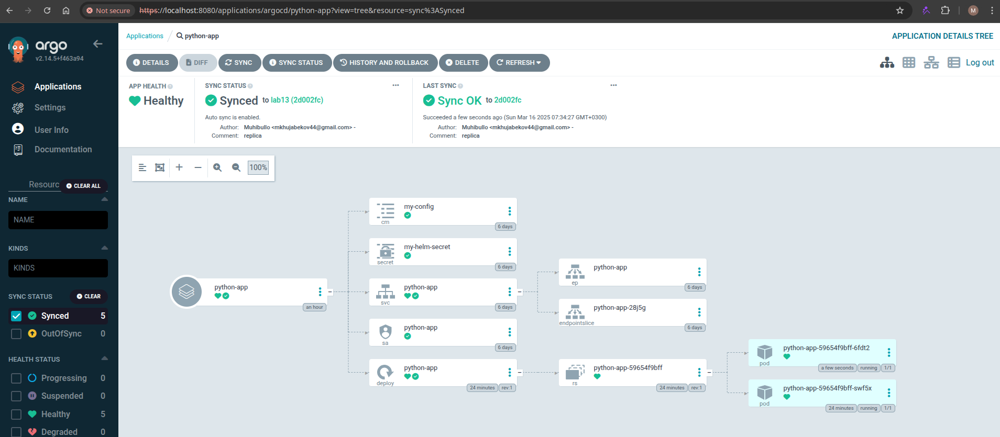
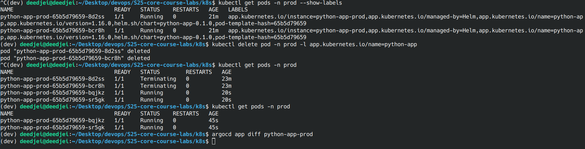

# Lab 13: GitOps Deployment with ArgoCD
## Task 1 : Deploy and Configure ArgoCD
### 1. Instalation verification


### 2. Replica tests
- With 1 replicas


- With 2 replicas



- argocd `sync` & `get` outputs: 
```bash
$ argocd app sync python-app
TIMESTAMP                  GROUP        KIND       NAMESPACE                  NAME    STATUS    HEALTH        HOOK  MESSAGE
2025-03-16T07:23:32+03:00                Pod         default       preinstall-hook                                  
2025-03-16T07:23:32+03:00             Secret         default        my-helm-secret    Synced                        
2025-03-16T07:23:32+03:00            Service         default            python-app    Synced   Healthy              
2025-03-16T07:23:32+03:00         ServiceAccount     default            python-app    Synced                        
2025-03-16T07:23:32+03:00   apps  Deployment         default            python-app  OutOfSync  Healthy              
2025-03-16T07:23:32+03:00          ConfigMap         default             my-config    Synced                        
2025-03-16T07:23:37+03:00                Pod     default       preinstall-hook   Running   Synced     PreSync  pod/preinstall-hook unchanged
2025-03-16T07:23:40+03:00            Service         default            python-app    Synced   Healthy              service/python-app unchanged
2025-03-16T07:23:40+03:00   apps  Deployment         default            python-app  OutOfSync  Healthy              deployment.apps/python-app configured. Warning: resource deployments/python-app is missing the kubectl.kubernetes.io/last-applied-configuration annotation which is required by  apply.  apply should only be used on resources created declaratively by either  create --save-config or  apply. The missing annotation will be patched automatically.
2025-03-16T07:23:40+03:00                Pod         default       preinstall-hook  Succeeded   Synced     PreSync  pod/preinstall-hook unchanged
2025-03-16T07:23:40+03:00         ServiceAccount     default            python-app    Synced                        serviceaccount/python-app unchanged
2025-03-16T07:23:40+03:00             Secret         default        my-helm-secret    Synced                        secret/my-helm-secret unchanged
2025-03-16T07:23:40+03:00          ConfigMap         default             my-config    Synced                        configmap/my-config unchanged
2025-03-16T07:23:41+03:00                Pod     default      postinstall-hook   Running   Synced    PostSync  pod/postinstall-hook created
2025-03-16T07:24:02+03:00                Pod     default      postinstall-hook  Succeeded   Synced    PostSync  pod/postinstall-hook created

Name:               argocd/python-app
Project:            default
Server:             https://kubernetes.default.svc
Namespace:          default
URL:                https://argocd.example.com/applications/python-app
Source:
- Repo:             https://github.com/Muhhhibullo/S25-core-course-labs.git
  Target:           lab13
  Path:             k8s/python-app
  Helm Values:      values.yaml
SyncWindow:         Sync Allowed
Sync Policy:        Automated
Sync Status:        Synced to lab13 (186fbfd)
Health Status:      Healthy

Operation:          Sync
Sync Revision:      186fbfdbdb745fb9188a785a0de976efadd22c22
Phase:              Succeeded
Start:              2025-03-16 07:23:32 +0300 MSK
Finished:           2025-03-16 07:24:02 +0300 MSK
Duration:           30s
Message:            successfully synced (no more tasks)

GROUP  KIND            NAMESPACE  NAME              STATUS     HEALTH   HOOK      MESSAGE
       Pod             default    preinstall-hook   Succeeded           PreSync   pod/preinstall-hook unchanged
       ServiceAccount  default    python-app        Synced                        serviceaccount/python-app unchanged
       Secret          default    my-helm-secret    Synced                        secret/my-helm-secret unchanged
       ConfigMap       default    my-config         Synced                        configmap/my-config unchanged
       Service         default    python-app        Synced     Healthy            service/python-app unchanged
apps   Deployment      default    python-app        Synced     Healthy            deployment.apps/python-app configured. Warning: resource deployments/python-app is missing the kubectl.kubernetes.io/last-applied-configuration annotation which is required by  apply.  apply should only be used on resources created declaratively by either  create --save-config or  apply. The missing annotation will be patched automatically.
       Pod             default    postinstall-hook  Succeeded           PostSync  pod/postinstall-hook created
-------------------------------------------------------------------------
$ argocd app get python-app
Name:               argocd/python-app
Project:            default
Server:             https://kubernetes.default.svc
Namespace:          default
URL:                https://argocd.example.com/applications/python-app
Source:
- Repo:             https://github.com/Muhhhibullo/S25-core-course-labs.git
  Target:           lab13
  Path:             k8s/python-app
  Helm Values:      values.yaml
SyncWindow:         Sync Allowed
Sync Policy:        Automated
Sync Status:        Synced to lab13 (186fbfd)
Health Status:      Healthy

GROUP  KIND            NAMESPACE  NAME              STATUS     HEALTH   HOOK      MESSAGE
       Pod             default    preinstall-hook   Succeeded           PreSync   pod/preinstall-hook unchanged
       ServiceAccount  default    python-app        Synced                        serviceaccount/python-app unchanged
       Secret          default    my-helm-secret    Synced                        secret/my-helm-secret unchanged
       ConfigMap       default    my-config         Synced                        configmap/my-config unchanged
       Service         default    python-app        Synced     Healthy            service/python-app unchanged
apps   Deployment      default    python-app        Synced     Healthy            deployment.apps/python-app configured. Warning: resource deployments/python-app is missing the kubectl.kubernetes.io/last-applied-configuration annotation which is required by  apply.  apply should only be used on resources created declaratively by either  create --save-config or  apply. The missing annotation will be patched automatically.
       Pod             default    postinstall-hook  Succeeded           PostSync  pod/postinstall-hook created
```

## Task 2: Multi-Environment Deployment & Auto-Sync

### Added `dev` and `prod` environments


- Dev env:


- Prod env:


- Self-Heal Testing:

    - Test 1: Manually change replica count

    ```bash
    $ kubectl patch deployment python-app-prod -n prod --patch '{"spec":{"replicas": 3}}'
    deployment.apps/python-app-prod patched
    ```

    

    ```bash
    $ kubectl get pods -n prod
    NAME                               READY   STATUS    RESTARTS   AGE
    python-app-prod-65b5d79659-8d2ss   1/1     Running   0          11m
    python-app-prod-65b5d79659-bcr8h   1/1     Running   0          11m
    ```

    

- Test 2:Delete a Pod (Replica)

    - Before:

    ```bash 
    $ kubectl get pods -n prod --show-labels
    NAME                               READY   STATUS    RESTARTS   AGE   LABELS
    python-app-prod-65b5d79659-8d2ss   1/1     Running   0          21m   app.kubernetes.io/instance=python-app-prod,app.kubernetes.io/managed-by=Helm,app.kubernetes.io/name=python-app,app.kubernetes.io/version=1.16.0,helm.sh/chart=python-app-0.1.0,pod-template-hash=65b5d79659
    python-app-prod-65b5d79659-bcr8h   1/1     Running   0          21m   app.kubernetes.io/instance=python-app-prod,app.kubernetes.io/managed-by=Helm,app.kubernetes.io/name=python-app,app.kubernetes.io/version=1.16.0,helm.sh/chart=python-app-0.1.0,pod-template-hash=65b5d79659
    ```

    - Delete pods:

    ```bash
    $ kubectl delete pod -n prod -l app.kubernetes.io/name=python-app
    pod "python-app-prod-65b5d79659-8d2ss" deleted
    pod "python-app-prod-65b5d79659-bcr8h" deleted

    ```
    - After:
    ```bash
    $ kubectl get pods -n prod
    NAME                               READY   STATUS        RESTARTS   AGE
    python-app-prod-65b5d79659-8d2ss   1/1     Terminating   0          23m
    python-app-prod-65b5d79659-bcr8h   1/1     Terminating   0          23m
    python-app-prod-65b5d79659-bqjkz   1/1     Running       0          20s
    python-app-prod-65b5d79659-sr5gk   1/1     Running       0          20s

    ```




