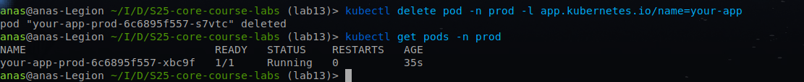

# Lab 13: ArgoCD for GitOps Deployment

## Task 1: Deploy and Configure ArgoCD

**6 Points:**

1. Install ArgoCD via Helm
   - Add the ArgoCD Helm repository:

     ```bash
     helm repo add argo https://argoproj.github.io/argo-helm
     ```
     [ArgoCD Helm Chart Docs](https://github.com/argoproj/argo-helm)

   - Install ArgoCD:

     ```bash
     helm install argo argo/argo-cd --namespace argocd --create-namespace
     ```

     [ArgoCD Installation Guide](https://argo-cd.readthedocs.io/en/stable/getting_started/)

   - Verify installation:

     ```bash
     kubectl wait --for=condition=ready pod -l app.kubernetes.io/name=argocd-server -n argocd --timeout=90s
     ```
    
2. Install ArgoCD CLI
   - Install the ArgoCD CLI tool (required for command-line interactions):

     ```bash
     # For macOS (Homebrew):
     brew install argocd

     # For Debian/Ubuntu:
     sudo apt-get install -y argocd

     # For other OS/architectures:
     curl -sSL -o argocd https://github.com/argoproj/argo-cd/releases/latest/download/argocd-linux-amd64
     chmod +x argocd
     sudo mv argocd /usr/local/bin/
     ```

     [ArgoCD CLI Docs](https://argo-cd.readthedocs.io/en/stable/cli_installation/)

   - Verify CLI installation:

     ```bash
     argocd version
     ```
    
3. Access the ArgoCD UI
   - Forward the ArgoCD server port:

     ```bash
     kubectl port-forward svc/argocd-server -n argocd 8080:443 &
     ```

   - Log in using the initial admin password:

     ```bash
     # Retrieve the password:
     kubectl -n argocd get secret argocd-initial-admin-secret -o jsonpath="{.data.password}" | base64 --decode

     # Log in via CLI:
     argocd login localhost:8080 --insecure
     argocd account login
     ```
    
     [ArgoCD Authentication Docs](https://argo-cd.readthedocs.io/en/stable/user-guide/accessing/)
     

4. Configure Python App Sync
   - Create an ArgoCD folder:
     Add an `ArgoCD` folder in your `k8s` directory for ArgoCD manifests.

   - Define the ArgoCD Application:
     Create `argocd-python-app.yaml` in the `ArgoCD` folder:

     ```yaml
     apiVersion: argoproj.io/v1alpha1
     kind: Application
     metadata:
       name: python-app
       namespace: argocd
     spec:
       project: default
       source:
         repoURL: https://github.com/<your-repo>/S25-core-course-labs.git
         targetRevision: lab13
         path: <k8s/app-python>
         helm:
           valueFiles:
             - values.yaml
       destination:
         server: https://kubernetes.default.svc
         namespace: default
       syncPolicy:
         automated: {}
     ```

     [ArgoCD Application Manifest Docs](https://argo-cd.readthedocs.io/en/stable/operator-manual/declarative_setup/)

   - Apply the configuration:

     ```bash
     kubectl apply -f ArgoCD/argocd-python-app.yaml
     ```

   - Verify sync:

     ```bash
     argocd app sync python-app
     argocd app status python-app
     ```
    

5. Test Sync Workflow
   - Modify `values.yaml` (e.g., update `replicaCount`).
   - Commit and push changes to the target branch from the config.
   - Observe ArgoCD auto-sync the update:

     ```bash
     argocd app status python-app
     ```
    After I modified `values.yaml` :
    
    Note: The commit is `test changes`
    
### Task 2: Multi-Environment Deployment & Auto-Sync

**4 Points:**

1. Set Up Multi-Environment Configurations
   - Extend your Python app’s Helm chart to support `dev` and `prod` environments.
   - Create environment-specific values files (`values-dev.yaml`, `values-prod.yaml`).

2. Create Namespaces

   ```bash
   kubectl create namespace dev
   kubectl create namespace prod
   ```

3. Deploy Multi-Environment via ArgoCD
   - Define two ArgoCD applications with auto-sync:
     `argocd-python-dev.yaml` and `argocd-python-prod.yaml` (as before).

4. Enable Auto-Sync
   - Test auto-sync by updating `values-prod.yaml` and pushing to Git.

Note: The commit is `test`
5. Self-Heal Testing
   - Test 1: Manual Override of Replica Count
     1. Modify the deployment’s replica count manually:

        ```bash
        kubectl patch deployment python-app-prod -n prod --patch '{"spec":{"replicas": 3}}'
        ```
        
     2. Observe ArgoCD auto-revert the change (due to `syncPolicy.automated`):

        ```bash
        argocd app sync python-app-prod
        argocd app status python-app-prod
        ```
        
   - Test 2: Delete a Pod (Replica)
     1. Delete a pod in the `prod` namespace:

        ```bash
        kubectl delete pod -n prod -l <app.kubernetes.io/name=python-app>
        ```
        Before deleting:
        
        
        After deleting:
        
     2. Verify Kubernetes recreates the pod to match the deployment’s `replicaCount`:

        ```bash
        kubectl get pods -n prod -w
        ```
        

     3. Confirm ArgoCD shows no drift (since pod deletions don’t affect the desired state):

        ```bash
        argocd app diff python-app-prod
        ```
        
    After recovery a new pod will be created:
    


6. Documentation
   - In `13.md`, include:
     - Output of `kubectl get pods -n prod` before and after pod deletion.
     - Screenshots of ArgoCD UI showing sync status and the dashboard after both tests.
     - Explanation of how ArgoCD handles configuration drift vs. runtime events.

        - **Configuration Drift:** ArgoCD detects configuration drift by constantly comparing the desired state in Git to the actual state in the cluster and can automatically correct any drift.
        - **Runtime Events:** ArgoCD primarily focuses on the desired state and does not directly react to runtime events, but it can help monitor and alert on discrepancies if these events cause the cluster to drift away from the Git-stored configuration.
